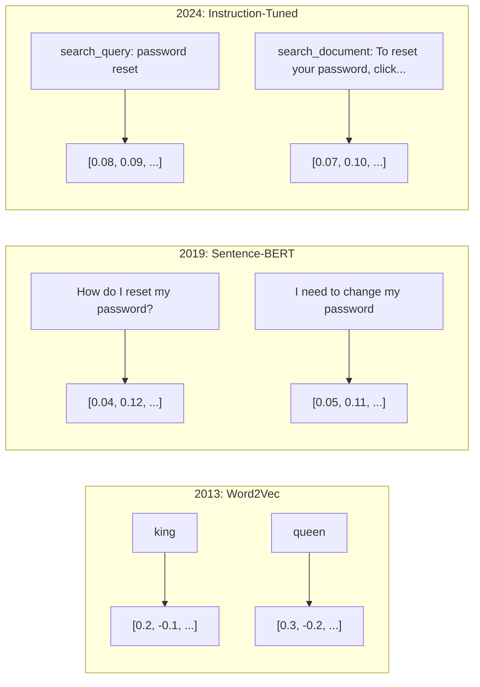
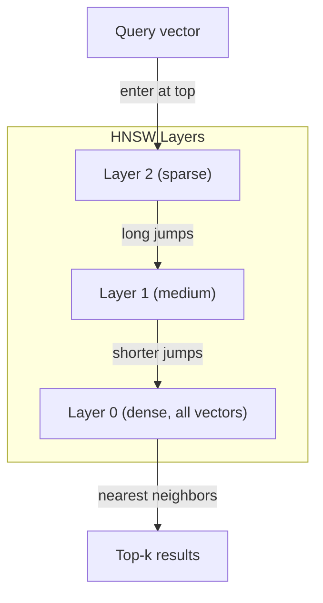
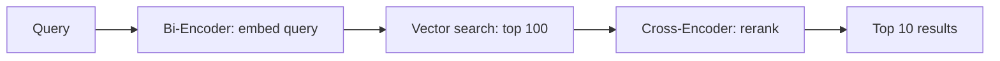

# Các nhúng & đại diện vector

> Các bài viết là riêng biệt. toán học là liên tục. Mỗi khi bạn yêu cầu một LLM tìm ra tài liệu "sẵn" hoặc so sánh ý nghĩa hoặc tìm kiếm ngoài từ khóa, bạn đang dựa vào một cây cầu giữa hai thế giới này. Cây cầu đó là một sự nhúng nhúng. Nếu bạn không hiểu được nhúng nhúng, bạn không hiểu AI hiện đại. Bạn chỉ sử dụng nó.

**Type:** Build
**Languages:** Python
**Prerequisites:** Phase 11, Lesson 01 (Prompt Engineering)
**Time:** ~75 minutes
**Related:**Giai đoạn 5 · 22 (Embedding Models Deep Dive) bao gồm mật độ so với hiếm và đa vector, cắt đứt Matryoshka và lựa chọn mô hình theo trục. Bài học này tập trung vào đường ống sản xuất (vector DBs, HNSW, toán tương tự).

## Mục tiêu học tập

- Tạo các bản ghi văn bản bằng cách sử dụng các nhà cung cấp API và mô hình nguồn mở, và tính toán sự tương đồng cosine giữa chúng
- Giải thích tại sao việc nhúng lại giải quyết vấn đề không phù hợp từ vựng mà tìm kiếm từ khóa không thể giải quyết
- Xây dựng một chỉ mục tìm kiếm ngữ nghĩa thu thập tài liệu theo ý nghĩa thay vì phù hợp chính xác từ khóa
- Đánh giá chất lượng nhúng bằng cách sử dụng các tiêu chuẩn thu hồi (precision@k, recall) và chọn mô hình nhúng phù hợp cho nhiệm vụ của bạn

## Vấn đề

Bạn có 10.000 vé hỗ trợ. Một khách hàng viết "trình thanh toán của tôi không được thực hiện". Bạn cần tìm các vé tương tự trong quá khứ. Tìm kiếm từ khóa tìm thấy các vé có chứa "trình thanh toán" và "không được thực hiện". Nó bỏ lỡ "transaction failed", "charge was declined", và "bước thanh toán lỗi". Những vé này mô tả chính xác cùng một vấn đề với các từ hoàn toàn khác nhau.

Đây là vấn đề sự không phù hợp của từ vựng. Ngôn ngữ con người có hàng chục cách để nói cùng một điều. Tìm kiếm từ khóa đối xử với mỗi từ như một biểu tượng độc lập mà không có ý nghĩa. Nó không thể biết rằng "được từ chối" và "không đi qua" đề cập đến cùng một khái niệm.

Bạn cần một mô tả văn bản mà ý nghĩa, chứ không phải chính tả, quyết định sự tương đồng. Bạn cần một cách để đặt "transaction đã bị từ chối" và "transaction đã bị trả" gần nhau trong một số không gian toán học, trong khi đẩy "transaction đã trả đúng giờ" xa hơn mặc dù chia sẻ từ "transaction đã trả"

Sự đại diện đó là một sự nhúng nhúng.

## Khái niệm

### Một sự nhúng nhúng là gì?

Một embedding là một vector dày đặc của các số điểm nổi đại diện cho ý nghĩa của văn bản. Từ " dày đặc" quan trọng - mỗi chiều có thông tin, không giống như các đại diện hiếm (bag-of-words, TF-IDF) nơi hầu hết các chiều kích là không.

"Căn chó ngồi trên thảm" trở thành một thứ gì đó như `[0.023, -0.041, 0.087, ..., 0.012]`-- một danh sách số từ 768 đến 3072 tùy thuộc vào mô hình. Những số này mã hóa ý nghĩa. Bạn không bao giờ kiểm tra chúng trực tiếp. Bạn so sánh chúng.

### Sự đột phá của Word2Vec

Năm 2013, Tomas Mikolov và các đồng nghiệp tại Google đã xuất bản Word2Vec. Nhìn sâu sắc cốt lõi: đào tạo một mạng lưới thần kinh để dự đoán một từ từ hàng xóm của nó (hoặc hàng xóm từ một từ), và trọng lượng lớp ẩn trở thành đại diện vector có ý nghĩa.

Kết quả nổi tiếng:

```
king - man + woman = queen
```

Các phương pháp toán học vector trên các chữ nhúng bắt được các mối quan hệ ngữ nghĩa. hướng từ "nam" đến "nam" gần giống như hướng từ " vua" đến " nữ hoàng. " Đây là thời điểm mà lĩnh vực nhận ra rằng hình học có thể mã hóa ý nghĩa.

Word2Vec tạo ra các vector 300 chiều. Mỗi từ có một vector bất kể bối cảnh. "Bank" trong "bạn sông" và "tài khoản ngân hàng" có sự nhúng nhúng tương tự.

### Từ từ đến câu

Word embeds đại diện cho các token đơn lẻ. Hệ thống sản xuất cần phải embed toàn bộ câu, đoạn văn hoặc tài liệu. Bốn cách tiếp cận xuất hiện:

**Averaging**: lấy trung bình của tất cả các vector từ trong câu. rẻ, mất mát, đáng ngạc nhiên tốt cho văn bản ngắn. mất hoàn toàn thứ tự từ - "con chó cắn người đàn ông" và "màn người cắn chó" nhận được các nhúng giống nhau.

**CLS token**: mô hình biến thể (BERT, 2018) phát ra một token đặc biệt [CLS] nhúng đại diện cho toàn bộ đầu vào.

**Contrastive learning**: đào tạo mô hình một cách rõ ràng để đẩy các cặp tương tự cùng nhau và các cặp khác nhau ra khỏi nhau. Sentence-BERT (Reimers & Gurevych, 2019) sử dụng cách tiếp cận này và trở thành nền tảng cho các mô hình nhúng hiện đại. Với "Làm thế nào tôi đặt lại mật khẩu của tôi?" và "Tôi cần thay đổi mật khẩu của tôi", mô hình học được rằng những thứ này nên có các vector gần như giống nhau.

**Instruction-tuned embeddings**: phương pháp tiếp cận mới nhất. Các mô hình như E5 và GTE chấp nhận một phụ đề nhiệm vụ ("search_query:", "search_document:") cho mô hình biết loại nhúng nào để sản xuất. Điều này cho phép một mô hình phục vụ nhiều nhiệm vụ.



### Các mô hình nhúng hiện đại

Thị trường đã được phân chia thành một số lựa chọn cấp sản xuất (MTEB điểm số từ đầu năm 2026, MTEB v2):

| Model | Provider | Dimensions | MTEB | Context | Cost / 1M tokens |
|-------|----------|-----------|------|---------|------------------|
| Gemini Embedding 2 | Google | 3072 (Matryoshka) | 67.7 (retrieval) | 8192 | $0.15 |
| embed-v4 | Cohere | 1024 (Matryoshka) | 65.2 | 128K | $0.12 |
| voyage-4 | Voyage AI | 1024/2048 (Matryoshka) | 66.8 | 32K | $0.12 |
| text-embedding-3-large | OpenAI | 3072 (Matryoshka) | 64.6 | 8192 | $0.13 |
| text-embedding-3-small | OpenAI | 1536 (Matryoshka) | 62.3 | 8192 | $0.02 |
| BGE-M3 | BAAI | 1024 (dense+sparse+ColBERT) | 63.0 multilingual | 8192 | Open-weight |
| Qwen3-Embedding | Alibaba | 4096 (Matryoshka) | 66.9 | 32K | Open-weight |
| Nomic-embed-v2 | Nomic | 768 (Matryoshka) | 63.1 | 8192 | Open-weight |

MTEB (Massive Text Embedding Benchmark) v2 bao gồm 100 công việc trên toàn bộ truy xuất, phân loại, nhóm, xếp hạng lại và tóm tắt. Tăng lên thì tốt hơn. Đến năm 2026, các mô hình trọng lượng mở (Qwen3-Embedding, BGE-M3) phù hợp hoặc đánh bại các mô hình được lưu trữ đóng trên hầu hết các trục. Gemini Embedding 2 dẫn đầu việc lấy lại thuần túy; Voyage / Cohere dẫn đầu các lĩnh vực cụ thể (tài chính, luật, mã). Luôn đánh giá bằng các câu hỏi của riêng bạn trước khi cam kết.

### Métrics tương đồng

Với hai vector nhúng, ba cách để đo mức độ tương tự của chúng:

**Cosine similarity**: cosine của góc giữa hai vector. dao động từ -1 (ngược lại) đến 1 (nghĩa giống nhau). Không xem xét độ lớn - một câu 10 từ và một tài liệu 500 từ có thể đạt được 1,0 nếu chúng chỉ ra cùng một hướng. Đây là mặc định cho 90% trường hợp sử dụng.

```
cosine_sim(a, b) = dot(a, b) / (||a|| * ||b||)
```

**Dot product**: sản phẩm bên trong thô của hai vector. giống hệt với sự tương đồng cosine khi vector được bình thường hóa (nghĩa đơn vị).

```
dot(a, b) = sum(a_i * b_i)
```

**Euclidean (L2) distance**: khoảng cách đường thẳng trong không gian vector. nhỏ hơn = tương tự hơn. nhạy cảm với sự khác biệt độ lớn. Sử dụng khi vị trí tuyệt đối trong không gian quan trọng, không chỉ là hướng.

```
L2(a, b) = sqrt(sum((a_i - b_i)^2))
```

Khi nào sử dụng:

| Metric | Use when | Avoid when |
|--------|----------|------------|
| Cosine similarity | Comparing texts of different lengths; most retrieval tasks | Magnitude carries information |
| Dot product | Embeddings are already normalized; maximum speed | Vectors have varying magnitudes |
| Euclidean distance | Clustering; spatial nearest-neighbor problems | Comparing documents of wildly different lengths |

### Các cơ sở dữ liệu vector và HNSW

Một tìm kiếm tương tự bằng lực thô so sánh truy vấn với mỗi vector được lưu trữ. Ở 1 triệu vector với 1536 chiều, đó là 1,5 tỷ lần cộng các hoạt động mỗi truy vấn.

Các cơ sở dữ liệu vector giải quyết điều này bằng thuật toán hàng xóm gần nhất (ANN).

1. Xây dựng biểu đồ nhiều lớp của các vector
2. Các lớp trên cùng rất hiếm -- kết nối tầm xa giữa các cụm từ xa
3. Các lớp dưới cùng dày đặc - kết nối hạt mỏng giữa các vector gần đó
4. Tìm kiếm bắt đầu ở tầng trên cùng, tham lam xuống để tinh chỉnh
5. Thu trả về kết quả top-k gần như trong O(log n) thời gian thay vì O(n)

HNSW giao dịch một sự mất tích độ chính xác nhỏ (thường là 95-99% nhớ lại) để tăng tốc độ lớn.



Các lựa chọn sản xuất:

| Database | Type | Best for | Max scale |
|----------|------|----------|-----------|
| Pinecone | Managed SaaS | Zero-ops production | Billions |
| Weaviate | Open source | Self-hosted, hybrid search | 100M+ |
| Qdrant | Open source | High performance, filtering | 100M+ |
| ChromaDB | Embedded | Prototyping, local dev | 1M |
| pgvector | Postgres extension | Already using Postgres | 10M |
| FAISS | Library | In-process, research | 1B+ |

### Các chiến lược làm cho các mảnh vỡ

Các tài liệu quá dài để nhúng thành một vector. Một PDF 50 trang bao gồm hàng chục chủ đề - nhúng của nó trở thành trung bình của mọi thứ, giống như không có gì cụ thể. Bạn chia các tài liệu thành các mảnh và nhúng mỗi một.

**Fixed-size chunking**: chia tất cả các token N với m-token chồng chéo. đơn giản và có thể dự đoán được. hoạt động tốt khi tài liệu không có cấu trúc rõ ràng. Một phần 512 token với 50 token chồng chéo: phần 1 là token 0-511, phần 2 là token 462-973.

**Sentence-based chunking**: chia ra ở giới hạn câu, nhóm câu cho đến khi đạt đến giới hạn biểu tượng. Mỗi phần là ít nhất một câu hoàn chỉnh. Tốt hơn là kích thước cố định bởi vì bạn không bao giờ cắt một suy nghĩ thành nửa.

**Recursive chunking**Nếu vẫn quá lớn, hãy thử giới hạn đoạn văn. Sau đó giới hạn câu. Sau đó giới hạn ký tự. Đây là giới hạn LangChain `RecursiveCharacterTextSplitter`và nó hoạt động tốt cho các cơ thể dạng hỗn hợp.

**Semantic chunking**: nhúng mỗi câu, sau đó nhóm các câu liên tiếp có nhúng tương tự. Khi sự tương tự nhúng giảm xuống dưới ngưỡng, bắt đầu một phần mới.

| Strategy | Complexity | Quality | Best for |
|----------|-----------|---------|----------|
| Fixed-size | Low | Decent | Unstructured text, logs |
| Sentence-based | Low | Good | Articles, emails |
| Recursive | Medium | Good | Markdown, HTML, mixed docs |
| Semantic | High | Best | Critical retrieval quality |

Điểm ngọt ngào cho hầu hết các hệ thống: 256-512 token với 50 token chồng chéo.

### Bi-Encoders vs Cross-Encoders

Một bộ mã hóa hai kết hợp truy vấn và tài liệu độc lập, sau đó so sánh các vector. nhanh - bạn nhúng truy vấn một lần và so sánh với nhúng tài liệu trước khi tính toán. Đây là những gì bạn sử dụng để lấy.

Một cross-encoder lấy truy vấn và một tài liệu như một đầu vào duy nhất và đưa ra một điểm liên quan. chậm - nó xử lý mỗi cặp truy vấn- tài liệu thông qua mô hình đầy đủ. Nhưng chính xác hơn nhiều bởi vì nó có thể tham gia qua truy vấn và tài liệu token cùng một lúc.

Mô hình sản xuất: Bi-encoder lấy 100 ứng cử viên hàng đầu, cross-encoder xếp hạng họ lên top-10. Đây là đường ống lấy và xếp hạng lại.



Các mô hình xếp hạng lại: Cohere Rerank 3.5 ($ 2 cho mỗi 1000 truy vấn), BGE-reranker-v2 (tự do, nguồn mở), Jina Reranker v2 (tự do, nguồn mở).

### Matryoshka Embedded

Các bản nhúng truyền thống là tất cả hoặc không có gì. Một vector 1536 chiều sử dụng 1536 floats. Bạn không thể cắt giảm đến 256 chiều mà không cần đào tạo lại.

Matryoshka Representation Learning (Kusupati et al., 2022) sửa chữa điều này. Mô hình được đào tạo để các chiều N đầu tiên nắm bắt thông tin quan trọng nhất, giống như một con búp bê tổ của Nga.

OpenAI's text-embedding-3-small và text-embedding-3-large hỗ trợ Matryoshka truncation thông qua `dimensions`yêu cầu 256 chiều thay vì 1536 cắt giảm lưu trữ bằng 6 lần với mất độ chính xác khoảng 3-5% trên các tiêu chuẩn MTEB.

### Quantization Binary

Một bản nhúng 1536 chiều được lưu trữ như float32 sử dụng 6.144 byte.

Sự định lượng nhị phân chuyển mỗi float thành một bit: giá trị tích cực trở thành 1, giá trị tiêu cực trở thành 0. Kho lưu trữ giảm từ 6.144 byte xuống còn 192 byte - giảm 32x. Sự tương tự được tính bằng cách sử dụng khoảng cách Hamming (đếm các bit khác nhau), mà CPU có thể làm trong một chỉ dẫn duy nhất.

Tính độ chính xác là khoảng 5-10% khi thu hồi. mô hình phổ biến: định lượng nhị phân cho việc tìm kiếm lần qua đầu tiên trên hàng triệu vector, sau đó tái phân tích top-1000 với vector chính xác đầy đủ. Điều này giúp bạn có được 95% + độ chính xác đầy đủ với bộ nhớ ít hơn 32 lần.

```figure
cosine-similarity
```

## Hãy xây dựng nó

Chúng tôi xây dựng một công cụ tìm kiếm ngữ nghĩa từ đầu. Không cơ sở dữ liệu vector, không API bên ngoài nhúng. Python tinh khiết với numpy cho toán học.

### Bước 1: Chọn văn bản

```python
def chunk_text(text, chunk_size=200, overlap=50):
    words = text.split()
    chunks = []
    start = 0
    while start < len(words):
        end = start + chunk_size
        chunk = " ".join(words[start:end])
        chunks.append(chunk)
        start += chunk_size - overlap
    return chunks


def chunk_by_sentences(text, max_chunk_tokens=200):
    sentences = text.replace("\n", " ").split(".")
    sentences = [s.strip() + "." for s in sentences if s.strip()]
    chunks = []
    current_chunk = []
    current_length = 0
    for sentence in sentences:
        sentence_length = len(sentence.split())
        if current_length + sentence_length > max_chunk_tokens and current_chunk:
            chunks.append(" ".join(current_chunk))
            current_chunk = []
            current_length = 0
        current_chunk.append(sentence)
        current_length += sentence_length
    if current_chunk:
        chunks.append(" ".join(current_chunk))
    return chunks
```

### Bước 2: Xây dựng các nội dung từ đầu

Chúng tôi thực hiện một bản nhúng dày đặc đơn giản bằng cách sử dụng TF-IDF với bình thường hóa L2. Đây không phải là một bản nhúng thần kinh, nhưng nó theo cùng một hợp đồng: văn bản vào, vector kích thước cố định ra, các văn bản tương tự tạo ra các vector tương tự.

```python
import math
import numpy as np
from collections import Counter

class SimpleEmbedder:
    def __init__(self):
        self.vocab = []
        self.idf = []
        self.word_to_idx = {}

    def fit(self, documents):
        vocab_set = set()
        for doc in documents:
            vocab_set.update(doc.lower().split())
        self.vocab = sorted(vocab_set)
        self.word_to_idx = {w: i for i, w in enumerate(self.vocab)}
        n = len(documents)
        self.idf = np.zeros(len(self.vocab))
        for i, word in enumerate(self.vocab):
            doc_count = sum(1 for doc in documents if word in doc.lower().split())
            self.idf[i] = math.log((n + 1) / (doc_count + 1)) + 1

    def embed(self, text):
        words = text.lower().split()
        count = Counter(words)
        total = len(words) if words else 1
        vec = np.zeros(len(self.vocab))
        for word, freq in count.items():
            if word in self.word_to_idx:
                tf = freq / total
                vec[self.word_to_idx[word]] = tf * self.idf[self.word_to_idx[word]]
        norm = np.linalg.norm(vec)
        if norm > 0:
            vec = vec / norm
        return vec
```

### Bước 3: Các chức năng tương tự

```python
def cosine_similarity(a, b):
    dot = np.dot(a, b)
    norm_a = np.linalg.norm(a)
    norm_b = np.linalg.norm(b)
    if norm_a == 0 or norm_b == 0:
        return 0.0
    return float(dot / (norm_a * norm_b))


def dot_product(a, b):
    return float(np.dot(a, b))


def euclidean_distance(a, b):
    return float(np.linalg.norm(a - b))
```

### Bước 4: Chỉ số vector với tìm kiếm Brute-Force

```python
class VectorIndex:
    def __init__(self):
        self.vectors = []
        self.texts = []
        self.metadata = []

    def add(self, vector, text, meta=None):
        self.vectors.append(vector)
        self.texts.append(text)
        self.metadata.append(meta or {})

    def search(self, query_vector, top_k=5, metric="cosine"):
        scores = []
        for i, vec in enumerate(self.vectors):
            if metric == "cosine":
                score = cosine_similarity(query_vector, vec)
            elif metric == "dot":
                score = dot_product(query_vector, vec)
            elif metric == "euclidean":
                score = -euclidean_distance(query_vector, vec)
            else:
                raise ValueError(f"Unknown metric: {metric}")
            scores.append((i, score))
        scores.sort(key=lambda x: x[1], reverse=True)
        results = []
        for idx, score in scores[:top_k]:
            results.append({
                "text": self.texts[idx],
                "score": score,
                "metadata": self.metadata[idx],
                "index": idx
            })
        return results

    def size(self):
        return len(self.vectors)
```

### Bước 5: Công cụ tìm kiếm ngữ nghĩa

```python
class SemanticSearchEngine:
    def __init__(self, chunk_size=200, overlap=50):
        self.embedder = SimpleEmbedder()
        self.index = VectorIndex()
        self.chunk_size = chunk_size
        self.overlap = overlap

    def index_documents(self, documents, source_names=None):
        all_chunks = []
        all_sources = []
        for i, doc in enumerate(documents):
            chunks = chunk_text(doc, self.chunk_size, self.overlap)
            all_chunks.extend(chunks)
            name = source_names[i] if source_names else f"doc_{i}"
            all_sources.extend([name] * len(chunks))
        self.embedder.fit(all_chunks)
        for chunk, source in zip(all_chunks, all_sources):
            vec = self.embedder.embed(chunk)
            self.index.add(vec, chunk, {"source": source})
        return len(all_chunks)

    def search(self, query, top_k=5, metric="cosine"):
        query_vec = self.embedder.embed(query)
        return self.index.search(query_vec, top_k, metric)

    def search_with_scores(self, query, top_k=5):
        results = self.search(query, top_k)
        return [
            {
                "text": r["text"][:200],
                "source": r["metadata"].get("source", "unknown"),
                "score": round(r["score"], 4)
            }
            for r in results
        ]
```

### Bước 6: So sánh các số liệu tương đồng

```python
def compare_metrics(engine, query, top_k=3):
    results = {}
    for metric in ["cosine", "dot", "euclidean"]:
        hits = engine.search(query, top_k=top_k, metric=metric)
        results[metric] = [
            {"score": round(h["score"], 4), "preview": h["text"][:80]}
            for h in hits
        ]
    return results
```

## Sử dụng nó

Với một API nhúng sản xuất, kiến trúc vẫn giống nhau. Chỉ có người nhúng thay đổi:

```python
from openai import OpenAI

client = OpenAI()

def openai_embed(texts, model="text-embedding-3-small", dimensions=None):
    kwargs = {"model": model, "input": texts}
    if dimensions:
        kwargs["dimensions"] = dimensions
    response = client.embeddings.create(**kwargs)
    return [item.embedding for item in response.data]
```

Truncation Matryoshka với OpenAI -- mô hình tương tự, kích thước ít hơn, lưu trữ thấp hơn:

```python
full = openai_embed(["semantic search query"], dimensions=1536)
compact = openai_embed(["semantic search query"], dimensions=256)
```

Dòng 256-d sử dụng dung lượng lưu trữ ít hơn 6 lần. Đối với 10 triệu tài liệu, đó là 10 GB so với 61 GB.

Đối với việc xếp hạng lại với Cohere:

```python
import cohere

co = cohere.ClientV2()

results = co.rerank(
    model="rerank-v3.5",
    query="What is the refund policy?",
    documents=["Full refund within 30 days...", "No refunds after 90 days..."],
    top_n=3
)
```

Đối với các nhúng địa phương không phụ thuộc vào API:

```python
from sentence_transformers import SentenceTransformer

model = SentenceTransformer("BAAI/bge-small-en-v1.5")
embeddings = model.encode(["semantic search query", "another document"])
```

Các lớp VectorIndex từ xây dựng của chúng tôi làm việc với bất kỳ điều này.

## Chuyển nó

Bài học này mang lại:
- `outputs/prompt-embedding-advisor.md`-- một lời nhắc cho việc lựa chọn các mô hình và chiến lược nhúng cho các trường hợp sử dụng cụ thể
- `outputs/skill-embedding-patterns.md`-- một kỹ năng dạy cho các đại lý cách sử dụng các nhúng hiệu quả trong sản xuất

## Các bài tập

1. **Metric comparison**: chạy cùng 5 truy vấn với các tài liệu mẫu bằng cách sử dụng sự tương đồng cosine, sản phẩm điểm và khoảng cách Euclidean.

2. **Chunk size experiment**: chỉ mục các tài liệu mẫu với kích thước phần 50, 100, 200, và 500 từ. Đối với mỗi câu hỏi, chạy 5 truy vấn và ghi điểm tương đồng top-1. Bạch mối quan hệ giữa kích thước phần và chất lượng truy xuất. Tìm điểm mà các phần lớn bắt đầu đau.

3. **Matryoshka simulation**: xây dựng một SimpleEmbedder tạo ra các vector 500-d. Truncate đến 50, 100, 200, và 500 chiều. đo mức độ thu hồi suy giảm tại mỗi truncation. Điều này mô phỏng hành vi Matryoshka mà không cần thủ thuật thực sự đào tạo.

4. **Binary quantization**: lấy các kết hợp từ công cụ tìm kiếm, chuyển đổi chúng thành nhị phân (1 nếu dương, 0 nếu âm), và thực hiện tìm kiếm khoảng cách Hamming. So sánh 10 kết quả hàng đầu với sự tương tự cosine chính xác. Đo tỷ lệ tỷ lệ chồng chéo.

5. **Sentence-based chunking**: thay thế chunking kích thước cố định bằng `chunk_by_sentences`- Làm cùng một câu hỏi và so sánh điểm thu hồi.

## Các điều khoản chính

| Term | What people say | What it actually means |
|------|----------------|----------------------|
| Embedding | "Text to numbers" | A dense vector where geometric proximity encodes semantic similarity |
| Word2Vec | "The OG embedding" | 2013 model that learned word vectors by predicting context words; proved vector arithmetic encodes meaning |
| Cosine similarity | "How similar are two vectors" | Cosine of the angle between vectors; 1 = identical direction, 0 = orthogonal, -1 = opposite |
| HNSW | "Fast vector search" | Hierarchical Navigable Small World graph -- multi-layer structure enabling O(log n) approximate nearest neighbor search |
| Bi-encoder | "Embed separately, compare fast" | Encodes query and document independently into vectors; enables pre-computation and fast retrieval |
| Cross-encoder | "Slow but accurate reranker" | Processes query-document pair jointly through the full model; higher accuracy, no pre-computation |
| Matryoshka embeddings | "Truncatable vectors" | Embeddings trained so the first N dimensions capture the most important information, enabling variable-size storage |
| Binary quantization | "1-bit embeddings" | Converting float vectors to binary (sign bit only) for 32x storage reduction with Hamming distance search |
| Chunking | "Split docs for embedding" | Breaking documents into 256-512 token segments so each can be independently embedded and retrieved |
| Vector database | "Search engine for embeddings" | Data store optimized for storing vectors and performing approximate nearest neighbor search at scale |
| Contrastive learning | "Train by comparison" | Training approach that pushes similar pair embeddings together and dissimilar pair embeddings apart |
| MTEB | "The embedding benchmark" | Massive Text Embedding Benchmark -- 56 datasets across 8 tasks; standard for comparing embedding models |

## Đọc thêm

- Mikolov et al., "Sự ước tính hiệu quả của biểu tượng từ trong không gian vector" (2013) -- bài báo Word2Vec bắt đầu cuộc cách mạng nhúng với tương tự vua-nữ hoàng
- Reimers & Gurevych, "Sentence-BERT: Embeddings Sentence using Siamese BERT-Networks" (2019) -- làm thế nào để đào tạo các bộ mã hóa hai cho sự tương đồng cấp độ câu, nền tảng của các mô hình nhúng hiện đại
- Kusupati et al., "Matryoshka Representation Learning" (2022) - kỹ thuật đằng sau các bản nhúng chiều biến mà OpenAI áp dụng cho việc nhúng văn bản-3
- Malkov & Yashunin, "Thông hiệu quả và mạnh mẽ Phương gần hàng xóm gần nhất sử dụng Hịararchical Navigable Small World Graphs" (2018) - bài báo HNSW, thuật toán đằng sau hầu hết các tìm kiếm vector sản xuất
- OpenAI Embeddings Guide (platform.openai.com/docs/guides/embeddings) - Khán giả thực tế cho các mô hình văn bản-embedded-3 bao gồm giảm kích thước Matryoshka
- MTEB Leaderboard (huggingface.co/spaces/mteb/leaderboard) - chỉ số chuẩn trực tiếp so sánh tất cả các mô hình nhúng trên các nhiệm vụ và ngôn ngữ
- [Muennighoff et al., "MTEB: Massive Text Embedding Benchmark" (EACL 2023)](https://arxiv.org/abs/2210.07316)-- chỉ số chuẩn xác định 8 loại nhiệm vụ (thân loại, nhóm, phân loại cặp, xếp hạng lại, lấy lại, STS, tóm tắt, khai thác bittext) mà bảng xếp hạng báo cáo; đọc trước khi tin tưởng vào bất kỳ điểm MTEB duy nhất.
- [Sentence Transformers documentation](https://www.sbert.net/)-- tham chiếu kinh điển cho bi-encoder vs cross-encoder, chiến lược tập hợp, và đường ống RAG nhập-căn-bảo-bảo-bảo-bảo này thực hiện bài học này.
