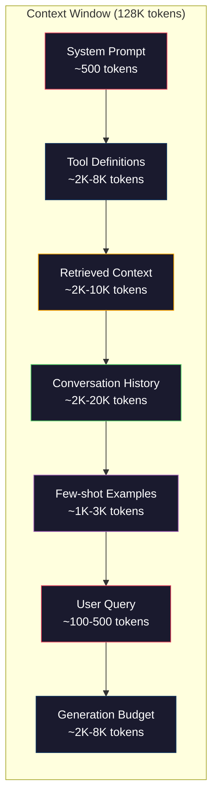
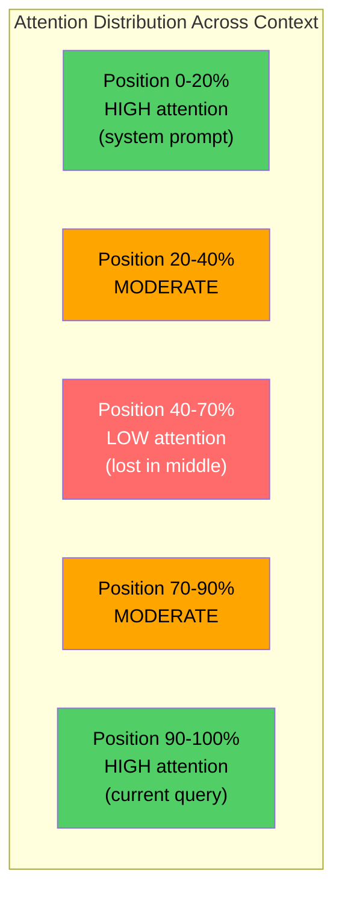
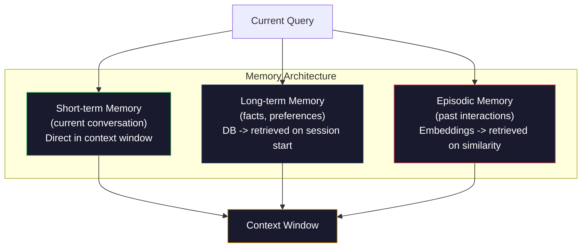

# Kỹ thuật ngữ cảnh: Windows, ngân sách, bộ nhớ và tìm lại

> Kỹ thuật sao chép là một bộ phụ. Kỹ thuật ngữ cảnh là toàn bộ trò chơi. Một sao chép là một chuỗi bạn gõ. ngữ cảnh là mọi thứ đi vào cửa sổ của mô hình: hướng dẫn hệ thống, tài liệu được lấy lại, định nghĩa công cụ, lịch sử cuộc trò chuyện, vài ví dụ chụp, và tựa lệnh. Các kỹ sư AI tốt nhất vào năm 2026 là kỹ sư ngữ cảnh. Họ quyết định những gì đi vào, những gì không đi, và theo thứ tự nào.

**Type:** Build
**Languages:** Python
**Prerequisites:** Phase 10 (LLMs from Scratch), Phase 11 Lesson 01-02
**Time:** ~90 minutes
**Related:**Giai đoạn 11 · 15 (Caching nhanh)  bố cục thân thiện với cache là một phần mở rộng của kỹ thuật ngữ cảnh. Giai đoạn 5 · 28 (Việc đánh giá ngữ cảnh dài) cho cách đo lường mất ở giữa với NIAH / RULER.

## Mục tiêu học tập

- Xét ngân sách token trên tất cả các thành phần cửa sổ ngữ cảnh (sản ứng hệ thống, công cụ, lịch sử, tài liệu thu hồi, phòng đầu thế hệ)
- Thực hiện các chiến lược quản lý cửa sổ ngữ cảnh: cắt ngắn, tóm tắt và trượt cửa sổ cho lịch sử cuộc trò chuyện
- Tự ưu tiên và sắp xếp các thành phần ngữ cảnh để tối đa hóa sự chú ý của mô hình về thông tin có liên quan nhất
- Xây dựng bộ sưu tập ngữ cảnh phân bổ mã thông báo động dựa trên loại truy vấn và không gian cửa sổ có sẵn

## Vấn đề

Claude Opus 4.7 có một cửa sổ mã thông báo 200K (1M trong beta). GPT-5 có 400K. Gemini 3 Pro có 2M. Llama 4 tuyên bố 10M. Những con số này nghe có vẻ rất lớn cho đến khi bạn điền chúng.

Đây là một phân tích thực sự cho một trợ lý lập trình. System prompt: 500 token. Định nghĩa công cụ cho 50 công cụ: 8.000 token. Tài liệu được lấy lại: 4.000 token. Lịch sử trò chuyện (10 lượt): 6.000 token. truy vấn người dùng hiện tại: 200 token. Ngân sách thế hệ (tổng sản xuất tối đa): 4.000 token. Tổng cộng: 22.700 token. Đó chỉ là 18% của một cửa sổ 128K.

Nhưng sự chú ý không phải là quy mô tuyến tính với chiều dài của ngữ cảnh. Một mô hình với 128K token của ngữ cảnh trả chi phí chú ý vuông (O(n^2) trong các biến thể vanilla, mặc dù hầu hết các mô hình sản xuất sử dụng các biến thể chú ý hiệu quả). Quan trọng hơn, độ chính xác của việc lấy lại sẽ suy giảm. Thử nghiệm "Tháp trong một đống lầy" cho thấy các mô hình gặp khó khăn để tìm thấy thông tin được đặt giữa các bối cảnh dài. Nghiên cứu của Liu et al. (2023) cho thấy LLM thu thập thông tin ở đầu và cuối các bối cảnh dài với độ chính xác gần như hoàn hảo, nhưng độ chính xác giảm 10-20% đối với thông tin được đặt ở giữa (nơi 40-70% của bối cảnh). Hiệu ứng "lạc trong giữa" này khác nhau theo mô hình nhưng ảnh hưởng đến tất cả các kiến trúc hiện tại.

Bài học thực tế: có 200K token có sẵn không có nghĩa là sử dụng 200K token là hiệu quả. Một bối cảnh token 10K được sắp xếp cẩn thận thường vượt qua bối cảnh token 100K bị ném. Kỹ thuật ngữ ngữ cảnh là kỷ luật tối đa hóa tỷ lệ tín hiệu-giọng trong cửa sổ ngữ cảnh.

Mỗi token bạn đặt trong cửa sổ sẽ thay thế một token có thể mang lại thông tin có liên quan hơn. Mỗi định nghĩa công cụ không liên quan, mỗi vòng trò chuyện lỗi thời, mỗi đoạn văn được lấy lại không trả lời câu hỏi - mỗi một làm cho mô hình trở nên tồi tệ hơn một chút trong nhiệm vụ.

## Khái niệm

### Chiếc cửa sổ ngữ cảnh là một nguồn tài nguyên hiếm

Hãy nghĩ về cửa sổ ngữ cảnh như RAM, không phải đĩa. Nó nhanh chóng và trực tiếp truy cập, nhưng hạn chế. Bạn không thể chứa tất cả mọi thứ. Bạn phải chọn.



Mỗi thành phần cạnh tranh về không gian. Thêm nhiều định nghĩa công cụ có nghĩa là ít không gian cho lịch sử cuộc trò chuyện. Thêm nhiều bối cảnh được lấy lại có nghĩa là ít không gian cho vài ví dụ. Kỹ thuật ngữ ngữ cảnh là nghệ thuật phân bổ ngân sách này để tối đa hóa hiệu suất nhiệm vụ.

### - Đúng rồi.

Kết quả thực nghiệm quan trọng nhất trong kỹ thuật ngữ cảnh. Các mô hình chăm sóc tốt hơn cho thông tin ở đầu và cuối của ngữ cảnh. Thông tin ở giữa nhận được điểm chú ý thấp hơn và có nhiều khả năng bị bỏ qua.

Liu et al. (2023) đã kiểm tra hệ thống này. Họ đặt một tài liệu liên quan giữa 20 tài liệu không liên quan ở các vị trí khác nhau và đo độ chính xác câu trả lời. Khi tài liệu liên quan là đầu tiên hoặc cuối cùng, độ chính xác là 85-90%. Khi nó ở giữa ( vị trí 10 của 20), độ chính xác giảm xuống 60-70%.

Điều này có những ý nghĩa kỹ thuật trực tiếp:

- Đặt thông tin quan trọng nhất trước (đơn giản hệ thống, hướng dẫn quan trọng)
- Đặt truy vấn hiện tại và ngữ cảnh phù hợp nhất cuối cùng (các định tính gần đây giúp)
- Chống lại giữa bối cảnh như là vùng ưu tiên thấp nhất
- Nếu bạn phải đưa thông tin vào giữa, hãy lặp lại điểm chính ở cuối



### Các thành phần ngữ cảnh

**System prompt**Claude Code sử dụng khoảng 6.000 token cho hệ thống nhắc nhở của mình bao gồm các định nghĩa công cụ và hướng dẫn hành vi. Giữ nó chặt chẽ. Mỗi từ trong hệ thống nhắc nhở được lặp lại trên mỗi cuộc gọi API.

**Tool definitions**mỗi công cụ thêm 50-200 token (tên, mô tả, quy trình tham số). 50 tool ở 150 token mỗi công cụ là 7.500 token trước khi bất kỳ cuộc trò chuyện nào xảy ra.

**Retrieved context**: tài liệu từ cơ sở dữ liệu vector, kết quả tìm kiếm, nội dung tệp. Chất lượng tìm kiếm trực tiếp quyết định chất lượng phản ứng. Tìm kiếm xấu là tồi tệ hơn không tìm kiếm - nó lấp đầy cửa sổ với tiếng ồn và tích cực sai lầm mô hình.

**Conversation history**: mỗi tin nhắn người dùng trước đó và phản ứng trợ lý. tăng thẳng theo chiều dài cuộc trò chuyện. Một cuộc trò chuyện 50 lượt với 200 token mỗi lượt là 10.000 token lịch sử. Phần lớn nó không liên quan đến truy vấn hiện tại.

**Few-shot examples**Các ví dụ được chọn tốt thường cải thiện chất lượng đầu ra hơn hàng ngàn token hướng dẫn. Nhưng chúng tốn không gian.

**Generation budget**Nếu bạn lấp đầy cửa sổ đến dung lượng, mô hình không có chỗ để trả lời.

### Chiến lược nén ngữ cảnh

**History summarization**: thay vì giữ tất cả các lượt trước đó theo nghĩa đen, thường xuyên tóm tắt cuộc trò chuyện. "Chúng tôi đã thảo luận X, quyết định Y, và người dùng muốn Z" trong 100 token thay thế 10 lượt mà đã mất 2.000 token.

**Relevance filtering**: đánh giá mỗi tài liệu được lấy lại so với truy vấn hiện tại và thả tài liệu dưới ngưỡng. Nếu bạn đã lấy 10 mảnh nhưng chỉ có 3 phần liên quan, hãy loại bỏ phần còn lại 7. Tốt hơn là có 3 phần có liên quan cao hơn là 10 phần trung bình.

**Tool pruning**: phân loại ý định truy vấn của người dùng và chỉ bao gồm các công cụ có liên quan đến ý định đó. Một câu hỏi mã không cần các công cụ lịch. Một câu hỏi lập lịch không cần các công cụ hệ thống tệp. Điều này có thể giảm định nghĩa công cụ từ 8.000 token xuống còn 1.000.

**Recursive summarization**: trong các tài liệu rất dài, tóm tắt theo từng giai đoạn. Đầu tiên tóm tắt từng phần, sau đó tóm tắt các bản tóm tắt.

### Hệ thống bộ nhớ

Kỹ thuật ngữ cảnh bao gồm ba chân trời thời gian.

**Short-term memory**: cuộc trò chuyện hiện tại. được lưu trữ trực tiếp trong cửa sổ ngữ cảnh. phát triển với mỗi lượt. Quản lý bằng cách tóm tắt và cắt ngắn.

**Long-term memory**"Người dùng thích TypeScript. " " Dự án sử dụng PostgreSQL. " Cung trữ trong một cơ sở dữ liệu, được lấy lại khi bắt đầu phiên. Claude Code lưu trữ điều này trong các tệp CLAUDE.md. ChatGPT lưu trữ nó trong tính năng bộ nhớ của nó.

**Episodic memory**: tương tác trong quá khứ cụ thể có thể có liên quan. "Tuesday trước, chúng tôi đã gỡ lỗi một vấn đề tương tự trong module auth". Cung cấp như nhúng, lấy lại khi cuộc trò chuyện hiện tại phù hợp với một tập trước.



### Phong trào kết nối động lực

Thông tin quan trọng: các truy vấn khác nhau cần bối cảnh khác nhau. Một hệ thống tĩnh prompt + công cụ tĩnh + lịch sử tĩnh là lãng phí. Các hệ thống tốt nhất động cơ tập hợp bối cảnh cho mỗi truy vấn.

1. Đánh phân mục ý định truy vấn
2. Chọn các công cụ liên quan (không phải tất cả các công cụ)
3. Thu thập các tài liệu liên quan (không phải một bộ cố định)
4. Bao gồm các lượt lịch sử liên quan (không phải tất cả lịch sử)
5. Thêm một vài hình ảnh ví dụ phù hợp với loại nhiệm vụ
6. Đặt mọi thứ theo tầm quan trọng: quan trọng trước, quan trọng sau, tùy chọn ở giữa

Đây là điều phân biệt một ứng dụng AI tốt với một ứng dụng AI tuyệt vời. mô hình là giống nhau.

```figure
lost-in-the-middle
```

## Hãy xây dựng nó

### Bước 1: Đếm mã thông báo

Bạn không thể lập ngân sách những gì bạn không thể đo lường. Xây dựng một con số token đơn giản (sự gần gũi bằng cách sử dụng phân chia không gian trắng, vì số lượng chính xác phụ thuộc vào tokeniser).

```python
import json
import numpy as np
from collections import OrderedDict

def count_tokens(text):
    if not text:
        return 0
    return int(len(text.split()) * 1.3)

def count_tokens_json(obj):
    return count_tokens(json.dumps(obj))
```

### Bước 2: Quản lý ngân sách ngữ cảnh

Một nhà quản lý ngân sách theo dõi số lượng token mỗi thành phần sử dụng và thực thi giới hạn.

```python
class ContextBudget:
    def __init__(self, max_tokens=128000, generation_reserve=4000):
        self.max_tokens = max_tokens
        self.generation_reserve = generation_reserve
        self.available = max_tokens - generation_reserve
        self.allocations = OrderedDict()

    def allocate(self, component, content, max_tokens=None):
        tokens = count_tokens(content)
        if max_tokens and tokens > max_tokens:
            words = content.split()
            target_words = int(max_tokens / 1.3)
            content = " ".join(words[:target_words])
            tokens = count_tokens(content)

        used = sum(self.allocations.values())
        if used + tokens > self.available:
            allowed = self.available - used
            if allowed <= 0:
                return None, 0
            words = content.split()
            target_words = int(allowed / 1.3)
            content = " ".join(words[:target_words])
            tokens = count_tokens(content)

        self.allocations[component] = tokens
        return content, tokens

    def remaining(self):
        used = sum(self.allocations.values())
        return self.available - used

    def utilization(self):
        used = sum(self.allocations.values())
        return used / self.max_tokens

    def report(self):
        total_used = sum(self.allocations.values())
        lines = []
        lines.append(f"Context Budget Report ({self.max_tokens:,} token window)")
        lines.append("-" * 50)
        for component, tokens in self.allocations.items():
            pct = tokens / self.max_tokens * 100
            bar = "#" * int(pct / 2)
            lines.append(f"  {component:<25} {tokens:>6} tokens ({pct:>5.1f}%) {bar}")
        lines.append("-" * 50)
        lines.append(f"  {'Used':<25} {total_used:>6} tokens ({total_used/self.max_tokens*100:.1f}%)")
        lines.append(f"  {'Generation reserve':<25} {self.generation_reserve:>6} tokens")
        lines.append(f"  {'Remaining':<25} {self.remaining():>6} tokens")
        return "\n".join(lines)
```

### Bước 3: Việc sắp xếp lại trong thời gian trung gian

Thực hiện chiến lược sắp xếp lại: các mục quan trọng nhất đi trước và cuối cùng, ít quan trọng nhất đi giữa.

```python
def reorder_lost_in_middle(items, scores):
    paired = sorted(zip(scores, items), reverse=True)
    sorted_items = [item for _, item in paired]

    if len(sorted_items) <= 2:
        return sorted_items

    first_half = sorted_items[::2]
    second_half = sorted_items[1::2]
    second_half.reverse()

    return first_half + second_half

def score_relevance(query, documents):
    query_words = set(query.lower().split())
    scores = []
    for doc in documents:
        doc_words = set(doc.lower().split())
        if not query_words:
            scores.append(0.0)
            continue
        overlap = len(query_words & doc_words) / len(query_words)
        scores.append(round(overlap, 3))
    return scores
```

### Bước 4: Bộ nén lịch sử cuộc trò chuyện

Kết luận về cuộc trò chuyện cũ quay lại để đòi lại ngân sách token.

```python
class ConversationManager:
    def __init__(self, max_history_tokens=5000):
        self.turns = []
        self.summaries = []
        self.max_history_tokens = max_history_tokens

    def add_turn(self, role, content):
        self.turns.append({"role": role, "content": content})
        self._compress_if_needed()

    def _compress_if_needed(self):
        total = sum(count_tokens(t["content"]) for t in self.turns)
        if total <= self.max_history_tokens:
            return

        while total > self.max_history_tokens and len(self.turns) > 4:
            old_turns = self.turns[:2]
            summary = self._summarize_turns(old_turns)
            self.summaries.append(summary)
            self.turns = self.turns[2:]
            total = sum(count_tokens(t["content"]) for t in self.turns)

    def _summarize_turns(self, turns):
        parts = []
        for t in turns:
            content = t["content"]
            if len(content) > 100:
                content = content[:100] + "..."
            parts.append(f"{t['role']}: {content}")
        return "Previous: " + " | ".join(parts)

    def get_context(self):
        parts = []
        if self.summaries:
            parts.append("[Conversation Summary]")
            for s in self.summaries:
                parts.append(s)
        parts.append("[Recent Conversation]")
        for t in self.turns:
            parts.append(f"{t['role']}: {t['content']}")
        return "\n".join(parts)

    def token_count(self):
        return count_tokens(self.get_context())
```

### Bước 5: Chọn công cụ động

Chỉ bao gồm các công cụ liên quan đến truy vấn hiện tại. Đặt mục đích, sau đó lọc.

```python
TOOL_REGISTRY = {
    "read_file": {
        "description": "Read contents of a file",
        "tokens": 120,
        "categories": ["code", "files"],
    },
    "write_file": {
        "description": "Write content to a file",
        "tokens": 150,
        "categories": ["code", "files"],
    },
    "search_code": {
        "description": "Search for patterns in codebase",
        "tokens": 130,
        "categories": ["code"],
    },
    "run_command": {
        "description": "Execute a shell command",
        "tokens": 140,
        "categories": ["code", "system"],
    },
    "create_calendar_event": {
        "description": "Create a new calendar event",
        "tokens": 180,
        "categories": ["calendar"],
    },
    "list_emails": {
        "description": "List recent emails",
        "tokens": 160,
        "categories": ["email"],
    },
    "send_email": {
        "description": "Send an email message",
        "tokens": 200,
        "categories": ["email"],
    },
    "web_search": {
        "description": "Search the web for information",
        "tokens": 140,
        "categories": ["research"],
    },
    "query_database": {
        "description": "Run a SQL query on the database",
        "tokens": 170,
        "categories": ["code", "data"],
    },
    "generate_chart": {
        "description": "Generate a chart from data",
        "tokens": 190,
        "categories": ["data", "visualization"],
    },
}

def classify_intent(query):
    query_lower = query.lower()

    intent_keywords = {
        "code": ["code", "function", "bug", "error", "file", "implement", "refactor", "debug", "test"],
        "calendar": ["meeting", "schedule", "calendar", "appointment", "event"],
        "email": ["email", "mail", "send", "inbox", "message"],
        "research": ["search", "find", "what is", "how does", "explain", "look up"],
        "data": ["data", "query", "database", "chart", "graph", "analytics", "sql"],
    }

    scores = {}
    for intent, keywords in intent_keywords.items():
        score = sum(1 for kw in keywords if kw in query_lower)
        if score > 0:
            scores[intent] = score

    if not scores:
        return ["code"]

    max_score = max(scores.values())
    return [intent for intent, score in scores.items() if score >= max_score * 0.5]

def select_tools(query, token_budget=2000):
    intents = classify_intent(query)
    relevant = {}
    total_tokens = 0

    for name, tool in TOOL_REGISTRY.items():
        if any(cat in intents for cat in tool["categories"]):
            if total_tokens + tool["tokens"] <= token_budget:
                relevant[name] = tool
                total_tokens += tool["tokens"]

    return relevant, total_tokens
```

### Bước 6: Đường ống tổng hợp hoàn chỉnh

Kết nối tất cả mọi thứ với nhau. Với một truy vấn, động lực tập hợp bối cảnh tối ưu.

```python
class ContextEngine:
    def __init__(self, max_tokens=128000, generation_reserve=4000):
        self.budget = ContextBudget(max_tokens, generation_reserve)
        self.conversation = ConversationManager(max_history_tokens=5000)
        self.system_prompt = (
            "You are a helpful AI assistant. You have access to tools for "
            "code editing, file management, web search, and data analysis. "
            "Use the appropriate tools for each task. Be concise and accurate."
        )
        self.knowledge_base = [
            "Python 3.12 introduced type parameter syntax for generic classes using bracket notation.",
            "The project uses PostgreSQL 16 with pgvector for embedding storage.",
            "Authentication is handled by Supabase Auth with JWT tokens.",
            "The frontend is built with Next.js 15 using the App Router.",
            "API rate limits are set to 100 requests per minute per user.",
            "The deployment pipeline uses GitHub Actions with Docker multi-stage builds.",
            "Test coverage must be above 80% for all new modules.",
            "The codebase follows the repository pattern for data access.",
        ]

    def assemble(self, query):
        self.budget = ContextBudget(self.budget.max_tokens, self.budget.generation_reserve)

        system_content, _ = self.budget.allocate("system_prompt", self.system_prompt, max_tokens=1000)

        tools, tool_tokens = select_tools(query, token_budget=2000)
        tool_text = json.dumps(list(tools.keys()))
        tool_content, _ = self.budget.allocate("tools", tool_text, max_tokens=2000)

        relevance = score_relevance(query, self.knowledge_base)
        threshold = 0.1
        relevant_docs = [
            doc for doc, score in zip(self.knowledge_base, relevance)
            if score >= threshold
        ]

        if relevant_docs:
            doc_scores = [s for s in relevance if s >= threshold]
            reordered = reorder_lost_in_middle(relevant_docs, doc_scores)
            doc_text = "\n".join(reordered)
            doc_content, _ = self.budget.allocate("retrieved_context", doc_text, max_tokens=3000)

        history_text = self.conversation.get_context()
        if history_text.strip():
            history_content, _ = self.budget.allocate("conversation_history", history_text, max_tokens=5000)

        query_content, _ = self.budget.allocate("user_query", query, max_tokens=500)

        return self.budget

    def chat(self, query):
        self.conversation.add_turn("user", query)
        budget = self.assemble(query)
        response = f"[Response to: {query[:50]}...]"
        self.conversation.add_turn("assistant", response)
        return budget


def run_demo():
    print("=" * 60)
    print("  Context Engineering Pipeline Demo")
    print("=" * 60)

    engine = ContextEngine(max_tokens=128000, generation_reserve=4000)

    print("\n--- Query 1: Code task ---")
    budget = engine.chat("Fix the bug in the authentication module where JWT tokens expire too early")
    print(budget.report())

    print("\n--- Query 2: Research task ---")
    budget = engine.chat("What is the best approach for implementing vector search in PostgreSQL?")
    print(budget.report())

    print("\n--- Query 3: After conversation history builds up ---")
    for i in range(8):
        engine.conversation.add_turn("user", f"Follow-up question number {i+1} about the implementation details of the system")
        engine.conversation.add_turn("assistant", f"Here is the response to follow-up {i+1} with technical details about the architecture")

    budget = engine.chat("Now implement the changes we discussed")
    print(budget.report())

    print("\n--- Tool Selection Examples ---")
    test_queries = [
        "Fix the bug in auth.py",
        "Schedule a meeting with the team for Tuesday",
        "Show me the database query performance stats",
        "Search for best practices on error handling",
    ]

    for q in test_queries:
        tools, tokens = select_tools(q)
        intents = classify_intent(q)
        print(f"\n  Query: {q}")
        print(f"  Intents: {intents}")
        print(f"  Tools: {list(tools.keys())} ({tokens} tokens)")

    print("\n--- Lost-in-the-Middle Reordering ---")
    docs = ["Doc A (most relevant)", "Doc B (somewhat relevant)", "Doc C (least relevant)",
            "Doc D (relevant)", "Doc E (moderately relevant)"]
    scores = [0.95, 0.60, 0.20, 0.80, 0.50]
    reordered = reorder_lost_in_middle(docs, scores)
    print(f"  Original order: {docs}")
    print(f"  Scores:         {scores}")
    print(f"  Reordered:      {reordered}")
    print(f"  (Most relevant at start and end, least relevant in middle)")
```

## Sử dụng nó

### Khối cảnh được quản lý

Claude Code quản lý bối cảnh với một cách tiếp cận lớp. Cấp dẫn hệ thống bao gồm các quy tắc hành vi và định nghĩa công cụ (~ 6K token). Khi bạn mở một tệp, nội dung của nó được tiêm vào như bối cảnh. Khi bạn tìm kiếm, kết quả được thêm vào. Chuyển đổi cuộc trò chuyện cũ được tóm tắt. CLAUDE.md cung cấp bộ nhớ lâu dài tồn tại qua các phiên.

Quyết định kỹ thuật chính: Claude Code không thả toàn bộ cơ sở mã của bạn vào ngữ cảnh. Nó lấy lại các tệp liên quan khi yêu cầu. Đây là kỹ thuật ngữ cảnh trong thực tế.

### Loading Dynamic Context

Cursor chỉ mục toàn bộ cơ sở mã của bạn thành các bản nhúng. Khi bạn gõ truy vấn, nó lấy các tệp và khối mã có liên quan nhất bằng cách sử dụng sự tương đồng vector. Chỉ những phần đó đi vào cửa sổ ngữ cảnh.

Đây là mô hình: nhúng tất cả mọi thứ, lấy lại theo yêu cầu, chỉ bao gồm những gì quan trọng.

### Giúp ký ức lâu dài

ChatGPT lưu trữ sở thích và dữ liệu của người dùng như là bộ nhớ dài hạn. Vào mỗi cuộc trò chuyện bắt đầu, các ký ức liên quan được lấy lại và đưa vào lời nhắc hệ thống. "Người dùng thích Python" tốn 5 token nhưng lưu lại hàng trăm token của các hướng dẫn lặp lại trong các cuộc trò chuyện.

### RAG như Kỹ thuật ngữ ngữ cảnh

Phục hồi-Tăng thế hệ là kỹ thuật ngữ được chính thức hóa. Thay vì điền kiến thức vào trọng lượng của mô hình (trình huấn luyện) hoặc hệ thống nhắc (tương ngữ tĩnh), bạn lấy lại các tài liệu liên quan vào thời điểm truy vấn và tiêm chúng vào cửa sổ ngữ cảnh. Toàn bộ đường ống RAG -- chia nhỏ, nhúng, lấy lại, xếp hạng lại -- tồn tại để giải quyết một vấn đề: đưa thông tin đúng trong cửa sổ ngữ cảnh.

## Chuyển nó

Bài học này sẽ mang lại kết quả `outputs/prompt-context-optimizer.md`-- một lời nhắc tái sử dụng kiểm tra một chiến lược tập hợp ngữ cảnh và đề nghị tối ưu hóa. Đưa nó cho hệ thống của bạn lời nhắc, số công cụ, chiều dài lịch sử trung bình, và chiến lược lấy lại, và nó xác định lãng phí token và đề xuất cải tiến.

Nó cũng sản xuất `outputs/skill-context-engineering.md`-- một khung quyết định để thiết kế các đường ống tập hợp ngữ cảnh dựa trên loại nhiệm vụ, kích thước cửa sổ ngữ cảnh và ngân sách thời gian trễ.

## Các bài tập

1. Thêm một "chứng nhận chất thải token" vào lớp ContextBudget. Nó nên đánh dấu các thành phần sử dụng hơn 30% ngân sách và đề xuất các chiến lược nén đặc biệt cho từng loại thành phần (chổn lại lịch sử, công cụ cắt tỉa, xếp hạng lại tài liệu).

2. Thực hiện tính toán trừ bản ngữ học cho bối cảnh được lấy lại. Nếu hai tài liệu được lấy lại giống nhau hơn 80% (bằng cách trùng lặp từ hoặc tương đồng cosine của nhúng của chúng), chỉ giữ cho một điểm cao hơn. Đo mức ngân sách token nào mà nó phục hồi.

3. Xây dựng một công cụ "việc tái phát ngữ cảnh". Với bản sao của một cuộc trò chuyện, hãy tái phát nó thông qua ContextEngine và xem hình ảnh cách phân bổ ngân sách thay đổi theo lượt.

4. Thực hiện một lựa chọn công cụ dựa trên ưu tiên. Thay vì chọn nhị phân bao gồm/ loại trừ, chỉ định cho mỗi công cụ một điểm liên quan đến truy vấn hiện tại. Bao gồm các công cụ theo thứ tự liên quan giảm cho đến khi ngân sách công cụ được sử dụng hết. So sánh hiệu suất nhiệm vụ với 5, 10, 20 và 50 công cụ bao gồm.

5. Xây dựng một máy nén bối cảnh đa chiến lược. Thực hiện ba chiến lược nén (các đoạn, tổng hợp, trích xuất các câu khóa) và đánh giá chúng trên một tập hợp 20 tài liệu. đo lường sự thỏa hiệp giữa tỷ lệ nén và lưu giữ thông tin (có phiên bản nén vẫn chứa câu trả lời cho câu hỏi?).

## Các điều khoản chính

| Term | What people say | What it actually means |
|------|----------------|----------------------|
| Context window | "How much the model can read" | The maximum number of tokens (input + output) the model processes in a single forward pass -- 400K for GPT-5, 200K (1M beta) for Claude Opus 4.7, 2M for Gemini 3 Pro |
| Context engineering | "Advanced prompt engineering" | The discipline of deciding what goes into the context window, in what order, and at what priority -- encompasses retrieval, compression, tool selection, and memory management |
| Lost-in-the-middle | "Models forget stuff in the middle" | Empirical finding that LLMs attend better to the beginning and end of context, with 10-20% accuracy drop for information placed in the middle |
| Token budget | "How many tokens you have left" | An explicit allocation of context window capacity across components (system prompt, tools, history, retrieval, generation) with per-component limits |
| Dynamic context | "Loading stuff on the fly" | Assembling the context window differently for each query based on intent classification, relevant tool selection, and retrieval results |
| History summarization | "Compressing the conversation" | Replacing verbatim old conversation turns with a concise summary, reducing token cost while preserving key information |
| Tool pruning | "Only including relevant tools" | Classifying query intent and only including tool definitions that match, reducing tool token cost by 60-80% |
| Long-term memory | "Remembering across sessions" | Facts and preferences stored in a database and retrieved at session start -- CLAUDE.md, ChatGPT Memory, and similar systems |
| Episodic memory | "Remembering specific past events" | Past interactions stored as embeddings and retrieved when the current query is similar to a past conversation |
| Generation budget | "Room for the answer" | Tokens reserved for the model's output -- if the context fills the window completely, the model has no room to respond |

## Đọc thêm

- [Liu et al., 2023 -- "Lost in the Middle: How Language Models Use Long Contexts"](https://arxiv.org/abs/2307.03172)-- nghiên cứu cuối cùng về sự chú ý phụ thuộc vào vị trí, cho thấy rằng các mô hình đấu tranh với thông tin giữa các bối cảnh dài
- [Anthropic's Contextual Retrieval blog post](https://www.anthropic.com/news/contextual-retrieval)-- cách Anthropic tiếp cận lấy lại các phần có ý thức về bối cảnh, giảm thất bại trong việc lấy lại 49%
- [Simon Willison's "Context Engineering"](https://simonwillison.net/2025/Jun/27/context-engineering/)-- bài đăng trên blog đặt tên cho ngành và phân biệt nó với kỹ thuật nhanh chóng
- [LangChain documentation on RAG](https://python.langchain.com/docs/tutorials/rag/)-- thực tế thực hiện các phát triển tăng cường thu hồi như một mô hình kỹ thuật ngữ
- [Greg Kamradt's Needle in a Haystack test](https://github.com/gkamradt/LLMTest_NeedleInAHaystack)-- chỉ số chuẩn cho thấy các thất bại tìm kiếm phụ thuộc vào vị trí trên tất cả các mô hình chính
- [Pope et al., "Efficiently Scaling Transformer Inference" (2022)](https://arxiv.org/abs/2211.05102)-- tại sao chiều dài ngữ cảnh thúc đẩy bộ nhớ và độ trễ, và cách KV cache, MQA, và GQA thay đổi tính toán ngân sách.
- [Agrawal et al., "SARATHI: Efficient LLM Inference by Piggybacking Decodes with Chunked Prefills" (2023)](https://arxiv.org/abs/2308.16369)-- hai giai đoạn suy luận làm cho các lời nhắc dài tốn kém trong TTFT nhưng rẻ trong TPOT; sự thật căn bản đằng sau các thỏa thuận đóng gói bối cảnh.
- [Ainslie et al., "GQA: Training Generalized Multi-Query Transformer Models from Multi-Head Checkpoints" (EMNLP 2023)](https://arxiv.org/abs/2305.13245)- giấy tập hợp để tìm kiếm sự chú ý mà cắt bộ nhớ KV 8x trong máy giải mã sản xuất mà không mất chất lượng.
