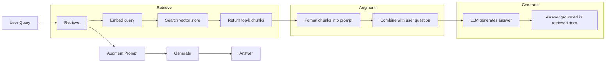
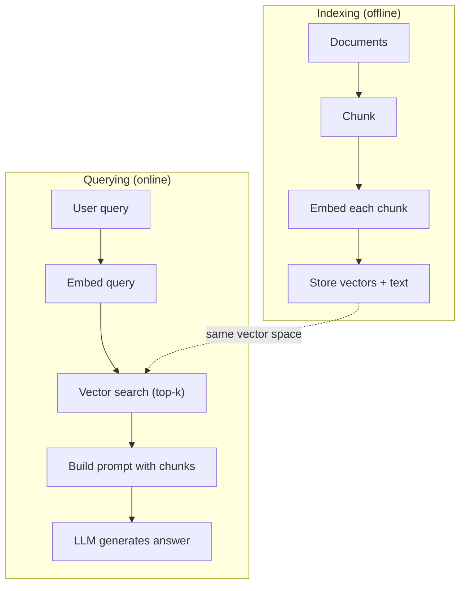

# RAG (Tổ sung phát triển)

> LLM của bạn biết mọi thứ cho đến thời gian đào tạo của mình. Nó không biết gì về tài liệu của công ty của bạn, cơ sở mã của bạn, hoặc ghi chú cuộc họp tuần trước. RAG giải quyết điều này bằng cách lấy tài liệu liên quan và lấp vào lời nhắc. Đó là mô hình được triển khai nhiều nhất trong AI sản xuất. Nếu bạn xây dựng một thứ từ khóa học này, xây dựng một đường ống dẫn RAG.

**Type:** Build
**Languages:** Python
**Prerequisites:** Phase 10 (LLMs from Scratch), Phase 11 Lessons 01-05
**Time:** ~90 minutes
**Related:**Giai đoạn 5 · 23 (Chunking Strategies for RAG) cho sáu thuật toán chunking và khi mỗi người thắng. Giai đoạn 5 · 22 (Embedding Models Deep Dive) cho việc chọn người nhúng. Giai đoạn 11 · 07 (Advanced RAG) cho tìm kiếm lai, xếp hạng lại và chuyển đổi truy vấn.

## Mục tiêu học tập

- Xây dựng một đường ống RAG hoàn chỉnh: tải tài liệu, phân mảnh, nhúng, lưu trữ vector, lấy lại và tạo
- Thực hiện tìm kiếm ngữ nghĩa bằng cách sử dụng cơ sở dữ liệu vector (ChromaDB, FAISS hoặc Pinecone) với lập chỉ mục đúng
- Giải thích lý do tại sao RAG được ưu tiên so với điều chỉnh tinh tế cho các ứng dụng dựa trên kiến thức (chi phí, độ tươi mới, tính thuộc tính)
- Đánh giá chất lượng RAG bằng cách sử dụng các số liệu thu hồi (sự chính xác, thu hồi) và số liệu sản xuất (sự trung thành, liên quan)

## Vấn đề

Bạn xây dựng một chatbot cho công ty của mình. Một khách hàng hỏi "Công lý hoàn trả tiền cho các kế hoạch doanh nghiệp là gì?" LLM trả lời với một câu trả lời chung về các chính sách hoàn trả tiền SaaS điển hình. Chính sách thực tế, được chôn cất trong một wiki nội bộ 200 trang, nói rằng khách hàng doanh nghiệp có cửa sổ 60 ngày với hoàn trả tiền theo tỷ lệ. LLM chưa bao giờ xem tài liệu này. Nó không thể biết nó không được đào tạo về điều gì.

Phân chỉnh tinh chỉnh là một giải pháp. Hãy lấy LLM, đào tạo nó trên tài liệu nội bộ của bạn, và triển khai mô hình được cập nhật. Điều này hoạt động nhưng có những vấn đề nghiêm trọng. Phân chỉnh tinh chỉnh tốn hàng ngàn đô la trong tính toán. Mô hình trở nên lỗi thời ngay khi một tài liệu thay đổi. Bạn không có cách nào để biết mô hình được lấy từ nguồn nào. Và nếu công ty mua lại một dòng sản phẩm khác tháng tới, bạn sẽ tinh chỉnh lại.

RAG là giải pháp khác. Để mẫu không bị ảnh hưởng. Khi một câu hỏi xuất hiện, hãy tìm kiếm các đoạn văn liên quan trong kho lưu trữ tài liệu của bạn, dán chúng vào thư nhắc trước câu hỏi, và để mô hình trả lời bằng cách sử dụng các đoạn văn đó như bối cảnh. Kho lưu trữ tài liệu có thể được cập nhật trong vài phút. Bạn có thể thấy chính xác những tài liệu nào đã được lấy lại. Bản thân mô hình không bao giờ thay đổi. Đó là lý do tại sao RAG là mô hình thống trị trong sản xuất: nó rẻ hơn, tươi hơn, kiểm toán hơn, và hoạt động với bất kỳ LLM nào.

## Khái niệm

### Mô hình RAG

Toàn bộ mô hình phù hợp với bốn bước:



Query -> Retrieve -> Augment prompt -> Generate. Mỗi hệ thống RAG theo mô hình này. Sự khác biệt giữa các hệ thống RAG sản xuất nằm trong chi tiết của mỗi bước: cách bạn phân chia, cách bạn nhúng, cách bạn tìm kiếm và cách bạn xây dựng prompt.

### Tại sao RAG không thích nghi với việc điều chỉnh tốt

| Concern | Fine-tuning | RAG |
|---------|------------|-----|
| Cost | $1,000-$100,000+ per training run | $0.01-$0.10 per query (embedding + LLM) |
| Freshness | Stale until retrained | Updated in minutes by re-indexing docs |
| Auditability | Cannot trace answer to source | Can show exact retrieved passages |
| Hallucination | Still hallucinates freely | Grounded in retrieved documents |
| Data privacy | Training data baked into weights | Documents stay in your vector store |

Định chỉnh tinh chỉnh thay đổi cân nặng của mô hình vĩnh viễn. RAG thay đổi bối cảnh của mô hình tạm thời. Đối với hầu hết các ứng dụng, bối cảnh tạm thời là điều bạn muốn.

Một trường hợp khi điều chỉnh tinh tế thắng: khi bạn cần mô hình để áp dụng một phong cách, giọng nói hoặc mô hình lý luận cụ thể mà không thể đạt được bằng cách chỉ đơn thuần thôi thúc.

### Đưa vào mô hình

Một mô hình nhúng chuyển đổi văn bản thành một vector dày đặc. Các văn bản tương tự tạo ra các vector gần nhau trong không gian chiều cao này. "Tôi đặt lại mật khẩu của tôi như thế nào?" và "Tôi cần thay đổi mật khẩu của tôi" tạo ra các vector gần giống nhau mặc dù chia sẻ một vài từ. "Căn nuôi ngồi trên thảm" tạo ra một vector rất khác nhau.

Các mô hình nhúng chung (2026 lineup  xem giai đoạn 5 · 22 để phân tích đầy đủ):

| Model | Dimensions | Provider | Notes |
|-------|-----------|----------|-------|
| text-embedding-3-small | 1536 (Matryoshka) | OpenAI | Best price/performance for most use cases |
| text-embedding-3-large | 3072 (Matryoshka) | OpenAI | Higher accuracy, truncatable to 256/512/1024 |
| Gemini Embedding 2 | 3072 (Matryoshka) | Google | Top MTEB retrieval; 8K context |
| voyage-4 | 1024/2048 (Matryoshka) | Voyage AI | Domain variants (code, finance, law) |
| Cohere embed-v4 | 1024 (Matryoshka) | Cohere | Strong multilingual, 128K context |
| BGE-M3 | 1024 (dense + sparse + ColBERT) | BAAI (open-weight) | Three views from one model |
| Qwen3-Embedding | 4096 (Matryoshka) | Alibaba (open-weight) | Top open-weight retrieval score |
| all-MiniLM-L6-v2 | 384 | Open-weight (Sentence Transformers) | Prototyping baseline |

Đối với bài học này, chúng tôi xây dựng bản nhúng đơn giản của riêng mình bằng cách sử dụng TF-IDF. Không phải vì TF-IDF là những gì hệ thống sản xuất sử dụng, nhưng bởi vì nó làm cho khái niệm cụ thể: văn bản đi vào, một vector ra ngoài, các văn bản tương tự tạo ra các vector tương tự.

### Sự tương đồng vector

Với hai vector, bạn đo lường sự tương đồng như thế nào?

**Cosine similarity**: cosine của góc giữa hai vector. dao động từ -1 (đối diện) đến 1 (tương tự).

```
cosine_sim(a, b) = dot(a, b) / (||a|| * ||b||)
```

**Dot product**: sản phẩm nội bộ thô. Các vector lớn hơn có điểm cao hơn. hữu ích khi độ lớn mang thông tin (các tài liệu dài hơn có thể có liên quan hơn).

```
dot(a, b) = sum(a_i * b_i)
```

**L2 (Euclidean) distance**: đường thẳng trong không gian vector. khoảng cách nhỏ hơn = tương tự hơn. Nhận thức về sự khác biệt độ lớn.

```
L2(a, b) = sqrt(sum((a_i - b_i)^2))
```

Sự tương đồng cosine là tiêu chuẩn. nó xử lý các tài liệu có chiều dài khác nhau một cách đẹp đẽ bởi vì nó bình thường hóa theo quy mô. Khi ai đó nói "sự tìm kiếm vector", họ gần như luôn có nghĩa là sự tương đồng cosine.

### Các chiến lược làm cho các mảnh vỡ

Các tài liệu quá dài để nhúng thành một khối vector. Một PDF 50 trang có thể tạo ra một nhúng khủng khiếp vì nó chứa hàng chục chủ đề. Thay vào đó, bạn chia các tài liệu thành các mảnh và nhúng từng mảnh riêng biệt.

**Fixed-size chunking**: chia tất cả các token N. đơn giản và có thể dự đoán được. Một phần 512 token với 50 token chồng chéo có nghĩa là phần 1 là token 0-511, phần 2 là token 462-973, v.v. Sự chồng chéo đảm bảo bạn không chia một câu ở một ranh giới không may mắn.

**Semantic chunking**: chia ở các ranh giới tự nhiên. Các đoạn văn, phần, hoặc tiêu đề đánh dấu xuống. Mỗi phần là một đơn vị có ý nghĩa liên kết.

**Recursive chunking**: cố gắng chia ở ranh giới lớn nhất trước (tên phần). Nếu một phần vẫn quá lớn, chia ở ranh giới đoạn. Nếu một đoạn văn vẫn quá lớn, chia ở ranh giới câu. Đây là cách tiếp cận LangChain RecursiveCharacterTextSplitter và nó hoạt động tốt trong thực tế.

Kích thước của mảnh phụ quan trọng hơn mọi người nghĩ:

- Quá nhỏ (64-128 token): mỗi phần thiếu ngữ cảnh. "Nó tăng 15% quý trước" không có nghĩa là gì mà không biết "nó" đề cập đến gì.
- quá lớn (2048 + token): mỗi phần bao gồm nhiều chủ đề, làm suy giảm sự liên quan. Khi bạn tìm kiếm dữ liệu doanh thu, bạn nhận được một phần là 10% về doanh thu và 90% về nhân viên.
- Sweet spot (256-512 token): đủ bối cảnh để tự chủ, tập trung đủ để có liên quan.

Hầu hết các hệ thống RAG sản xuất sử dụng 256-512 token với 50 token chồng chéo.

### Các cơ sở dữ liệu vector

Một khi bạn có nội dung, bạn cần một nơi để lưu trữ và tìm kiếm chúng.

| Database | Type | Best for |
|----------|------|----------|
| FAISS | Library (in-process) | Prototyping, small to medium datasets |
| Chroma | Lightweight DB | Local development, small deployments |
| Pinecone | Managed service | Production without ops overhead |
| Weaviate | Open source DB | Self-hosted production |
| pgvector | Postgres extension | Already using Postgres |
| Qdrant | Open source DB | High-performance self-hosted |

Đối với bài học này, chúng tôi xây dựng một kho lưu trữ vector đơn giản trong bộ nhớ. Nó lưu trữ vector trong một danh sách và thực hiện tìm kiếm tương tự cosine bằng lực thô. Điều này tương đương với FAISS với chỉ số phẳng. Nó mở rộng lên khoảng 100.000 vector trước khi chậm. Hệ thống sản xuất sử dụng thuật toán hàng xóm gần nhất (ANN) như HNSW để tìm kiếm hàng triệu vector trong millisecond.

### Lối ống dẫn đầy đủ



Các trình indexing được thực hiện một lần cho mỗi tài liệu (hoặc khi các tài liệu cập nhật).

### Số thực

Hầu hết các hệ thống RAG sản xuất sử dụng các tham số này:

- **k = 5 to 10**lấy các khối trên mỗi truy vấn
- **Chunk size = 256 to 512 tokens**với 50 token chồng chéo
- **Context budget**: 2,500-5,000 token nội dung được lấy lại mỗi truy vấn
- **Total prompt**: ~ 8.000-16.000 token (sự nhắc hệ thống + các đoạn thu hồi + lịch sử cuộc trò chuyện + truy vấn người dùng)
- **Embedding dimension**: 384-3072 tùy thuộc vào mô hình
- **Indexing throughput**: 100-1,000 tài liệu mỗi giây với API nhúng
- **Query latency**: 50-200ms cho việc lấy lại, 500-3000ms cho việc tạo ra

```figure
rag-chunking
```

## Hãy xây dựng nó

### Bước 1: Chunking tài liệu

```python
def chunk_text(text, chunk_size=200, overlap=50):
    words = text.split()
    chunks = []
    start = 0
    while start < len(words):
        end = start + chunk_size
        chunk = " ".join(words[start:end])
        chunks.append(chunk)
        start += chunk_size - overlap
    return chunks
```

### Bước 2: Nhập TF-IDF

Chúng tôi xây dựng một chức năng nhúng đơn giản. TF-IDF (Term Frequency-Inverse Document Frequency) không phải là một nhúng thần kinh, nhưng nó chuyển đổi văn bản thành các vector theo cách nắm bắt tầm quan trọng của từ. Các từ thường xuyên trong một tài liệu có được TF cao hơn. Các từ hiếm trên cơ thể có được IDF cao hơn. Sản phẩm cung cấp một vector nơi các từ quan trọng, đặc biệt có giá trị cao.

```python
import math
from collections import Counter

def build_vocabulary(documents):
    vocab = set()
    for doc in documents:
        vocab.update(doc.lower().split())
    return sorted(vocab)

def compute_tf(text, vocab):
    words = text.lower().split()
    count = Counter(words)
    total = len(words)
    return [count.get(word, 0) / total for word in vocab]

def compute_idf(documents, vocab):
    n = len(documents)
    idf = []
    for word in vocab:
        doc_count = sum(1 for doc in documents if word in doc.lower().split())
        idf.append(math.log((n + 1) / (doc_count + 1)) + 1)
    return idf

def tfidf_embed(text, vocab, idf):
    tf = compute_tf(text, vocab)
    return [t * i for t, i in zip(tf, idf)]
```

### Bước 3: Tìm kiếm sự tương đồng cosine

```python
def cosine_similarity(a, b):
    dot = sum(x * y for x, y in zip(a, b))
    norm_a = math.sqrt(sum(x * x for x in a))
    norm_b = math.sqrt(sum(x * x for x in b))
    if norm_a == 0 or norm_b == 0:
        return 0.0
    return dot / (norm_a * norm_b)

def search(query_embedding, stored_embeddings, top_k=5):
    scores = []
    for i, emb in enumerate(stored_embeddings):
        sim = cosine_similarity(query_embedding, emb)
        scores.append((i, sim))
    scores.sort(key=lambda x: x[1], reverse=True)
    return scores[:top_k]
```

### Bước 4: Xây dựng nhanh chóng

Đây là nơi "đồng cấp" trong RAG xảy ra. Hãy lấy các mảnh thu hồi, định dạng chúng thành một lời nhắc, và yêu cầu LLM trả lời dựa trên bối cảnh được cung cấp.

```python
def build_rag_prompt(query, retrieved_chunks):
    context = "\n\n---\n\n".join(
        f"[Source {i+1}]\n{chunk}"
        for i, chunk in enumerate(retrieved_chunks)
    )
    return f"""Answer the question based ONLY on the following context.
If the context doesn't contain enough information, say "I don't have enough information to answer that."

Context:
{context}

Question: {query}

Answer:"""
```

### Bước 5: Đường ống dẫn RAG hoàn chỉnh

```python
class RAGPipeline:
    def __init__(self):
        self.chunks = []
        self.embeddings = []
        self.vocab = []
        self.idf = []

    def index(self, documents):
        all_chunks = []
        for doc in documents:
            all_chunks.extend(chunk_text(doc))
        self.chunks = all_chunks
        self.vocab = build_vocabulary(all_chunks)
        self.idf = compute_idf(all_chunks, self.vocab)
        self.embeddings = [
            tfidf_embed(chunk, self.vocab, self.idf)
            for chunk in all_chunks
        ]

    def query(self, question, top_k=5):
        query_emb = tfidf_embed(question, self.vocab, self.idf)
        results = search(query_emb, self.embeddings, top_k)
        retrieved = [(self.chunks[i], score) for i, score in results]
        prompt = build_rag_prompt(
            question, [chunk for chunk, _ in retrieved]
        )
        return prompt, retrieved
```

### Bước 6: Tạo (được mô phỏng)

Trong sản xuất, đây là nơi bạn gọi là LLM API. cho bài học này, chúng tôi mô phỏng thế hệ bằng cách trích xuất câu có liên quan nhất từ ngữ cảnh được lấy lại.

```python
def simple_generate(prompt, retrieved_chunks):
    query_words = set(prompt.lower().split("question:")[-1].split())
    best_sentence = ""
    best_score = 0
    for chunk in retrieved_chunks:
        for sentence in chunk.split("."):
            sentence = sentence.strip()
            if not sentence:
                continue
            words = set(sentence.lower().split())
            overlap = len(query_words & words)
            if overlap > best_score:
                best_score = overlap
                best_sentence = sentence
    return best_sentence if best_sentence else "I don't have enough information."
```

## Sử dụng nó

Với mô hình thực sự nhúng và LLM, mã hầu như không thay đổi:

```python
from openai import OpenAI

client = OpenAI()

def embed(text):
    response = client.embeddings.create(
        model="text-embedding-3-small",
        input=text
    )
    return response.data[0].embedding

def generate(prompt):
    response = client.chat.completions.create(
        model="gpt-4o-mini",
        messages=[{"role": "user", "content": prompt}],
        temperature=0
    )
    return response.choices[0].message.content
```

Hoặc với Anthropic:

```python
import anthropic

client = anthropic.Anthropic()

def generate(prompt):
    response = client.messages.create(
        model="claude-sonnet-5",
        max_tokens=1024,
        messages=[{"role": "user", "content": prompt}]
    )
    return response.content[0].text
```

Các đường ống là giống nhau. Thay đổi chức năng nhúng. Thay đổi chức năng tạo. Lý thuyết lấy lại, chia nhỏ, xây dựng nhanh -- tất cả đều giống nhau bất kể bạn sử dụng mô hình nào.

Đối với lưu trữ vector ở quy mô, thay thế tìm kiếm lực thô bằng cơ sở dữ liệu vector thích hợp:

```python
import chromadb

client = chromadb.Client()
collection = client.create_collection("my_docs")

collection.add(
    documents=chunks,
    ids=[f"chunk_{i}" for i in range(len(chunks))]
)

results = collection.query(
    query_texts=["What is the refund policy?"],
    n_results=5
)
```

Chroma xử lý việc nhúng nội bộ (nó sử dụng tất cả MiniLM-L6-v2 theo mặc định) và lưu trữ các vector trong một cơ sở dữ liệu địa phương.

## Chuyển nó

Bài học này mang lại:
- `outputs/prompt-rag-architect.md`-- một lời nhắc để thiết kế các hệ thống RAG cho các trường hợp sử dụng cụ thể
- `outputs/skill-rag-pipeline.md`-- một kỹ năng dạy cho các đặc vụ cách xây dựng và gỡ lỗi đường ống RAG

## Các bài tập

1. Thay thế các bản nhúng TF-IDF bằng cách tiếp cận đơn giản của túi từ (tín: 1 nếu từ có, 0 nếu không). So sánh chất lượng tìm kiếm trên các tài liệu mẫu. TF-IDF nên vượt qua bởi vì nó cân nặng từ hiếm hơn.

2. Hãy thử các kích thước phần: thử 50, 100, 200, và 500 từ trên cùng một tập hợp tài liệu. Đối với mỗi kích thước, chạy cùng 5 truy vấn và đếm bao nhiêu trả lại một phần liên quan ở phần đầu-3. Tìm vị trí ngọt ngào nơi chất lượng tìm kiếm đạt đỉnh.

3. Thêm metadata vào mỗi phần (tên tài liệu nguồn, vị trí phần). Thay đổi mẫu yêu cầu để bao gồm thuộc tính nguồn để LLM trích dẫn nguồn của nó.

4. Thực hiện một đánh giá đơn giản: với 10 cặp câu hỏi-phản ứng, chạy mỗi câu hỏi qua đường ống RAG, và đo lường tỷ lệ phần trăm của các mảnh thu được chứa câu trả lời.

5. Xây dựng một đường ống RAG biết chuyện: giữ lịch sử của 3 sàn giao dịch cuối cùng và bao gồm chúng trong thư nhắc bên cạnh các mảnh thu hồi.

## Các điều khoản chính

| Term | What people say | What it actually means |
|------|----------------|----------------------|
| RAG | "AI that reads your docs" | Retrieve relevant documents, paste them into the prompt, and generate an answer grounded in those documents |
| Embedding | "Convert text to numbers" | A dense vector representation of text where similar meanings produce similar vectors |
| Vector database | "Search engine for AI" | A data store optimized for storing vectors and finding the nearest neighbors by similarity |
| Chunking | "Split docs into pieces" | Breaking documents into smaller segments (typically 256-512 tokens) so each can be embedded and retrieved independently |
| Cosine similarity | "How similar are two vectors" | The cosine of the angle between two vectors; 1 = identical direction, 0 = orthogonal, -1 = opposite |
| Top-k retrieval | "Get the k best matches" | Return the k most similar chunks to the query from the vector store |
| Context window | "How much text the LLM can see" | The maximum number of tokens the LLM can process in a single request; retrieved chunks must fit within this |
| Augmented generation | "Answer using given context" | Generating a response using retrieved documents as context rather than relying solely on trained knowledge |
| TF-IDF | "Word importance scoring" | Term Frequency times Inverse Document Frequency; weights words by how distinctive they are within a corpus |
| Indexing | "Preparing docs for search" | The offline process of chunking, embedding, and storing documents so they can be searched at query time |

## Đọc thêm

- Lewis et al., "Tổ thế tăng cường tìm kiếm cho các nhiệm vụ NLP chuyên sâu về kiến thức" (2020) - bài báo RAG ban đầu từ Nghiên cứu AI của Facebook đã chính thức hóa mô hình tìm kiếm sau đó tạo ra
- Tài liệu RAG của Anthropic (docs.anthropic.com) - hướng dẫn thực tế cho kích thước mảnh, xây dựng nhanh chóng và đánh giá
- Trung tâm học tập Pinecone, "RAG là gì?" - những lời giải thích trực quan rõ ràng về đường ống dẫn RAG với các cân nhắc sản xuất
- Câu-BERT: Reimers & Gurevych (2019) -- bài báo đằng sau các mô hình nhúng MiniLM, cho thấy cách đào tạo các bộ mã hóa hai cho sự tương đồng ngữ nghĩa
- [Karpukhin et al., "Dense Passage Retrieval for Open-Domain Question Answering" (EMNLP 2020)](https://arxiv.org/abs/2004.04906)- giấy DPR chứng minh việc lấy lại mật độ hai mã hóa vượt qua BM25 trên QA khu vực mở và đặt khuôn mẫu cho các máy lấy lại RAG hiện đại.
- [LlamaIndex High-Level Concepts](https://docs.llamaindex.ai/en/stable/getting_started/concepts.html)-- các khái niệm chính cần biết khi xây dựng đường ống RAG: bộ tải dữ liệu, bộ phân chia nút, chỉ số, máy lấy lại, bộ tổng hợp phản ứng.
- [LangChain RAG tutorial](https://python.langchain.com/docs/tutorials/rag/)- trình tạo nhạc cụ hương vị ngược lại; chuỗi các runnable xem cùng một mô hình lấy lại sau đó tạo ra.
