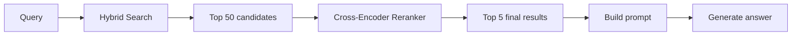
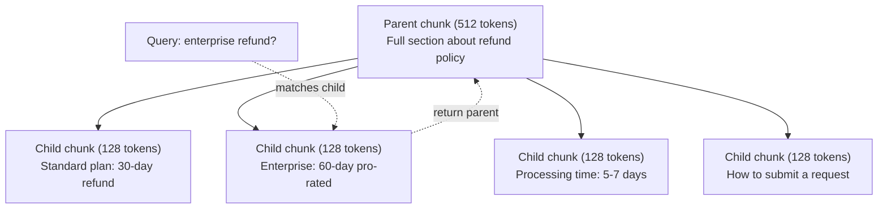
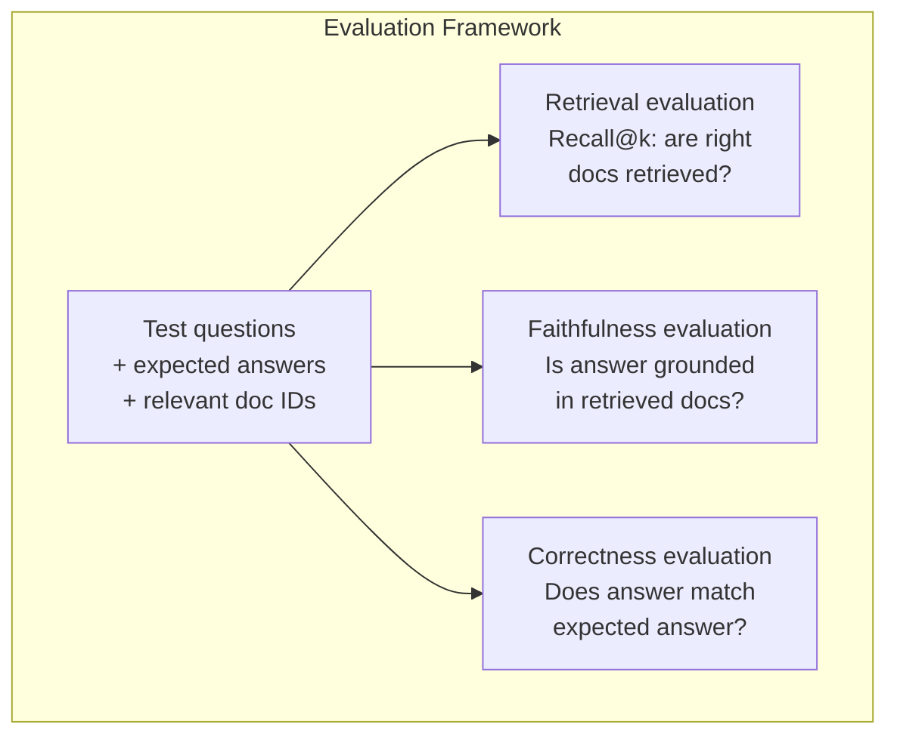

# RAG tiên tiến (Chunking, Ranger, Hybrid Search)

> RAG cơ bản lấy các phần tương tự nhất trên k. Điều đó hoạt động cho các câu hỏi đơn giản. Nó bị phá vỡ cho lý luận đa hop, các truy vấn mơ hồ và các cơ quan lớn. RAG nâng cao là sự khác biệt giữa một bản demo hoạt động trên 10 tài liệu và một hệ thống hoạt động trên 10 triệu.

**Type:** Build
**Languages:** Python
**Prerequisites:** Phase 11, Lesson 06 (RAG)
**Time:** ~90 minutes
**Related:**Giai đoạn 5 · 23 (Chunking Strategies for RAG) bao gồm tất cả sáu thuật toán chunking  tái phát, ngữ nghĩa, câu, tài liệu cha mẹ, chunking muộn, lấy lại ngữ cảnh  với các tiêu chuẩn Vectara / Anthropic. Bài học này xây dựng trên đỉnh: tìm kiếm lai, xếp hạng lại, chuyển đổi truy vấn.

## Mục tiêu học tập

- Thực hiện các chiến lược phân chia tiên tiến (tanthau nghĩa, thu hồi, cha mẹ-child) để bảo vệ cấu trúc và bối cảnh tài liệu
- Xây dựng một đường ống tìm kiếm lai kết hợp từ khóa BM25 phù hợp với tìm kiếm vector ngữ nghĩa và một trình xếp hạng lại mã hóa chéo
- Sử dụng kỹ thuật chuyển đổi truy vấn (HyDE, nhiều truy vấn, bước trở lại) để cải thiện việc truy cập vào các câu hỏi mơ hồ hoặc phức tạp
- Chẩn đoán và khắc phục các lỗi RAG phổ biến: lấy lại phần sai, trả lời không trong ngữ cảnh, phân tích lý luận đa hop

## Vấn đề

Bạn đã xây dựng một đường ống dẫn RAG cơ bản trong bài học 06 nó hoạt động cho các câu hỏi đơn giản trên một tập hợp nhỏ.

**Ambiguous query**"Thiết kế doanh thu quý trước là gì?" Tìm kiếm ngữ nghĩa trả về các phần về chiến lược doanh thu, dự báo doanh thu và suy nghĩ của CFO về tăng trưởng doanh thu. Tất cả đều tương tự như từ " doanh thu". Không có một phần nào chứa số thực tế. Phần chính xác nói "$47.2M in Q3 2025" but uses the word "earnings" instead of "revenue." The embedding model thinks "revenue strategy" is closer to the query than "Q3 earnings were $47,2M".

**Multi-hop question**"Đội nào có điểm số hài lòng khách hàng tốt nhất?" Điều này đòi hỏi phải tìm kiếm điểm số hài lòng cho mỗi nhóm, so sánh chúng và xác định tối đa.

**Large corpus problem**Bạn có 2 triệu khối. Câu trả lời chính xác là trong phần #1,847,293. Tìm kiếm top-5 của bạn kéo các khối # 14, #89,201, #1,200,000, #44, và #901,333. đóng trong không gian nhúng, nhưng không có chứa câu trả lời. Ở quy mô này, tìm kiếm hàng xóm gần nhất đưa ra lỗi đủ để kết quả liên quan được đẩy ra khỏi top-k.

RAG cơ bản thất bại vì sự tương đồng vector không giống nhau với sự liên quan. Một phần có thể tương tự như một câu hỏi mà không hữu ích để trả lời nó. Advanced RAG giải quyết vấn đề này bằng bốn kỹ thuật: tìm kiếm lai (số kết hợp từ khóa), xếp hạng lại (số ứng viên cẩn thận hơn), chuyển đổi truy vấn (làm chính xác truy vấn trước khi tìm kiếm) và phân tích tốt hơn (tại lại với độ phân tích đúng).

## Khái niệm

### Tìm kiếm lai: ngữ nghĩa + từ khóa

Tìm kiếm ngữ nghĩa (sự tương tự vector) là tốt để hiểu ý nghĩa. "Tôi hủy đăng ký của tôi như thế nào?" phù hợp với "Các bước để chấm dứt kế hoạch của bạn" mặc dù họ không chia sẻ các từ. Nhưng nó không có sự phù hợp chính xác. "Công mã lỗi E-4021" có thể không phù hợp với một phần chứa "E-4021" nếu mô hình nhúng xử lý nó như tiếng ồn.

Tìm kiếm từ khóa (BM25) là ngược lại. Nó xuất sắc khi phù hợp chính xác. "E-4021" phù hợp hoàn hảo. Nhưng "hoái đăng ký của tôi" trả lại kết quả không nếu tài liệu nói "hoái kế hoạch của bạn".

Tìm kiếm lai chạy cả hai, sau đó kết hợp kết quả.

**BM25**(Best Matching 25) là thuật toán tìm kiếm từ khóa tiêu chuẩn. Nó đã là xương sống của các công cụ tìm kiếm kể từ những năm 1990. Công thức:

```
BM25(q, d) = sum over terms t in q:
    IDF(t) * (tf(t,d) * (k1 + 1)) / (tf(t,d) + k1 * (1 - b + b * |d| / avgdl))
```

Trong khi tf(t,d) là t t t t t t t t t t t t t t t t t t t t t t t t t t t t t t t t t t t t t t t t t t t t t t t t t t t t t t t t t t t t t t t t t t t t t t t t t t t t t t t t t t t t t t t t t t t t t t t t t t t t t t t t t t t t t t t t t t t t t t t t t t t t t t t t t t t t t t t t t t t t t t t t t t t t t t t t t t t t t t t t t t t t t t t t t t t t t t t t t t t t t t t t t t t t t t t t t t t t t t t t t t t t t t t t t t t t t t t t t t t t t t t t t t t t t t t t t t t t t t t t t t t t t t t t t t t t t t t t t t t t t t t t t t t t t t t t t t t t t t t t t t t t t t t t t t t t t t t t t t t t t t t t t t t t t t t t t t t t t t t t t t t t t t t t t t t t t t t t t t t t t t t t t t t t t t t t t t t t t t t t t t t t t t t t t t t t t t t t t t t t t t t t t t t t t t t t t t t t t t t t t t t t t t t t t t t t t t t t t t t t t t t t t t t t t t t t t t t t t t t t t t t t t t t t t t t t t t t t t t t t t t t t t t t t t t t t t t t t t t t t t t t t t t t t t t t t t t t t t t t t t

Nói một cách đơn giản: BM25 đánh giá cao hơn tài liệu khi chúng chứa các thuật ngữ truy vấn (đặc biệt là những thuật ngữ hiếm), nhưng với lợi nhuận giảm đối với các thuật ngữ lặp đi lặp lại.

### Phối hợp cấp độ tương đối (RRF)

Bạn có hai danh sách xếp hạng: một từ tìm kiếm vector, một từ BM25. Làm thế nào để kết hợp chúng?

```
RRF_score(d) = sum over rankings R:
    1 / (k + rank_R(d))
```

K là một liên tục (thường là 60) ngăn cản kết quả xếp hạng hàng đầu thống trị.

Một tài liệu xếp hạng #1 trong tìm kiếm vector và #5 trong BM25 nhận được: 1/(60+1) + 1/(60+5) = 0.0164 + 0.0154 = 0.0318

Một tài liệu xếp hạng #3 trong tìm kiếm vector và #2 trong BM25 nhận được: 1/(60+3) + 1/(60+2) = 0.0159 + 0.0161 = 0.0320

RRF tự nhiên cân bằng hai tín hiệu. Một tài liệu xếp hạng cao trong cả hai danh sách nhận được điểm số tốt nhất. Một tài liệu xếp hạng #1 trong một danh sách nhưng vắng mặt trong danh sách khác nhận được điểm số trung bình. Điều này mạnh mẽ bởi vì nó sử dụng xếp hạng, không sử dụng điểm số thô, vì vậy sự khác biệt về phân phối điểm số giữa hai hệ thống không quan trọng.

### Tái xếp hạng

Khám truy xuất (dù là vector, keyword, hoặc hybrid) là nhanh nhưng không chính xác. Nó sử dụng các mã hóa hai: truy vấn và mỗi tài liệu được nhúng độc lập, sau đó so sánh. Các nhúng được tính toán một lần và được lưu trữ trong cache. Điều này có thể đạt đến hàng triệu tài liệu.

Việc xếp hạng lại sử dụng các mã hóa chéo: truy vấn và tài liệu ứng cử viên được đưa vào một mô hình đưa ra điểm liên quan. Mô hình nhìn thấy cả hai văn bản cùng một lúc và có thể nắm bắt các tương tác tinh tế giữa chúng. Một mã hóa chéo có thể hiểu rằng "Lợi nhuận Q3 là gì?" rất có liên quan đến một phần có chứa "$47.2M trong Q3" ngay cả khi một mã hóa đôi bỏ lỡ kết nối.

Sự đổi giá: cross-encoder là 100-1000x chậm hơn các bi-encoder vì họ xử lý cặp truy vấn-tài liệu cùng nhau. Bạn không thể tính toán trước điểm số cross-encoder cho một triệu tài liệu. Giải pháp: lấy một tập hợp ứng cử viên lớn hơn (top-50 từ tìm kiếm lai), sau đó xếp hạng lại với một cross-encoder để có được top-5 cuối cùng.



Các mô hình xếp hạng lại phổ biến (2026 lineup):
- Cohere Rerank 3.5: quản lý API, đa ngôn ngữ, lợi ích nhớ tốt nhất trên các cơ quan hỗn hợp
- Đơn vị xếp hạng lại của Voyage-2.5: API được quản lý, thời gian trễ thấp nhất trong các tùy chọn được lưu trữ
- Jina-Reranker-v2 Nhiều ngôn ngữ: trọng lượng mở, hơn 100 ngôn ngữ
- bge-re-ranker-v2-m3: trọng lượng mở, cơ sở mạnh
- cross-encoder/ms-marco-MiniLM-L-6-v2: Open-weight, chạy trên CPU để tạo mẫu
- ColBERTv2 / Jina-ColBERT-v2: Interaction Late-Multi-vector Ranger  O(tokens) không O(docs) tại thời điểm ghi điểm

### Query Transformation

Đôi khi vấn đề không phải là tìm kiếm mà chính là câu hỏi. "Điều đó là gì về sự thay đổi chính sách mới?" là một câu hỏi tìm kiếm khủng khiếp. Nó không chứa các thuật ngữ cụ thể. Việc nhúng là mơ hồ. Không có hệ thống tìm kiếm nào có thể tìm thấy các tài liệu phù hợp từ điều này.

**Query rewriting**: tái định nghĩa truy vấn của người dùng thành truy vấn tìm kiếm tốt hơn.

```
User: "What was that thing about the new policy change?"
Rewritten: "Recent policy changes and updates"
```

**HyDE (Hypothetical Document Embeddings)**: thay vì tìm kiếm với câu hỏi, tạo ra một câu trả lời giả thuyết, nhúng vào đó, và tìm kiếm các tài liệu thực tương tự.

```
Query: "What is the refund policy for enterprise?"
Hypothetical answer: "Enterprise customers are eligible for a full refund
within 60 days of purchase. Refunds are pro-rated based on the remaining
subscription period and processed within 5-7 business days."
```

Nhập câu trả lời giả thuyết và tìm kiếm các tài liệu thực tương tự nó. Nhận thức: câu trả lời giả thuyết sống gần hơn trong không gian nhúng vào câu trả lời thực hơn câu hỏi ban đầu. Câu hỏi và câu trả lời có cấu trúc ngôn ngữ khác nhau. Bằng cách tạo ra câu trả lời giả thuyết, bạn sẽ thu hẹp khoảng cách giữa "không gian câu hỏi" và "không gian trả lời" trong nhúng.

HyDE thêm một cuộc gọi LLM trước khi truy xuất. Điều này làm tăng độ trễ 500-2000ms.

### Bắt đầu với con

Việc làm phân mảnh thông thường buộc phải thỏa hiệp: các mảnh nhỏ để lấy lại chính xác, các mảnh lớn để đủ bối cảnh.

Chỉ số các đoạn nhỏ (128 token) để lấy lại. Khi một đoạn nhỏ được lấy lại, hãy trả lại phần mẹ của nó (512 token) cho lời nhắc. Phần nhỏ phù hợp chính xác với truy vấn. Phần mẹ cung cấp đủ bối cảnh để LLM tạo ra một câu trả lời tốt.



Câu hỏi "trái tiền doanh nghiệp?" phù hợp với phần nhỏ C2 chính xác. Nhưng lời nhắc nhận nhận phần chính đầy đủ P, bao gồm bối cảnh xung quanh về thời gian xử lý và quá trình gửi.

### Phân lọc metadata

Trước khi chạy tìm kiếm vector, lọc bộ phận theo metadata: ngày, nguồn, loại, tác giả, ngôn ngữ. Điều này làm giảm không gian tìm kiếm và ngăn chặn kết quả không liên quan.

"Điều gì đã thay đổi trong chính sách bảo mật tháng trước?" chỉ nên tìm kiếm tài liệu từ 30 ngày qua trong danh mục bảo mật. Không lọc siêu dữ liệu, bạn tìm kiếm toàn bộ bộ và có thể lấy lại một tài liệu bảo mật 2 năm tuổi mà xảy ra tương tự về ngữ nghĩa.

Hệ thống sản xuất RAG lưu trữ metadata bên cạnh từng phần: tài liệu nguồn, ngày tạo, loại, tác giả, phiên bản. Các cơ sở dữ liệu vector hỗ trợ lọc trước bằng metadata trước khi tìm kiếm tương đồng, điều này rất quan trọng đối với hiệu suất ở quy mô.

### Đánh giá

Anh đã xây dựng một hệ thống RAG. Làm sao anh biết nó có hoạt động không?

**Retrieval relevance (Recall@k)**: cho một tập hợp các câu hỏi thử nghiệm với các tài liệu có liên quan được biết, bao nhiêu phần trăm tài liệu có liên quan xuất hiện trong kết quả top-k?

**Faithfulness**Nếu các phần được lấy lại nói "trung cửa hàng hoàn trả 60 ngày" và mô hình nói "trung cửa hàng hoàn trả 90 ngày", đó là một sự thất bại. mô hình ảo giác mặc dù có bối cảnh chính xác.

**Answer correctness**: câu trả lời được tạo tương ứng với câu trả lời mong đợi? Đây là chỉ số kết thúc đến kết thúc. Nó kết hợp chất lượng thu thập và chất lượng sản xuất.

Một kiểm tra độ trung thực đơn giản: lấy từng tuyên bố trong câu trả lời được tạo và xác minh rằng nó xuất hiện (trong chất lượng) trong các mảnh thu hồi. Nếu câu trả lời có một sự thật không trong bất kỳ mảnh thu hồi nào, nó có thể bị ảo giác.



```figure
agentic-rag-loop
```

## Hãy xây dựng nó

### Bước 1: Thực hiện BM25

```python
import math
from collections import Counter

class BM25:
    def __init__(self, k1=1.2, b=0.75):
        self.k1 = k1
        self.b = b
        self.docs = []
        self.doc_lengths = []
        self.avg_dl = 0
        self.doc_freqs = {}
        self.n_docs = 0

    def index(self, documents):
        self.docs = documents
        self.n_docs = len(documents)
        self.doc_lengths = []
        self.doc_freqs = {}

        for doc in documents:
            words = doc.lower().split()
            self.doc_lengths.append(len(words))
            unique_words = set(words)
            for word in unique_words:
                self.doc_freqs[word] = self.doc_freqs.get(word, 0) + 1

        self.avg_dl = sum(self.doc_lengths) / self.n_docs if self.n_docs else 1

    def score(self, query, doc_idx):
        query_words = query.lower().split()
        doc_words = self.docs[doc_idx].lower().split()
        doc_len = self.doc_lengths[doc_idx]
        word_counts = Counter(doc_words)
        score = 0.0

        for term in query_words:
            if term not in word_counts:
                continue
            tf = word_counts[term]
            df = self.doc_freqs.get(term, 0)
            idf = math.log((self.n_docs - df + 0.5) / (df + 0.5) + 1)
            numerator = tf * (self.k1 + 1)
            denominator = tf + self.k1 * (1 - self.b + self.b * doc_len / self.avg_dl)
            score += idf * numerator / denominator

        return score

    def search(self, query, top_k=10):
        scores = [(i, self.score(query, i)) for i in range(self.n_docs)]
        scores.sort(key=lambda x: x[1], reverse=True)
        return scores[:top_k]
```

### Bước 2: Sự hợp nhất cấp bậc

```python
def reciprocal_rank_fusion(ranked_lists, k=60):
    scores = {}
    for ranked_list in ranked_lists:
        for rank, (doc_id, _) in enumerate(ranked_list):
            if doc_id not in scores:
                scores[doc_id] = 0.0
            scores[doc_id] += 1.0 / (k + rank + 1)
    fused = sorted(scores.items(), key=lambda x: x[1], reverse=True)
    return fused
```

### Bước 3: Đường ống tìm kiếm lai

```python
def hybrid_search(query, chunks, vector_embeddings, vocab, idf, bm25_index, top_k=5, fusion_k=60):
    query_emb = tfidf_embed(query, vocab, idf)
    vector_results = search(query_emb, vector_embeddings, top_k=top_k * 3)
    bm25_results = bm25_index.search(query, top_k=top_k * 3)
    fused = reciprocal_rank_fusion([vector_results, bm25_results], k=fusion_k)
    return fused[:top_k]
```

### Bước 4: Đặt lại đơn giản

Trong sản xuất, bạn sẽ sử dụng mô hình mã hóa chéo. Ở đây chúng tôi xây dựng một reanker mà đánh giá liên quan đến tài liệu truy vấn bằng cách sử dụng sự chồng chéo từ, tầm quan trọng của thuật ngữ và sự phù hợp cụm từ.

```python
def rerank(query, candidates, chunks):
    query_words = set(query.lower().split())
    stop_words = {"the", "a", "an", "is", "are", "was", "were", "what", "how",
                  "why", "when", "where", "do", "does", "for", "of", "in", "to",
                  "and", "or", "on", "at", "by", "it", "its", "this", "that",
                  "with", "from", "be", "has", "have", "had", "not", "but"}
    query_terms = query_words - stop_words

    scored = []
    for doc_id, initial_score in candidates:
        chunk = chunks[doc_id].lower()
        chunk_words = set(chunk.split())

        term_overlap = len(query_terms & chunk_words)

        query_bigrams = set()
        q_list = [w for w in query.lower().split() if w not in stop_words]
        for i in range(len(q_list) - 1):
            query_bigrams.add(q_list[i] + " " + q_list[i + 1])
        bigram_matches = sum(1 for bg in query_bigrams if bg in chunk)

        position_boost = 0
        for term in query_terms:
            pos = chunk.find(term)
            if pos != -1 and pos < len(chunk) // 3:
                position_boost += 0.5

        rerank_score = (
            term_overlap * 1.0
            + bigram_matches * 2.0
            + position_boost
            + initial_score * 5.0
        )
        scored.append((doc_id, rerank_score))

    scored.sort(key=lambda x: x[1], reverse=True)
    return scored
```

### Bước 5: HyDE (Hypothetical Document Embeddings)

```python
def hyde_generate_hypothesis(query):
    templates = {
        "what": "The answer to '{query}' is as follows: Based on our documentation, {topic} involves specific policies and procedures that define how the process works.",
        "how": "To address '{query}': The process involves several steps. First, you need to initiate the request. Then, the system processes it according to the defined rules.",
        "default": "Regarding '{query}': Our records indicate specific details and policies related to this topic that provide a comprehensive answer."
    }
    query_lower = query.lower()
    if query_lower.startswith("what"):
        template = templates["what"]
    elif query_lower.startswith("how"):
        template = templates["how"]
    else:
        template = templates["default"]

    topic_words = [w for w in query.lower().split()
                   if w not in {"what", "is", "the", "how", "do", "does", "a", "an",
                                "for", "of", "to", "in", "on", "at", "by", "and", "or"}]
    topic = " ".join(topic_words) if topic_words else "this topic"

    return template.format(query=query, topic=topic)


def hyde_search(query, chunks, vector_embeddings, vocab, idf, top_k=5):
    hypothesis = hyde_generate_hypothesis(query)
    hypothesis_emb = tfidf_embed(hypothesis, vocab, idf)
    results = search(hypothesis_emb, vector_embeddings, top_k)
    return results, hypothesis
```

### Bước 6: Biết cách làm cho con mẹ

```python
def create_parent_child_chunks(text, parent_size=200, child_size=50):
    words = text.split()
    parents = []
    children = []
    child_to_parent = {}

    parent_idx = 0
    start = 0
    while start < len(words):
        parent_end = min(start + parent_size, len(words))
        parent_text = " ".join(words[start:parent_end])
        parents.append(parent_text)

        child_start = start
        while child_start < parent_end:
            child_end = min(child_start + child_size, parent_end)
            child_text = " ".join(words[child_start:child_end])
            child_idx = len(children)
            children.append(child_text)
            child_to_parent[child_idx] = parent_idx
            child_start += child_size

        parent_idx += 1
        start += parent_size

    return parents, children, child_to_parent
```

### Bước 7: Đánh giá lòng trung thành

```python
def evaluate_faithfulness(answer, retrieved_chunks):
    answer_sentences = [s.strip() for s in answer.split(".") if len(s.strip()) > 10]
    if not answer_sentences:
        return 1.0, []

    grounded = 0
    ungrounded = []
    context = " ".join(retrieved_chunks).lower()

    for sentence in answer_sentences:
        words = set(sentence.lower().split())
        stop_words = {"the", "a", "an", "is", "are", "was", "were", "and", "or",
                      "to", "of", "in", "for", "on", "at", "by", "it", "this", "that"}
        content_words = words - stop_words
        if not content_words:
            grounded += 1
            continue

        matched = sum(1 for w in content_words if w in context)
        ratio = matched / len(content_words) if content_words else 0

        if ratio >= 0.5:
            grounded += 1
        else:
            ungrounded.append(sentence)

    score = grounded / len(answer_sentences) if answer_sentences else 1.0
    return score, ungrounded


def evaluate_retrieval_recall(queries_with_relevant, retrieval_fn, k=5):
    total_recall = 0.0
    results = []

    for query, relevant_indices in queries_with_relevant:
        retrieved = retrieval_fn(query, k)
        retrieved_indices = set(idx for idx, _ in retrieved)
        relevant_set = set(relevant_indices)
        hits = len(retrieved_indices & relevant_set)
        recall = hits / len(relevant_set) if relevant_set else 1.0
        total_recall += recall
        results.append({
            "query": query,
            "recall": recall,
            "hits": hits,
            "total_relevant": len(relevant_set)
        })

    avg_recall = total_recall / len(queries_with_relevant) if queries_with_relevant else 0
    return avg_recall, results
```

## Sử dụng nó

Với một mã hóa chéo thực sự để xếp hạng lại:

```python
from sentence_transformers import CrossEncoder

reranker = CrossEncoder("cross-encoder/ms-marco-MiniLM-L-6-v2")

def rerank_with_cross_encoder(query, candidates, chunks, top_k=5):
    pairs = [(query, chunks[doc_id]) for doc_id, _ in candidates]
    scores = reranker.predict(pairs)
    scored = list(zip([doc_id for doc_id, _ in candidates], scores))
    scored.sort(key=lambda x: x[1], reverse=True)
    return scored[:top_k]
```

Với người quản lý của Cohere:

```python
import cohere

co = cohere.Client()

def rerank_with_cohere(query, candidates, chunks, top_k=5):
    docs = [chunks[doc_id] for doc_id, _ in candidates]
    response = co.rerank(
        model="rerank-english-v3.0",
        query=query,
        documents=docs,
        top_n=top_k
    )
    return [(candidates[r.index][0], r.relevance_score) for r in response.results]
```

Đối với HyDE với một LLM thực sự:

```python
import anthropic

client = anthropic.Anthropic()

def hyde_with_llm(query):
    response = client.messages.create(
        model="claude-sonnet-5",
        max_tokens=256,
        messages=[{
            "role": "user",
            "content": f"Write a short paragraph that would be a good answer to this question. Do not say you don't know. Just write what the answer would look like.\n\nQuestion: {query}"
        }]
    )
    return response.content[0].text
```

Đối với việc tìm kiếm sản xuất lai với Weaviate:

```python
import weaviate

client = weaviate.connect_to_local()

collection = client.collections.get("Documents")
response = collection.query.hybrid(
    query="enterprise refund policy",
    alpha=0.5,
    limit=10
)
```

Các tham số alpha kiểm soát cân bằng: 0.0 = từ khóa thuần túy (BM25), 1.0 = vector thuần túy, 0.5 = trọng lượng bằng nhau.

## Chuyển nó

Bài học này mang lại:
- `outputs/prompt-advanced-rag-debugger.md`-- một lời nhắc để chẩn đoán và khắc phục các vấn đề chất lượng RAG
- `outputs/skill-advanced-rag.md`-- một kỹ năng để xây dựng RAG cấp sản xuất với tìm kiếm lai và xếp hạng lại

## Các bài tập

1. So sánh BM25 vs tìm kiếm vector vs tìm kiếm lai trên các tài liệu mẫu. Đối với mỗi trong 5 truy vấn thử nghiệm, ghi lại cách tiếp cận nào trả lại phần liên quan nhất ở vị trí # 1. Tìm kiếm lai nên thắng ít nhất 3 trong số 5.

2. Thực hiện một bộ lọc siêu dữ liệu. Thêm một trường "luật hạng" vào mỗi tài liệu (tự an ninh, hóa đơn, API, sản phẩm). Trước khi chạy tìm kiếm vector, lọc các đoạn chỉ vào danh mục liên quan. Kiểm tra bằng "Công mật mã nào được sử dụng?" và xác minh nó chỉ tìm kiếm các đoạn của danh mục bảo mật.

3. Xây dựng một đường ống HyDE đầy đủ bằng cách sử dụng chức năng tạo đơn giản từ Bài học 06. So sánh chất lượng thu thập (tối ưu 3 hàng đầu) giữa tìm kiếm truy vấn trực tiếp và tìm kiếm HyDE trên tất cả 5 truy vấn thử nghiệm. HyDE nên cải thiện kết quả cho các truy vấn mơ hồ.

4. Thực hiện chiến lược chia nhỏ cha mẹ con trên các tài liệu mẫu. Sử dụng child_size=30 và parent_size=100. Tìm kiếm với các phần nhỏ của trẻ em nhưng trả lại các phần nhỏ của cha mẹ trong lời nhắc. So sánh các câu trả lời được tạo ra cho chia nhỏ tiêu chuẩn với chunk_size=50.

5. Tạo một bộ dữ liệu đánh giá: 10 câu hỏi với các đoạn trả lời được biết đến. đo Recall@3, Recall@5, và Recall@10 chỉ cho (a) tìm kiếm vector, (b) chỉ cho BM25, (c) tìm kiếm lai, (d) tìm kiếm lai + xếp hạng lại.

## Các điều khoản chính

| Term | What people say | What it actually means |
|------|----------------|----------------------|
| BM25 | "Keyword search" | A probabilistic ranking algorithm that scores documents by term frequency, inverse document frequency, and document length normalization |
| Hybrid search | "Best of both worlds" | Running semantic (vector) and keyword (BM25) search in parallel, then merging results with rank fusion |
| Reciprocal Rank Fusion | "Merge ranked lists" | Combining multiple ranked lists by summing 1/(k + rank) for each document across all lists |
| Reranking | "Second pass scoring" | Using a more expensive cross-encoder model to re-score a candidate set from initial retrieval |
| Cross-encoder | "Joint query-document model" | A model that takes a query and document as a single input, producing a relevance score; more accurate than bi-encoders but too slow for full corpus search |
| Bi-encoder | "Independent embedding model" | A model that embeds queries and documents independently; fast because embeddings are precomputed, but less accurate than cross-encoders |
| HyDE | "Search with a fake answer" | Generate a hypothetical answer to the query, embed it, and search for real documents similar to it |
| Parent-child chunking | "Small search, big context" | Index small chunks for precise retrieval but return the larger parent chunk to provide sufficient context |
| Metadata filtering | "Narrow before searching" | Filtering documents by attributes (date, source, category) before running vector search to reduce the search space |
| Faithfulness | "Did it stay grounded" | Whether the generated answer is supported by the retrieved documents, as opposed to hallucinated from the model's training data |

## Đọc thêm

- Robertson & Zaragoza, "The Probabilistic Relevance Framework: BM25 and Beyond" (2009) - tham chiếu cuối cùng cho BM25, giải thích các nền tảng xác suất đằng sau công thức
- Cormack et al., "Thiết hợp cấp độ tương ứng vượt trội hơn phương pháp học tập Condorcet và cấp độ cá nhân" (2009) - bài báo RRF ban đầu cho thấy nó đánh bại các phương pháp hợp nhất phức tạp hơn
- Gao et al., "Cũng xác nhận mật độ không chụp bằng không mà không có nhãn liên quan" (2022) - bài HyDE chứng minh rằng việc nhúng tài liệu giả thuyết cải thiện việc lấy lại mà không cần bất kỳ dữ liệu đào tạo nào
- Nogueira & Cho, "Passage Re-ranking with BERT" (2019) -- cho thấy việc xếp hạng lại qua mã hóa trên đỉnh BM25 cải thiện đáng kể chất lượng truy xuất
- [Khattab et al., "DSPy: Compiling Declarative Language Model Calls into Self-Improving Pipelines" (2023)](https://arxiv.org/abs/2310.03714)-- xử lý việc xây dựng nhanh chóng và lựa chọn trọng lượng như một vấn đề tối ưu hóa trên đường ống thu hồi; đọc điều này cho " LLM chương trình" thay vì " LLM nhanh chóng".
- [Edge et al., "From Local to Global: A Graph RAG Approach to Query-Focused Summarization" (Microsoft Research 2024)](https://arxiv.org/abs/2404.16130)- Bức tranh GraphRAG: khai thác mối quan hệ thực thể + phát hiện cộng đồng Leiden cho tổng kết tập trung vào truy vấn; sự phân biệt về việc lấy lại toàn cầu và địa phương.
- [Asai et al., "Self-RAG: Learning to Retrieve, Generate, and Critique through Self-Reflection" (ICLR 2024)](https://arxiv.org/abs/2310.11511)-- tự đánh giá RAG với các token phản xạ; biên giới của các đại lý qua thu hồi tĩnh-đã tạo.
- [LangChain Query Construction blog](https://blog.langchain.dev/query-construction/)-- cách dịch các truy vấn ngôn ngữ tự nhiên thành truy vấn cơ sở dữ liệu có cấu trúc (Text-to-SQL, Cypher) như một bước mua phục hồi.
