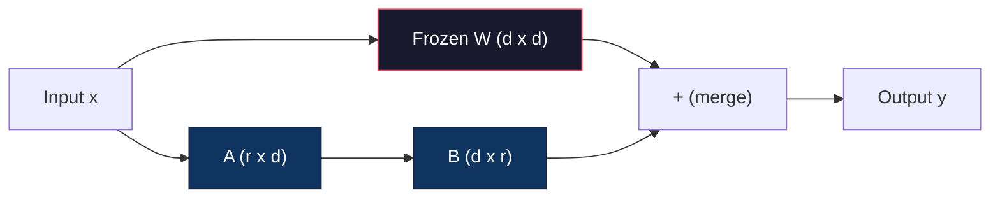
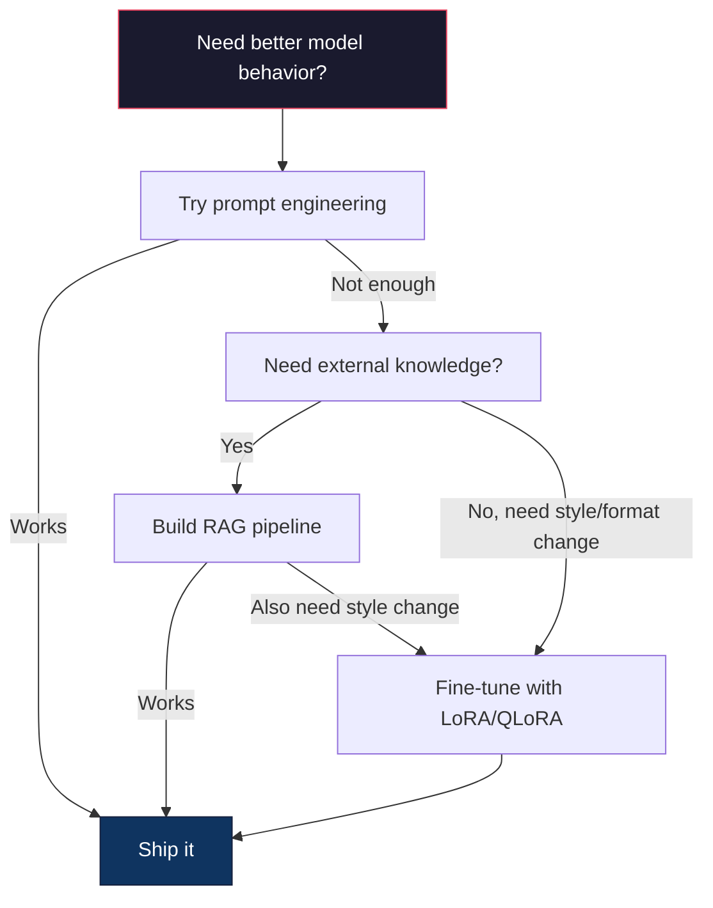

# Hoạt động tinh tế với LoRA & QLoRA

> LoRA cho phép bạn chỉnh sửa mô hình hoàn chỉnh trong 6GB bằng cách đào tạo ít hơn 1% các tham số. Đây không phải là một sự thỏa hiệp - nó phù hợp với chất lượng chỉnh sửa hoàn chỉnh trong hầu hết các nhiệm vụ. Toàn bộ hệ sinh thái chỉnh sửa mã nguồn mở chạy trên một thủ thuật này.

**Type:** Build
**Languages:** Python
**Prerequisites:** Phase 10, Lesson 06 (Instruction Tuning / SFT)
**Time:** ~75 minutes
**Related:**Giai đoạn 10 bao gồm các vòng SFT/DPO từ đầu. Bài học này kết nối chúng vào bộ công cụ PEFT 2026 (PEFT, TRL, Unsloth, Axolotl, LLaMA-Factory).

## Mục tiêu học tập

- Thực hiện LoRA bằng cách tiêm các bộ chuyển đổi cấp thấp (A và B) vào các lớp chú ý của mô hình được đào tạo trước
- Xét số tiết kiệm tham số của LoRA so với điều chỉnh hoàn chỉnh: xếp hạng r với d_model dimension train 2*r*d tham số thay vì d^2
- Hoàn chỉnh một mô hình sử dụng QLoRA (4 bit quanteized base + LoRA adapters) để phù hợp với bộ nhớ GPU của người tiêu dùng
- Thêm lại trọng lượng LoRA vào mô hình cơ bản để triển khai và so sánh tốc độ suy luận với và không có bộ điều chỉnh

## Vấn đề

Bạn có một mô hình cơ bản. Llama 3 8B. Bạn muốn nó trả lời các vé hỗ trợ khách hàng bằng giọng nói của công ty của bạn. SFT là câu trả lời. Nhưng SFT có một vấn đề chi phí.

Llama 3 8B có 8 tỷ tham số. Trong fp16, mỗi tham số mất 2 byte. Đó là 16GB chỉ để tải trọng. Trong quá trình đào tạo, bạn cũng cần gradient (16GB), trạng thái tối ưu hóa cho Adam (32GB cho động lực + biến thể), và kích hoạt. Tổng cộng: khoảng 56GB VRAM cho một mô hình 8B.

Một chiếc A100 80GB chỉ vừa đủ.$3-4/hour on cloud providers. Training for 3 epochs on 50,000 examples takes 6-10 hours. That's $30-40 cho mỗi thí nghiệm. Hãy thử 10 thí nghiệm để có được các siêu tham số đúng và bạn đã chi 400 đô trước khi triển khai bất cứ điều gì.

Làm quy mô này là Llama 3 70B và số lượng trở nên vô lý. 140GB chỉ cho trọng lượng. Bạn cần một cluster. 100 + mỗi thí nghiệm.

Có một vấn đề sâu sắc hơn nữa. Định chỉnh hoàn chỉnh thay đổi mọi trọng lượng trong mô hình. Nếu bạn điều chỉnh dữ liệu hỗ trợ khách hàng, bạn có thể làm suy giảm khả năng chung của mô hình. Nó được gọi là quên lãng thảm khốc. mô hình trở nên tốt hơn trong nhiệm vụ của bạn và tồi tệ hơn trong mọi thứ khác.

Bạn cần một phương pháp đào tạo ít tham số hơn, sử dụng ít bộ nhớ hơn, và không phá hủy kiến thức hiện tại của mô hình.

## Khái niệm

### LoRA: Chuẩn bị cấp thấp

Edward Hu và các đồng nghiệp tại Microsoft đã xuất bản LoRA vào tháng 6 năm 2021. Nhìn sâu của bài báo: các cập nhật trọng lượng trong quá trình điều chỉnh tinh tế có thứ hạng nội tại thấp. Bạn không cần cập nhật tất cả 16,7 triệu tham số trong một matrix trọng lượng 4096x4096. Thông tin hữu ích trong bản cập nhật có thể được nắm bắt bằng một matrix thứ hạng 16 hoặc 32.

Đây là toán học. Một lớp tuyến tính tiêu chuẩn tính toán:

```
y = Wx
```

Trong đó W là một d_out x d_in. cho một dự đoán 4096x4096, đó là 16,777,216 tham số.

LoRA đóng băng W và thêm một phân hủy cấp thấp:

```
y = Wx + BAx
```

Ở đó B là (d_out x r) và A là (r x d_in).

Đối với r=16 trên lớp 4096x4096:
- Các tham số ban đầu: 4096 x 4096 = 16,777,216
- Các tham số LoRA: (4096 x 16) + (16 x 4096) = 65,536 + 65,536 = 131,072
- Giảm: 131.072 / 16.777.216 = 0,78%

Bạn đang luyện tập 0,78% các thông số và nhận được 95-100% chất lượng.



A được khởi tạo bằng một Gaussian ngẫu nhiên. B được khởi tạo đến không. Điều này có nghĩa là đóng góp LoRA bắt đầu từ không - mô hình bắt đầu đào tạo từ hành vi ban đầu của nó và dần dần học cách thích nghi.

### Tỷ lệ quy mô: Alpha

LoRA giới thiệu một yếu tố quy mô alpha điều khiển mức độ cập nhật cấp thấp ảnh hưởng đến đầu ra:

```
y = Wx + (alpha / r) * BAx
```

Khi alpha = r, quy mô là 1x. Khi alpha = 2r (tầm định chung), quy mô là 2x.

Những hướng dẫn thực tế:
- alpha = 2 * rank là một quy ước cộng đồng phổ biến (màn giấy ban đầu được sử dụng alpha = rank trong hầu hết các thí nghiệm)
- alpha = xếp hạng cho phép 1x quy mô, bảo thủ nhưng ổn định
- Alpha cao hơn có nghĩa là các cập nhật lớn hơn mỗi bước, có thể tăng tốc sự hội tụ hoặc gây bất ổn

### Lần sử dụng LoRA

Một biến thể có nhiều lớp tuyến tính. Bạn không cần phải thêm LoRA vào tất cả chúng. Bức giấy ban đầu đã thử nghiệm các kết hợp khác nhau:

| Target Layers | Trainable Params (7B) | Quality |
|--------------|----------------------|---------|
| q_proj only | 4.7M | Good |
| q_proj + v_proj | 9.4M | Better |
| q_proj + k_proj + v_proj + o_proj | 18.9M | Best for attention |
| All linear (attention + MLP) | 37.7M | Marginal gain, 2x params |

Điểm ngọt ngào cho hầu hết các nhiệm vụ: q_proj + v_proj. Điều này nhắm vào các dự đoán truy vấn và giá trị trong sự chú ý tự, điều khiển những gì mô hình tham gia và những thông tin mà nó trích xuất.

### Chọn cấp độ

Đơn vị r kiểm soát tính biểu hiện của sự thích nghi:

| Rank | Trainable Params (per layer) | Best For |
|------|---------------------------|----------|
| 4 | 32,768 | Simple classification, sentiment |
| 8 | 65,536 | Single-domain Q&A, summarization |
| 16 | 131,072 | Multi-domain tasks, instruction following |
| 32 | 262,144 | Complex reasoning, code generation |
| 64 | 524,288 | Diminishing returns for most tasks |
| 128 | 1,048,576 | Rarely justified |

Hu et al. cho thấy rằng r=4 đã nắm bắt hầu hết các thích ứng cho các nhiệm vụ đơn giản. r=8 và r=16 là những lựa chọn phổ biến nhất trong thực tế.

### QLoRA: Quantization 4-bit + LoRA

Tim Dettmers và các đồng nghiệp tại Đại học Washington đã xuất bản QLoRA vào tháng 5 năm 2023. Ý tưởng: định lượng mô hình cơ sở đóng băng thành độ chính xác 4 bit, sau đó gắn bộ chuyển đổi LoRA trong fp16 ở trên.

Điều này thay đổi đáng kể phương trình ghi nhớ:

| Method | Weight Memory (7B) | Training Memory (7B) | GPU Required |
|--------|-------------------|---------------------|-------------|
| Full fine-tune (fp16) | 14GB | ~56GB | 1x A100 80GB |
| LoRA (fp16 base) | 14GB | ~18GB | 1x A100 40GB |
| QLoRA (4-bit base) | 3.5GB | ~6GB | 1x RTX 3090 24GB |

QLoRA đóng góp ba phần kỹ thuật:

**NF4 (Normal Float 4-bit)**Một loại dữ liệu mới được thiết kế đặc biệt cho trọng lượng mạng thần kinh. trọng lượng mạng thần kinh theo phân phối bình thường. NF4 đặt 16 mức lượng hóa của nó tại các lượng số của một phân phối bình thường tiêu chuẩn. Đây là lý thuyết thông tin tối ưu cho dữ liệu được phân phối bình thường. Nó mất ít thông tin hơn so với định lượng 4-bit đồng nhất (INT4) hoặc Float4 tiêu chuẩn.

**Double quantization**Các định lượng lượng hóa tự nó lấy bộ nhớ. Mỗi khối có 64 trọng lượng cần một nhân số quy mô fp32 (4 byte). Đối với mô hình 7B, đó là thêm 0.4GB.

**Paged optimizers**Trong quá trình đào tạo, trạng thái tối ưu hóa (tốc độ và sự khác biệt của Adam) có thể vượt quá bộ nhớ GPU trên chuỗi dài. Các trình tối ưu hóa trang sử dụng bộ nhớ thống nhất của NVIDIA để tự động trang trạng thái tối ưu hóa đến RAM CPU khi bộ nhớ GPU bị kiệt sức, và trang lại khi cần thiết. Điều này ngăn chặn OOM bị sụp đổ với chi phí của một số thông qua.

### Câu hỏi về chất lượng

Việc giảm các tham số hoặc định lượng cơ sở có ảnh hưởng đến chất lượng không?

| Method | MMLU (5-shot) | MT-Bench | HumanEval |
|--------|--------------|----------|-----------|
| Full fine-tune (Llama 2 7B) | 48.3 | 6.72 | 14.6 |
| LoRA r=16 | 47.9 | 6.68 | 14.0 |
| QLoRA r=16 (NF4) | 47.5 | 6.61 | 13.4 |
| QLoRA r=64 (NF4) | 48.1 | 6.70 | 14.2 |

LoRA ở r=16 nằm trong 1% của sự điều chỉnh hoàn chỉnh ở hầu hết các điểm chuẩn. QLoRA ở r=16 mất một phần trăm khác. QLoRA ở r=64 về cơ bản phù hợp với sự điều chỉnh hoàn chỉnh trong khi sử dụng 90% ít bộ nhớ hơn.

### Chi phí thực tế

Llama 3 8B được điều chỉnh tinh tế trên 50.000 mẫu (3 thời đại):

| Method | GPU | Time | Cost |
|--------|-----|------|------|
| Full fine-tune | 2x A100 80GB | 8 hours | ~$32 |
| LoRA r=16 | 1x A100 40GB | 4 hours | ~$8 |
| QLoRA r=16 | 1x RTX 4090 24GB | 6 hours | ~$5 |
| QLoRA r=16 (Unsloth) | 1x RTX 4090 24GB | 2.5 hours | ~$2 |
| QLoRA r=16 | 1x T4 16GB | 12 hours | ~$4 |

QLoRA trên một GPU tiêu dùng duy nhất chi phí ít hơn một bữa trưa. Đây là lý do tại sao cộng đồng chỉnh sửa tinh tế trọng lượng mở đã bùng nổ vào năm 2023 và tại sao mọi khung đào tạo dưới đó đều cung cấp QLoRA theo mặc định vào năm 2026.

### Bộ đống PEFT 2026

| Framework | What it is | Pick when |
|-----------|-----------|-----------|
| **Hugging Face PEFT** | The canonical LoRA/QLoRA/DoRA/IA3 library | You want raw control and your training loop is already on `transformers.Trainer` |
| **TRL** | HF's reinforcement-from-feedback trainers (SFT, DPO, GRPO, PPO, ORPO) | You need DPO/GRPO after SFT; built on top of PEFT |
| **Unsloth** | Triton-kernel rewrite of the forward/backward pass | You want 2-5x speedup + half the VRAM with no accuracy loss; Llama/Mistral/Qwen family |
| **Axolotl** | YAML-config wrapper over PEFT + TRL + DeepSpeed + Unsloth | You want reproducible, version-controlled training runs |
| **LLaMA-Factory** | GUI/CLI/API over PEFT + TRL | You want zero-code fine-tuning; 100+ model families supported |
| **torchtune** | Native PyTorch recipes, no `transformers` dep | You want minimal deps and your org already standardizes on PyTorch |

Quy tắc ngón tay: sử dụng nghiên cứu hoặc thử nghiệm một lần → PEFT. Đường ống sản xuất lặp lại → Axolotl với hạt nhân Unsloth được bật.

### Tích ứng hợp nhất

Sau khi đào tạo, bạn có hai thứ: mô hình cơ sở đóng băng và một bộ điều chỉnh LoRA nhỏ (thường là 10-100MB).

1. **Keep them separate**: Lắp đặt mô hình cơ bản, tải bộ chuyển đổi lên trên. Swap bộ chuyển đổi cho các nhiệm vụ khác nhau. Đây là cách bạn phục vụ nhiều biến thể được điều chỉnh từ một mô hình cơ bản.

2. **Merge them permanently**: tính toán W' = W + (alpha/r) * BA và lưu kết quả như một mô hình đầy đủ mới. mô hình hợp nhất có kích thước tương tự như bản gốc. Không có chi phí đầu tư suy luận. Không có bộ điều chỉnh để quản lý.

Để phục vụ nhiều nhiệm vụ (adaptator hỗ trợ khách hàng, adapter mã, adapter dịch), giữ chúng riêng biệt. Để triển khai một mô hình chuyên môn duy nhất, sáp nhập.

Kỹ thuật hợp nhất tiên tiến để kết hợp nhiều bộ chuyển đổi:

- **TIES-Merging**(Yadav et al. 2023): Trim các tham số độ lớn nhỏ, giải quyết xung đột tín hiệu, sau đó sáp nhập. Giảm sự can thiệp giữa các bộ điều chỉnh.
- **DARE**(Yu et al. 2023): Thường xuyên giảm các tham số bộ điều chỉnh trước khi sáp nhập và tái quy mô phần còn lại.
- **Task arithmetic**Chỉ cần thêm hoặc trừ trọng lượng bộ điều chỉnh.

### Khi không nên chỉnh sửa

Việc chỉnh sửa tốt là lựa chọn thứ ba, không phải là lựa chọn đầu tiên.

**First: prompt engineering.**Hãy viết một lời nhắc hệ thống tốt hơn, thêm vài ví dụ, sử dụng chuỗi suy nghĩ, không tốn tiền và mất vài phút, nếu lời nhắc dẫn giúp bạn đạt được 80% kết quả, bạn có thể không cần phải chỉnh sửa.

**Second: RAG.**Nếu mô hình cần biết về dữ liệu cụ thể của bạn (tác liệu, cơ sở kiến thức, danh mục sản phẩm), việc lấy lại là rẻ hơn và có thể duy trì hơn so với việc nướng nó thành trọng lượng.

**Third: fine-tuning.**Sử dụng điều này khi bạn cần mô hình để áp dụng một phong cách, định dạng hoặc mô hình lý luận cụ thể mà không thể đạt được thông qua nhắc nhở. Khi bạn cần đầu ra cấu trúc nhất quán. Khi bạn cần chưng cất một mô hình lớn hơn thành một mô hình nhỏ hơn. Khi độ trễ quan trọng và bạn không thể đủ khả năng để có thêm các token từ vài lần nhắc nhở.



```figure
lora-params
```

## Hãy xây dựng nó

Chúng tôi thực hiện LoRA từ đầu trong PyTorch tinh khiết. Không thư viện. Không ma thuật. Bạn sẽ xây dựng lớp LoRA, tiêm nó vào một mô hình, huấn luyện nó, và hợp lại trọng lượng.

### Bước 1: Lớp LoRA

```python
import torch
import torch.nn as nn
import math

class LoRALayer(nn.Module):
    def __init__(self, in_features, out_features, rank=8, alpha=16):
        super().__init__()
        self.rank = rank
        self.alpha = alpha
        self.scaling = alpha / rank

        self.A = nn.Parameter(torch.randn(in_features, rank) * (1 / math.sqrt(rank)))
        self.B = nn.Parameter(torch.zeros(rank, out_features))

    def forward(self, x):
        return (x @ self.A @ self.B) * self.scaling
```

A được khởi tạo bằng các giá trị ngẫu nhiên quy mô. B được khởi tạo bằng không. Bản phẩm BA bắt đầu từ không, vì vậy mô hình bắt đầu với hành vi ban đầu của nó.

### Bước 2: Lớp tuyến tính được lắp với LoRA

```python
class LinearWithLoRA(nn.Module):
    def __init__(self, linear, rank=8, alpha=16):
        super().__init__()
        self.linear = linear
        self.lora = LoRALayer(
            linear.in_features, linear.out_features, rank, alpha
        )

        for param in self.linear.parameters():
            param.requires_grad = False

    def forward(self, x):
        return self.linear(x) + self.lora(x)
```

Lớp tuyến tính ban đầu được đóng băng. Chỉ có các tham số LoRA (A và B) có thể được đào tạo.

### Bước 3: Tiêm LoRA vào mô hình

```python
def inject_lora(model, target_modules, rank=8, alpha=16):
    for param in model.parameters():
        param.requires_grad = False

    lora_layers = {}
    for name, module in model.named_modules():
        if isinstance(module, nn.Linear):
            if any(t in name for t in target_modules):
                parent_name = ".".join(name.split(".")[:-1])
                child_name = name.split(".")[-1]
                parent = dict(model.named_modules())[parent_name]
                lora_linear = LinearWithLoRA(module, rank, alpha)
                setattr(parent, child_name, lora_linear)
                lora_layers[name] = lora_linear
    return lora_layers
```

Đầu tiên, bạn đóng băng mọi tham số trong mô hình. Sau đó đi qua cây mô hình, tìm các lớp tuyến tính phù hợp với tên mục tiêu của bạn, và thay thế chúng bằng các phiên bản được gói LoRA. Các matrices LoRA A và B là các tham số duy nhất có thể được đào tạo trong toàn bộ mô hình.

### Bước 4: Đếm các tham số

```python
def count_parameters(model):
    total = sum(p.numel() for p in model.parameters())
    trainable = sum(p.numel() for p in model.parameters() if p.requires_grad)
    frozen = total - trainable
    return {
        "total": total,
        "trainable": trainable,
        "frozen": frozen,
        "trainable_pct": 100 * trainable / total if total > 0 else 0
    }
```

### Bước 5: Thêm lại trọng lượng

```python
def merge_lora_weights(model):
    for name, module in model.named_modules():
        if isinstance(module, LinearWithLoRA):
            with torch.no_grad():
                merged = (
                    module.lora.A @ module.lora.B
                ) * module.lora.scaling
                module.linear.weight.data += merged.T
            parent_name = ".".join(name.split(".")[:-1])
            child_name = name.split(".")[-1]
            if parent_name:
                parent = dict(model.named_modules())[parent_name]
            else:
                parent = model
            setattr(parent, child_name, module.linear)
```

Sau khi sáp nhập, các lớp LoRA đã biến mất. mô hình có cùng kích thước với bản gốc với sự thích nghi được nướng vào các trọng lượng. Không có chi phí đầu tư.

### Bước 6: Tiêu chuẩn số lượng QLoRA mô phỏng

```python
def quantize_to_nf4(tensor, block_size=64):
    blocks = tensor.reshape(-1, block_size)
    scales = blocks.abs().max(dim=1, keepdim=True).values / 7.0
    scales = torch.clamp(scales, min=1e-8)
    quantized = torch.round(blocks / scales).clamp(-8, 7).to(torch.int8)
    return quantized, scales

def dequantize_from_nf4(quantized, scales, original_shape):
    dequantized = quantized.float() * scales
    return dequantized.reshape(original_shape)
```

Điều này mô phỏng định lượng 4 bit bằng cách lập bản đồ trọng lượng thành 16 cấp độ riêng biệt trong các khối 64.

### Bước 7: Lòng huấn luyện

```python
def train_lora(model, data, epochs=5, lr=1e-3, batch_size=4):
    optimizer = torch.optim.AdamW(
        [p for p in model.parameters() if p.requires_grad], lr=lr
    )
    criterion = nn.MSELoss()

    losses = []
    for epoch in range(epochs):
        epoch_loss = 0.0
        n_batches = 0
        indices = torch.randperm(len(data["inputs"]))

        for i in range(0, len(indices), batch_size):
            batch_idx = indices[i:i + batch_size]
            x = data["inputs"][batch_idx]
            y = data["targets"][batch_idx]

            output = model(x)
            loss = criterion(output, y)

            optimizer.zero_grad()
            loss.backward()
            optimizer.step()

            epoch_loss += loss.item()
            n_batches += 1

        avg_loss = epoch_loss / n_batches
        losses.append(avg_loss)

    return losses
```

### Bước 8: Demo đầy đủ

```python
def demo():
    torch.manual_seed(42)
    d_model = 256
    n_classes = 10

    model = nn.Sequential(
        nn.Linear(d_model, 512),
        nn.ReLU(),
        nn.Linear(512, 512),
        nn.ReLU(),
        nn.Linear(512, n_classes),
    )

    n_samples = 500
    x = torch.randn(n_samples, d_model)
    y = torch.randint(0, n_classes, (n_samples,))
    y_onehot = torch.zeros(n_samples, n_classes).scatter_(1, y.unsqueeze(1), 1.0)

    data = {"inputs": x, "targets": y_onehot}

    params_before = count_parameters(model)

    lora_layers = inject_lora(
        model, target_modules=["0", "2"], rank=8, alpha=16
    )

    params_after = count_parameters(model)

    losses = train_lora(model, data, epochs=20, lr=1e-3)

    merge_lora_weights(model)
    params_merged = count_parameters(model)

    return {
        "params_before": params_before,
        "params_after": params_after,
        "params_merged": params_merged,
        "losses": losses,
    }
```

Demos tạo ra một mô hình nhỏ, tiêm LoRA vào hai lớp, đào tạo nó và hợp nhất các trọng lượng trở lại. Số lượng tham số giảm từ đầy đủ có thể đào tạo đến ~ 1% có thể đào tạo trong quá trình đào tạo LoRA, sau đó trở lại kiến trúc ban đầu sau khi hợp nhất.

## Sử dụng nó

Với hệ sinh thái Hugging Face, LoRA trên mô hình thực có khoảng 20 dòng:

```python
from transformers import AutoModelForCausalLM, AutoTokenizer
from peft import LoraConfig, get_peft_model, TaskType

model = AutoModelForCausalLM.from_pretrained("meta-llama/Llama-3.1-8B")
tokenizer = AutoTokenizer.from_pretrained("meta-llama/Llama-3.1-8B")

lora_config = LoraConfig(
    task_type=TaskType.CAUSAL_LM,
    r=16,
    lora_alpha=32,
    lora_dropout=0.05,
    target_modules=["q_proj", "v_proj"],
)

model = get_peft_model(model, lora_config)
model.print_trainable_parameters()
```

Đối với QLoRA, thêm số lượng bitandbytes:

```python
from transformers import BitsAndBytesConfig

bnb_config = BitsAndBytesConfig(
    load_in_4bit=True,
    bnb_4bit_quant_type="nf4",
    bnb_4bit_compute_dtype=torch.bfloat16,
    bnb_4bit_use_double_quant=True,
)

model = AutoModelForCausalLM.from_pretrained(
    "meta-llama/Llama-3.1-8B",
    quantization_config=bnb_config,
    device_map="auto",
)

model = get_peft_model(model, lora_config)
```

Đó là nó. cùng một vòng đào tạo, cùng một đường ống dữ liệu mô hình cơ sở hiện đang sống trong 4 bit, bộ điều chỉnh LoRA được đào tạo trong fp16, và toàn bộ bộ bộ bộ đều phù hợp trong 6GB.

Để huấn luyện với Hugging Face Trainer:

```python
from transformers import TrainingArguments, Trainer
from datasets import load_dataset

dataset = load_dataset("tatsu-lab/alpaca", split="train[:5000]")

training_args = TrainingArguments(
    output_dir="./lora-llama",
    num_train_epochs=3,
    per_device_train_batch_size=4,
    gradient_accumulation_steps=4,
    learning_rate=2e-4,
    fp16=True,
    logging_steps=10,
    save_strategy="epoch",
    optim="paged_adamw_8bit",
)

trainer = Trainer(
    model=model,
    args=training_args,
    train_dataset=dataset,
)

trainer.train()

model.save_pretrained("./lora-adapter")
```

Bộ chuyển đổi được lưu là 10-100MB. Mô hình cơ bản vẫn không bị ảnh hưởng. Bạn có thể chia sẻ bộ chuyển đổi trên Hugging Face Hub mà không cần phân phối lại mô hình đầy đủ.

## Chuyển nó

Bài học này mang lại:
- `outputs/prompt-lora-advisor.md`-- một lời nhắc giúp bạn quyết định LoRA xếp hạng, mục tiêu mô-đun, và các siêu tham số cho nhiệm vụ cụ thể của bạn
- `outputs/skill-fine-tuning-guide.md`-- một kỹ năng dạy cho các nhân viên cây quyết định khi nào và làm thế nào để tinh chỉnh

## Các bài tập

1. **Rank ablation study.**Hãy chạy demo với các thứ hạng 2, 4, 8, 16, 32, và 64. Bước cuối cùng mất mát so với thứ hạng. Tìm điểm thu nhập giảm đi nơi việc tăng gấp đôi thứ hạng không còn làm giảm mất mát một nửa. Đối với một nhiệm vụ phân loại đơn giản trên các tính năng 256 chiều, điều này nên khoảng r = 8-16.

2. **Target module comparison.**Thay đổi inject_lora để nhắm mục tiêu chỉ lớp "0", chỉ lớp "2", chỉ lớp "4", và cả ba. Cử lý mỗi biến thể trong 20 thời đại. So sánh tốc độ hội tụ và mất cuối cùng. Điều này phản ánh quyết định thực sự nhắm mục tiêu q_proj vs v_proj vs tất cả các lớp tuyến tính.

3. **Quantization error analysis.**Hãy lấy các matrices trọng lượng của mô hình được đào tạo trước và sau khi quantize_to_nf4 / dequantize_from_nf4. Xét lỗi vuông trung bình, lỗi tuyệt đối tối đa và mối tương quan giữa trọng lượng ban đầu và các trọng lượng được tái cấu trúc.

4. **Multi-adapter serving.**Đào tạo hai bộ điều chỉnh LoRA trên các bộ phụ dữ liệu khác nhau (ngay cả chỉ số so với chỉ số lẻ). Đặt cả hai bộ điều chỉnh. Lắp đặt mô hình cơ sở một lần, sau đó thay đổi bộ điều chỉnh và xác minh rằng mỗi bộ sản xuất đầu ra khác nhau trên cùng một đầu vào. Đây là cách hệ thống sản xuất phục vụ nhiều mô hình được điều chỉnh tốt từ một cơ sở.

5. **Merge vs. unmerged inference.**So sánh đầu ra của mô hình LoRA trước và sau khi merge_lora_weights trên cùng 100 đầu vào. Kiểm tra các đầu ra giống nhau (trong dung lượng điểm nổi của 1e-5). Sau đó, tốc độ suy luận tham chiếu cho cả hai - kết hợp nên nhanh hơn một chút vì nó là một số lượng tử liệu nhân thay vì hai.

## Các điều khoản chính

| Term | What people say | What it actually means |
|------|----------------|----------------------|
| LoRA | "Efficient fine-tuning" | Low-Rank Adaptation: freeze base weights, train two small matrices A and B whose product approximates the full weight update |
| QLoRA | "Fine-tune on a laptop" | Quantized LoRA: load the base model in 4-bit NF4, train LoRA adapters in fp16 on top, enabling 7B fine-tuning in 6GB VRAM |
| Rank (r) | "How much the model can learn" | The inner dimension of the A and B matrices; controls expressiveness vs. parameter count |
| Alpha | "LoRA learning rate" | Scaling factor applied to the LoRA output; alpha/r scales the adaptation's contribution to the final output |
| NF4 | "4-bit quantization" | Normal Float 4: a 4-bit data type with quantization levels at normal distribution quantiles, optimal for neural network weights |
| Adapter | "The small trained part" | The LoRA A and B matrices saved as a separate file (10-100MB), loadable on top of any copy of the base model |
| Target modules | "Which layers to LoRA" | The specific linear layers (q_proj, v_proj, etc.) where LoRA adapters are injected |
| Merging | "Bake it in" | Computing W + (alpha/r) * BA and replacing the original weight, eliminating the adapter overhead at inference |
| Paged optimizers | "Don't OOM during training" | Offloading optimizer states (Adam momentum, variance) to CPU when GPU memory is exhausted |
| Catastrophic forgetting | "Fine-tuning broke everything else" | When updating all weights causes the model to lose previously learned capabilities |

## Đọc thêm

- Hu et al., "LoRA: Đáp ứng hạng thấp của các mô hình ngôn ngữ lớn" (2021) -- bài báo ban đầu giới thiệu phương pháp phân hủy hạng thấp, được thử nghiệm trên GPT-3 175B với hạng thấp như 4
- Dettmers et al., "QLoRA: Định soạn hiệu quả của các mô hình ngôn ngữ lượng tử" (2023) -- giới thiệu NF4, định lượng đôi và tối ưu hóa trang, cho phép điều chỉnh tốt 65B trên một GPU 48GB duy nhất
- Tài liệu thư viện PEFT (huggingface.co/docs/peft) - thư viện tiêu chuẩn cho LoRA, QLoRA và các phương pháp hiệu quả các thông số khác trong hệ sinh thái Hugging Face
- Yadav et al., "TIES-Merging: Solving Interference When Merging Models" (2023) -- kỹ thuật kết hợp nhiều bộ chuyển đổi LoRA mà không làm suy giảm chất lượng
- [Rafailov et al., "Direct Preference Optimization: Your Language Model is Secretly a Reward Model" (NeurIPS 2023)](https://arxiv.org/abs/2305.18290)-- DPO dẫn xuất; giai đoạn điều chỉnh ưu tiên sau SFT, không cần mô hình phần thưởng.
- [TRL documentation](https://huggingface.co/docs/trl/)-- thông tin chính thức cho `SFTTrainer`- `DPOTrainer`- `KTOTrainer`, và bề mặt tích hợp với PEFT/bitsandbytes/Unsloth.
- [Unsloth documentation](https://docs.unsloth.ai/)-- các hạt nhân hợp nhất làm tăng gấp đôi thông qua điều chỉnh tinh tế và giảm bộ nhớ một nửa; lớp hiệu suất dưới TRL.
- [Axolotl documentation](https://axolotl-ai-cloud.github.io/axolotl/)-- YAML cấu hình nhiều GPU SFT / DPO / QLoRA huấn luyện viên; tùy chọn config-as-code cho các kịch bản viết tay.
