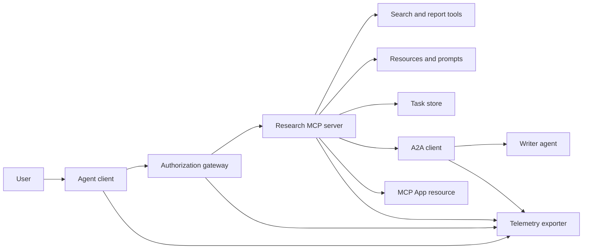
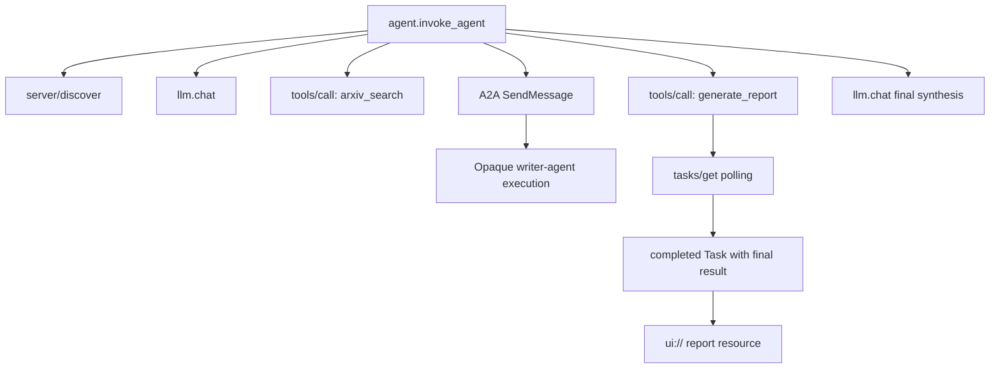
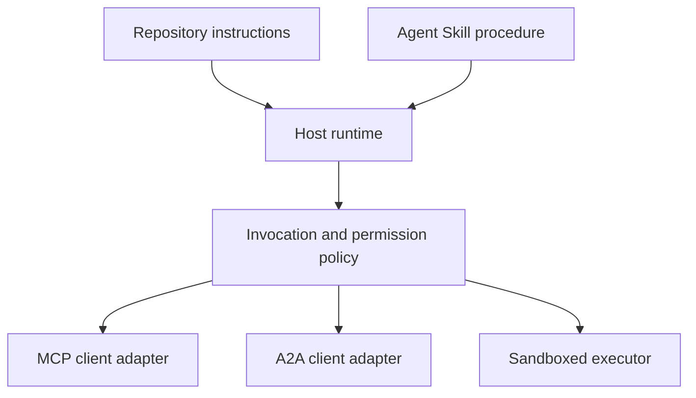

# Capstone: Hệ sinh thái công cụ vô quốc tịch

> Một hệ thống đại lý sản xuất là một tập hợp ranh giới, không phải là một đống các tính năng.

**Type:** Build
**Languages:** Python (stdlib, in-process simulation)
**Prerequisites:** Phase 13 · 01 through 22, using MCP revision `2026-07-28`
**Time:** ~120 minutes

## Mục tiêu học tập

- Sắp xếp các cuộc gọi công cụ, kết quả hình dạng nhiệm vụ, công việc ủy quyền, tài nguyên UI, chính sách ủy quyền và theo dõi hồ sơ vào một dòng chảy.
- Mang phiên bản giao thức, danh tính khách hàng và khả năng trên mỗi yêu cầu MCP thay vì dựa vào một phiên kết nối.
- Khám phá một máy chủ trước khi sử dụng và chạy công việc dài thông qua phần mở rộng Tasks chính thức.
- Để phân biệt mô phỏng hình thức giao thức với một thực hiện MCP, A2A, OAuth hoặc OpenTelemetry.
- Bản đồ mỗi ranh giới mô phỏng đến thành phần sản xuất phải thay thế nó.
- Cứ giữ lại`AGENTS.md`, một kỹ năng đặc vụ, bộ điều chỉnh thời gian chạy, công cụ, và chính sách an ninh trong vai trò đúng đắn của họ.
- Giải thích những tuyên bố nào có thể được xác minh từ sản lượng địa phương và những gì cần thử nghiệm tích hợp trực tiếp.

## Vấn đề

Thiết kế một hệ thống nghiên cứu và báo cáo. Người dùng yêu cầu các giấy tờ về giao thức đại lý. Hệ thống tìm kiếm một danh mục giấy, ủy quyền tổng kết, tạo ra một báo cáo, trả về một nguồn UI và ghi lại con đường qua hệ thống.

Câu án đó che giấu một số hợp đồng độc lập:

- một kế hoạch công cụ đối diện với mô hình;
- một gói yêu cầu không có quốc tịch và hợp đồng phát hiện máy chủ;
- Một quyết định thông qua thông tin về người chơi, phạm vi và danh tính công cụ;
- hợp đồng hoạt động lâu dài;
- Một giao thức ủy quyền;
- cầu từ máy chủ đến ứng dụng;
- Tải và xuất khẩu dấu vết;
- Một quy trình hoạt động có thể được sử dụng lại.

`code/main.py`giữ các ranh giới đó hiển thị với các chức năng Python và từ điển thông thường. Nó không mở một giao thông, liên hệ với arXiv, thực hiện OAuth, gọi một máy chủ A2A, render một ứng dụng MCP hoặc xuất khẩu điện từ. Điều này làm cho dòng chảy điều khiển dễ dàng kiểm tra mà không trình bày mô phỏng như một dịch vụ tuân thủ.

## Khái niệm

### Kiến trúc mục tiêu



Kiến trúc là một sự kết hợp khái niệm của các mô hình giao thức công cộng.

### Đường mòn mục tiêu



Trong một thực hiện thực tế, mỗi hop truyền tải ngữ cảnh dấu vết. Tên và thuộc tính của span phải tuân theo các quy ước ngữ nghĩa OpenTelemetry được hỗ trợ bởi phiên bản thiết bị được chọn.

### Mối giao thức hiện tại

Sử dụng tên phương pháp được xác định bởi giao thức hiện tại, chứ không phải tên được nhớ từ một bản thảo cũ hơn:

| Boundary | Current surface | What the capstone simulates |
|---|---|---|
| MCP discovery | Mandatory `server/discover` | A direct function returning versions, capabilities, and server identity |
| MCP request context | Version, capabilities, and client identity in every `params._meta` | Fresh request metadata passed to every simulated call |
| MCP tool call | `tools/call` | Direct Python function dispatch |
| MCP task polling | `io.modelcontextprotocol/tasks` with `tasks/get` | A working handle followed by a completed task carrying its final result |
| A2A delegation | `SendMessage` in gRPC and JSON-RPC; `POST /message:send` in HTTP+JSON | One nested span with no remote call or artificial delay |
| MCP App calling a server tool | `app.callServerTool({ name, arguments })` | An HTML string with no live bridge |
| OAuth authorization | Authorization server, protected-resource metadata, audience and scope validation | Static token lookup and scope membership |
| OpenTelemetry | SDK, propagator, exporter, and collector or backend | In-memory span dictionaries |

Tên giao thức chỉ là lớp đầu tiên. Các thử nghiệm sản xuất phải thực hiện chuỗi hóa, lỗi xác thực, hủy bỏ, thời gian ra, thử lại và tương thích phiên bản trên dây thực.

### MCP vô quốc tịch thay đổi biên giới hội nhập

Phân tích `2026-07-28`xóa các phiên giao thức và các`initialize`- `notifications/initialized`Nhúng tay. Nó cũng loại bỏ`Mcp-Session-Id`Mỗi yêu cầu đều có những tên không gian này`_meta`trường:

```json
{
  "io.modelcontextprotocol/protocolVersion": "2026-07-28",
  "io.modelcontextprotocol/clientCapabilities": {
    "extensions": {
      "io.modelcontextprotocol/tasks": {}
    }
  },
  "io.modelcontextprotocol/clientInfo": {
    "name": "capstone-client",
    "version": "1.0.0"
  }
}
```

Server phải thực hiện `server/discover`. Kết quả thông thường sử dụng `resultType: "complete"`; một tay xử lý nhiệm vụ sử dụng `resultType: "task"`. Mỗi kết quả nên xác định máy chủ trong `_meta.io.modelcontextprotocol/serverInfo`- Tôi không biết.

Việc mở rộng nhiệm vụ đã`tasks/get`- `tasks/update`, và`tasks/cancel`Một công cụ có thể quay lại trước tiên`resultType: "task"``tasks/get`tự nó trở lại `resultType: "complete"`, và hoàn thành `Task`chứa kết quả cuối cùng.`tasks/result`và `tasks/list`Các phương pháp không phải là một phần của việc mở rộng hiện tại.`io.modelcontextprotocol/tasks`trong cùng một yêu cầu mà có thể nhận được một xử lý nhiệm vụ. Nếu không, máy chủ sẽ trả lại `-32021`với `requiredCapabilities`hình dạng như đối tượng khả năng khách hàng bị thiếu, bao gồm `extensions.io.modelcontextprotocol/tasks`- Tôi không biết.

### Chế độ an ninh

Việc triển khai dự định sử dụng phòng thủ sâu:

- OAuth Authorization with PKCE khi loại khách hàng yêu cầu nó;
- Kết nối tài nguyên và đối tượng đối với các token truy cập được phát hành;
- Gateway RBAC kiểm tra công cụ và phạm vi yêu cầu;
- Các thông tin tín dụng trước dòng được giữ bên ngoài bối cảnh hình ảnh hình mẫu;
- Một biểu đồ mô tả công cụ được gắn hoặc xem xét;
- Một quy tắc hai xem xét các thông tin nhập không đáng tin cậy, dữ liệu nhạy cảm và các hành động hậu quả;
- một hộp cát thực hiện mà hệ thống tập tin, quy trình, mạng, giấy phép tín dụng và giới hạn nguồn lực được thực thi ngoài kỹ năng.

Demo chỉ thực hiện các token tĩnh, kiểm tra phạm vi và hash mô tả. Nó hữu ích cho dòng chảy chính sách, không phải xác thực bảo mật.

### Kỹ năng là quy trình, không phải vận chuyển

Một kỹ năng đại lý có thể cho biết thời gian chạy làm thế nào để thực hiện dòng công việc nghiên cứu, các công cụ hợp đồng để mong đợi, bằng chứng nào để lưu, và khi nào để dừng lại. Nó không thể làm cho một máy chủ MCP tồn tại, thiết lập tính tương thích A2A, cấp phạm vi, hoặc tạo một hộp cát.



Đăng thư mục kỹ năng đầy đủ khi thủ tục tham khảo các tệp đồng hành. Các đồ tạo phẳng trong đá cuối cũ này là một bản vẽ khóa học, không phải bằng chứng cho thấy một chủ sở hữu bảo tồn một gói di động. Bài học 24 đến 27 xây dựng và kiểm tra vòng đời gói đầy đủ.

### Các metadata của các sản phẩm khóa học là một bộ chuyển đổi địa phương

Các danh mục khóa học và cài đặt nhận ra các tệp phẳng có tên `skill-*.md`, nhưng đó là một quy ước kho chứ không phải hợp đồng gói kỹ năng đại lý di động. trình phân tích mặt hàng tối thiểu của họ chỉ đọc các phím cấp cao. Bài học này do đó giữ các trường danh tính di động và các trường danh mục khóa học ở cùng một mức độ:

```yaml
---
name: ecosystem-blueprint
description: Produce a full Phase 13 ecosystem architecture for a product need.
version: "1.0.0"
phase: "13"
lesson: "23"
tags: [mcp, capstone, ecosystem, architecture, a2a, otel]
---
```

`name`và `description`là các trường danh tính di động. `version`- `phase`- `lesson`, và`tags`là các phần mở rộng danh mục cụ thể cho khóa học.`tags`như một danh sách trong dòng như vậy `--tag capstone`có thể phù hợp với nó.

Một kỹ năng thư mục di động có thể sử dụng tùy chọn `metadata`bản đồ cho dữ liệu mở rộng có giá trị chuỗi.`metadata`thay đổi với kế hoạch danh mục của kho lưu trữ này. Nếu file phẳng này tổ `version`hoặc `tags`dưới đây`metadata`, trình phân tích tối thiểu bỏ qua các phím được ghi dấu, danh mục ghi lại một phiên bản trống, và lọc thẻ không thể tìm thấy vật liệu.

### Tái mô so sánh so với sản xuất

| Layer | `code/main.py` | Production replacement | Required evidence |
|---|---|---|---|
| Discovery | `server_discover()` plus static `TOOLS` | `server/discover` followed by cache-aware `tools/list` | Wire transcript, deterministic order, and schema validation |
| Authentication | Token-keyed dictionary | OAuth authorization and resource server validation | Issuer, audience, scope, expiry, and failure tests |
| Authorization | Scope membership | Gateway policy bound to actor, tool, target, and tenant | Allow and deny audit cases |
| Search | Static paper fixtures | Search API or MCP server | Source provenance, ranking, and error tests |
| Tasks | Local handle plus immediate `tasks/get` | Durable `io.modelcontextprotocol/tasks` store with `tasks/get`, `tasks/update`, `tasks/cancel`, and TTL | State-transition, input, cancellation, and recovery tests |
| Delegation | Sleep plus nested span | A2A client and remote Agent Card | Contract, timeout, retry, and opacity tests |
| App | HTML string and URI | MCP Apps resource and `App` bridge | CSP, permissions, tool-call, and browser tests |
| Telemetry | In-memory list | OTel SDK and exporter | Collector receipt and trace-parent assertions |
| Sandbox | None | Host-enforced isolated executor | Escape, egress, secret, and resource-limit tests |

Bảng này là giới hạn giao dịch. Một chạy địa phương xanh chỉ xác nhận mô phỏng.

### Bản đồ giai đoạn 13

| Lessons | Contribution |
|---|---|
| 01-05 | Tool interfaces, calls, schemas, structured results, and deterministic validation |
| 06-14 | Stateless MCP request envelopes, discovery, transports, resources, prompts, extensions, and Apps |
| 15-18 | Poisoning defenses, OAuth, gateways, registries, and production authentication |
| 19 | A2A message and task delegation |
| 20 | OpenTelemetry GenAI trace design |
| 21 | Model-provider routing |
| 22 | Portable skill contract and runtime boundary |

```figure
t3-capstone-chain
```

## Hãy xây dựng nó

Động dụng dây thắt trong quá trình:

```bash
cd phases/13-tools-and-protocols/23-capstone-tool-ecosystem
python3 code/main.py
```

Hãy kiểm tra 5 điều:

1. `server/discover`quảng cáo sửa đổi `2026-07-28`và mở rộng nhiệm vụ.
2. Alice có thể đọc và tạo ra một báo cáo, trong khi cuộc gọi của Bob được từ chối.
3. Mỗi vòng dài địa phương trong một trình diễn nhạc sĩ chia sẻ một nhận dạng dấu vết và ghi nhận nhận dạng vòng dài bậc cha.
4. Báo cáo bắt đầu như một nhiệm vụ xử lý. `tasks/get`trả lại một nhiệm vụ hoàn thành mà kết quả cuối cùng chứa văn bản và một `ui://`tham chiếu.
5. Người viết ủy quyền vẫn không minh bạch vì người dàn nhạc chỉ ghi lại khoảng thời gian biên giới.
6. Không có tuyên bố đầu ra kết nối mạng, trao đổi OAuth, xuất bộ sưu tập, trình render trình duyệt hoặc thực thi hộp rác xảy ra.

Các kịch bản chạy hai lần, vì vậy nó tạo ra hai dấu vết gốc.

## Sử dụng nó

Tăng cường một lớp một lần:

1. Thay thế `server_discover()`và danh sách công cụ tĩnh với real `server/discover`và `tools/list`gửi phiên bản, danh tính và khả năng trong mỗi yêu cầu.
2. Thay thế các token tĩnh bằng máy chủ ủy quyền và xác thực tài nguyên được bảo vệ.
3. Thực hiện các`io.modelcontextprotocol/tasks`mở rộng và thử nghiệm `tasks/get`- `tasks/update`- `tasks/cancel`, thời gian nghỉ, TTL, và khởi động lại phục hồi.`tasks/result`hoặc `tasks/list`- Tôi không biết.
4. Thay thế các đại diện với một khách hàng A2A giải quyết một thẻ đại lý và gửi một tin nhắn.
5. Xây dựng ứng dụng với SDK chính thức và gọi các công cụ máy chủ thông qua `app.callServerTool`- Tôi không biết.
6. Xuất khẩu kéo dài đến một người thu thập thử nghiệm và khẳng định tổ tiên tại người nhận.
7. Lên công cụ và script thực hiện bên trong sandbox hợp đồng từ bài học 26.
8. Bao gồm thủ tục như một gói thư mục đầy đủ và vượt qua cửa phát hành Bài học 27.

Mỗi chương trình khuyến mãi cần một thử nghiệm tích hợp vượt qua ranh giới mới. Đừng xóa các thử nghiệm chính sách cấp thấp hơn khi dây trở thành thực.

## Chuyển nó

Bài học này sẽ mang lại kết quả `outputs/skill-ecosystem-blueprint.md`, một vật liệu khóa học đơn tập tin cũ. Nó yêu cầu một kiến trúc một trang bao gồm nguyên thủy, bảo mật, ủy quyền, viễn thông, đóng gói và rủi ro hoạt động khó khăn nhất.

Vì nó không phải là một gói thư mục, nó không thể mang theo tham chiếu, kịch bản, tài sản hoặc thiết bị đánh giá. Sử dụng định dạng gói từ Bài học 22 và 24 đến 27 khi xuất bản một kỹ năng có thể sử dụng lại bên ngoài khóa học này.

## Các bài tập

1. Đi chạy`code/main.py`- Các sự kiện riêng biệt được chứng minh bởi sản lượng từ các tuyên bố sản xuất mà vẫn cần bằng chứng tích hợp.
2. Thêm một backend tĩnh thứ hai và xác định quy tắc va chạm cho hai công cụ cùng tên. Sau đó thay thế cả hai danh sách bằng real `tools/list`gọi điện.
3. Thay thế đoạn văn bằng máy chủ thử nghiệm A2A ghi lại thẻ đại lý, yêu cầu thông điệp, đường thời gian và đồ tạo được trả về.
4. Thêm một cửa hàng nhiệm vụ tồn tại trong quá trình khởi động lại.`tasks/get`, tôn trọng `pollIntervalMs`, và đọc kết quả cuối cùng của nhiệm vụ hoàn thành mà không cần `tasks/result`- Tôi không biết.
5. Xây dựng một ứng dụng MCP tối thiểu và xác minh `app.callServerTool`trong trình duyệt có một CSP hạn chế và quyền rõ ràng.
6. Xuất khẩu các khoảng thời gian mô phỏng thông qua một SDK OTel sang một bộ sưu tập địa phương. Cấm nhận, nhận dạng dấu vết, tổ tiên và tình trạng lỗi.
7. Hãy viết`AGENTS.md`cho các quy tắc bảo trì toàn bộ kho và một gói kỹ năng riêng cho quy trình nghiên cứu tái sử dụng. Giải thích tại sao không có tài liệu nào cấp quyền công cụ.

## Các điều khoản chính

| Term | What people say | What it actually means |
|---|---|---|
| Capstone | "Everything wired together" | A staged integration whose simulated and live boundaries remain explicit |
| Protocol-shaped simulation | "It is basically MCP" | Local data and calls that resemble a protocol without implementing its wire contract |
| Tasks extension | "Long tool call" | An optional `io.modelcontextprotocol/tasks` lifecycle with durable identity, polling, client input, final result, and cancellation semantics |
| Opacity boundary | "The other agent handles it" | The caller sees the declared interface and artifacts, not private reasoning or internal state |
| Runtime adapter | "Skill integration" | Host code that maps portable procedure to discovery, invocation, tools, policy, and context |
| Integration evidence | "It passed" | A transcript, artifact, or receiver-side observation proving the real boundary was crossed |

## Đọc thêm

- [MCP specification 2026-07-28](https://modelcontextprotocol.io/specification/2026-07-28)cho các yêu cầu không có quốc tịch, khám phá, công cụ, ủy quyền và hành vi vận chuyển.
- [MCP 2026-07-28 key changes](https://modelcontextprotocol.io/specification/2026-07-28/changelog)cho việc xóa phiên, siêu dữ liệu theo yêu cầu, MRTR, mở rộng và giảm.
- [MCP Tasks extension](https://tasks.extensions.modelcontextprotocol.io/specification/draft/tasks)cho `tasks/get`- `tasks/update`- `tasks/cancel`, và kết quả cuối cùng được thực hiện bởi các nhiệm vụ cuối cùng.
- [MCP Apps SDK](https://github.com/modelcontextprotocol/ext-apps/blob/main/docs/overview.md)cho `App`và `app.callServerTool`- Tôi không biết.
- [A2A protocol](https://a2a-protocol.org/latest/)cho thẻ đại lý, giao thông tin, nhiệm vụ, đồ tạo vật và liên kết vận chuyển.
- [OpenTelemetry GenAI semantic conventions](https://opentelemetry.io/docs/specs/semconv/gen-ai/)cho các quy ước dấu vết và thuộc tính.
- [Agent Skills specification](https://agentskills.io/specification)Đối với hợp đồng gói di động được sử dụng bởi lớp thủ tục.
