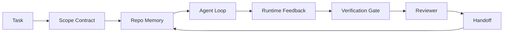

# Kỹ thuật máy chủ: Tại sao các mô hình có khả năng vẫn thất bại

> Một mô hình có khả năng không đủ. Các đại lý đáng tin cậy cần một bàn làm việc: hướng dẫn, trạng thái, phạm vi, phản hồi, xác minh, xem xét và giao.

**Type:** Learn + Build
**Languages:** Python (stdlib)
**Prerequisites:** Phase 14 · 01 (Agent Loop), Phase 14 · 26 (Failure Modes)
**Time:** ~45 minutes

## Mục tiêu học tập

- Khả năng mô hình tách biệt với độ tin cậy thực hiện.
- Hãy cho tên bảy mặt bàn làm việc quyết định liệu một nhân viên có được chuyển đi hay không.
- So sánh một chạy chỉ trong thời gian nhanh với một chạy được hướng dẫn trên bàn làm việc trên một nhiệm vụ repo nhỏ.
- Tạo một báo cáo về chế độ thất bại mà lập bản đồ mỗi bề mặt bị bỏ qua đến triệu chứng nó gây ra.

## Vấn đề

Bạn bỏ một mô hình biên giới vào một repo thực tế và yêu cầu nó thêm xác thực đầu vào. Nó mở bốn tệp, viết mã có thể tin cậy, tuyên bố thành công và dừng lại. Bạn chạy các thử nghiệm. Hai thất bại. Một tệp thứ ba được chạm vào không có liên quan đến xác thực. Không có ghi lại những gì đại lý giả định, những gì nó đã thử trước tiên, hoặc những gì còn lại để làm.

Mô hình không sai về Python, nó sai về công việc, nó không biết được điều gì được tính là đã được thực hiện, nơi nó được phép viết, những bài kiểm tra nào có thẩm quyền, hoặc cách tiếp theo sẽ bắt đầu.

Đây không phải là lỗi mô hình mà là lỗi bàn làm việc, bề mặt xung quanh đại lý thiếu các bộ phận biến một thế hệ một cú bắn thành kỹ thuật đáng tin cậy, có thể sử dụng lại.

## Khái niệm

Một bàn làm việc là môi trường hoạt động bao quanh mô hình trong một nhiệm vụ.

| Surface | What it carries | Failure when missing |
|---------|-----------------|----------------------|
| Instructions | Startup rules, forbidden actions, definition of done | Agent guesses what shipping means |
| State | Current task, touched files, blockers, next action | Each session restarts from zero |
| Scope | Allowed files, forbidden files, acceptance criteria | Edits leak into unrelated code |
| Feedback | Real command output captured into the loop | Agent declares success on a 400 |
| Verification | Tests, lint, smoke run, scope check | "Looks good" reaches main |
| Review | A second pass with a different role | Builder marks own homework |
| Handoff | What changed, why, what is left | Next session re-discovers everything |

Bàn làm việc độc lập với mô hình. Bạn có thể thay đổi mô hình và giữ bề mặt. Bạn không thể thay đổi bề mặt và giữ độ tin cậy.



Chuyện này sẽ đóng lại trong tập tin trạng thái, không phải trong lịch sử trò chuyện.

### Bàn làm việc so với kỹ thuật nhanh

Việc nhắc nhở cho mô hình biết bạn muốn gì trong lượt này. Một bàn làm việc cho mô hình biết làm thế nào để làm việc qua các lượt và qua các phiên. Hầu hết các câu chuyện thất bại của đại lý là thất bại bàn làm việc mặc quần áo kỹ thuật nhắc nhở.

### Bàn làm việc so với khung

Một framework cung cấp cho bạn một runtime (LangGraph, AutoGen, Agents SDK). một workbench cung cấp cho đại lý một nơi để làm việc trong runtime đó. bạn cần cả hai. mini track này là về thứ hai.

### Lý luận từ nguyên thủy, không phải từ phân loại nhà cung cấp

Có rất nhiều bài viết về "kỹ thuật dây đeo" ngay bây giờ. Addy Osmani, OpenAI, Anthropic, LangChain, Martin Fowler, MongoDB, HumanLayer, Augment Code, Thoughtworks, danh sách tuyệt vời của walkinglabs, và một đập trống ổn định của các phần Medium và Hacker News đều mang nó. Họ không đồng ý về ranh giới của một vòng xoáy là gì, trong phạm vi, và vốn từ vựng để sử dụng. Chúng ta không cần phải chọn một bên. Bảy bề mặt là một lớp UX; bên dưới mỗi bàn làm việc là cùng một bộ nguyên thủy hệ thống phân tán giữ bất kỳ hậu kết đáng tin cậy nào.

Tháo nhãn đại lý một lúc. Một hành trình đại lý là tính toán vượt qua thời gian, quy trình và máy. Để làm cho nó đáng tin cậy bạn cần những nguyên thủy giống như bất kỳ hệ thống sản xuất nào cần.

| Primitive | What it is | What it carries for an agent |
|-----------|------------|------------------------------|
| Function | Typed handler. Pure where possible. Owns its inputs and outputs. | A tool call, a rule check, a verification step, a model invocation |
| Worker | Long-lived process that owns one or more functions and a lifecycle | The builder, the reviewer, the verifier, an MCP server |
| Trigger | Event source that invokes a function | Agent loop tick, HTTP request, queue message, cron, file change, hook |
| Runtime | The boundary that decides what runs where, with what timeouts and resources | Claude Code's process, LangGraph's runtime, a worker container |
| HTTP / RPC | The wire between caller and worker | Tool-call protocol, MCP request, model API |
| Queue | Durable buffer between trigger and worker; back-pressure, retry, idempotency | The task board, the feedback log, the review inbox |
| Session persistence | State that survives crashes, restarts, model swaps | `agent_state.json`, checkpoints, KV stores, the repo itself |
| Authorization policy | Who can call what function with which scope | Allowed/forbidden files, approval boundaries, MCP capability lists |

Bây giờ hãy lập bản đồ bảy bề mặt bàn làm việc trên những thứ nguyên thủy đó.

- **Instructions** chính sách + function metadata. quy tắc là kiểm tra (các chức năng).`AGENTS.md`) là chính sách gắn liền với khởi động thời gian chạy.
- **State** session persistence. một keyed store đọc runtime tại mỗi bước. file, KV, hoặc DB; sự liên tục của semantics quan trọng, backend lưu trữ không.
- **Scope** chính sách ủy quyền cho mỗi nhiệm vụ. Các quả cầu được phép/không được phép là một ACL.
- **Feedback** Lập nhật ký cuộc gọi được ghi vào một hàng. Mỗi cuộc gọi shell là một bản ghi, bền, có thể chơi lại.
- **Verification** một hàm. xác định tính trên đầu vào. được kích hoạt khi nhiệm vụ đóng. thất bại đóng.
- **Review** một công nhân riêng với quyền đọc chỉ về các vật thể xây dựng và quyền viết chỉ về các báo cáo đánh giá.
- **Handoff** một bản ghi lâu dài được phát ra bởi một kích hoạt cuối phiên.

Bản thân vòng tròn đại lý là một người lao động tiêu thụ các sự kiện (thông điệp người dùng, kết quả công cụ, dấu hiệu thời gian), gọi các chức năng (chương trình, sau đó các công cụ mà mô hình chọn), viết hồ sơ (thế trạng, phản hồi), và phát ra các kích hoạt (thêm lại, xem xét, chuyển giao). Không có bí ẩn; cùng một hình dạng như một bộ xử lý công việc.

### Các mẫu trong lưu thông, được dịch sang nguyên thủy

Mỗi mô hình dây đeo phổ biến đều giảm xuống còn 8 cái nguyên thủy.

| Vendor or community pattern | What it actually is |
|------------------------------|--------------------|
| Ralph Loop (Claude Code, Codex, agentic_harness book) — re-inject original intent into a fresh context window when the agent tries to stop early | A trigger that re-enqueues a task with a clean context; session persistence carries the goal forward |
| Plan / Execute / Verify (PEV) | Three workers, one per role, communicating via state and a queue between phases |
| Harness-compute separation (OpenAI Agents SDK, April 2026) — split control plane from execution plane | Restating control-plane / data-plane. Predates the agent label by decades |
| Open Agent Passport (OAP, March 2026) — sign and audit every tool call against a declarative policy before execution | An authorization policy enforced by a pre-action worker, with a signed audit queue |
| Guides and Sensors (Birgitta Böckeler / Thoughtworks) — feedforward rules + feedback observability | Authorization policy + verification functions + observability traces |
| Progressive compaction, 5-stage (Claude Code reverse engineering, April 2026) | A state-management worker that runs cron-like over session persistence to keep it within a budget |
| Hooks / middleware (LangChain, Claude Code) — intercept model and tool calls | Triggers + functions wrapped around the runtime's invocation path |
| Skills as Markdown with progressive disclosure (Anthropic, Flue) | A function registry where the function metadata is loaded into context just-in-time |
| Sandbox agents (Codex, Sandcastle, Vercel Sandbox) | The compute plane: a runtime with isolated filesystem, network, and lifecycle |
| MCP servers | Workers exposing functions over a stable RPC, with capability lists as authorization |

Mỗi mục trong bảng đó là cộng đồng đại lý đến một nguyên thủy đã có một tên trong hệ thống phân tán và cho nó một tên mới.

### Những gì biên lai thực sự nói

Việc tuyên bố về đeo đeo đeo đeo đeo đeo đeo đeo đeo đeo đeo đeo đeo đeo đeo đeo đeo đeo đeo đeo đeo đeo đeo đeo đeo đeo đeo đeo đeo đeo đeo đeo đeo đeo đeo đeo đeo đeo đeo đeo đeo đeo đeo đeo đeo đeo đeo đeo đeo đeo đeo đeo đeo đeo đeo đeo đeo đeo đeo đeo đeo đeo đeo đeo đeo đeo đeo đeo đeo đeo đeo đeo đeo đeo đeo đeo đeo đeo đeo đeo đeo đeo đeo đeo đeo đeo đeo đeo đeo đeo đeo đeo đeo đeo đeo đeo đeo đeo đeo đeo đeo đeo đeo đeo đeo đeo đeo đeo đeo đeo đeo đeo đeo đeo đeo đeo đeo đeo đeo đeo đeo đeo đeo đeo đeo đeo đeo đeo đeo đeo đeo đeo đeo đeo đeo đeo đeo đeo đeo đeo đeo đeo đeo đeo đeo đeo đeo đeo đeo đeo đeo đeo đeo đeo đeo đeo đeo đeo đeo đeo đeo đeo đeo đeo đeo đeo đeo đeo đeo đeo đeo đeo đeo đeo đeo đeo đeo đeo đeo đeo đeo đeo đeo đeo đeo đeo đeo đeo đeo đeo đeo đeo đeo đeo đeo đeo đeo đeo đeo đeo đeo đeo đeo đeo đeo đeo đeo đeo đeo đeo đeo đeo đeo đeo đeo đeo đeo đeo đeo đeo đeo đeo đeo đeo đeo đeo đeo đeo đeo đeo đeo đeo đeo đeo đeo đeo đeo đeo đeo đeo đeo đeo đeo đeo đeo đeo đeo đeo đeo đeo đeo đeo đeo

- Terminal Bench 2.0  cùng một mô hình, thay đổi vòng xoắn đã di chuyển một chất điều khiển mã hóa từ bên ngoài 30 top lên thứ năm (LangChain, * Anatomy of an Agent Harness*).
- Vercel  đã xóa 80% các công cụ của đại lý của mình; tỷ lệ thành công đã tăng từ 80% lên 100% (MongoDB).
- Harvey  các đại lý pháp lý đã tăng độ chính xác hơn gấp đôi chỉ bằng cách tối ưu hóa sử dụng (MongoDB).
- 88% các dự án đại lý AI doanh nghiệp không đạt đến sản xuất. Các thất bại tập hợp xung quanh thời gian chạy, không phải lý luận (preprints.org, *Harness Engineering for Language Agents*, tháng 3 năm 2026).
- Một nghiên cứu chuẩn 2025 trên ba khung nguồn mở phổ biến báo cáo hoàn thành nhiệm vụ ~ 50%; WebAgent ngữ cảnh dài sụp đổ từ 40-50% xuống dưới 10% trong điều kiện ngữ cảnh dài, chủ yếu từ vòng lặp vô hạn và mất mục tiêu (được bao phủ rộng rãi vào đầu năm 2026 viết).

Điểm quan trọng là ngày nay, kỹ thuật mang tải được đặt xung quanh mô hình, chứ không phải bên trong nó, và những thứ nguyên thủy mang tải đó là những gì mà mọi hệ thống sản xuất luôn cần.

### Khi các nhà cung cấp viết tắt dừng lại ngắn

Đây là phần mà anh không cần phải lịch sự.

- LangChain * Anatomy of an Agent Harness* liệt kê mười một thành phần:  các lời nhắc, công cụ, móng, hộp cát, dàn xếp, bộ nhớ, kỹ năng, các bộ phận phụ, và một "cuối ngốc" chạy thời gian.
- Công nghệ vận động của Addy Osmani đã đưa ra khung hình.`Agent = Model + Harness`và mô hình đinh, nhưng không nói được cái gì làm nên một dây đeo. Nó đọc như một lập trường, không phải là một thông số kỹ thuật.
- Anthropic và OpenAI đi sâu nhất trên bề mặt nhưng ở trong thời gian chạy của riêng họ. Thông báo "các phần cúp-sự phân tách" trong tháng 4 năm 2026 Agents SDK là sản phẩm đầu tiên của nhà cung cấp rõ ràng ủng hộ sự phân chia máy tính điều khiển / máy tính dữ liệu. Đó là một ý tưởng nguyên thủy, không phải là một ý tưởng mới.
- Cuốn sách agentic_harness xử lý harness như một đối tượng config (Jaymin West *Agentic Engineering*, chương 6) và dòng mạnh nhất trong nó là "hành cáp là ranh giới bảo mật chính trong một hệ thống agentic". Đó chỉ là chính sách ủy quyền, tái diễn.
- Các chủ đề của Hacker News tiếp tục đến cùng một nơi. Các chủ đề tháng 4 năm 2026 *Hành động đại lý thuộc về bên ngoài hộp cát * lập luận rằng bộ phận này nên nằm "càng giống như một siêu thị nằm bên ngoài mọi thứ và cho phép truy cập dựa trên bối cảnh và người dùng".

Bạn không cần phải bất đồng với bất kỳ một phần nào của các mảnh này để nhận thấy khoảng cách. Họ đang viết mô tả UX của một hệ thống đã tồn tại. Chúng tôi đang viết hệ thống. Khi hệ thống được xây dựng đúng, bảy bề mặt rơi ra khỏi nguyên thủy. Khi nó được xây dựng sai, không có số lượng `AGENTS.md`Polish sửa chữa hàng thiếu.

Vì vậy, khi bạn nghe "kỹ thuật đinh" ở nơi khác, dịch sang nguyên thủy. Các lệnh và quy tắc là chính sách và chức năng. Lắp xếp là thời gian chạy. Các đường dây bảo vệ là ủy quyền + xác minh. Chừng nào thì có thể. Tưởng thức là sự kiên trì của phiên. Ralph Loop là một sự sắp xếp. Những người phụ nữ là công nhân. Những hộp cát là máy bay tính. Từ vựng thay đổi; kỹ thuật không thay đổi. Bàn làm việc là UX đối diện với đại lý; vòng, theo nghĩa là tồn tại trong khung lại nhà cung cấp tiếp theo, là các chức năng, công nhân, kích hoạt, thời gian chạy, hàng, kiên trì và chính sách được kết nối với nhau đúng cách.

```figure
wb-seven-surfaces
```

## Hãy xây dựng nó

`code/main.py`chạy một nhiệm vụ repo nhỏ hai lần. Đầu tiên chỉ như prompt, sau đó với bảy bề mặt được dây vào. mô hình tương tự, nhiệm vụ tương tự. kịch bản đếm những bề mặt nào bị thiếu trong chạy thất bại và in báo cáo chế độ thất bại.

Nhiệm vụ repo là nhỏ theo mục đích: thêm xác thực đầu vào vào một trình xử lý kiểu FastAPI một tập tin và viết một bài kiểm tra vượt qua.

Đi đi.

```
python3 code/main.py
```

Kết quả: một bản ghi bên cạnh hai lần chạy, một `failure_modes.json`tóm tắt cuộc chạy nhanh nhất, và một bản án đơn giản cho cuộc chạy bàn làm việc.

Các tác nhân là một cái cột nhỏ dựa trên các quy tắc; điểm là bề mặt, không phải mô hình.

## Sử dụng nó

Ba chỗ bàn làm việc bề mặt đã tồn tại trong tự nhiên, ngay cả khi không ai gọi chúng là:

- **Claude Code, Codex, Cursor.** `AGENTS.md`và `CLAUDE.md`Chỉ thị Slash là phạm vi, và các cái nát là xác minh.
- **LangGraph, OpenAI Agents SDK.**Các điểm kiểm soát và cửa hàng họp là bề mặt của tiểu bang.
- **CI on a real repo.**Các thử nghiệm, trần, và kiểm tra loại là xác minh. Mô hình PR là giao.

Kỹ thuật bàn làm việc là kỷ luật làm cho các bề mặt đó rõ ràng và có thể sử dụng lại, thay vì để mỗi nhóm khám phá lại chúng.

## Chuyển nó

`outputs/skill-workbench-audit.md`là một kỹ năng di động kiểm tra một repo hiện có cho bảy bề mặt bàn làm việc và báo cáo bị thiếu, không đầy đủ và khỏe mạnh.

## Các bài tập

1. Chọn một repo nơi bạn đã chạy một đại lý. Điểm bảy bề mặt từ 0 (không có) đến 2 (hiên lành). bề mặt yếu nhất của bạn là gì?
2. Tăng `main.py`Vì vậy, việc chạy chỉ nhanh cũng tạo ra một tuyên bố "sự thành công" giả.
3. Thêm một bề mặt thứ tám cho sản phẩm của bạn.
4. Lấy lại kịch bản với một chất tác dụng khác để tạo ảo giác về việc viết thêm file.
5. Bản đồ năm chế độ thất bại lặp lại trong ngành từ giai đoạn 14 · 26 lên bảy bề mặt.

## Các điều khoản chính

| Term | What people say | What it actually means |
|------|----------------|------------------------|
| Workbench | "The setup" | Engineered surfaces around the model that make work reliable |
| Surface | "A doc" or "a script" | A named, machine-readable input the agent reads or writes every turn |
| System of record | "The notes" | The file the agent treats as truth when chat history is gone |
| Definition of done | "Acceptance" | An objective, file-backed checklist the agent cannot fake |
| Workbench audit | "Repo readiness check" | A pass over the seven surfaces that flags missing pieces before work begins |

## Đọc thêm

Đọc các điểm dữ liệu này, không phải là các cơ quan. Mỗi một phân loại phân bổ. Đưa ra mọi khái niệm trở lại một nguyên thủy (phụng chức năng, người làm việc, kích hoạt, thời gian chạy, HTTP / RPC, hàng, kiên trì, chính sách) trước khi quyết định có nên áp dụng nó hay không.

Các khung của nhà cung cấp:

- [Addy Osmani, Agent Harness Engineering](https://addyosmani.com/blog/agent-harness-engineering/) `Agent = Model + Harness`và mô hình cục; mỏng trên cơ sở hạ tầng
- [LangChain, The Anatomy of an Agent Harness](https://blog.langchain.com/the-anatomy-of-an-agent-harness/) mười một thành phần: các lời nhắc, công cụ, móng, dàn nhạc, hộp cát, bộ nhớ, kỹ năng, các bộ phận phụ, thời gian chạy; bỏ qua hàng, triển khai, authz
- [OpenAI, Harness engineering: leveraging Codex in an agent-first world](https://openai.com/index/harness-engineering/) Quan điểm của nhóm Codex về bề mặt xung quanh thời gian chạy của chúng
- [OpenAI, Unrolling the Codex agent loop](https://openai.com/index/unrolling-the-codex-agent-loop/) vòng tròn đại lý giảm xuống là `while`qua các cuộc gọi hàm
- [Anthropic, Effective harnesses for long-running agents](https://www.anthropic.com/engineering/effective-harnesses-for-long-running-agents) bề mặt đường chân trời dài trong một thời gian chạy cụ thể
- [Anthropic, Harness design for long-running application development](https://www.anthropic.com/engineering/harness-design-long-running-apps) Các ghi chú thiết kế được áp dụng
- [LangChain Deep Agents harness capabilities](https://docs.langchain.com/oss/python/deepagents/harness) bề mặt cấu hình thời gian chạy

Các bộ phận của học viên với chi tiết có thể sử dụng:

- [Martin Fowler / Birgitta Böckeler, Harness engineering for coding agent users](https://martinfowler.com/articles/harness-engineering.html) hướng dẫn (feedforward) + cảm biến (feedback); khung lý thuyết điều khiển sạch nhất
- [HumanLayer, Skill Issue: Harness Engineering for Coding Agents](https://www.humanlayer.dev/blog/skill-issue-harness-engineering-for-coding-agents)"Đó không phải là vấn đề mô hình, đó là vấn đề cấu hình"
- [MongoDB, The Agent Harness: Why the LLM Is the Smallest Part of Your Agent System](https://www.mongodb.com/company/blog/technical/agent-harness-why-llm-is-smallest-part-of-your-agent-system) biên nhận: Vercel 80% đến 100%, Harvey 2 lần chính xác, Terminal Bench Top 30 đến Top 5
- [Augment Code, Harness Engineering for AI Coding Agents](https://www.augmentcode.com/guides/harness-engineering-ai-coding-agents) hạn chế đi bộ đầu tiên
- [Sequoia podcast, Harrison Chase on Context Engineering Long-Horizon Agents](https://sequoiacap.com/podcast/context-engineering-our-way-to-long-horizon-agents-langchains-harrison-chase/) Lo ngại về thời gian chạy hơn là lo ngại về mô hình

Cuốn sách, giấy tờ và thực hiện tham khảo:

- [Jaymin West, Agentic Engineering — Chapter 6: Harnesses](https://www.jayminwest.com/agentic-engineering-book/6-harnesses) xử lý chiều dài sách, xử lý vòng xoáy như là ranh giới an ninh chính
- [preprints.org, Harness Engineering for Language Agents (March 2026)](https://www.preprints.org/manuscript/202603.1756) khung học thuật như kiểm soát / cơ quan / runtime
- [walkinglabs/awesome-harness-engineering](https://github.com/walkinglabs/awesome-harness-engineering) danh sách đọc được chọn qua bối cảnh, đánh giá, khả năng quan sát, dàn xếp
- [ai-boost/awesome-harness-engineering](https://github.com/ai-boost/awesome-harness-engineering) danh sách chọn lọc thay thế (các công cụ, đánh giá, bộ nhớ, MCP, quyền)
- [andrewgarst/agentic_harness](https://github.com/andrewgarst/agentic_harness) Thực hiện tham chiếu sẵn sàng sản xuất với bộ nhớ và eval hỗ trợ Redis
- [HKUDS/OpenHarness](https://github.com/HKUDS/OpenHarness) Vỏ máy bay mở với máy bay cá nhân tích hợp

Các chủ đề của Hacker News đáng đọc vì sự bất đồng, không phải sự đồng thuận:

- [HN: Effective harnesses for long-running agents](https://news.ycombinator.com/item?id=46081704)
- [HN: Improving 15 LLMs at Coding in One Afternoon. Only the Harness Changed](https://news.ycombinator.com/item?id=46988596)
- [HN: The agent harness belongs outside the sandbox](https://news.ycombinator.com/item?id=47990675) tranh luận về việc cấp phép như một máy bay riêng biệt

Các tham chiếu chéo trong chương trình giảng dạy này:

- Giai đoạn 14 · 23  OpenTelemetry GenAI: lớp quan sát các cảm biến văn học chỉ ra tại
- Giai đoạn 14 · 26  Các chế độ thất bại danh mục bảy bề mặt được thiết kế để hấp thụ
- Giai đoạn 14 · 27  Vệ binh tiêm nhanh nằm ở chính sách chính thức cho phép
- Giai đoạn 14 · 29  Thời gian chạy sản xuất (trung, sự kiện, cron): nơi các nguyên thủy trong bài học này sống trong triển khai
