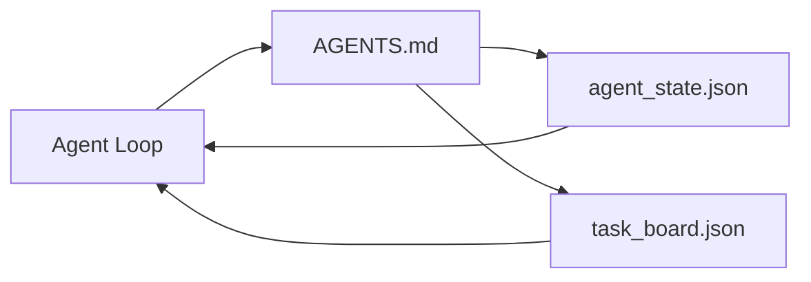

# Bàn làm việc của nhân viên tối thiểu

> Bàn làm việc hữu ích nhỏ nhất là ba tập tin: một bộ định tuyến hướng dẫn gốc, một tập tin trạng thái và một bảng tác vụ. Mọi thứ khác được xếp lớp trên. Nếu một repo không thể mang được ba tập tin này, không có mô hình nào sẽ lưu nó.

**Type:** Build
**Languages:** Python (stdlib)
**Prerequisites:** Phase 14 · 31 (Why Capable Models Still Fail)
**Time:** ~45 minutes

## Mục tiêu học tập

- Định nghĩa ba tập tin tạo thành bảng làm việc tối thiểu khả thi.
- Giải thích tại sao một router gốc ngắn đánh bại một router monolithic dài `AGENTS.md`- Tôi không biết.
- Hãy tạo ra một tập tin nhà nước mà nhân viên có thể đọc ở mỗi lượt và viết ở cuối.
- Xây dựng một bảng nhiệm vụ tồn tại nhiều phiên làm việc mà không có lịch sử trò chuyện.

## Vấn đề

Hầu hết các nhóm tìm đến một bàn làm việc bằng cách viết một dòng 3000 `AGENTS.md`mô hình tải nó, bỏ qua các bộ phận mà nó không thể tóm tắt, và vẫn thất bại trên cùng một bề mặt mà nó luôn thất bại trên.

Bạn cần ngược lại. Một tệp gốc nhỏ chỉ định tuyến người đại lý vào các tệp sâu hơn khi có liên quan. trạng thái bền người đại lý đọc trước khi hành động và viết sau đó. Một bảng tác vụ cho biết những gì đang bay, những gì bị chặn, và những gì tiếp theo.

Ba tập tin, mỗi tập tin có một công việc, mỗi tập tin có thể đọc được bằng máy để phát triển thành một hệ thống thực sự sau này.

## Khái niệm



### AGENTS.md là một router, không phải là một hướng dẫn

Một cái tốt `AGENTS.md`Nó chỉ ra người đại lý đến:

- Tài liệu của tiểu bang (nơi bạn đang ở).
- Bảng nhiệm vụ (điều còn lại).
- Các quy tắc sâu hơn (dưới `docs/agent-rules.md`().
- Chỉ thị xác minh (làm thế nào để biết nó hoạt động).

Bất cứ thứ gì dài hơn đều được ghi vào các tài liệu sâu hơn, chỉ được tải khi cần thiết, các hướng dẫn dài bị bỏ qua, các bộ định tuyến ngắn bị theo dõi.

### agent_state.json là hệ thống ghi chép

Các trạng thái mang theo: ID nhiệm vụ hoạt động, các tệp được chạm vào, các giả định được thực hiện, các ngăn chặn, và hành động tiếp theo.

Nhà nước sống trong một tập tin vì lịch sử trò chuyện không đáng tin cậy, các buổi nói chuyện bị cắt giảm, tập tin không.

### task_board.json là hàng

Ban công việc thực hiện mọi nhiệm vụ với trạng thái `todo | in_progress | done | blocked`Đó là hàng đợi mà nhân viên rút ra khi trạng thái trống rỗng, và hàng đợi bạn đọc khi bạn muốn biết liệu nhân viên có trên đường đúng không.

Một nhiệm vụ trên bảng có một ID, một mục tiêu, một chủ sở hữu (`builder`- `reviewer`, hoặc`human`), và các tiêu chí chấp nhận. bảng nhỏ: khi nó phát triển vượt qua màn hình, bạn có một vấn đề lập kế hoạch, không phải là vấn đề bảng.

### Ba tập tin là sàn nhà, không phải trần nhà.

Các bài học sau đó thêm các hợp đồng phạm vi, các bộ chạy phản hồi, cổng xác minh, danh sách kiểm tra của các nhà phê bình và các gói giao hàng. Ba tập tin ở đây là những gì tất cả họ giả định.

```figure
wb-three-files
```

## Hãy xây dựng nó

`code/main.py`viết bảng làm việc tối thiểu thành repo trống và chứng minh một đại lý đơn biến đổi rằng:

1. Đọc `agent_state.json`- Tôi không biết.
2. Lấy nhiệm vụ tiếp theo từ `task_board.json`nếu tiểu bang trống.
3. Đúng là một tập tin trong phạm vi.
4. Tác lại trạng thái cập nhật.

Đi đi.

```
python3 code/main.py
```

Bản kịch bản tạo ra`workdir/`bên cạnh chính nó, đặt xuống ba tập tin, chạy một lượt, và in sự khác biệt. chạy lại nó để xem như thế nào lượt thứ hai bắt đầu nơi mà lượt đầu tiên đã dừng lại.

## Sử dụng nó

Bên trong sản phẩm đại lý sản xuất, cùng ba tập tin xuất hiện dưới tên khác nhau:

- **Claude Code:** `AGENTS.md`hoặc `CLAUDE.md`cho router, `.claude/state.json`- các cửa hàng kiểu nhà nước, móng tay cho hội đồng quản trị.
- **Codex / Cursor:**Quy tắc không gian làm việc cho router, bộ nhớ phiên cho trạng thái, các nhiệm vụ xếp hàng trong thanh bên trò chuyện cho bảng.
- **Custom Python agent:**cùng các tập tin mà anh vừa viết.

Tên thay đổi, hình dạng thay đổi.

## Các mô hình sản xuất trong tự nhiên

Bàn làm việc tối thiểu tồn tại khi tiếp xúc với monorepos thực sự khi ba mô hình được xếp lớp trên nó.

**Nested `AGENTS.md` with nearest-wins precedence.**Các tàu OpenAI 88 `AGENTS.md`Các tập tin trên repo chính của nó, một trong mỗi thành phần phụ. Codex, Cursor, Claude Code, và Copilot tất cả đi từ tập tin làm việc đến gốc repo và kết nối mỗi `AGENTS.md`Các tập tin phụ thư mục mở rộng tập tin gốc.`AGENTS.override.md`thay vì mở rộng; cơ chế bỏ qua là đặc biệt của Codex và tránh nó cho công việc chéo công cụ.`AGENTS.md`các file cung cấp một bước nhảy chất lượng tương đương với nâng cấp từ Haiku sang Opus; những file tồi tệ nhất làm cho sản xuất tồi tệ hơn không có file nào cả.

**Anti-patterns to refuse, even when they look like coverage.**Các hướng dẫn xung đột lặng lẽ thả chất từ chế độ tương tác sang chế độ tham lam (ICLR 2026 AMBIG-SWE: 48,8% → 28% tỷ lệ giải quyết); số ưu tiên thay vì xếp chúng bằng phẳng. Các quy tắc kiểu không xác minh ("để theo hướng dẫn kiểu Python của Google") mà không có lệnh thực thi cho phép đại lý phát minh ra sự tuân thủ; kết hợp mọi quy tắc kiểu với lệnh lint chính xác. Tiếp tục bằng phong cách thay vì lệnh chôn đi con đường xác minh; lệnh trước, phong cách sau. Viết cho con người thay vì các đại lý lãng phí ngân sách ngữ cảnh; ngắn gọn là một tính năng.

**Cross-tool symlinks.**Một tệp gốc duy nhất với liên kết (`ln -s AGENTS.md CLAUDE.md`- `ln -s AGENTS.md .github/copilot-instructions.md`- `ln -s AGENTS.md .cursorrules`) giữ cho mọi nhân viên lập trình trên cùng một nguồn sự thật.`nx ai-setup`tự động hóa điều này qua Claude Code, Cursor, Copilot, Gemini, Codex, và OpenCode từ một cấu hình duy nhất.

## Chuyển nó

`outputs/skill-minimal-workbench.md`tạo ra bàn làm việc ba tập tin cho bất kỳ repo mới: một `AGENTS.md`router được điều chỉnh cho dự án, một `agent_state.json`với các khóa đúng, và một `task_board.json`được gieo trồng với số dư hiện tại.

## Các bài tập

1. Thêm một `last_run`dấu thời gian đến `agent_state.json`- Không chạy nếu tập tin đã có hơn 24 giờ trừ khi một nhà điều hành xác nhận.
2. Thêm một `priority`trường vào bảng tác vụ và thay đổi kéo để luôn chọn ưu tiên cao nhất `todo`- Tôi không biết.
3. Di cư`task_board.json`để JSON Lines để mỗi nhiệm vụ là một dòng và các sự khác biệt là sạch trong điều khiển phiên bản.
4. Hãy viết một `lint_workbench.py`Nếu không,`AGENTS.md`là hơn 80 dòng hoặc tham chiếu một tập tin không tồn tại.
5. Hãy quyết định là một trong ba tập tin nào sẽ làm tổn thương nhiều nhất nếu mất.

## Các điều khoản chính

| Term | What people say | What it actually means |
|------|----------------|------------------------|
| Router | `AGENTS.md` | Short root file that points the agent at deeper docs and files |
| State file | "The notes" | Machine-readable record of where the agent is, written every turn |
| Task board | "The backlog" | JSON queue of work with status, owner, acceptance |
| System of record | "Source of truth" | The file the workbench treats as authoritative when chat is gone |

## Đọc thêm

- [agents.md — the open spec](https://agents.md/) được thông qua bởi Cursor, Codex, Claude Code, Copilot, Gemini, OpenCode
- [Augment Code, A good AGENTS.md is a model upgrade. A bad one is worse than no docs at all](https://www.augmentcode.com/blog/how-to-write-good-agents-dot-md-files) tăng cường chất lượng được đo
- [Blake Crosley, AGENTS.md Patterns: What Actually Changes Agent Behavior](https://blakecrosley.com/blog/agents-md-patterns) những gì hoạt động theo kinh nghiệm, những gì không
- [Datadog Frontend, Steering AI Agents in Monorepos with AGENTS.md](https://dev.to/datadog-frontend-dev/steering-ai-agents-in-monorepos-with-agentsmd-13g0) ưu tiên trong thực tế
- [Nx Blog, Teach Your AI Agent How to Work in a Monorepo](https://nx.dev/blog/nx-ai-agent-skills) Sản xuất nguồn duy nhất trên sáu công cụ
- [The Prompt Shelf, AGENTS.md Best Practices: Structure, Scope, and Real Examples](https://thepromptshelf.dev/blog/agents-md-best-practices/) mục sắp xếp tồn tại xem xét
- [Anthropic, Claude Code subagents](https://code.claude.com/docs/en/sub-agents)
- Giai đoạn 14 · 31  các chế độ thất bại tối thiểu này hấp thụ
- Giai đoạn 14 · 34  các kế hoạch trạng thái bền vững bài học này xem trước
