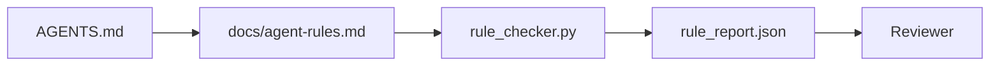

# Các hướng dẫn của đại lý như các hạn chế thực thi

> Các hướng dẫn được viết dưới dạng văn bản là những mong muốn. Các hướng dẫn được viết dưới dạng hạn chế là các bài kiểm tra. Bàn làm việc biến mỗi quy tắc thành thứ mà một đại lý có thể kiểm tra vào thời gian chạy và một nhà phê bình có thể xác minh sau sự kiện.

**Type:** Build
**Languages:** Python (stdlib)
**Prerequisites:** Phase 14 · 32 (Minimal Workbench)
**Time:** ~50 minutes

## Mục tiêu học tập

- Lấy điệu bài viết riêng biệt với các quy tắc hoạt động.
- Các quy tắc khởi động cụ thể, các hành động bị cấm, định nghĩa đã hoàn thành, xử lý không chắc chắn và ranh giới phê duyệt như những hạn chế có thể kiểm tra máy.
- Thực hiện một kiểm tra quy tắc ghi điểm chạy chống lại quy tắc được đặt ra.
- Làm cho các quy tắc được thiết lập khác nhau thân thiện để đánh giá có thể thấy những gì đã thay đổi.

## Vấn đề

Một kiểu `AGENTS.md`Nó nói với đại lý "Hãy cẩn thận" và "đánh giá kỹ lưỡng" và "Hãy hỏi nếu không chắc chắn". Ba ngày sau, đại lý gửi một thay đổi mà không có xét nghiệm, viết cho một thư mục bị cấm, và không bao giờ hỏi vì nó không bao giờ biết đường dây là ở đâu.

Các hướng dẫn có sức mạnh khi chúng hoạt động và yếu khi chúng có tham vọng.

## Khái niệm

Quy tắc thuộc về `docs/agent-rules.md`Mỗi quy tắc có tên, danh mục và kiểm tra.



### Năm loại bao gồm hầu hết các quy tắc

| Category | Question the rule answers | Example |
|----------|---------------------------|---------|
| Startup | What must be true before work begins? | "state file exists and is fresh" |
| Forbidden | What must never happen? | "do not edit `scripts/release.sh`" |
| Definition of done | What proves the task is complete? | "pytest exits 0 and acceptance line passes" |
| Uncertainty | What does the agent do when unsure? | "open a question note instead of guessing" |
| Approval | What requires human approval? | "any new dependency, any prod write" |

Một quy tắc không phù hợp với một trong năm quy tắc này thường muốn là hai quy tắc.

### Các quy tắc có thể đọc được bằng máy

Mỗi quy tắc có một khẩu hiệu, một loại, một dòng mô tả, và một `check`trường đặt tên cho một hàm trong `rule_checker.py`Thêm một quy tắc có nghĩa là thêm một kiểm tra; kiểm tra tăng lên với bàn làm việc.

### Các quy tắc là thân thiện với sự khác biệt

Các quy tắc sống một trong mỗi tiêu đề trong một tệp đánh dấu duy nhất. Tên đổi có thể nhìn thấy trong các sự khác biệt. Các quy tắc mới nằm ở đầu danh mục của họ. Các quy tắc cũ bị xóa, không được bình luận, bởi vì bàn làm việc là nguồn gốc của sự thật, không phải nhật ký trò chuyện về cảm giác của nhóm quý trước.

### Quy tắc so với khung bảo vệ

Các khung bảo vệ (OpenAI Agents SDK guardrails, LangGraph interrupts) thực thi các quy tắc ở cấp độ chạy. Quy tắc được đặt trong bài học này là hợp đồng có thể đọc được, có thể xem xét được mà những khung bảo vệ đó thực hiện. Bạn cần cả hai: thời gian chạy bắt được vi phạm trong một lượt, quy tắc được đặt chứng minh thời gian chạy đang làm điều đúng đắn.

### Việc tiết lộ tiến bộ: một bản đồ, không phải một ensiklopedia

Lý do `AGENTS.md`Một năm sau, tập tin là hai ngàn dòng, và đại lý đọc màn hình đầu tiên, chạy ra khỏi ngân sách chú ý, và hành động trên một phần nhỏ của những gì nó đã được nói. Một tập tin hướng dẫn khổng lồ thất bại vì cùng một lý do một tài liệu gia nhập bốn mươi trang thất bại: người đọc nhét nó một lần và không bao giờ quay lại phần quan trọng.

Các sửa chữa không phải là một tập tin ngắn hơn. Nó là một một lớp. Router gốc vẫn đủ nhỏ để đọc mỗi phiên và không chứa gì ngoài chỉ dẫn. Độ sâu sống trong các tập tin chủ đề mà đại lý tải chỉ khi nhiệm vụ chạm vào chúng. Cho đại lý một bản đồ, không phải toàn bộ encyclopedia, và để nó đi đến trang nó cần.

```
AGENTS.md                  # router, < 50 lines: what this repo is, where to look, the 5 hard rules
docs/
  agent-rules.md           # the full rule set (this lesson)
  architecture.md          # loaded when the task touches module boundaries
  testing.md               # loaded when the task writes or runs tests
  deploy.md                # loaded only for release work, gated behind an approval rule
feature_list.json          # the backlog (Phase 14 · 36)
```

| Tier | Lives in | Read when | Size budget |
|------|----------|-----------|-------------|
| Router | `AGENTS.md` | Every session, always | Under ~50 lines |
| Rules | `docs/agent-rules.md` | Every session, on startup | One screen per category |
| Topic docs | `docs/<topic>.md` | Only when the task touches that topic | As deep as needed |

Hai thử nghiệm giữ cho lớp tính trung thực. Thử nghiệm khả năng tiếp cận: một đại lý nên đạt được bất kỳ quy tắc nào trong tối đa hai hop từ router, vì vậy router phải liên kết mọi tài liệu chủ đề theo con đường, không mô tả nó bằng văn bản. Thử nghiệm tươi mới: router đủ ngắn để một nhà phê bình đọc lại nó trên mọi PR, đó là điều duy nhất ngăn nó lặng lẽ phát triển trở lại trong bách khoa học mà nó thay thế. Một chỉ số không còn giải quyết là một lỗi tồi tệ hơn một quy tắc bị thiếu, vì vậy một liên kết bị hỏng trong router chính nó là một vi phạm kiểm tra khởi động.

```figure
wb-rule-checkoff
```

## Hãy xây dựng nó

`code/main.py`tàu:

- `agent-rules.md`Parser tải các quy tắc vào một lớp dữ liệu.
- `rule_checker.py`chức năng kiểm tra phong cách, một cho mỗi `check`tham chiếu.
- Một nhân viên thử nghiệm chạy mà vi phạm hai quy tắc và một kiểm tra vượt qua mà bắt được họ.

Đi đi.

```
python3 code/main.py
```

Kết quả: bộ quy tắc phân tích, chạy theo dõi, vượt qua/không thành công cho mỗi quy tắc, và một `rule_report.json`được lưu bên cạnh kịch bản.

## Các mô hình sản xuất trong tự nhiên

Ba mô hình tách ra một quy tắc kéo dài một phần tư từ một quy tắc bị phân hủy trong một tuần.

**Severity tagging at write time.**Mỗi quy tắc đều có`severity``block`- `warn`, hoặc`info`- Người kiểm tra báo cáo cả ba; thời gian chạy chỉ từ chối vào`block`Hầu hết các nhóm quá mức độ nghiêm trọng sớm sau đó lặng lẽ làm suy yếu nó dưới áp lực thời hạn; Taging tại thời điểm viết buộc calibration phía trước.`block`quy định thành một `overrides.jsonl`sổ kiểm toán.

**Rule expiry as a forcing function.**Mỗi quy tắc đều có một điều kiện`expires_at`ngày (tạm dịch: 90 ngày từ khi lập ra).`info`Dữ liệu đánh giá mã AI sản xuất của Cloudflare (ngày 4 năm 2026, 131.246 đánh giá chạy trên 5.169 repos trong 30 ngày) cho thấy các bộ quy tắc với thời hạn hết hạn rõ ràng vẫn nằm dưới 30 quy tắc mỗi repo; các bộ không tăng lên 80 + với hầu hết không bao giờ bắn.

**Markdown-as-source, JSON-as-cache.** `agent-rules.md`là hồ sơ được viết bởi tác giả; `agent-rules.lock.json`là một bộ nhớ cache mà người kiểm tra đọc trong đường dẫn nóng. khóa được tái tạo bằng một cái nát trước khi thực hiện. Markdown khác biệt có thể xem xét; phân tích JSON vẫn không ở trong mọi lượt.`package.json`- `package-lock.json`và `Cargo.toml`- `Cargo.lock`- Tôi không biết.

## Sử dụng nó

Trong sản xuất:

- Claude Code, Codex, Cursor đọc các quy tắc khi bắt đầu phiên và trích dẫn chúng khi từ chối hành động.
- Các cửa sổ bảo vệ SDK của OpenAI Agents ghi lại các kiểm tra tương tự như cửa sổ bảo vệ đầu vào và đầu ra.
- LangGraph gián đoạn bắn khi một nút trong chuyến bay vi phạm một quy tắc.

Bộ quy tắc là di động trên cả ba bởi vì nó chỉ là dấu chấm cộng với tên hàm.

## Chuyển nó

`outputs/skill-rule-set-builder.md`phỏng vấn chủ sở hữu dự án, phân loại các hướng dẫn văn bản hiện có của họ vào năm loại, và phát hành một phiên bản `agent-rules.md`cộng với một cái đống kiểm tra.

## Các bài tập

1. Thêm một loại thứ sáu nếu sản phẩm của bạn thực sự cần nó.
2. Lớn hơn so với kiểm tra để một quy tắc có thể mang tính nghiêm trọng (`block`- `warn`- `info`) và tổng hợp báo cáo theo đó.
3. Đưa bộ kiểm tra vào CI: thất bại khi xây dựng nếu quy tắc độ nghiêm trọng khối thất bại trong lần chạy đại lý mới nhất.
4. Thêm một trường "sự hết hạn" cho mỗi quy tắc. Sau 90 ngày mà không có một kiểm tra thất bại, quy tắc được xem xét.
5. Tìm một cái thật `AGENTS.md`Và viết lại nó như là 5 loại quy tắc. bao nhiêu dòng của nó đã hoạt động? bao nhiêu là tham vọng?

## Các điều khoản chính

| Term | What people say | What it actually means |
|------|----------------|------------------------|
| Operational rule | "A real instruction" | A rule the workbench can check at runtime |
| Aspirational rule | "Be careful" | A rule with no check; either delete or upgrade |
| Definition of done | "Acceptance" | An objective, file-backed proof the task is complete |
| Block severity | "Hard rule" | Violation halts the run; cannot be silenced without an operator |
| Rule expiry | "Stale rule sweep" | A rule with no fails in N days is up for retirement |

## Đọc thêm

- [OpenAI Agents SDK guardrails](https://openai.github.io/openai-agents-python/guardrails/)
- [LangGraph interrupts](https://langchain-ai.github.io/langgraph/how-tos/human_in_the_loop/breakpoints/)
- [Anthropic, Building Effective Agents](https://www.anthropic.com/research/building-effective-agents)
- [Rick Hightower, Agent RuleZ: A Deterministic Policy Engine](https://medium.com/@richardhightower/agent-rulez-a-deterministic-policy-engine-for-ai-coding-agents-9489e0561edf) khối/ cảnh báo/ thông tin nghiêm trọng trong sản xuất
- [Cloudflare, Orchestrating AI Code Review at Scale](https://blog.cloudflare.com/ai-code-review/) 131k lần xem xét, bài học về quy tắc
- [microservices.io, GenAI development platform — part 1: guardrails](https://microservices.io/post/architecture/2026/03/09/genai-development-platform-part-1-development-guardrails.html) phòng thủ sâu giữa các quy tắc và CI
- [Type-Checked Compliance: Deterministic Guardrails (arXiv 2604.01483)](https://arxiv.org/pdf/2604.01483) Lean 4 là giới hạn trên của quy tắc như kiểm tra
- [logi-cmd/agent-guardrails](https://github.com/logi-cmd/agent-guardrails) Thực hiện cổng kết hợp: phạm vi, thử nghiệm đột biến, ngân sách vi phạm
- Giai đoạn 14 · 32  bàn làm việc tối thiểu quy tắc này đặt rơi vào
- Giai đoạn 14 · 38  cổng xác minh tiêu thụ báo cáo quy tắc
- Giai đoạn 14 · 39  đại lý kiểm tra đánh giá tuân thủ quy tắc
