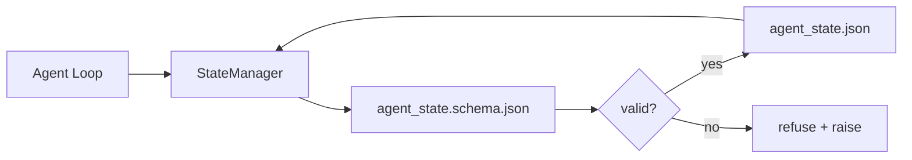

# Tưởng thức Repo và trạng thái bền vững

> Lịch sử trò chuyện không ổn định, repo là lâu dài, đại lý của cửa hàng trên bàn làm việc được ghi trong các tệp phiên bản để phiên bản tiếp theo, đại lý tiếp theo và người xem tiếp theo đều đọc từ cùng một nguồn sự thật.

**Type:** Build
**Languages:** Python (stdlib + `jsonschema` optional)
**Prerequisites:** Phase 14 · 32 (Minimal Workbench)
**Time:** ~60 minutes

## Mục tiêu học tập

- Định nghĩa những gì thuộc về bộ nhớ repo và những gì thuộc về lịch sử trò chuyện.
- Author JSON Schemas for `agent_state.json`và `task_board.json`- Tôi không biết.
- Xây dựng một nhà quản lý nhà nước tải, xác nhận, đột biến và duy trì nhà nước nguyên tử.
- Sử dụng kế hoạch để từ chối viết xấu trước khi họ làm hỏng bàn làm việc.

## Vấn đề

Người đại lý hoàn thành một phiên, trò chuyện kết thúc, phiên tiếp theo mở ra và hỏi bắt đầu từ đâu. Mô hình nói "hãy cho tôi kiểm tra các tệp", đọc các ghi chú lỗi thời, và làm lại công việc đã hoàn thành. Hoặc tệ hơn, nó viết lại một tệp hoàn thành vì không ai nói với nó tệp đã hoàn thành.

Phong sửa workbench là bộ nhớ repo: trạng thái sống trong các tệp JSON trong repo, được viết dưới một schema, tồn tại nguyên tử, khác biệt trong đánh giá mã.

## Khái niệm



### Những gì thuộc về bộ nhớ repo

| Belongs | Does not belong |
|---------|-----------------|
| Active task id | Raw chat transcripts |
| Touched files this session | Token-level reasoning traces |
| Assumptions the agent made | "The user seemed frustrated" |
| Open blockers | Sampled completions |
| Next action | Vendor-specific model ids |

Thử nghiệm là độ bền: liệu điều này có hữu ích trong ba tháng nữa trong một lần lặp lại CI? Nếu có, repo. Nếu không, telemetry.

### Chương trình đầu tiên

JSON Schema là hợp đồng. Nếu không có nó, mỗi đại lý phát minh ra các trường mới, mỗi nhà phê bình học được một hình dạng mới, và mỗi kịch bản CI phải đặc biệt các phiên bản trước đó.

Các quy trình bao gồm:

- Chìa khóa cần thiết.
- Được phép`status`giá trị.
- Giá trị cấm (ví dụ: `null`cho các mảng).
- Các hạn chế mô hình (tác dụng ID phù hợp `T-\d{3,}`().
- Vùng phiên bản cho di chuyển.

### Atomic viết

State writes cần phải tồn tại trong một số thất bại: viết vào một file temp, fsync, đổi tên trên mục tiêu.

### Di cư

Khi schema thay đổi, gửi một kịch bản di chuyển bên cạnh bump schema.`schema_version`trường; người quản lý từ chối tải một tập tin từ một phiên bản mà nó không thể di chuyển.

```figure
wb-state-persist
```

## Hãy xây dựng nó

`code/main.py`thực hiện:

- `agent_state.schema.json`và `task_board.schema.json`- Tôi không biết.
- Một trình xác thực chỉ có stdlib (đối hợp của JSON Schema: yêu cầu, loại, enum, mẫu, mục).
- `StateManager.load`- `StateManager.update`- `StateManager.commit`với tên gọi và thời gian nguyên tử viết.
- Một bản demo biến đổi trạng thái, tồn tại, tải lại, và chứng minh chuyến đi về và về.

Đi đi.

```
python3 code/main.py
```

Bản kịch bản viết `workdir/agent_state.json`và `workdir/task_board.json`, biến đổi chúng qua hai vòng, và in trạng thái xác nhận tại mỗi bước.

## Các mô hình sản xuất trong tự nhiên

Bốn mô hình biến tối thiểu của bài học thành thứ mà một đơn vị đa tác nhân có thể tồn tại.

**Atomic temp-and-rename is not optional.**Một báo cáo lỗi dự án Hive tháng 3 năm 2026 ghi lại chế độ thất bại một cách sạch sẽ: `state.json`được viết qua `write_text()`Và những ngoại lệ đã bị bắt và bị đóng đinh.`tempfile.mkstemp`Trong cùng thư mục với mục tiêu, viết, `fsync`- `os.replace`(đổi tên nguyên tử trên POSIX và Windows).`atomic_write`làm đúng như vậy.

**Idempotency keys on every non-idempotent tool call.**Nếu một đại lý bị hỏng sau khi gọi một công cụ nhưng trước khi kiểm tra kết quả, phục hồi lại thử lại cuộc gọi công cụ. An toàn cho đọc; nguy hiểm cho email, chèn DB, tải lên tệp.`pending_calls.jsonl`Khi thử lại, kiểm tra ID; nếu có, bỏ qua cuộc gọi và sử dụng kết quả được lưu trữ trong cache. cả Anthropic và LangChain đều gọi điều này trong hướng dẫn 2026; Điểm kiểm tra của LangGraph vẫn còn chờ các bài viết vì cùng một lý do.

**Separate large artifacts from state.**Đừng lưu trữ CSV, bản sao dài, hoặc các tệp được tạo trong `agent_state.json`. lưu đồ tạo vật như một tệp riêng biệt (hoặc tải lên lưu trữ đối tượng) và chỉ giữ đường đi trong trạng thái. Các điểm kiểm tra vẫn nhỏ và nhanh chóng; các đồ tạo vật phát triển độc lập.

**Event sourcing for audit, snapshots for resume.**Thêm vào nhật ký sự kiện (`state.events.jsonl`) trên mỗi đột biến; định kỳ chụp ảnh nhanh cho `state.json`. Resume đọc snapshot, sau đó tái tạo bất kỳ sự kiện nào sau dấu thời gian của snapshot. Điều này chi phí nhiều đĩa hơn nhưng cho phép bạn tái phát quyết định của đại lý theo nghĩa đen  cần thiết khi gỡ lỗi các chạy đường chân trời dài. cùng một hình dạng Postgres sử dụng bên trong cho WAL.

**Schema migrations or refuse to load.**- `schema_version`integer là hợp đồng. Khi người quản lý tải một tập tin ở một phiên bản không rõ, nó từ chối đọc. Sending a migration script next to the schema bump; `tools/migrate_state.py`chạy vô hiệu trên mọi startup.

## Sử dụng nó

Trong sản xuất:

- **LangGraph checkpointers.**cùng ý tưởng, lưu trữ khác nhau. Điểm kiểm tra vẫn giữ trạng thái biểu đồ đến SQLite, Postgres, hoặc một nền tùy chỉnh.
- **Letta memory blocks.**Các khối liên tục với các kế hoạch có cấu trúc (Phase 14 · 08).
- **OpenAI Agents SDK session store.**Các backend có thể được cài đặt, có thể được biết đến với các schema.

## Chuyển nó

`outputs/skill-state-schema.md`tạo ra một cặp JSON Schema cụ thể cho dự án (state + board), một Python `StateManager`được cáp vào các chữ viết nguyên tử, và một sàn di chuyển để vụ nổ kế hoạch tiếp theo không phá vỡ bàn làm việc.

## Các bài tập

1. Thêm một `last_human_touch`Từ chối bất kỳ tác giả nào viết trong vòng 5 giây sau khi người chỉnh sửa.
2. Tăng độ xác nhận để hỗ trợ `oneOf`Vì vậy, một nhiệm vụ có thể là một nhiệm vụ xây dựng hoặc một nhiệm vụ xem xét với các lĩnh vực yêu cầu khác nhau.
3. Thêm một `schema_version`trường và viết chuyển đổi từ v1 đến v2 (tái tên `blockers`đến`risks`().
4. Di chuyển backend lưu trữ từ một tệp địa phương sang SQLite. Giữ `StateManager`API giống nhau.
5. Đưa hai đại lý vào cùng một tập tin với một cuộc đua viết 50 ms.

## Các điều khoản chính

| Term | What people say | What it actually means |
|------|----------------|------------------------|
| Repo memory | "Notes file" | State stored in tracked files in the repo, under schema |
| Schema-first | "Validate inputs" | Define the contract before the writer, refuse drift |
| Atomic write | "Just rename" | Write to temp, fsync, rename, so partial failures cannot corrupt |
| Migration | "Schema bump" | A script that turns vN state into v(N+1) state |
| System of record | "Source of truth" | The artifact the workbench treats as authoritative |

## Đọc thêm

- [JSON Schema specification](https://json-schema.org/specification.html)
- [LangGraph checkpointers](https://langchain-ai.github.io/langgraph/concepts/persistence/)
- [Letta memory blocks](https://docs.letta.com/concepts/memory)
- [Fast.io, AI Agent State Checkpointing: A Practical Guide](https://fast.io/resources/ai-agent-state-checkpointing/) Đường kiểm tra đầu tiên với khả năng không có
- [Fast.io, AI Agent Workflow State Persistence: Best Practices 2026](https://fast.io/resources/ai-agent-workflow-state-persistence/) kiểm soát đồng thời, TTL, nguồn cung cấp sự kiện
- [Hive Issue #6263 — non-atomic state.json writes silently ignored](https://github.com/aden-hive/hive/issues/6263) chế độ thất bại trong một dự án thực sự
- [eunomia, Checkpoint/Restore Systems: Evolution, Techniques, Applications](https://eunomia.dev/blog/2025/05/11/checkpointrestore-systems-evolution-techniques-and-applications-in-ai-agents/) CR nguyên thủy từ lịch sử OS áp dụng cho các đại lý
- [Indium, 7 State Persistence Strategies for Long-Running AI Agents in 2026](https://www.indium.tech/blog/7-state-persistence-strategies-ai-agents-2026/)
- [Microsoft Agent Framework, Compaction](https://learn.microsoft.com/en-us/agent-framework/agents/conversations/compaction) Giám đốc điểm kiểm soát của nhà cung cấp
- Giai đoạn 14 · 08  Các khối bộ nhớ và tính toán thời gian ngủ
- Giai đoạn 14 · 32  tối thiểu ba tập tin bài học này sơ đồ
- Giai đoạn 14 · 40  các gói chuyển giao được đọc từ cùng một kế hoạch
