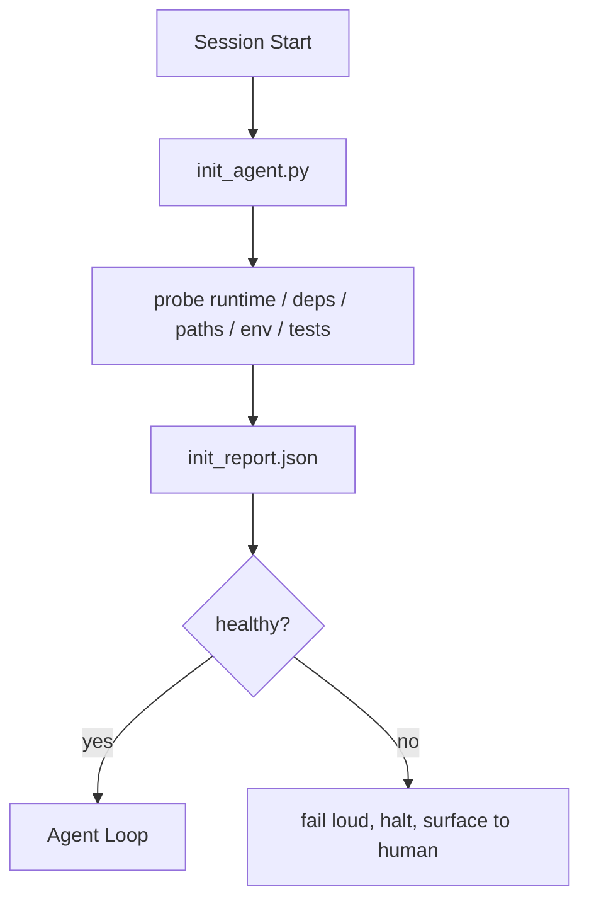

# Các kịch bản khởi tạo cho các đại lý

> Mỗi phiên bắt đầu lạnh trả thuế, đại lý đọc cùng một tập tin, thử lại cùng một quãng và phát hiện lại cùng một con đường, một bản thảo init trả thuế một lần và viết câu trả lời vào trạng thái.

**Type:** Build
**Languages:** Python (stdlib)
**Prerequisites:** Phase 14 · 32 (Minimal Workbench), Phase 14 · 34 (Repo Memory)
**Time:** ~45 minutes

## Mục tiêu học tập

- Định danh công việc mà một nhân viên không bao giờ phải làm lại mỗi phiên.
- Xây dựng một kịch bản init xác định học để thăm dò thời gian chạy, phụ thuộc và sức khỏe repo.
- Cố gắng giữ kết quả của cuộc thăm dò để người đại diện đọc nó thay vì chạy lại kiểm tra.
- Thiếu tiếng, nhanh chóng, và với một nơi để nhìn khi khởi tạo thất bại.

## Vấn đề

Mở một phiên bản. Đại lý đoán phiên bản Python. đoán lệnh thử nghiệm. liệt kê gốc repo năm lần để tìm điểm nhập. Nỗ lực nhập khẩu một gói chưa được cài đặt. hỏi người dùng nơi lưu trữ tập tin cấu hình. Đến khi nó thực hiện chỉnh sửa thực sự, mười ngàn token đã đi đến việc thiết lập mà nên là một kịch bản duy nhất.

Việc sửa là một kịch bản khởi tạo chạy trước khi đại lý làm bất cứ điều gì khác và viết một `init_report.json`Đại lý đọc ở startup.

## Khái niệm



### Điều gì các bản ghi init thăm dò

| Probe | Why it matters |
|-------|----------------|
| Runtime versions | Wrong Python or Node version means silent wrong-version bugs |
| Dependency availability | A missing package later costs ten times the cost of catching it now |
| Test command | The agent must know how to verify; if the command is missing the workbench is broken |
| Repo paths | Hard-coded paths drift; resolve them once and pin |
| Environment variables | Missing `OPENAI_API_KEY` is a failure surface, not a runtime mystery |
| State + board freshness | Stale state from a crashed session is a footgun |
| Last-known-good commit | Anchor for the handoff diff at the end of the session |

### Thất bại lớn, thất bại nhanh, thất bại ở một nơi

Một vụ thất bại của con tàu là dừng lại và lên mặt người. Không "nhà tác nhân sẽ tìm ra nó".

### Không có khả năng

Lần thứ hai sẽ không có thời gian, ngoại trừ khi có dấu thời gian mới.

### Init vs quy tắc khởi động

Quy tắc (Phase 14 · 33) mô tả những gì phải đúng để hành động. Init là kịch bản thiết lập rằng những quy tắc đó có thể được kiểm tra. Quy tắc mà không có init trở thành "để cẩn thận".

```figure
wb-init-probes
```

## Hãy xây dựng nó

`code/main.py`thực hiện `init_agent.py`- Có thể là:

- Năm thăm dò: phiên bản Python, liệt kê các phụ thuộc qua `importlib.util.find_spec`, kiểm tra lệnh giải quyết, yêu cầu môi trường, trạng thái tệp tươi mới.
- Mỗi con tàu quay lại`(name, status, detail)`- Tôi không biết.
- Bản kịch bản viết `init_report.json`với toàn bộ bộ bộ phận thăm dò và thoát khỏi không bằng 0 nếu bất kỳ bộ phận thăm dò khối nặng nào thất bại.

Đi đi.

```
python3 code/main.py
```

Bản kịch bản in bảng của các con thám, viết `init_report.json`, và thoát khỏi 0 trên đường hạnh phúc hoặc không bằng 0 với một danh sách các thăm dò thất bại.

## Các mô hình sản xuất trong tự nhiên

Ba mô hình tách ra một kịch bản init hữu ích từ một buổi lễ.

**Last-known-good commit anchoring.**Thử nghiệm cam kết hiện tại chống lại một `LKG`file được viết trên kết hợp thành công cuối cùng. Nếu sự khác biệt vượt quá ngân sách (tạm dịch là 50 file), từ chối bắt đầu và yêu cầu một người phải phê chuẩn đường cơ sở mới. Đây là những gì AI Code Review của Cloudflare sử dụng để bao gồm các đại lý đánh giá: mỗi phiên đánh giá được neo chống lại cùng một điều tốt nhất và không bao giờ hợp chất trôi qua các phiên.

**Lock files with TTL.**Hãy viết một `prereqs.lock`sau khi thử nghiệm đầu tiên thành công. Các lần chạy sau đó tin vào khóa trong N giờ (24h mặc định) và bỏ qua các thử nghiệm đắt tiền. kịch bản init đọc khóa trước; nếu nó tươi và biểu hiện phụ thuộc phù hợp, nó sẽ chuyển mạch ngắn. Đây là cùng một mô hình Docker sử dụng cho bộ nhớ cache lớp: thám idempotent + content hash = bỏ qua.

**No network, no LLM, no surprises in the hot path.**Các thăm dò Init là ống nước xác định. Một thăm dò gọi một LLM để phân loại một lỗi hoặc tấn công một dịch vụ bên ngoài để kiểm tra giấy phép không phải là một thăm dò; đó là một dòng công việc. Nếu một thăm dò kéo dài hơn ba giây trong một chạy khô, hãy coi đó như một mùi bàn làm việc và hoặc di chuyển nó ra khỏi init hoặc lưu trữ kết quả của nó.

## Sử dụng nó

Trong sản xuất:

- **Claude Code hooks.** `pre-task`Hook gọi lệnh init và từ chối khởi động máy nếu không thành công.
- **GitHub Actions.**A `setup-agent`công việc chạy kịch bản init; công việc đại lý phụ thuộc vào nó.
- **Docker entrypoint.**Cụ thể container chạy script init trước khi exec-ing runtime của đại lý; ghi mặt khi thất bại.

Các bản thảo init là di động vì nó không thực hiện các cuộc gọi đến một khung cụ thể. Bash, Make, hoặc một tệp nhiệm vụ có thể bao bì nó.

## Chuyển nó

`outputs/skill-init-script.md`phỏng vấn dự án, phân loại công việc thiết lập của nó thành các con sond và phát hành một dự án cụ thể `init_agent.py`cộng với một thông tin thông tin thông tin thông tin thông tin thông tin thông tin thông tin thông tin thông tin thông tin thông tin thông tin thông tin thông tin thông tin thông tin thông tin thông tin thông tin thông tin thông tin thông tin thông tin thông tin thông tin thông tin thông tin thông tin thông tin thông tin thông tin thông tin thông tin thông tin thông tin thông tin thông tin thông tin thông tin thông tin thông tin thông tin thông tin thông tin thông tin thông tin thông tin thông tin thông tin thông tin thông tin thông tin thông tin thông tin thông tin thông tin thông tin thông tin thông tin thông tin thông tin thông tin thông tin thông tin thông tin thông tin thông tin thông tin thông tin thông tin thông tin thông tin thông tin thông tin thông tin thông tin thông tin thông tin thông tin thông tin thông tin thông tin thông tin thông tin thông tin thông tin thông tin thông tin thông tin thông tin thông tin thông tin thông tin thông tin thông tin thông tin thông tin thông tin thông tin thông tin thông tin thông tin thông tin thông tin thông tin thông tin thông tin thông tin thông tin thông tin thông tin thông tin thông tin thông tin thông tin thông tin thông tin thông tin thông tin thông tin thông tin thông tin thông tin thông tin thông tin thông tin thông tin thông tin thông tin thông tin thông tin thông tin thông tin thông tin thông tin thông tin thông tin thông tin thông tin thông tin thông tin thông tin thông tin thông tin thông tin thông tin thông tin thông tin thông tin thông tin thông tin thông tin thông tin thông tin thông tin thông tin thông tin thông tin thông tin thông tin thông tin thông tin thông tin thông tin thông tin thông tin thông tin thông tin thông tin thông tin thông tin thông tin thông tin thông tin thông tin thông tin thông tin thông tin thông tin thông tin thông tin thông tin thông tin thông tin thông tin thông tin thông tin

## Các bài tập

1. Thêm một sonda khác biệt commit hiện tại với commit tốt nhất và từ chối bắt đầu nếu hơn 50 file thay đổi.
2. Chuyển kịch bản để viết `prereqs.lock`Đơn và từ chối bắt đầu nếu khóa có tuổi hơn bảy ngày.
3. Thêm một `--fix`cờ tự động cài đặt các phụ thuộc phát triển bị mất nhưng không bao giờ sửa đổi các phụ thuộc thời gian chạy mà không được phê duyệt.
4. Di chuyển các con thám từ các chức năng mã hóa cứng sang một sổ đăng ký YAML.
5. Thêm một ngân sách thời gian cho mỗi thăm dò.

## Các điều khoản chính

| Term | What people say | What it actually means |
|------|----------------|------------------------|
| Probe | "A check" | A deterministic function returning `(name, status, detail)` |
| Init report | "Setup output" | JSON written next to state with the probe results |
| Idempotent | "Safe to re-run" | Two runs in a row produce identical reports modulo timestamp |
| Fail loud | "Don't swallow" | Halt and surface to the human; no silent fallback |
| Setup tax | "Bootstrap cost" | The tokens the agent spends per session rediscovering the obvious |

## Đọc thêm

- [Anthropic, Effective harnesses for long-running agents](https://www.anthropic.com/engineering/effective-harnesses-for-long-running-agents)
- [GitHub Actions, composite actions for setup](https://docs.github.com/en/actions/sharing-automations/creating-actions/creating-a-composite-action)
- [microservices.io, GenAI dev platform: guardrails](https://microservices.io/post/architecture/2026/03/09/genai-development-platform-part-1-development-guardrails.html) Đề nghị trước + kiểm tra CI như init
- [Augment Code, How to Build Your AGENTS.md (2026)](https://www.augmentcode.com/guides/how-to-build-agents-md) kỳ vọng init
- [Codex Blog, Codex CLI Context Compaction](https://codex.danielvaughan.com/2026/03/31/codex-cli-context-compaction-architecture/) bắt đầu phiên như bắt đầu có ý thức về sự nén
- Giai đoạn 14 · 33  quy tắc được đặt trong kịch bản này cho phép
- Giai đoạn 14 · 34  tập tin nhà nước này bản thảo hạt giống
- Giai đoạn 14 · 38  cổng xác minh nguồn gốc của kịch bản init
- Giai đoạn 14 · 40  việc chuyển giao tiêu thụ những gì tốt nhất được biết đến trong báo cáo init
