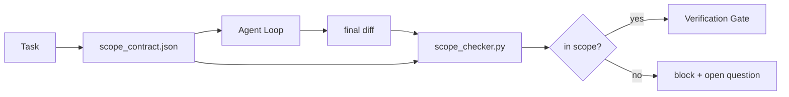

# Các hợp đồng phạm vi và giới hạn nhiệm vụ

> Mô hình không biết công việc kết thúc ở đâu. Hợp đồng phạm vi là một tệp mỗi nhiệm vụ cho biết công việc bắt đầu ở đâu, kết thúc ở đâu, và làm thế nào để quay lại nếu nó đổ. Hợp đồng biến "đứng trong phạm vi" từ một mong muốn thành một kiểm tra.

**Type:** Build
**Languages:** Python (stdlib)
**Prerequisites:** Phase 14 · 32 (Minimal Workbench), Phase 14 · 33 (Rules as Constraints)
**Time:** ~50 minutes

## Mục tiêu học tập

- Viết một hợp đồng phạm vi mà một đại lý đọc tại bắt đầu nhiệm vụ và một xác minh đọc tại kết thúc nhiệm vụ.
- Định nghĩa các tệp được phép, tệp bị cấm, tiêu chí chấp nhận, kế hoạch quay lại và ranh giới phê duyệt.
- Thực hiện một kiểm tra phạm vi so sánh sự khác biệt với hợp đồng và đánh dấu vi phạm.
- Làm cho phạm vi lấp lánh nhìn thấy, tự động, và có thể xem xét.

## Vấn đề

Các đại lý trượt. Nhiệm vụ là "làm chính lỗi đăng nhập". Sự khác biệt liên quan đến đường đăng nhập, trợ lý email, trình điều khiển cơ sở dữ liệu, README và kịch bản phát hành. Mỗi lần chạm có lý do hợp lý trong thời điểm đó. Cùng với nhau chúng là một thay đổi khác so với một người đã được xem xét.

Scope creep là chế độ thất bại bị theo dõi kém nhất trong công việc của đại lý vì đại lý kể lại từng bước một cách trung thành.

## Khái niệm



### Điều gì được ghi trong hợp đồng phạm vi

| Field | Purpose |
|-------|---------|
| `task_id` | Links to the task on the board |
| `goal` | One sentence the reviewer can verify |
| `allowed_files` | Globs the agent may write |
| `forbidden_files` | Globs the agent must not touch even by accident |
| `acceptance_criteria` | Test commands or assertion lines that prove done |
| `rollback_plan` | One paragraph the operator can execute if a halt is required |
| `approvals_required` | Actions outside scope that need explicit human sign-off |

Một hợp đồng mà không có`forbidden_files`không gian âm là một nửa hợp đồng.

### Các quả cầu, không phải đường nguyên liệu

Real repos chuyển các tập tin. Pin hợp đồng với các globs (`app/**/*.py`- `tests/test_signup*.py`) do đó một refactor giữa các phiên không vô hiệu hóa hợp đồng.

### Rollback là một phần của phạm vi

Việc liệt kê cách để quay lại buộc tác giả hợp đồng phải suy nghĩ về những gì có thể sai.

### Kiểm tra phạm vi là kiểm tra sự khác biệt

Người kiểm tra đọc sự khác biệt, các cầu được phép, các cầu bị cấm, và một danh sách các lệnh chấp nhận đã chạy.

### Hai độ cao phạm vi: danh sách tính năng và hợp đồng nhiệm vụ

Hợp đồng phạm vi giới hạn một nhiệm vụ. Nó không ràng buộc dự án. Một đại lý có thể ở hoàn hảo trong một hợp đồng để sửa chữa đăng nhập và vẫn, ở lượt tiếp theo, quyết định dự án cũng cần một trang cài đặt, một chuyển đổi chế độ tối, và một viết lại của bộ định tuyến. Hợp đồng không bao giờ được hỏi công việc nào trong phạm vi của dự án, chỉ có những tệp nào trong phạm vi của nhiệm vụ.

Độ cao thứ hai cần một nguyên thủy riêng:`feature_list.json`đại lý đọc khi bắt đầu phiên. Đó là dự án backlog như một máy đọc, file được đặt. đại lý chọn chính xác một tính năng mà `status`là `todo`, viết của nó `id`"Một tính năng một lần" ngừng là một dòng trong lời nhắc đại lý có thể hợp lý hóa quá khứ và trở thành một giá trị nó đọc ra đĩa và kiểm tra cổng thực thi.

```json
{
  "project": "knowledge-base",
  "active": "import-pdf",
  "features": [
    { "id": "import-pdf",   "status": "in_progress", "goal": "import a PDF into the library",        "done_when": "pytest tests/test_import.py && a sample PDF appears in the library view" },
    { "id": "full-text-search", "status": "todo",     "goal": "search document text and rank hits",   "done_when": "query returns ranked results with snippets" },
    { "id": "cite-answers", "status": "todo",         "goal": "answers carry source citations",        "done_when": "every answer renders at least one clickable citation" }
  ]
}
```

| Field | Purpose |
|-------|---------|
| `active` | The single feature the current session may touch; empty means pick one and set it |
| `features[].id` | Stable slug the scope contract's `task_id` points at |
| `features[].status` | `todo`, `in_progress`, `done`, `blocked`; only one `in_progress` at a time |
| `features[].goal` | One sentence the reviewer can verify |
| `features[].done_when` | The acceptance line that flips `in_progress` to `done` |

Hai quy tắc làm cho danh sách chịu tải thay vì trang trí.`in_progress`" là một kiểm tra khởi động (Phase 14 · 33): nếu danh sách hiển thị hai, phiên bản từ chối bắt đầu cho đến khi một người giải quyết nó. Thứ hai, danh sách tính năng là một tệp, không phải là một tin nhắn trò chuyện, bởi vì trò chuyện cuộn ra khỏi ngữ cảnh và tệp tồn tại qua các phiên và qua các đại lý. Handoff (Phase 14 · 40) viết lại tình trạng của tính năng hoàn thành đến `done`Vì vậy, phiên tiếp theo mở ra cho một bảng chính xác thay vì rút lại những gì còn lại.

Hợp đồng và danh sách tạo thành bởi quyền lợi ít nhất, cùng sự sáp nhập được mô tả dưới đây: hợp đồng nhiệm vụ `allowed_files`phải ngồi bên trong bất cứ điều gì mà tính năng hoạt động chạm vào, không bao giờ bên ngoài nó.

```figure
wb-scope-bounce
```

## Hãy xây dựng nó

`code/main.py`thực hiện:

- `scope_contract.json`schema (đối nhóm của JSON Schema, các mảng glob).
- Một phân tích khác nhau biến một danh sách các tệp được chạm cộng với một danh sách các lệnh chạy thành một `RunSummary`- Tôi không biết.
- A `scope_check`- Đó là trả lại.`(violations, in_scope, off_scope)`chống lại hợp đồng.
- Hai phiên bản demo: một trong đó vẫn còn trong phạm vi, một trong đó có sự lật lật.

Đi đi.

```
python3 code/main.py
```

Kết quả: hợp đồng, hai lần chạy, phán quyết mỗi lần chạy, và một lần cứu `scope_report.json`- Tôi không biết.

## Các mô hình sản xuất trong tự nhiên

Một học viên chạy "specsmaxxing" (các hợp đồng phạm vi trong YAML trước khi gọi đại lý) báo cáo tỷ lệ lỗ thỏ giảm từ 52% xuống còn 21% trong ba tuần mà không thay đổi đại lý.

**Violation budgets, not binary failures.** `agent-guardrails`(cổng kết hợp OSS được sử dụng bởi Claude Code, Cursor, Windsurf, Codex thông qua MCP)`violationBudget`mỗi nhiệm vụ: các mục tiêu nhỏ trong ngân sách được hiển thị như là cảnh báo; chỉ khi ngân sách vượt quá thì cổng hợp nhất sẽ từ chối.`violationSeverity: "error" | "warning"`Ngân sách là sự khác biệt giữa một cổng mà tàu và một cổng mà bị vô hiệu hóa bởi đội đã ghét nó.

**Severity asymmetry by path family.**Off-scope viết thư đến `docs/**`thường là `warn`; ngoài phạm vi viết thư đến `scripts/**`- `migrations/**`- `config/prod/**`luôn luôn`block`Sự bất đối xứng này phải tồn tại trong hợp đồng, không phải trong thời gian chạy, bởi vì nó là cụ thể cho dự án và thay đổi cho mỗi nhiệm vụ.

**Time and network budgets next to file budgets.**A `time_budget_minutes`trường giới hạn đồng hồ tường; thời gian chạy từ chối tiếp tục vượt qua nó mà không được phê duyệt lại.`network_egress`Allowlist trên hostname ngăn chặn đại lý từ một cách lặng lẽ nhấn vào một API bên ngoài không phải là một phần của nhiệm vụ.

**Multi-contract merge semantics (least privilege).**Khi có hai hợp đồng phạm vi áp dụng (ví dụ: một hợp đồng toàn dự án cộng với một hợp đồng cụ thể về nhiệm vụ), sự sáp nhập là: **intersect** `allowed_files`(cả hai hợp đồng đều phải cho phép con đường),**union** `forbidden_files`(hoặc có thể cấm),`time_budget_minutes`là hạn chế nhất (min), `approvals_required`Nâng lên.`network_egress`là `None`không có hành động,`[]`vì đã nói dối mọi người.`[...]`như một công ty có quyền; trong quá trình hợp nhất,`None`Đưa lại phía bên kia, hai danh sách giao nhau, và từ chối tất cả vẫn từ chối tất cả.

## Sử dụng nó

Các mô hình sản xuất:

- **Claude Code slash commands.**A `/scope`chỉ huy viết hợp đồng và pin nó như bối cảnh phiên.
- **GitHub PRs.**Nhập hợp đồng như một tệp JSON trong cơ quan PR hoặc như một vật liệu đã được kiểm tra. CI chạy kiểm tra phạm vi chống lại sự khác biệt kết hợp.
- **LangGraph interrupts.**Một vi phạm vi gây ra một sự gián đoạn; người quản lý hỏi con người liệu hợp đồng cần phát triển hay đại lý cần rút lui.

Hợp đồng đi cùng với nhiệm vụ. Khi nhiệm vụ kết thúc, hợp đồng được lưu trữ dưới `outputs/scope/closed/`- Tôi không biết.

## Chuyển nó

`outputs/skill-scope-contract.md`tạo ra một hợp đồng phạm vi cho mô tả nhiệm vụ và một kiểm tra toàn cầu được chạy trong CI cho mỗi nhân khác nhau.

## Các bài tập

1. Thêm một `network_egress`danh sách trường cho phép các máy chủ bên ngoài. từ chối chạy liên quan đến các máy chủ khác.
2. Lên bộ kiểm tra để không thể mềm `docs/**`và cứng lên `scripts/**`- Định lý sự bất đối xứng.
3. Làm cho hợp đồng bắt nguồn `allowed_files`từ một `goal`trường sử dụng một quy tắc tĩnh (không LLM). Điều gì sai trong trường hợp cạnh đầu tiên?
4. Thêm một `time_budget_minutes`và từ chối tiếp tục khi đồng hồ tường vượt quá nó.
5. Thực hiện hai hợp đồng với cùng một sự khác biệt.

## Các điều khoản chính

| Term | What people say | What it actually means |
|------|----------------|------------------------|
| Scope contract | "The task brief" | Per-task JSON listing allowed/forbidden files, acceptance, rollback |
| Scope creep | "It also touched..." | Files outside the contract changed in the same task |
| Rollback plan | "We can revert" | The one-paragraph operator runbook for halting |
| Approval boundary | "Needs sign-off" | An action listed in the contract as requiring explicit human approval |
| Diff check | "Path audit" | Comparing touched files against the contract globs |

## Đọc thêm

- [LangGraph human-in-the-loop interrupts](https://langchain-ai.github.io/langgraph/concepts/human_in_the_loop/)
- [OpenAI Agents SDK tool approval policies](https://platform.openai.com/docs/guides/agents-sdk)
- [logi-cmd/agent-guardrails — merge gates and scope validation](https://github.com/logi-cmd/agent-guardrails) ngân sách vi phạm, mức độ nghiêm trọng
- [Dev|Journal, Preventing AI Agent Configuration Drift with Agent Contract Testing](https://earezki.com/ai-news/2026-05-05-i-built-a-tiny-ci-tool-to-keep-ai-agent-configs-from-drifting-in-my-repo/) `--strict`chế độ không có các thiết bị bên ngoài
- [Agentic Coding Is Not a Trap (production logs)](https://dev.to/jtorchia/agentic-coding-is-not-a-trap-i-answered-the-viral-hn-post-with-my-own-production-logs-33d9) thu nhập phân tích: 52% → 21%
- [OpenCode permission globs](https://opencode.ai/docs/agents/) phạm vi cho phép hạt mỏng
- [Knostic, AI Coding Agent Security: Threat Models and Protection Strategies](https://www.knostic.ai/blog/ai-coding-agent-security) phạm vi như một phần của quyền tối thiểu
- [Augment Code, AI Spec Template](https://www.augmentcode.com/guides/ai-spec-template) Hệ thống ranh giới ba cấp (cần/không bao giờ)
- Giai đoạn 14 · 27  phòng thủ tiêm nhanh kết hợp với khóa phạm vi
- Giai đoạn 14 · 33  quy tắc được thiết lập trong hợp đồng này chuyên về mỗi nhiệm vụ
- Giai đoạn 14 · 38  cổng kiểm tra kiểm tra báo cáo vào
