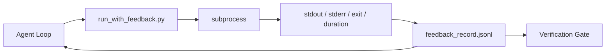

# Các vòng lặp phản hồi thời gian chạy

> Các đại lý không thấy lệnh đầu ra thực sự đoán. Một người chạy phản hồi bắt được stdout, stderr, mã thoát và thời gian vào một bản ghi có cấu trúc mà lượt tiếp theo có thể đọc. Sau đó đại lý phản ứng với các sự kiện thay vì dự đoán của riêng mình về sự kiện.

**Type:** Build
**Languages:** Python (stdlib)
**Prerequisites:** Phase 14 · 32 (Minimal Workbench), Phase 14 · 35 (Init Script)
**Time:** ~50 minutes

## Mục tiêu học tập

- Sự khác biệt giữa phản hồi thời gian chạy và đo lường theo dõi khả năng quan sát.
- Xây dựng một bộ chạy phản hồi bao bọc các lệnh shell và duy trì các hồ sơ được cấu trúc.
- Giảm các đầu ra lớn theo cách xác định để vòng lặp vẫn nằm trong ngân sách token.
- Không muốn tiến bộ vòng lặp khi phản hồi bị thiếu.

## Vấn đề

Người đại lý nói "đánh thử ngay bây giờ". Thông điệp tiếp theo nói "tất cả các thử nghiệm đều qua". Thực tế là không có thử nghiệm nào được chạy. Người đại lý tưởng tượng ra kết quả, hoặc nó chạy lệnh và không bao giờ đọc kết quả, hoặc nó đọc kết quả và im lặng cắt giảm đường thất bại.

Một người chạy phản hồi xóa khoảng cách đó. Mỗi lệnh đi qua người chạy. Mỗi ghi chép mang theo lệnh, stdout và stderr bị bắt, mã thoát, thời gian đồng hồ tường, và một ghi chú đại lý. Đại lý đọc ghi chép ở lượt tiếp theo. Cổng xác minh đọc ghi chép ở cuối nhiệm vụ.

## Khái niệm



### Những gì đi trong hồ sơ phản hồi

| Field | Why it matters |
|-------|----------------|
| `command` | Exact argv, no shell expansion surprises |
| `stdout_tail` | Last N lines, deterministic truncation |
| `stderr_tail` | Last N lines, separate from stdout |
| `exit_code` | The unambiguous success signal |
| `duration_ms` | Surfaces slow probes and runaway processes |
| `started_at` | Timestamp for replay |
| `agent_note` | One line the agent writes about what it expected |

### Truncation là xác định

Một bản ghi 50 MB phá hủy vòng lặp. người chạy cắt đầu và đuôi bằng một `...truncated N lines...`Các điểm khác nhau trong các phân tích là:

### Phản hồi so với điện đo

Telemetry (Phase 14 · 23, các quy ước OTel GenAI) là cho các nhà điều hành con người xem xét chạy qua thời gian.

### Nhận không nhận được phản hồi

Nếu người chạy sai trước khi chụp ra, hồ sơ mang `exit_code: null`và `error: <reason>`. vòng đại lý phải từ chối tuyên bố thành công trên một`null`Không có lối ra, không có tiến bộ.

```figure
wb-feedback-loop
```

## Hãy xây dựng nó

`code/main.py`thực hiện:

- `run_with_feedback(command, agent_note)`Cái gì đó `subprocess.run`, ghi lại stdout/stderr/exit/duration, cắt giảm theo cách xác định, thêm vào `feedback_record.jsonl`- Tôi không biết.
- Một bộ tải nhỏ truyền JSONL vào danh sách Python.
- Một bản demo chạy ba lệnh (success, failure, slow) và in bản ghi cuối cùng cho mỗi lệnh.

Đi đi.

```
python3 code/main.py
```

Kết quả: ba hồ sơ phản hồi được thêm vào `feedback_record.jsonl`, cuối cùng của mỗi dòng inline in.

## Các mô hình sản xuất trong tự nhiên

Ba mô hình làm cho người chạy đủ cứng để vận chuyển.

**Redact at write, not at read.**Bất kỳ ghi chép nào chạm vào stdout hoặc stderr có thể rò rỉ bí mật. Người chạy sẽ gửi một thẻ biên dịch trước khi JSONL phụ lục: các đường dải phù hợp `^Bearer `- `password=`- `api[_-]?key=`- `AKIA[0-9A-Z]{16}`(AWS), `xox[baprs]-`(Slack) Tác phẩm viết lại khi đọc là một khẩu súng; file trên đĩa là những gì một kẻ tấn công đạt được. kiểm tra các mô hình biên tập hàng quý so với các định dạng bí mật được quan sát trong thời gian chạy sản xuất.

**Rotation policy, not a single file.**Tướng `feedback_record.jsonl`ở 1 MB mỗi tập tin; khi quá tải quay đến `.1`- `.2`, thả`.5`. vòng lặp của đại lý chỉ đọc tập tin hiện tại, do đó chi phí thời gian chạy là giới hạn. lưu trữ CI tạo vật có được bộ quay đầy đủ. Nếu không quay tập tin trở thành nút thắt trong mỗi cuộc gọi tải.

**Parent-command id for retry chains.**Mỗi bản ghi đều có được`command_id`; thử lại `parent_command_id`Chỉ ra nỗ lực trước đó. danh sách "cố gắng thất bại" của nhà phê bình (Phase 14 · 40) và kiểm toán của cổng xác minh đều theo chuỗi.

## Sử dụng nó

Các mô hình sản xuất:

- **Claude Code Bash tool.**Công cụ đã nắm bắt stdout, stderr, exit, và thời gian.
- **LangGraph nodes.**Lật bất kỳ nút shell nào trong runner để ghi lại tồn tại bên ngoài trạng thái biểu đồ.
- **CI logs.**Đưa JSONL vào cửa hàng đồ tạo CI của bạn; các nhà xem có thể chơi lại bất kỳ lệnh nào mà không cần chạy lại phiên.

Người chạy là một tấm bọc mỏng sống sót trong mọi chuyển đổi khung vì nó sở hữu hình dạng của hồ sơ.

## Chuyển nó

`outputs/skill-feedback-runner.md`tạo ra một dự án cụ thể `run_with_feedback.py`với đúng ngân sách cắt ngắn, một nhà văn JSONL được dây đến bàn làm việc, và một bộ tải mà đại lý đọc ở mỗi lượt.

## Các bài tập

1. Thêm một `cwd`trường cho mỗi ghi để cùng một lệnh chạy từ các thư mục khác nhau có thể phân biệt.
2. Thêm một `redaction`bước mà dải các đường phù hợp `^Bearer `hoặc `password=`- Thử nghiệm trên một hồ sơ cố định.
3. Tổng giới hạn`feedback_record.jsonl`kích thước ở 1 MB bằng cách xoay `.1`- `.2`Bảo vệ chính sách quay.
4. Thêm một `parent_command_id`để thử lại chuỗi có thể nhìn thấy: lệnh nào tạo ra đầu vào mà lệnh tiếp theo tiêu thụ.
5. Đưa JSONL vào một TUI nhỏ để làm nổi bật các bước ra mới nhất không bằng 0.

## Các điều khoản chính

| Term | What people say | What it actually means |
|------|----------------|------------------------|
| Feedback record | "Run log" | Structured JSONL entry with command, output, exit, duration |
| Tail truncation | "Trim the log" | Deterministic head+tail capture so records fit in token budget |
| Refuse-on-null | "Block on missing data" | The loop must not advance when `exit_code` is null |
| Agent note | "Expectation tag" | The one-line prediction the agent writes before reading the result |
| Telemetry split | "Two log files" | Feedback for the next turn, telemetry for the operator |

## Đọc thêm

- [OpenTelemetry GenAI semantic conventions](https://opentelemetry.io/docs/specs/semconv/gen-ai/)
- [Anthropic, Effective harnesses for long-running agents](https://www.anthropic.com/engineering/effective-harnesses-for-long-running-agents)
- [Guardrails AI x MLflow — deterministic safety, PII, quality validators](https://guardrailsai.com/blog/guardrails-mlflow) các mẫu biên dịch như các thử nghiệm hồi quy
- [Aport.io, Best AI Agent Guardrails 2026: Pre-Action Authorization Compared](https://aport.io/blog/best-ai-agent-guardrails-2026-pre-action-authorization-compared/) Pre/post-tool capture
- [Andrii Furmanets, AI Agents in 2026: Practical Architecture for Tools, Memory, Evals, Guardrails](https://andriifurmanets.com/blogs/ai-agents-2026-practical-architecture-tools-memory-evals-guardrails) bề mặt có thể quan sát được
- Giai đoạn 14 · 23  Công ước OTel GenAI cho phía viễn thông
- Giai đoạn 14 · 24  Các nền tảng quan sát tác nhân (Langfuse, Phoenix, Opik)
- Giai đoạn 14 · 33  quy tắc yêu cầu phản hồi trước khi tuyên bố đã hoàn thành
- Giai đoạn 14 · 38  cổng xác minh đọc JSONL
