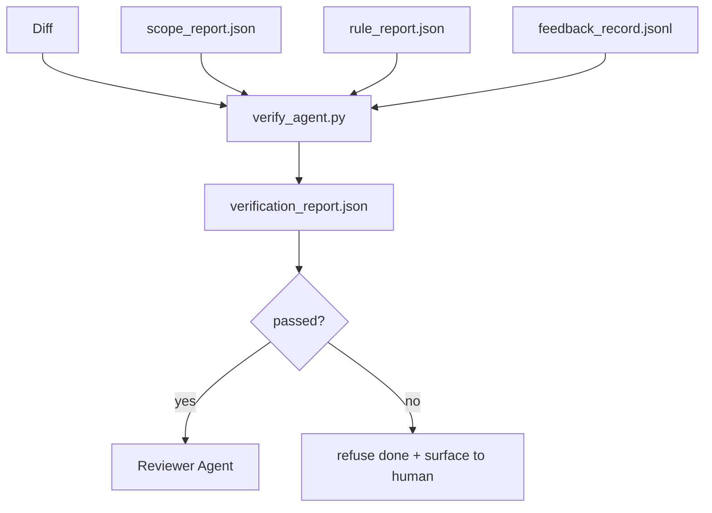

# Cổng xác minh

> Người đại lý không được đánh dấu công việc của mình như đã hoàn thành. Một cổng xác minh đọc hợp đồng phạm vi, nhật ký phản hồi, báo cáo quy tắc và sự khác biệt, và trả lời một câu hỏi duy nhất: liệu nhiệm vụ này thực sự hoàn thành không? Nếu cổng nói không, nhiệm vụ không hoàn thành, bất kể trò chuyện nói gì.

**Type:** Build
**Languages:** Python (stdlib)
**Prerequisites:** Phase 14 · 33 (Rules), Phase 14 · 36 (Scope), Phase 14 · 37 (Feedback)
**Time:** ~55 minutes

## Mục tiêu học tập

- Định nghĩa một cổng xác minh như một chức năng xác định trên các đồ tạo tác bàn làm việc.
- Kết hợp báo cáo quy tắc, báo cáo phạm vi, hồ sơ phản hồi và phân biệt thành một phán quyết duy nhất.
- Gửi một `verification_report.json`Đại lý kiểm tra và thông tin cả hai đều có thể đọc.
- Từ chối tiến hành một nhiệm vụ về bất kỳ thất bại nghiêm trọng khối, mà không có ngoại lệ.

## Vấn đề

Các đại lý tuyên bố thành công quá dễ dàng.

- "Có vẻ tốt". Mô hình đọc ra sự khác biệt của nó và quyết định nó là đúng.
- "Các xét nghiệm đã qua". Ông nói với sự tự tin. Không có hồ sơ nào về việc xét nghiệm thực sự chạy.
- "Tình thức chấp nhận được đáp ứng". Các tiêu chí chấp nhận được giải thích đủ lỏng lẻo để có nghĩa là "bất cứ điều gì giống như đã được thực hiện".

Cổng kiểm soát phiên bản. Cổng được dây vào CI. Cổng không thể hối lộ nó. Cổng được kết nối với CI. Cổng kiểm soát phiên bản không thể hối lộ nó. Cổng kiểm soát phiên bản là một cổng kiểm soát. Cổng kiểm soát được kết nối với Cổng kiểm soát và không thể hối lộ.

## Khái niệm



### Cái gì mà cổng kiểm tra

| Check | Source artifact | Severity |
|-------|-----------------|----------|
| All acceptance commands ran | `feedback_record.jsonl` | block |
| All acceptance commands exited zero | `feedback_record.jsonl` | block |
| Scope check has no forbidden writes | `scope_report.json` | block |
| Scope check has no off-scope writes | `scope_report.json` | block or warn |
| All block-severity rules pass | `rule_report.json` | block |
| No `null` exit codes in feedback | `feedback_record.jsonl` | block |
| Touched files match `scope.allowed_files` | both | warn |

A `warn`tìm kiếm ghi chú phán quyết; a `block`tìm kiếm ngăn cản `passed: true`- Tôi không biết.

### Định nghĩa, không xác suất

Cổng phải đưa ra cùng một phán quyết cho cùng một sản phẩm đặt mỗi lần. Không có thẩm phán LLM. thẩm phán LLM thuộc về phía nhà phê duyệt (Phase 14 · 39) nơi mục tiêu là đánh giá chất lượng, không phải là tình trạng.

### Một báo cáo, một con đường

Cổng phát ra một .`verification_report.json`mỗi nhiệm vụ kết thúc, được viết dưới `outputs/verification/<task_id>.json`CI tiêu thụ cùng một con đường, nhiều cổng với các con đường khác nhau làm cho nguồn của sự thật trở nên rõ ràng.

### Không có ngoại lệ

Các phát hiện về độ nghiêm trọng khối không thể bị bác bỏ bởi đại lý.`override_reason`và một `overridden_by`Đơn thay đổi là một sự thay đổi được ký kết, không phải là quyết định của đại lý.

```figure
wb-gate-sequence
```

## Hãy xây dựng nó

`code/main.py`thực hiện:

- Một bộ tải cho mỗi vật tạo ra, tất cả đều được đập vào địa phương để bài học tự nhiên.
- A `verify(task_id, artifacts) -> VerdictReport`chức năng thuần túy.
- Một máy in hiển thị kết quả kiểm tra và điểm vượt qua/không thành công cuối cùng.
- Một bản demo với ba kịch bản nhiệm vụ: thông qua sạch, phạm vi creep, mất chấp nhận.

Đi đi.

```
python3 code/main.py
```

Kết quả: ba bản báo cáo phán quyết, mỗi bản lưu bên cạnh kịch bản.

## Các mô hình sản xuất trong tự nhiên

Bốn mô hình nâng cổng từ "một công việc lông khác" lên "về quyết định".

**Defense-in-depth, not single gate.**Hook trước giao dịch → kiểm tra tình trạng CI → hook trước công cụ authz → cổng trước hợp nhất. Mỗi lớp là xác định, do đó một thất bại trong một lớp được bắt bởi lớp tiếp theo. sổ chơi tháng 3 năm 2026 của microservices.io là rõ ràng: hook trước giao dịch không thể vượt qua bởi vì, không giống như một kỹ năng bên mô hình, nó không phụ thuộc vào đại lý theo hướng dẫn. Cổng xác minh nằm ở lớp CI / pre-merge.

**Defense by deterministic check, model-judge only for nuance.**Các cặp chuẩn mực lai năm 2026 của Anthropic: phần thưởng có thể xác minh (thử nghiệm đơn vị, kiểm tra sơ đồ, mã thoát) trả lời "có mã giải quyết vấn đề không?"  Các quy tắc LLM trả lời "có mã có thể đọc được, an toàn, theo phong cách không?" Cổng chạy lớp đầu tiên; người xem xét (Phase 14 · 39) chạy thứ hai. Trộn chúng làm sụp đổ tín hiệu.

**Signed override log, not Slack threads.**Mỗi lần bỏ qua sẽ phát ra một hàng trong `outputs/verification/overrides.jsonl`với: timestamp, tìm kiếm mã, lý do, ký kết người dùng, hiện tại HEAD cam kết. thời gian chạy từ chối bất kỳ bỏ qua mà không có chữ ký; con đường kiểm toán là git-track. Đây là đường biên giữa một chính sách bỏ qua và một phim bỏ qua.

**Coverage floor as a first-class check.**A `coverage_report.json`cho ăn một `coverage_floor`(đánh giá mặc định 80%) Cổng thất bại nếu bảo hiểm đo lường giảm xuống dưới sàn hoặc dưới sàn hợp nhất trước đó hơn 1 điểm phần trăm. Không có kiểm tra này, các đại lý lặng lẽ xóa các thử nghiệm thất bại và báo cáo xác minh vẫn xanh lá cây.

**`--strict` mode promotes warns to blocks.**Đối với các chi nhánh giải phóng, PR chặn tàu, hoặc phân loại sau sự cố, `--strict`Lái cờ là chọn nhượng bộ theo chi nhánh, không phải là mặc định toàn cầu, bởi vì nghiêm ngặt đối với mọi thứ làm ăn mòn dòng chảy hàng ngày.

## Sử dụng nó

Các mô hình sản xuất:

- **CI step.**A `verify_agent`Job chạy cổng chống lại các đồ tạo vật cuối cùng của đại lý.`passed: true`- Tôi không biết.
- **Pre-handoff hook.**Đặc vụ chạy thời gian gọi cổng trước khi tạo ra tài liệu giao hàng.
- **Manual triage.**Các nhà điều hành đọc báo cáo khi một nhân viên tuyên bố thành công và một con người nghi ngờ nó.

Cổng là cạnh quyết định trong dòng chảy của bàn làm việc.

## Chuyển nó

`outputs/skill-verification-gate.md`dây cổng vào một dự án cụ thể: những lệnh chấp nhận nào cung cấp cho nó, những quy tắc nào là nghiêm trọng khối, những gì ngoài phạm vi viết được dung nạp, cách ghi nhật ký kiểm toán qua lại được lưu trữ.

## Các bài tập

1. Thêm một `coverage_floor`kiểm tra: chỉ huy thử nghiệm phải đưa ra báo cáo bảo hiểm ít nhất 80%.
2. Cung cấp cho một `--strict`chế độ thúc đẩy mọi `warn`đến`block`. Tài liệu các trường hợp trong đó chế độ nghiêm ngặt là mặc định đúng.
3. Làm cho cổng tạo ra một bản tóm tắt Markdown ngoài JSON. Bảo vệ các trường thuộc về bản tóm tắt.
4. Thêm một `time_since_last_human_touch`kiểm tra: bất kỳ tập tin nào được chỉnh sửa trong vòng 60 giây sau khi nhấn phím của con người đều được miễn trừ các cờ ngoài phạm vi.
5. Hãy chạy cổng trên một chất thực khác với sản phẩm của bạn. bao nhiêu phát hiện là thực và bao nhiêu là tiếng ồn? Cổng cần phát triển ở đâu?

## Các điều khoản chính

| Term | What people say | What it actually means |
|------|----------------|------------------------|
| Verification gate | "The check that stops things" | Deterministic function over workbench artifacts producing a pass/fail verdict |
| Block severity | "Hard fail" | A finding that prevents `passed: true` and requires a signed override |
| Override log | "Why we let it through" | Signed entries with reason and user id, audited by review |
| Acceptance command | "The proof" | A shell command whose zero exit is what `done` means |
| One report path | "Source of truth" | `outputs/verification/<task_id>.json`, consumed by CI and humans alike |

## Đọc thêm

- [Anthropic, Harness design for long-running application development](https://www.anthropic.com/engineering/harness-design-long-running-apps)
- [OpenAI Agents SDK guardrails](https://openai.github.io/openai-agents-python/guardrails/)
- [microservices.io, GenAI dev platform: guardrails](https://microservices.io/post/architecture/2026/03/09/genai-development-platform-part-1-development-guardrails.html) phòng thủ sâu giữa dự án trước và CI
- [ICMD, The 2026 Playbook for Agentic AI Ops](https://icmd.app/article/the-2026-playbook-for-agentic-ai-ops-guardrails-costs-and-reliability-at-scale-1776661990431) Thang cổng chấp thuận (mở → chấp thuận → tự động dưới ngưỡng)
- [Type-Checked Compliance: Deterministic Guardrails (arXiv 2604.01483)](https://arxiv.org/pdf/2604.01483) Lean 4 như giới hạn trên của định nghĩa gào
- [logi-cmd/agent-guardrails — merge gate spec](https://github.com/logi-cmd/agent-guardrails) phạm vi + cổng thử nghiệm đột biến
- [Guardrails AI x MLflow](https://guardrailsai.com/blog/guardrails-mlflow) Các xác thực viên xác định như là điểm số CI
- [Akira, Real-Time Guardrails for Agentic Systems](https://www.akira.ai/blog/real-time-guardrails-agentic-systems) Cổng trước/ sau công cụ
- Giai đoạn 14 · 27  phòng thủ tiêm nhanh (cặp đối thủ của cổng)
- Giai đoạn 14 · 36  hợp đồng phạm vi này thực thi
- Giai đoạn 14 · 37  hồ sơ phản hồi này cửa điểm
- Giai đoạn 14 · 39  đại lý kiểm tra cánh cổng bàn tay ra
