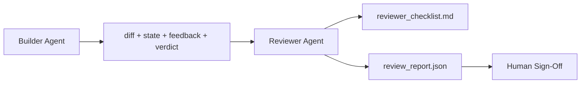

# Trình viên đánh giá: Builder tách biệt với Marker

> Người viết mã không thể đánh giá nó. Người xem xét là một vòng lặp thứ hai với một lệnh hệ thống khác, một mục tiêu khác, và truy cập chỉ đọc vào mọi thứ mà nhà xây dựng tạo ra. Khoảng cách giữa nhà xây dựng và nhà đánh giá là nơi mà độ tin cậy lớn nhất sống.

**Type:** Build
**Languages:** Python (stdlib)
**Prerequisites:** Phase 14 · 38 (Verification Gate)
**Time:** ~55 minutes

## Mục tiêu học tập

- Hãy giải thích tại sao người đại diện không thể kiểm tra công việc của mình một cách đáng tin cậy.
- Xây dựng một vòng lặp đại lý đánh giá tiêu thụ các đồ tạo của nhà xây dựng và phát ra một báo cáo đánh giá có cấu trúc.
- Tác giả một mục đánh giá đánh giá kích thước cụ thể, không phải xung.
- Đưa người xem vào bàn làm việc để bước đánh giá của con người bắt đầu từ một đồ tạo vật thực sự.

## Vấn đề

Bạn yêu cầu đại lý sửa lỗi. Nó chỉnh sửa bốn tệp, chạy các thử nghiệm và báo cáo được thực hiện. Cổng xác minh (Phase 14 · 38) xác nhận chấp nhận đã chạy và phạm vi được giữ. Cổng nói `passed: true`Hai ngày sau, bạn thấy rằng sự sửa chữa đã giải quyết sai nửa lỗi.

Sự chấp nhận là cần thiết, không đủ. Người xem hỏi những câu hỏi mà sự chấp nhận không thể đặt ra: liệu điều này đã giải quyết được vấn đề đúng đắn không?

## Khái niệm



### Đề tài đánh giá

Năm chiều, mỗi điểm là 0-2.

| Dimension | Question |
|-----------|----------|
| Problem fit | Did the change solve the task as stated, not a nearby task? |
| Scope discipline | Were edits confined to the contract or was the contract grown deliberately? |
| Assumptions | Are all hidden assumptions written down somewhere reviewable? |
| Verification quality | Does the acceptance command actually prove the goal, or did it prove a weaker version? |
| Handoff readiness | Could the next session pick up cleanly from the current state? |

Tổng số 10 trong số đó là 7 là một thất bại mềm; 5 là một thất bại khó khăn.

### Người đánh giá là một vai trò riêng biệt, không phải là một mô hình riêng biệt

Bạn có thể chạy trình duyệt với cùng mô hình như người xây dựng. Phân tích là sự tách biệt vai trò: prompt hệ thống khác nhau, đầu vào khác nhau, không có quyền truy cập viết cho sự khác biệt. Sự thay đổi về tư thế là sự thay đổi trong tín hiệu.

### Người xem không thể chỉnh sửa sự khác biệt

Người đánh giá đọc sự khác biệt, trạng thái, phản hồi, phán quyết. Nó viết một báo cáo. Nó không sửa chữa sự khác biệt. Nếu báo cáo nói "làm điều này", lượt xây dựng tiếp theo làm việc sửa chữa; người đánh giá trở lại đánh giá.

### Đường kiểm tra đối với cửa kiểm tra

Cổng (Phase 14 · 38) kiểm tra các thực tế xác định: liệu việc chấp nhận đã được thực hiện hay không, liệu các quy tắc đã được thông qua hay không, liệu phạm vi của việc thực hiện có tồn tại hay không.

```figure
wb-builder-marker
```

## Hãy xây dựng nó

`code/main.py`thực hiện:

- A `ReviewerInputs`Dataclass tập hợp các hiện vật mà người xem đọc.
- Một điểm số mục với một hàm trên mỗi chiều. Mỗi hàm là xác định và stub-grade cho bài học; thực hiện thực sự sẽ gọi là một LLM.
- A `review_report.json`Nhà văn với năm điểm, tổng số, và một phán quyết (`pass`- `soft_fail`- `hard_fail`().
- Hai trường hợp demo: một thay đổi sạch và một thay đổi "điều tra đúng, vấn đề sai".

Đi đi.

```
python3 code/main.py
```

Kết quả: hai báo cáo đánh giá được viết lên đĩa và một bảng bảng điểm chiều của máy điều khiển.

## Các mô hình sản xuất trong tự nhiên

Các biên nhận: Hệ thống đánh giá mã AI tháng 4 năm 2026 của Cloudflare đã chạy 131.246 lần đánh giá trên 48.095 yêu cầu hợp nhất trong 5.169 repos trong 30 ngày. Phân tích trung bình hoàn thành trong 3 phút 39 giây. Có tới bảy nhà đánh giá chuyên gia (tự an toàn, hiệu suất, chất lượng mã, tài liệu, quản lý phát hành, tuân thủ, Bộ luật Kỹ thuật) chạy song song với một Giám đốc điều hành đánh giá đã phân tích các phát hiện và đánh giá mức độ nghiêm trọng. Mô hình cấp cao dành riêng cho người điều phối; các chuyên gia chạy trên các cấp giá rẻ hơn.

Bốn mô hình làm cho việc này hoạt động trên quy mô.

**Specialist pool, not one big reviewer.**Một nhà phê bình với một rubric 5 chiều làm việc cho repos riêng. Một khi cơ sở mã có bề mặt bảo mật quan trọng, hiệu suất quan trọng và tài liệu, chia thành các chuyên gia với các lời nhắc nhỏ hơn.

**Bias mitigation as design requirement, not optimization.**Các thẩm phán LLM cho thấy bốn thiên vị đáng tin cậy (Adnan Masood, tháng 4 năm 2026): thiên vị vị trí (GPT-4 ~ 40% không phù hợp với (A,B) vs (B,A) đặt hàng), thiên vị từ ngữ (~ 15% điểm lạm phát hướng tới các kết quả dài hơn), sự thích tự (các thẩm phán thích các kết quả từ cùng một gia đình mô hình), thẩm quyền (các thẩm phán tham chiếu tỷ lệ quá cao đến các tác giả nổi tiếng). Giảm thiểu: đánh giá cả hai thứ tự và chỉ đếm số chiến thắng nhất quán; sử dụng thang 1-4 để giải thưởng rõ ràng sự ngắn gọn; xoay các thẩm phán trên các gia đình mẫu; xóa tên tác giả trước khi ghi điểm.

**Calibration set, not vibes.**Một tập hợp lịch sử 10-20 nhiệm vụ với các phán quyết chính xác được biết đến. Đưa người xem qua nó trên mỗi thay đổi nhanh chóng. Nếu sự đồng thuận với hồ sơ lịch sử giảm xuống dưới 80%, rubric cần sửa đổi trước khi các tàu đánh giá. Đây là những gì mỗi nhóm cuối cùng khám phá lại; tốt hơn để bắt đầu với nó.

**Hybrid norm with the gate.**Cổng xác minh (Phase 14 · 38) xử lý kiểm tra xác định (có chấp nhận chạy, thử nghiệm qua, có phạm vi giữ). Thẩm phán xử lý kiểm tra ngữ nghĩa (nếu đây là công việc đúng, giả định được ghi chép, là giao dịch có thể sử dụng). Chỉ dẫn 2026 của Anthropic rõ ràng về sự chia rẽ này: đừng yêu cầu người xem làm lại những gì cổng đã chứng minh.

## Sử dụng nó

Các mô hình sản xuất:

- **Claude Code subagents.**Một người kiểm tra viên chạy sau khi nhà xây dựng đóng một nhiệm vụ. Nó đăng một bình luận về PR với điểm số rubric.
- **OpenAI Agents SDK handoffs.**Người xây dựng giao cho người đánh giá khi hoàn thành nhiệm vụ. Người đánh giá có thể trả lại với một danh sách các phát hiện hoặc đến một con người.
- **Two-model pairing.**Builder chạy trên một mô hình rẻ hơn nhanh hơn. Người đánh giá chạy trên một mô hình mạnh hơn với bối cảnh nhỏ hơn, tập trung vào phán xét.

Người đánh giá là đôi mắt thứ hai bàn làm việc phát triển khi con người không thể tự làm mỗi đánh giá.

## Chuyển nó

`outputs/skill-reviewer-agent.md`tạo ra một mục đánh giá cụ thể cho dự án, một bộ phận kiểm tra viên được kết nối với các vật liệu của nhà xây dựng, và tích hợp với cổng xác minh để đánh giá của con người bắt đầu từ một báo cáo bằng văn bản thay vì một trang trống.

## Các bài tập

1. Thêm một chiều thứ sáu cụ thể cho lĩnh vực sản phẩm của bạn.
2. Hãy chạy trình duyệt với hai hệ thống khác nhau (terse, verbose).
3. Thêm một `confidence`trường mỗi chiều. từ chối gửi báo cáo khi sự tin tưởng trong chiều thấp nhất là dưới 0,6.
4. Xây dựng một bộ hiệu chuẩn: 10 kết thúc nhiệm vụ lịch sử với những phán quyết chính xác được biết.
5. Thêm một "hiện xin thêm bằng chứng" ưu đãi: người xem có thể yêu cầu người xây dựng cho một thử nghiệm cụ thể chạy trước khi ghi điểm.

## Các điều khoản chính

| Term | What people say | What it actually means |
|------|----------------|------------------------|
| Reviewer rubric | "Checklist" | Five-dimension 0-2 scoring with a written question per dimension |
| Soft fail | "Needs revisions" | Total below 7; builder gets findings to address |
| Hard fail | "Reject" | Total below 5 or any dimension at 0; halt and surface to human |
| Role separation | "Different prompt" | Same model can be both roles; the discipline is inputs and posture |
| Confidence floor | "Don't ship low-signal reports" | Refuse to emit a verdict when the rubric is uncertain |

## Đọc thêm

- [OpenAI Agents SDK handoffs](https://openai.github.io/openai-agents-python/handoffs/)
- [Anthropic Claude Code subagents](https://code.claude.com/docs/en/sub-agents)
- [Cloudflare, Orchestrating AI Code Review at Scale](https://blog.cloudflare.com/ai-code-review/) 7 chuyên gia + kiến trúc điều phối viên, 131k chạy / 30 ngày
- [Agent-as-a-Judge: Evaluating Agents with Agents (OpenReview / ICLR)](https://openreview.net/forum?id=DeVm3YUnpj) Định nghĩa chuẩn của DevAI, 366 yêu cầu giải pháp hàng đầu
- [Adnan Masood, Rubric-Based Evaluations and LLM-as-a-Judge: Methodologies, Biases, Empirical Validation](https://medium.com/@adnanmasood/rubric-based-evals-llm-as-a-judge-methodologies-and-empirical-validation-in-domain-context-71936b989e80) 4 phương hướng và giảm thiểu
- [MLflow, LLM-as-a-Judge Evaluation](https://mlflow.org/llm-as-a-judge) Công cụ sản xuất cho người xây dựng/học giả tách biệt
- [LangChain, How to Calibrate LLM-as-a-Judge with Human Corrections](https://www.langchain.com/articles/llm-as-a-judge) Luôn hoạt động được thiết lập bằng hiệu chuẩn
- [Evidently AI, LLM-as-a-judge: a complete guide](https://www.evidentlyai.com/llm-guide/llm-as-a-judge)
- [Arize, LLM as a Judge — Primer and Pre-Built Evaluators](https://arize.com/llm-as-a-judge/)
- Giai đoạn 14 · 05  Tự tinh chỉnh và CRITIC (tỷ nguyên cơ bản tự kiểm tra đơn tác nhân)
- Giai đoạn 14 · 30  Phát triển chất vận hành bằng Eval (generator bộ chuẩn hóa)
- Giai đoạn 14 · 38  cổng xác minh người xem đọc
- Giai đoạn 14 · 40  gói chuyển giao báo cáo của nhà phê duyệt cung cấp
