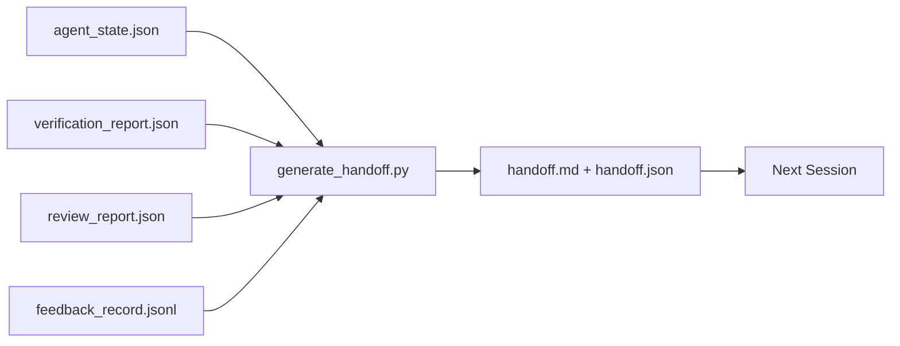

# Việc giao tiếp nhiều phiên

> Việc làm không phải là việc làm, gói giao là một tác phẩm tạo ra "nhà nhân làm việc trong một giờ" thành "phát tiếp sẽ có hiệu quả ngay trong phút đầu tiên".

**Type:** Build
**Languages:** Python (stdlib)
**Prerequisites:** Phase 14 · 34 (Repo Memory), Phase 14 · 38 (Verification), Phase 14 · 39 (Reviewer)
**Time:** ~50 minutes

## Mục tiêu học tập

- Định danh bảy trường mà mỗi gói giao hàng cần.
- Tạo ra một giao tiếp từ các đồ tạo tác bàn làm việc mà không cần viết bằng tay.
- Tr trim log phản hồi lớn vào một bản tóm tắt quy mô bàn tay.
- Làm cho hành động đầu tiên của phiên tiếp theo là quyết định.

## Vấn đề

Trình diễn kết thúc. Trình diễn nói "Tốt lắm, chúng tôi đã tiến bộ". Trình diễn tiếp theo mở ra. Trình diễn tiếp theo hỏi "Chúng tôi đã dừng ở đâu?" Trình diễn đầu tiên không còn. Trình diễn tiếp theo phát hiện lại, chạy lại các lệnh tương tự, hỏi lại người con người những câu hỏi tương tự, và đốt cháy ba mươi phút để lấy lại ba mươi giây cuối cùng của phiên diễn ra trước đó.

Chi phí của một giao dịch không tốt được trả cho mỗi phiên trong suốt cuộc đời của nhiệm vụ.

## Khái niệm



### 7 cánh đồng mỗi giao hàng mang theo

| Field | Question it answers |
|-------|---------------------|
| `summary` | One paragraph of what was done |
| `changed_files` | The diff at a glance |
| `commands_run` | What was actually executed |
| `failed_attempts` | What was tried and why it did not work |
| `open_risks` | What could bite next session, with severity |
| `next_action` | The first concrete step next session takes |
| `verdict_pointer` | Path to the verification + review reports |

- `next_action`Một giao hàng với mọi thứ ngoại trừ`next_action`là một báo cáo tình trạng, không phải là một giao hàng.

### Những lời chuyển giao được tạo ra, không phải được viết ra

Một giao dịch viết tay là một giao dịch được bỏ qua vào một ngày khó khăn. Máy phát điện đọc các tác phẩm của bàn làm việc và phát hành gói. Công việc của đại lý là để bàn làm việc trong trạng thái mà máy phát điện có thể tóm tắt, chứ không phải viết tóm tắt.

### Hai hình thức: có thể đọc được bởi con người và có thể đọc được bởi máy

`handoff.md`là những gì con người đọc.`handoff.json`là thứ mà đại lý tiếp theo tải. cả hai đều đến từ cùng một nguồn tạo vật. Nếu chúng khác nhau, JSON thắng.

### Trình cắt hồ sơ phản hồi

- Đúng rồi.`feedback_record.jsonl`Các bài đăng được chuyển chỉ với K cuối cùng cộng với mỗi bài đăng với một lối ra không bằng 0.

### Để lại một trạng thái sạch sẽ

Một giao dịch mô tả công việc. Một trạng thái sạch sẽ làm cho công việc có thể tiếp tục.`handoff.md`là vô giá nếu phiên tiếp theo mở ra với một phân biệt được áp dụng nửa, một tệp tạm thời mà đại lý đã quên, một nhánh lạc, và kiểm tra sai lầm đó trước khi họ thậm chí chạy.

Vì vậy, phiên không kết thúc khi tính năng hoạt động. Nó kết thúc khi bàn làm việc ở trạng thái mà máy phát điện có thể tóm tắt và phiên tiếp theo có thể tin tưởng. Việc dọn dẹp là giai đoạn của riêng nó, chạy trước khi giao hàng, và nó là một kiểm tra, không phải là một thói quen, bởi vì một thói quen là điều mà bạn bỏ qua vào một ngày khó khăn.

| Check | Clean means | Dirty blocks because |
|-------|-------------|----------------------|
| Working tree | Every change committed or explicitly stashed with a note | A half-applied diff looks like intentional work to the next agent |
| Temp artifacts | No `*.tmp`, scratch dirs, debug prints, or commented-out blocks left behind | Stray files pollute the diff and the next agent's mental model |
| Tests | Green, or red with the failure named in `open_risks` | A silent red test is a trap the next session steps in |
| Feature board | `feature_list.json` status reflects reality (Phase 14 · 36) | A stale board sends the next session to work that is already done |
| Branch | On the expected branch, no detached HEAD, no orphan branches | Wrong branch means the next session's first commit lands in the wrong place |

Giai đoạn thanh lọc phát ra một `clean_state.json`Một danh sách trống là điều kiện tiên quyết mà máy phát hành giao dịch khẳng định trước khi nó viết một gói. Một giao dịch được xây dựng trên một cây bẩn không phải là giao dịch, nó là một lộn xộn. Hai vật liệu cặp: làm sạch chứng minh bàn làm việc an toàn để rời đi, giao dịch chứng minh phiên tiếp theo biết bắt đầu từ đâu.

```figure
wb-handoff-packet
```

## Hãy xây dựng nó

`code/main.py`thực hiện:

- Một bộ tải tập hợp trạng thái, phán quyết, đánh giá và phản hồi thành một đơn `WorkbenchSnapshot`- Tôi không biết.
- A `generate_handoff(snapshot) -> (markdown, payload)`chức năng.
- Một bộ lọc chọn các mục phản hồi K cuối cùng cộng với tất cả các lối ra không bằng 0.
- Một bản demo chạy viết`handoff.md`và `handoff.json`bên cạnh kịch bản.

Đi đi.

```
python3 code/main.py
```

Khả năng phát ra: một bộ phận in, cộng với cả hai tập tin trên đĩa.

## Các mô hình sản xuất trong tự nhiên

Codex CLI, Claude Code và OpenCode mỗi tàu một câu chuyện nén khác nhau; gói giao dịch có cấu trúc nằm trên trên cả ba.

**Compaction strategies vary; the packet schema does not.**POST /v1/responses/compact của Codex CLI là một điểm AES không rõ ràng bên máy chủ (cách nhanh cho mô hình OpenAI); đoạn trượt là một "chương trình tổng kết" địa phương được thêm vào như một `_summary`Claude Code chạy 5 giai đoạn thu nhỏ dần ở 95% ngữ cảnh. OpenCode làm ẩn tin nhắn dựa trên dấu thời gian cộng với 5 tiêu đề LLM tóm tắt. Ba cơ chế khác nhau, cùng một nhu cầu: serialize những gì tồn tại trong compression thành một đồ tạo di động. gói là đồ tạo đó.

**Fresh-session handoff is not compaction.**Sự hòa nhã kéo dài một buổi; trao tay đóng một buổi một cách sạch sẽ và bắt đầu buổi tiếp theo. Các khung Hermes Issue #20372 (ngày tháng 4 năm 2026) là đúng: khi nén trong chỗ bắt đầu suy giảm, đại lý nên viết một giao dịch nhỏ gọn, kết thúc phiên, và tiếp tục trong bối cảnh mới. Đó là gói mà làm cho quá trình chuyển đổi đó rẻ. Sai lầm là tiếp tục nén cho đến khi chất lượng sụp đổ; sự cố là ngân sách cho một sớm, sạch sẽ giao hàng.

**One active handoff per branch and topic.**Sự phối hợp đa đại lý bị phá vỡ trên giao hàng cũ hơn trên sản xuất mô hình xấu.`branch`- `last_known_good_commit`, và một `status`của `active | superseded | archived`Các giao dịch không được lưu trữ; chỉ có một hoạt động điều khiển phiên tiếp theo. Đây là sự khác biệt giữa giao dịch như ghi chú và giao dịch như trạng thái.

**Wrap up before 50-75% context, not at the wall.**Các bản ghi mẫu viết tay (CLAUDE.md + HANDOVER.md) báo cáo kết quả tốt nhất khi phiên kết thúc với ngân sách ngữ cảnh 50-75% thay vì 95%. Bộ sản xuất gói chạy sạch trước khi các vật liệu nén làm ô nhiễm trạng thái nguồn.

## Sử dụng nó

Các mô hình sản xuất:

- **Session-end hook.**Thời gian chạy kích hoạt máy phát điện khi người dùng đóng cửa trò chuyện.`outputs/handoff/<session_id>/`- Tôi không biết.
- **PR template.**Đánh giá của máy phát điện cũng là một cơ quan PR.
- **Cross-agent handoff.**Xây dựng với một sản phẩm (Claude Code), tiếp tục với một sản phẩm khác (Codex).

Các gói nhỏ, thường xuyên, và rẻ để sản xuất.

## Chuyển nó

`outputs/skill-handoff-generator.md`tạo ra một máy phát điện được điều chỉnh cho các con đường của một dự án, một cái móng cuối phiên điều hành nó, và một `handoff.json`Schema của đại lý tiếp theo đọc khi khởi động.

## Các bài tập

1. Thêm một `assumptions_to_validate`trường mà xuất hiện trên mọi giả định người xây dựng đã đăng nhập nhưng người xem xét không ghi điểm trên 1.
2. Tr trim summary phản hồi khác nhau cho chạy thất bại so với những lần đi qua. Bảo vệ sự bất đối xứng.
3. Bao gồm một danh sách "các câu hỏi cho con người".
4. Làm cho máy phát điện không có năng lực: chạy nó hai lần tạo ra cùng một gói.
5. Thêm một phần "Cấp dẫn phiên tiếp theo" liệt kê chính xác các đồ tạo nên phiên tiếp theo phải tải trước khi hành động.

## Các điều khoản chính

| Term | What people say | What it actually means |
|------|----------------|------------------------|
| Handoff packet | "Session summary" | Generated artifact carrying the seven fields, both markdown and JSON |
| Next action | "What to do first" | The one concrete step that starts the next session |
| Feedback trim | "Log summary" | Last K records plus every non-zero exit |
| Status report | "What we did" | A document missing `next_action`; useful, but not a handoff |
| Verdict pointer | "Receipt" | Path to the verification + review reports for traceability |

## Đọc thêm

- [Anthropic, Effective harnesses for long-running agents](https://www.anthropic.com/engineering/effective-harnesses-for-long-running-agents)
- [OpenAI Agents SDK handoffs](https://openai.github.io/openai-agents-python/handoffs/)
- [Codex Blog, Codex CLI Context Compaction: Architecture, Configuration, Managing Long Sessions](https://codex.danielvaughan.com/2026/03/31/codex-cli-context-compaction-architecture/) POST /v1/câu trả lời/công bằng và sự lùi địa phương
- [Justin3go, Shedding Heavy Memories: Context Compaction in Codex, Claude Code, OpenCode](https://justin3go.com/en/posts/2026/04/09-context-compaction-in-codex-claude-code-and-opencode) So sánh độ nén ba nhà cung cấp
- [JD Hodges, Claude Handoff Prompt: How to Keep Context Across Sessions (2026)](https://www.jdhodges.com/blog/ai-session-handoffs-keep-context-across-conversations/) CLAUDE.md + HANDOVER.md, ngân sách trong bối cảnh 50-75%
- [Mervin Praison, Managing Handoffs in Multi-Agent Coding Sessions: Fresh Context Without Losing Continuity](https://mer.vin/2026/04/managing-handoffs-in-multi-agent-coding-sessions-fresh-context-without-losing-continuity/) Phong khung hệ thống phân tán
- [Hermes Issue #20372 — automatic fresh-session handoff when compression becomes risky](https://github.com/NousResearch/hermes-agent/issues/20372)
- [Hermes Issue #499 — Context Compaction Quality Overhaul](https://github.com/NousResearch/hermes-agent/issues/499) Các lệnh chuyển giao hướng trong Codex CLI
- [Microsoft Agent Framework, Compaction](https://learn.microsoft.com/en-us/agent-framework/agents/conversations/compaction)
- [OpenCode, Context Management and Compaction](https://deepwiki.com/sst/opencode/2.4-context-management-and-compaction)
- [LangChain, Context Engineering for Agents](https://www.langchain.com/blog/context-engineering-for-agents)
- Giai đoạn 14 · 34  tập tin trạng thái máy phát điện đọc
- Giai đoạn 14 · 38  phán quyết xác minh các gói điểm tại
- Giai đoạn 14 · 39  báo cáo của nhà phê bình được kết hợp vào gói
