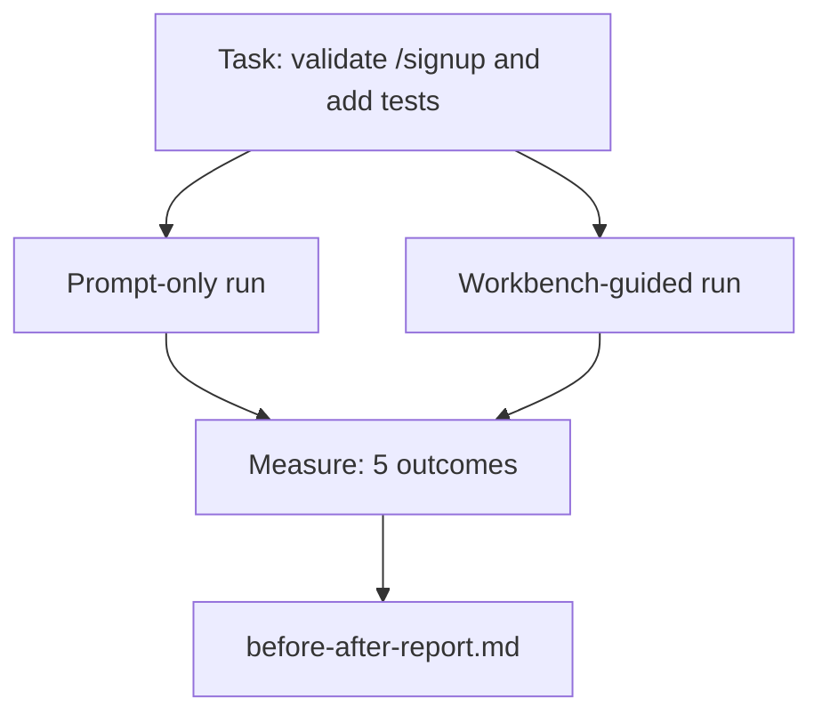

# Bàn làm việc trên một chiếc xe đại diện thực sự

> Một mươi một bài học về bề mặt không có giá trị gì nếu chúng không tồn tại tiếp xúc với một cơ sở mã thực sự. Bài học này thực hiện nhiệm vụ tương tự hai lần trên một ứng dụng mẫu nhỏ: chỉ đơn giản so với hướng dẫn bàn làm việc. Số lượng làm cho lập luận.

**Type:** Build
**Languages:** Python (stdlib)
**Prerequisites:** Phases 14 · 32 to 14 · 40
**Time:** ~60 minutes

## Mục tiêu học tập

- Kết hợp bảy bề mặt bàn làm việc trên một ứng dụng nhỏ.
- Thực hiện cùng một nhiệm vụ hai lần (chỉ đơn giản và hướng dẫn trên bàn làm việc) và đo lường năm kết quả.
- Đọc báo cáo trước/sau và quyết định bề mặt nào tạo ra đòn bẩy lớn nhất.
- Bảo vệ bàn làm việc chống lại một "nhưng mô hình của tôi là đủ tốt" đẩy.

## Vấn đề

Một bài demo về một nhiệm vụ đồ chơi không thuyết phục ai. Vấn đề cho bàn làm việc được thực hiện khi một nhiệm vụ thực sự cảm thấy trên một repo thực sự cảm thấy rơi vào sản xuất với ít thất bại, ít đảo ngược, và một gói mà phiên tiếp theo có thể sử dụng.

Bài học này đưa ra những cảm giác thực sự repo và chạy cùng một nhiệm vụ thông qua cả hai đường ống dẫn. Kết quả là một báo cáo trước / sau bạn có thể trao cho một nghi ngờ.

## Khái niệm



### Ứng dụng mẫu

Một bộ xử lý kiểu FastAPI tối thiểu trong `sample_app/`- Có thể là:

- `app.py`với `/signup`(vẫn chưa được xác nhận).
- `test_app.py`với một bài kiểm tra đường hạnh phúc.
- `README.md`và `scripts/release.sh`như mồi trong khu vực cấm.

### Nhiệm vụ

> Thêm xác thực đầu vào vào `/signup`: từ chối mật khẩu ngắn hơn 8 ký tự, trả lại 422 với một bìa lỗi nhập. Thêm một bài kiểm tra chứng minh hành vi mới.

### Hai đường ống dẫn

Chỉ cần:

1. Đọc sách README.
2. Đọc `app.py`- Tôi không biết.
3. Tạo tập tin.
4. Đề nghị đã được thực hiện.

Đạo hướng dẫn trên bàn làm việc:

1. Động tác script init (Dạy 35).
2. Đọc phạm vi hợp đồng (Dạy 36).
3. Đọc trạng thái (Dạy 34).
4. Chỉ sửa các tệp được phép.
5. Thực hiện lệnh chấp nhận thông qua feedback runner (Dạy 37).
6. Động cơ kiểm tra (Dạy 38).
7. Thử kiểm tra (Học tập 39).
8. Tạo giao tiếp (Dạy 40).

### Năm kết quả được đo

| Outcome | Why it matters |
|---------|----------------|
| `tests_actually_run` | Most "tests passed" claims are unverifiable |
| `acceptance_met` | The test that proves the goal must be the test that ran |
| `files_outside_scope` | Scope creep is the dominant silent failure |
| `handoff_quality` | The next session pays for or benefits from this |
| `reviewer_total` | Qualitative judgment on top of the gate |

```figure
wb-ab-runs
```

## Hãy xây dựng nó

`code/main.py`Phân phối hai đường ống chống lại cùng một thiết bị ứng dụng mẫu. Cả hai đường ống đều được viết kịch bản (không có LLM trong vòng lặp) vì vậy phép đo có thể tái tạo.`before-after-report.md`và `comparison.json`- Tôi không biết.

Đi đi.

```
python3 code/main.py
```

Kết quả: một bảng kết quả của máy tính bảng cho mỗi đường ống, báo cáo dấu chấm lưu bên cạnh kịch bản, và JSON cho bất cứ ai muốn biểu đồ nó.

## Các mô hình sản xuất trong tự nhiên

Câu hỏi của người hoài nghi là "bên làm việc thực sự giúp ích bao nhiêu?" Số 2026 nói nhiều hơn là lời giải thích.

**Terminal Bench Top-30 to Top-5 on the same model.**LangChain * Anatomy of an Agent Harness * ( Tháng 4 năm 2026): một nhân viên lập trình nhảy từ bên ngoài 30 hạng hàng đầu để xếp hạng năm trên Terminal Bench 2.0 bằng cách thay đổi chỉ các dây chuyền.

**Vercel 80% to 100% by deleting tools.**Vercel báo cáo xóa 80% công cụ của đại lý của mình đã di chuyển tỷ lệ thành công từ 80% lên 100%. bề mặt công cụ nhỏ hơn, phạm vi sắc nét hơn, ít cách để thất bại. Không gian tiêu cực thắng.

**Harvey 2x accuracy via harness alone.**Các đại lý pháp lý đã tăng độ chính xác hơn gấp đôi thông qua tối ưu hóa vòng xoay, không thay đổi mô hình.

**88% of enterprise AI agent projects fail to reach production.**Bài báo preprints.org *Harness Engineering for Language Agents* (Tháng 3 năm 2026) theo dõi các thất bại đến thời gian chạy, không phải lý luận: trạng thái cũ, thử nghiệm lại mỏng manh, bối cảnh quá lớn, phục hồi kém từ những lỗi trung gian.

**Long-context collapse.**WebAgent cơ sở 40-50% thành công giảm xuống dưới 10% trong điều kiện ngữ cảnh dài, chủ yếu từ vòng lặp vô hạn và mất mục tiêu. Ralph Loop và gói giao hàng tồn tại để hấp thụ điều đó.

**False negatives still exist.**Các nhiệm vụ thực tế từng bước, các dòng đơn, các trình chạy định dạng, bất cứ thứ gì mô hình đã ghi nhớ theo nghĩa đen  những nhiệm vụ này chạy nhanh hơn chỉ theo thời gian.

Những mô hình thực sự hấp thụ các thủ thuật sử dụng vòng xoáy theo thời gian.

## Sử dụng nó

Bài học này là hồ sơ vụ án mà bạn trích dẫn khi:

- Có ai đó hỏi tại sao mọi công việc liên lạc đều mang theo một cái tên`agent-rules.md`và một hợp đồng phạm vi.
- Một đội muốn thả cổng xác minh "chỉ cho cuộc chạy đua này".
- Một sản phẩm đại lý mới được ra mắt và bạn cần một điểm chuẩn di động để xem nó có thực sự tiết kiệm thời gian hay không.

Số liệu đi xa hơn lời giải thích.

## Chuyển nó

`outputs/skill-workbench-benchmark.md`là một thiết bị đánh giá di động chạy bất kỳ sản phẩm đại lý nào qua cả hai đường ống với ứng dụng mẫu của dự án và báo cáo năm kết quả.

## Các bài tập

1. Thêm một kết quả thứ sáu: thời gian đến lần đầu tiên - chỉnh sửa có ý nghĩa. Làm thế nào để đo nó sạch sẽ?
2. Hãy so sánh một nhiệm vụ thực sự trong ngày thứ hai trong cơ sở mã của bạn.
3. Thêm một "được âm" thông qua: các nhiệm vụ mà chỉ đơn giản chỉ có thể nhanh hơn và chi phí trên bàn làm việc là chi phí thực sự.
4. Thay thế "chỉ tác" bằng một cuộc gọi LLM thực sự.
5. Nhà văn một bản tóm tắt một trang nhằm vào một người không phải kỹ sư.

## Các điều khoản chính

| Term | What people say | What it actually means |
|------|----------------|------------------------|
| Sample app | "Toy repo" | Small but realistic enough to exercise all seven surfaces |
| Pipeline | "Workflow" | Ordered sequence of surface reads/writes the agent follows |
| Before/after report | "The receipts" | The artifact you hand to a skeptic |
| False negative | "Workbench overkill" | Tasks where prompt-only is faster; useful to enumerate honestly |
| Workbench benchmark | "Reliability score" | Portable harness that runs the comparison on your codebase |

## Đọc thêm

- [LangChain, The Anatomy of an Agent Harness](https://blog.langchain.com/the-anatomy-of-an-agent-harness/) Quý phiếu từ Terminal Bench Top-30 đến Top-5
- [MongoDB, The Agent Harness: Why the LLM Is the Smallest Part of Your Agent System](https://www.mongodb.com/company/blog/technical/agent-harness-why-llm-is-smallest-part-of-your-agent-system) Số Vercel + Harvey
- [preprints.org, Harness Engineering for Language Agents](https://www.preprints.org/manuscript/202603.1756) 88% tỷ lệ thất bại doanh nghiệp, nguyên nhân gốc rễ thời gian chạy
- [HN: Improving 15 LLMs at Coding in One Afternoon. Only the Harness Changed](https://news.ycombinator.com/item?id=46988596) Tái tạo trên 15 mô hình
- [Cloudflare, Orchestrating AI Code Review at Scale](https://blog.cloudflare.com/ai-code-review/) 131k lần xem xét / 30 ngày trong sản xuất
- [Anthropic, Building Effective Agents](https://www.anthropic.com/research/building-effective-agents)
- Các giai đoạn 14 · 32 đến 14 · 40  các bề mặt bài học này tập hết cuối đến cuối
- Giai đoạn 14 · 19  SWE-bench, GAIA, AgentBench như các điểm tham khảo macro bài học này bổ sung
- Giai đoạn 14 · 30  phát triển chất liệu dựa trên đánh giá cùng một cắm dây đeo vào
