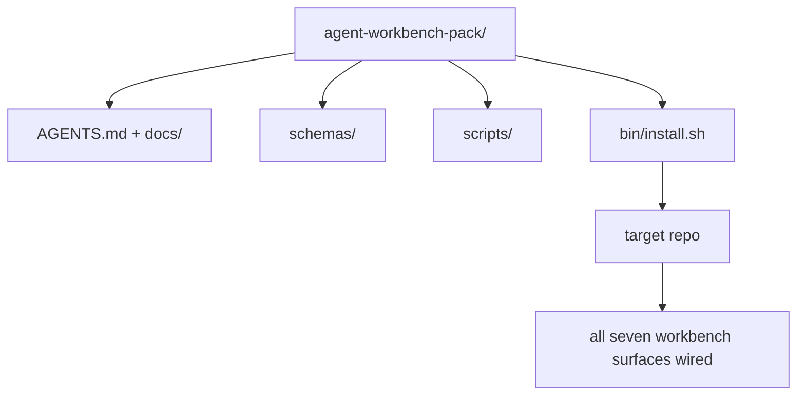

# Capstone: Chuyển một gói công việc đại lý tái sử dụng

> Bộ phim kết thúc với một gói bạn bỏ vào bất kỳ repo. 11 bài học của bề mặt nén vào một thư mục bạn có thể`cp -r`Và có một đại lý làm việc đáng tin cậy vào sáng hôm sau.

**Type:** Build
**Languages:** Python (stdlib)
**Prerequisites:** Phases 14 · 31 to 14 · 41
**Time:** ~75 minutes

## Mục tiêu học tập

- Bao gồm bảy bề mặt bàn làm việc vào một thư mục drop-in.
- Đặt các sơ đồ, kịch bản và mẫu để một repo mới có được một đường cơ sở được biết đến.
- Thêm một kịch bản cài đặt duy nhất để đặt gói idempotently.
- Hãy quyết định những gì ở trong hàng và những gì ở ngoài, bảo vệ vết cắt cho mỗi người.

## Vấn đề

Một bàn làm việc sống trong một Google Doc, lịch sử trò chuyện, và ba kịch bản không nhớ được là một bàn làm việc được xây dựng lại mỗi quý.

Bạn sẽ kết thúc bài học này với `outputs/agent-workbench-pack/`được gửi trên đĩa và một `bin/install.sh`mà đưa nó vào bất kỳ repo mục tiêu nào.

## Khái niệm



### Layout gói

```
outputs/agent-workbench-pack/
├── AGENTS.md
├── docs/
│   ├── agent-rules.md
│   ├── reliability-policy.md
│   ├── handoff-protocol.md
│   └── reviewer-rubric.md
├── schemas/
│   ├── agent_state.schema.json
│   ├── task_board.schema.json
│   └── scope_contract.schema.json
├── scripts/
│   ├── init_agent.py
│   ├── run_with_feedback.py
│   ├── verify_agent.py
│   └── generate_handoff.py
├── bin/
│   └── install.sh
└── README.md
```

### Những gì ở trong, những gì ở ngoài

Trong:

- Các sơ đồ bề mặt, đó là hợp đồng.
- Bốn kịch bản trên là thời gian chạy.
- Bốn tài liệu đó là quy tắc và quy tắc.

Ra ngoài:

- Các nhiệm vụ cụ thể cho dự án, nhiệm vụ thuộc về bảng repo mục tiêu, không phải trong gói.
- Các nhà cung cấp SDK gọi.
- Nhóm sống bên cạnh nhòm nhòm của đội, không phải bên trong nó.

### Bộ cài đặt

Một đoạn ngắn `bin/install.sh`(hoặc `bin/install.py`):

1. Nhận không cài đặt trên một gói hiện có mà không cần `--force`- Tôi không biết.
2. Tác lại gói hàng vào repo mục tiêu.
3. Cáp lên CI nếu `.github/workflows/`tồn tại.
4. Bác in các bước tiếp theo: điền vào bảng, đặt lệnh chấp nhận, chạy kịch bản init.

### Phiên bản

Chuỗi này mang theo một `VERSION`file. schema bumps và thay đổi kịch bản đòi hỏi di chuyển bump chính. Doc-chỉ thay đổi bump váy. mục tiêu repo `agent_state.json`ghi lại phiên bản gói nào nó được khởi tạo chống lại.

```figure
wb-pack-install
```

## Hãy xây dựng nó

`code/main.py`lắp ráp gói thành `outputs/agent-workbench-pack/`bên cạnh bài học, được gieo trồng với các sơ đồ và kịch bản từ các bài học trước trong mini-track này và các tài liệu mà bạn đã viết.

Đi đi.

```
python3 code/main.py
```

Các kịch bản sao chép và pin các bề mặt, viết README, in cây gói, và thoát khỏi không.

## Các mô hình sản xuất trong tự nhiên

Một gói chỉ có giá trị nếu nó tồn tại trong những chiếc cành, những chiếc xe mới và một dòng nước không thân thiện.

**`VERSION` is the contract, not the marketing.**Những đốm lớn cần phải di chuyển trạng thái, những đốm nhỏ cần phải chạy lại kiểm tra, những đốm vá chỉ có tài liệu.`.workbench-version`vào repo mục tiêu trên mỗi lần cài đặt; `lint_pack.py`từ chối vận chuyển nếu khóa của mục tiêu không đồng ý với gói `VERSION`Đây là cách mà`npm`- `Cargo`, và`pyproject.toml`sống sót 10 năm trong churn; không có gì về các đại lý thay đổi các quy tắc.

**Single source for cross-tool distribution.**Nx tàu một `nx ai-setup`Điều đó đặt ra `AGENTS.md`- `CLAUDE.md`- `.cursor/rules/`- `.github/copilot-instructions.md`, và một máy chủ MCP từ một cấu hình duy nhất.`ln -s AGENTS.md CLAUDE.md`(vì vậy, một nguồn duy nhất của sự thật là một nguồn thông tin cho mỗi nhân viên lập trình.

**`uninstall.sh` that refuses on non-trivial state.**Tháo gỡ gói không được xóa `agent_state.json`- `task_board.json`, hoặc`outputs/`. Uninstaller loại bỏ các sơ đồ, kịch bản, tài liệu, và `AGENTS.md`(với `--keep-agents-md`(opt-out) và từ chối tiến hành nếu các tệp nhà nước có bất kỳ thay đổi không cam kết nào. Nhà nước thuộc về người dùng; gói không sở hữu nó.

**Skill-as-publishable. SkillKit-style distribution.**Các gói tàu như một kỹ năng SkillKit: `skillkit install agent-workbench-pack`Sản phẩm này được tạo ra bởi các nhà cung cấp AI, và nó được tạo ra bởi các nhà cung cấp AI.

## Sử dụng nó

Ba chỗ tàu đóng gói:

- **As a directory you drop into a repo.** `cp -r outputs/agent-workbench-pack /path/to/repo`- Tôi không biết.
- **As a public template repo.**Cánh và tùy chỉnh, với `VERSION`điều khiển drift.
- **As a SkillKit skill.**Được kết nối với sản phẩm của đại lý của bạn để chỉ một lệnh đặt nó xuống.

Bác là công thức, mỗi lần cài đặt là một phần.

## Chuyển nó

`outputs/skill-workbench-pack.md`tạo ra một gói phù hợp với dự án: các quy tắc được sắc nét theo lịch sử của nhóm, phạm vi của các cầu phù hợp với repo, kích thước rubric được mở rộng bằng một mục cụ thể về lĩnh vực.

## Các bài tập

1. Hãy quyết định loại tài liệu thứ năm nào xứng đáng được thăng chức vào nhóm giáo phái.
2. Tái viết cài đặt thành Python với một `--dry-run`So sánh công nghệ với Bash.
3. Thêm một `bin/uninstall.sh`Điều gì được coi là không tầm thường?
4. Thêm một `lint_pack.py``VERSION`Đưa nó vào CI để lấy lại cho nhóm.
5. Tác giả của sổ chạy di chuyển từ một bàn làm việc quét tay đến gói này.

## Các điều khoản chính

| Term | What people say | What it actually means |
|------|----------------|------------------------|
| Workbench pack | "The starter kit" | A versioned directory carrying all seven surfaces |
| Installer | "Setup script" | `bin/install.sh` that lays the pack down idempotently |
| Pack version | "VERSION" | Major bumps for schema/script changes, patch for doc-only |
| Drop-in pack | "cp -r and go" | Pack works without per-repo customization on day one |
| Forkable template | "GitHub template" | Public repo that GitHub's "Use this template" can clone from |

## Đọc thêm

- Các giai đoạn 14 · 31 đến 14 · 41  mỗi bề mặt gói này
- [SkillKit](https://github.com/rohitg00/skillkit) cài đặt kỹ năng này trên 32 đại lý AI
- [Nx Blog, Teach Your AI Agent How to Work in a Monorepo](https://nx.dev/blog/nx-ai-agent-skills) Máy phát điện nguồn duy nhất trên sáu công cụ
- [agents.md — the open spec](https://agents.md/) điều gì router của gói của bạn phải thực hiện
- [HKUDS/OpenHarness](https://github.com/HKUDS/OpenHarness) Thực hiện tham chiếu của một gói tương đương
- [andrewgarst/agentic_harness](https://github.com/andrewgarst/agentic_harness) Quý vị được hỗ trợ bởi Redis với bộ eval
- [Augment Code, A good AGENTS.md is a model upgrade](https://www.augmentcode.com/blog/how-to-write-good-agents-dot-md-files) gói tài liệu thanh chất lượng
- [Anthropic, Effective harnesses for long-running agents](https://www.anthropic.com/engineering/effective-harnesses-for-long-running-agents)
- [Anthropic, Harness design for long-running application development](https://www.anthropic.com/engineering/harness-design-long-running-apps)
- Giai đoạn 14 · 30  Phát triển chất liệu dựa trên đánh giá tiêu thụ cổng xác minh của gói
- Giai đoạn 14 · 41  điểm tham chiếu trước/ sau khi gói này cải thiện
