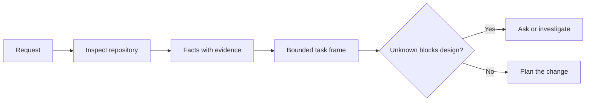

# Đặt khung nhiệm vụ trước khi người đại lý viết mã

> Một nhân viên lập trình có thể thực hiện một nhiệm vụ rõ ràng nhanh chóng. Nó cũng có thể thực hiện một nhiệm vụ không rõ ràng nhanh chóng. Tốc độ giống nhau. Chi phí không phải.

**Type:** Learn + Build
**Languages:** Python (stdlib)
**Prerequisites:** Phase 14 lessons 31 and 36
**Time:** ~60 minutes

## Mục tiêu học tập

- Chuyển đổi yêu cầu thành khung nhiệm vụ giới hạn trước khi chỉnh sửa.
- Lấy các dữ liệu lưu trữ riêng biệt từ giả định và các câu hỏi mở.
- Định nghĩa các con đường được phép, các con đường bị cấm, và bằng chứng chấp nhận.
- Hãy quyết định khi nào việc trinh sát đủ để bắt đầu công việc.

## Sự thất bại đắt tiền

Tổ thêm bảo vệ email trùng lặp nghe có vẻ cụ thể. Nó không. Sự độc đáo có thuộc về API, dịch vụ miền hoặc cơ sở dữ liệu không? So sánh có nhạy cảm với trường hợp?

Một nhân viên có khả năng sẽ lấp đầy những khoảng trống đó bằng những lựa chọn hợp lý. Đó là trường hợp nguy hiểm bởi vì việc thực hiện có thể sạch, được thử nghiệm, và vẫn không tương thích với hệ thống.

Do đó, đơn vị đầu tiên của công việc lập trình-nhà làm không phải là một chỉnh sửa.

## Khung tác vụ

Một khung hữu ích có sáu trường:

| Field | Question |
|---|---|
| Goal | What observable behavior must change? |
| Repository facts | What did you verify in code, tests, config, or history? |
| Allowed paths | Where may the change land? |
| Forbidden paths | What must remain untouched? |
| Acceptance evidence | Which commands or observations prove the goal? |
| Unknowns | Which decisions still need evidence or human judgment? |

Các dữ liệu cần biên nhận.  API sử dụng 409 cho bản sao không phải là một sự thật cho đến khi bạn có thể chỉ ra các thử nghiệm hoặc xử lý hiện có. Một con đường tệp và dòng là đủ. Kết quả lệnh tốt hơn khi hành vi quan trọng.



## Nhận thức là tìm kiếm những giới hạn

Không đọc toàn bộ kho lưu trữ. Tìm kiếm các bề mặt hạn chế thay đổi:

1. Hành vi hiện tại và người gọi nó.
2. Thử nghiệm gần nhất hiện có.
3. Hợp đồng công cộng hoặc hình dạng liên tục.
4. Các hướng dẫn dự án điều khiển con đường.
5. Các lệnh xây dựng và xác minh.
6. Những thay đổi hoàn thành tương tự cho thấy các mô hình địa phương.

Hãy dừng lại khi mọi quyết định được lên kế hoạch đều được chứng minh bằng bằng chứng, được ủy quyền rõ ràng hoặc được liệt kê như là không rõ.

## Những điều không biết không phải là thất bại

Một cái không biết là một khoảng cách được kiểm soát. Một giả định là một câu trả lời không được kiểm soát cho khoảng cách đó.

Đánh phân loại mỗi người không biết:

- **Discoverable:**bộ lưu trữ hoặc hệ thống chạy có thể trả lời.
- **Decidable:**hợp đồng nhiệm vụ cho phép đại lý lựa chọn.
- **Human:**sự lựa chọn thay đổi hành vi sản phẩm, chi phí, rủi ro hoặc tính tương thích của công chúng.
- **Deferred:**sự lựa chọn nằm ngoài đoạn này và thuộc về các mục tiêu không có mục tiêu.

Đặc vụ phải tiếp tục thông qua những điều không biết được phát hiện và ủy quyền.

## Tự chấp nhận trước khi thực hiện

Hãy viết bằng chứng trước khi đệm.

- một đơn vị tập trung hoặc chỉ huy thử nghiệm tích hợp;
- một chuyến đi trình duyệt với một cửa sổ xem có tên và trạng thái dự kiến;
- yêu cầu bằng điện thoại và hợp đồng trả lời chính xác;
- Một phép đo hiệu suất với ngưỡng;
- kiểm tra phạm vi xác nhận không có thay đổi tập tin không liên quan.

Thử nghiệm vượt qua không phải là một kế hoạch chứng minh.

## Hãy xây dựng nó

Phòng thí nghiệm tạo ra một`TaskFrame`, xác nhận ranh giới và bằng chứng của nó, và viết `outputs/task-frame.md`- Tôi không biết.

Đi từ thư mục bài học này:

```bash
python3 code/main.py
python3 -m unittest discover code/tests -v
```

Hãy phá vỡ ví dụ theo bốn cách: loại bỏ mục tiêu, loại bỏ biên nhận thực tế, chồng chéo một con đường được phép và cấm, và loại bỏ lệnh chấp nhận.

## Sử dụng nó trong kho chứa thực sự

Trước khi yêu cầu một đại lý chỉnh sửa:

1. Viết mục tiêu như một hành vi, không phải là thay đổi tập tin.
2. Hãy ghi lại hai hoặc ba sự kiện với bằng chứng chính xác.
3. Tên gọi đường dẫn nhỏ nhất được phép.
4. Hãy đặt tên không gian âm rõ ràng.
5. Viết lệnh hoặc quan sát kết thúc nhiệm vụ.
6. Hãy liệt kê những quyết định mà bạn chưa đạt được.

Các khung nên phù hợp trên một màn hình. Nếu không thể, nhiệm vụ có thể chứa nhiều thay đổi có thể kiểm tra độc lập.

## Các bài tập

1. Chụp một lỗi thực sự từ một trong các kho lưu trữ của bạn mà không đề xuất một giải pháp.
2. Tìm một tuyên bố trong khung đó thực sự là một giả định. Thay thế nó bằng chứng.
3. Thêm một người không biết câu trả lời của người sẽ thay đổi hợp đồng công cộng.
4. Chia một con đường rộng cho phép vào bộ an toàn nhỏ nhất.
5. Thêm một biên nhận phạm vi vào bằng chứng chấp nhận.

## Đọc thêm

- [Nuseibeh and Easterbrook, Requirements Engineering: A Roadmap](https://www.cs.toronto.edu/~sme/papers/2000/ICSE2000.pdf), để gắn kết việc thực hiện với các mục tiêu trong thế giới thực và những hạn chế đang phát triển.
- [Yang et al., SWE-agent: Agent-Computer Interfaces Enable Automated Software Engineering](https://arxiv.org/abs/2405.15793), để chứng minh rằng giao diện xung quanh một chất mã hóa thay đổi hiệu quả của nó.

## Những gì bạn giữ

Cứ giữ lại`outputs/task-frame.md`Nó là đầu vào bài học tiếp theo, nơi khung trở thành một kế hoạch thực hiện được hỗ trợ bằng chứng.
