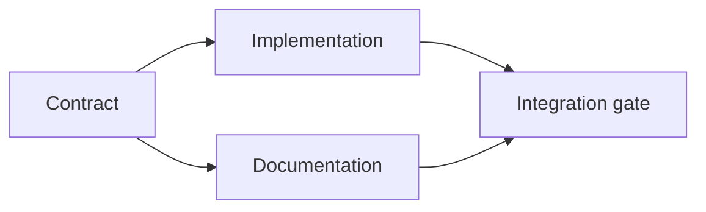

# Xây dựng kế hoạch hành quyết dựa trên bằng chứng

> Một kế hoạch không phải là một danh sách phải làm đẹp hơn. Nó là một biểu đồ phụ thuộc trong đó mỗi thay đổi có một lý do và mỗi nút cuối có bằng chứng.

**Type:** Learn + Build
**Languages:** Python (stdlib)
**Prerequisites:** Phase 14 lesson 43
**Time:** ~65 minutes

## Mục tiêu học tập

- Chuyển đổi một khung nhiệm vụ thành các mục làm việc với bằng chứng và bằng chứng.
- Mô hình sắp xếp như phụ thuộc thay vì chuỗi văn.
- Khám phá các sự kiện bị thiếu, phụ thuộc không rõ, và chu kỳ trước khi chỉnh sửa.
- Các bước riêng biệt có thể chạy cùng nhau từ các bước phải chờ.

## Tại sao kế hoạch của các đại lý thất bại

Các kế hoạch yếu sẽ lặp lại yêu cầu trong thời gian tương lai:

1. Tắc lại API.
2. Thêm thêm các xét nghiệm.
3. Cập nhật tài liệu.

Không có gì trong danh sách đó nói về những gì đã được tìm thấy, tại sao các tệp đó là chính xác, hợp đồng nào thay đổi đầu tiên, hoặc những gì có thể xảy ra cùng lúc.

Một kế hoạch mạnh mẽ đưa ra năm cam kết cho mỗi mục công việc:

| Commitment | Purpose |
|---|---|
| Identifier | Stable reference for dependencies and handoff |
| Change | The smallest behavior or contract change |
| Evidence | Repository facts that justify the change |
| Dependencies | Work that must be true first |
| Proof | The exact check that closes the item |

## Hãy lên kế hoạch hợp đồng trước khi thực hiện

Khi nhiều bề mặt phụ thuộc vào cùng một hành vi, hãy xác định hành vi trước tiên. Các thử nghiệm, thực hiện, tài liệu và tích hợp sau đó có thể chia sẻ một hợp đồng thay vì phát minh bốn phiên bản.



Hình đồ họa cho thấy sự đồng thời an toàn. Việc thực hiện và tài liệu có thể tiến hành cùng nhau sau khi hợp đồng được xác định.

## Bằng chứng thay đổi kế hoạch

Bằng chứng lưu trữ không phải là trang trí. Nó nên có khả năng thay đổi công việc:

- Một người trợ giúp hiện có loại bỏ một trừu tượng mới được lên kế hoạch.
- Một thử nghiệm tương thích buộc một bước di chuyển.
- Một hạn chế triển khai di chuyển một thay đổi sơ đồ vào một nhiệm vụ khác.
- Một loại phản ứng công cộng thay đổi thứ tự thực hiện và tài liệu.

Nếu bằng chứng không thể thay đổi kế hoạch, nó có lẽ không phải bằng chứng cho quyết định đó.

## Thiết kế cho sự gián đoạn

Các phiên lập trình-đại diện kết thúc bất ngờ. Một kế hoạch có thể tiếp tục có các mục làm việc đủ nhỏ để một phiên khác có thể xác định:

- mục nào hoàn chỉnh;
- bằng chứng nào đã chạy;
- những vật liệu nào đã thay đổi;
- các thuộc tính nào hiện đã được mở khóa;
- thứ an toàn tiếp theo là gì.

Đừng mã hóa trạng thái chỉ trong các hộp kiểm bên trong trò chuyện.

## Định hành kế hoạch

Thử án trước khi thực hiện khi:

- Một nhận dạng được sao chép;
- một mặt hàng làm việc không có bằng chứng;
- một mặt hàng làm việc không có bằng chứng;
- một sự phụ thuộc đặt tên cho một mục không rõ;
- biểu đồ chứa một chu kỳ;
- hành động không thể đảo ngược đầu tiên xảy ra trước khi sự không chắc chắn liên quan được giải quyết.

Năm kiểm tra đầu tiên là cơ khí, cuối cùng đòi hỏi sự phán xét và nên được gọi rõ ràng.

## Hãy xây dựng nó

`code/main.py`mô hình các mục làm việc, xác nhận biên nhận của chúng, tính toán sóng thực hiện với một loại topological, và viết `outputs/evidence-plan.json`- Tôi không biết.

Đi chạy:

```bash
python3 code/main.py
python3 -m unittest discover code/tests -v
```

Ví dụ tạo ra ba sóng. định nghĩa hợp đồng chạy trước. thực thi và tài liệu chạy cùng nhau. Cổng tích hợp chạy cuối cùng.

## Sử dụng nó với một tác nhân mã hóa

Hãy yêu cầu đại lý đưa ra kế hoạch trước khi thay đổi các tệp.

1. Mỗi yêu cầu về đường đi và hành vi đều có biên lai.
2. Mỗi mặt hàng đều có một bằng chứng hoàn thành rõ ràng.
3. Chữ đồ họa trì hoãn công việc đắt tiền hoặc không thể đảo ngược cho đến khi sự không chắc chắn mà nó phụ thuộc vào được giải quyết.

Hãy chấp thuận kế hoạch, không phải là lời hứa mơ hồ để cẩn thận.

## Các bài tập

1. Thêm một mục di cư đòi hỏi sự chấp thuận của con người rõ ràng.
2. Tạo một chu kỳ và giải thích sự bất đồng sản phẩm ẩn đằng sau nó.
3. Chia một mục có hai lệnh chứng minh.
4. Thêm một mục làm việc có thể chạy trong sóng thứ hai mà không chạm vào bất kỳ nhánh hiện có.
5. Đưa kế hoạch như Markdown trong khi giữ JSON như là nguồn của sự thật.

## Đọc thêm

- [Nuseibeh and Easterbrook, Requirements Engineering: A Roadmap](https://www.cs.toronto.edu/~sme/papers/2000/ICSE2000.pdf), cho mối quan hệ lặp lại giữa mục tiêu, đặc điểm, sự đồng thuận và tiến hóa.
- [Barry Boehm, A Spiral Model of Software Development and Enhancement](https://dl.acm.org/doi/10.1145/12944.12948), để sắp xếp phát triển xung quanh giải quyết rủi ro thay vì một chuỗi tuyến tính cố định.

## Những gì bạn giữ

Cứ giữ lại`outputs/evidence-plan.json`Nó sẽ trở thành hợp đồng ủy nhiệm trong bài học tiếp theo.
