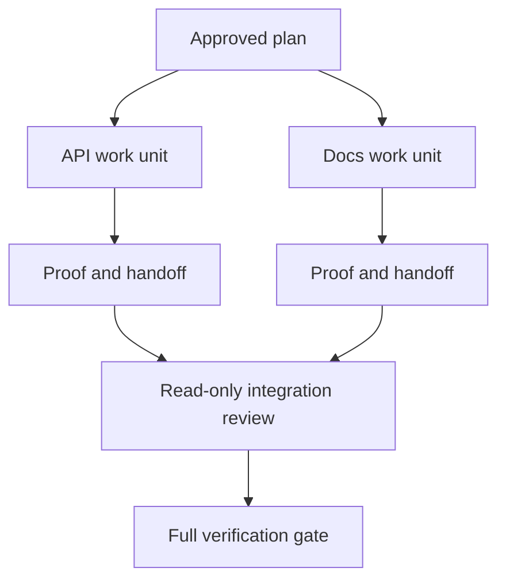

# Đại diện ủy nhiệm làm việc với các hợp đồng tách biệt và hợp đồng hợp nhất

> Các đại lý song song chỉ tiết kiệm thời gian tường khi công việc độc lập. Nếu không họ chuyển đổi một nhiệm vụ rõ ràng thành một vấn đề phối hợp với tỷ lệ thất bại nhanh hơn.

**Type:** Learn + Build
**Languages:** Python (stdlib)
**Prerequisites:** Phase 14 lessons 39 and 44
**Time:** ~70 minutes

## Mục tiêu học tập

- Quyết định liệu việc ủy quyền có được biện minh bởi sự độc lập thực sự hay không.
- Cho mỗi công nhân sở hữu tài liệu độc quyền và chứng minh rõ ràng.
- Lập sóng thực hiện tính toán từ các phụ thuộc.
- Thiết kế hợp đồng hợp nhất để kết hợp công việc của đại lý một cách an toàn.

## Thử nghiệm tương đồng

Không ủy quyền vì có nhiều đại lý hơn.

- hai cuộc điều tra có thể trả lời các câu hỏi khác nhau một cách độc lập;
- hai tổ chức thực hiện có hồ sơ và hợp đồng không liên kết;
- Một nhà kiểm tra có thể kiểm tra một đồ tạo vật hoàn thành mà không thay đổi nó;
- Một kiểm tra bên ngoài chậm có thể chạy trong khi công việc địa phương tiếp tục.

Giữ việc liên tục khi các nhân viên cần cùng các tệp, cùng một quyết định chưa được giải quyết, hoặc cùng một môi trường thay đổi.

## Một đơn vị làm việc là một hợp đồng

Mỗi đơn vị được ủy quyền cần:

| Field | Meaning |
|---|---|
| Goal | One observable result |
| Owner | One accountable worker |
| Paths | Exclusive write ownership |
| Dependencies | Completed units required before starting |
| Proof | Exact evidence returned to the integrator |
| Handoff | Files changed, decisions made, remaining risk |

Handling the backend không phải là một đơn vị làm việc.  Thực hiện kiểm tra trùng lặp `app/accounts.py`và chứng minh nó bằng bài kiểm tra tài khoản tập trung

## Sự cô lập có ba tầng

1. **Filesystem isolation:**cây làm việc hoặc hộp cát riêng biệt ngăn chặn việc chỉnh sửa chung tình cờ.
2. **Ownership isolation:**hợp đồng ngăn cản hai công nhân cố tình chỉnh sửa cùng một con đường.
3. **State isolation:**Các hồ sơ và kết quả khác nhau ngăn cản một công nhân ghi lại bằng chứng của công nhân khác.

Việc tách biệt hệ thống tập tin không giải quyết quyền sở hữu. Hai cây làm việc sạch vẫn có thể tạo ra các thiết kế mâu thuẫn. Hợp đồng hợp nhất phải giải quyết giao diện chia sẻ trước khi bắt đầu công việc.



## Người kết hợp không xây dựng lại công việc

Người tích hợp nên:

1. xác nhận mỗi giao hàng phù hợp với phạm vi giao dịch;
2. đọc kết quả bằng chứng, không chỉ tổng kết của người lao động;
3. kết hợp các thay đổi trong trật tự phụ thuộc;
4. chạy toàn bộ cổng chéo đơn vị;
5. từ chối mở rộng phạm vi ẩn;
6. ghi lại xung đột như những quyết định mới, không phải sửa đổi im lặng.

Nếu việc tích hợp đòi hỏi phải viết lại hầu hết kết quả của người lao động, sự phân hủy ban đầu là sai.

## Vai trò của con người và nhân viên

Việc ủy quyền không loại bỏ phán đoán của con người. Con người vẫn sở hữu những lựa chọn thay đổi hành vi công chúng, rủi ro, thẩm quyền hoặc chi phí không thể đảo ngược.

Đây là tự trị chuẩn hóa: hệ thống cho phép tự do khi bằng chứng và sự quay lại mạnh mẽ, và đòi hỏi một điểm kiểm soát khi hậu quả cao.

## Hãy xây dựng nó

Phòng thí nghiệm kiểm tra đường dẫn chồng chéo, xác nhận sự phụ thuộc, tính toán sóng thực hiện an toàn, và viết `outputs/delegation-plan.json`- Tôi không biết.

Đi chạy:

```bash
python3 code/main.py
python3 -m unittest discover code/tests -v
```

Thay đổi đơn vị tài liệu để sở hữu `app/`Kế hoạch nên bị chặn bởi vì con đường gốc này chồng chéo với đơn vị API.

## Các bài tập

1. Phân hủy một thay đổi thực sự thành hai đơn vị làm việc độc lập và một bộ tích hợp.
2. Tìm một phân chia song song được đề xuất mà chỉ có vẻ độc lập.
3. Thêm một nhân viên nghiên cứu chỉ đọc mà sản lượng của nó là một bảng thực tế.
4. Thêm một cổng kết hợp kiểm tra tập tin thay đổi cuối cùng với tất cả các hợp đồng đơn vị.
5. Định nghĩa một quy tắc hủy bỏ cho một công nhân mà sự phụ thuộc trở nên vô hiệu.

## Đọc thêm

- [Reid Smith, The Contract Net Protocol](https://doi.org/10.1109/TC.1980.1675516), để xử lý chính thức sớm về phân bổ nhiệm vụ phân chia và báo cáo kết quả.
- [Eric Horvitz, Principles of Mixed-Initiative User Interfaces](https://dl.acm.org/doi/10.1145/302979.303030), để quyết định khi nào tự động hóa nên hoạt động và khi nào nó nên trả lại sự kiểm soát cho một người.

## Những gì bạn giữ

Cứ giữ lại`outputs/delegation-plan.json`Nó ghi lại lý do tại sao sự chia rẽ là an toàn, ai sở hữu mỗi con đường, và bằng chứng tích hợp phải nhận được.
