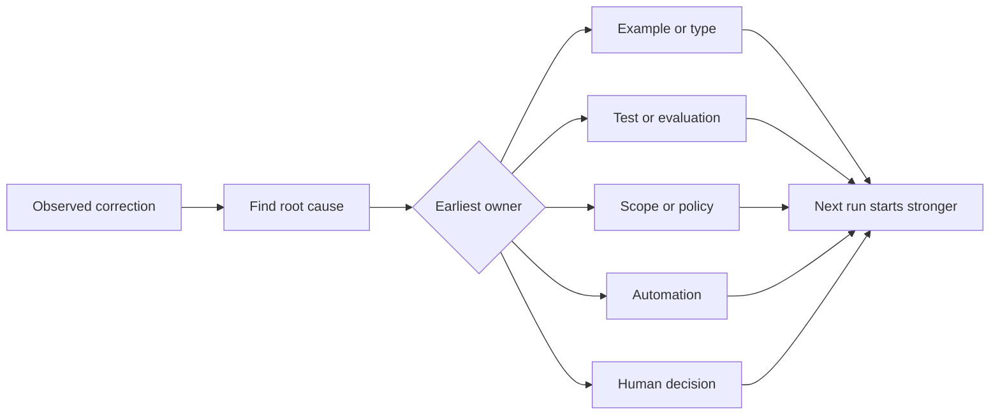

# Làm cho mỗi sự sửa chữa của nhân viên trở thành một cải tiến hệ thống

> Một sửa đổi chỉ tồn tại trong trò chuyện sửa chữa một lần chạy. Một sửa đổi được quảng bá thành một bài kiểm tra, ranh giới, ví dụ hoặc công cụ cải thiện mỗi lần chạy sau đó.

**Type:** Learn + Build
**Languages:** Python (stdlib)
**Prerequisites:** Phase 14 lessons 37 to 41
**Time:** ~65 minutes

## Mục tiêu học tập

- Chuyển đổi các điều chỉnh của chất độc thành điều khiển bền.
- Đặt mỗi điều khiển ở lớp sớm nhất có thể ngăn ngừa tái phát.
- Tăng lại các bài học lặp đi lặp lại với dấu vân tay ổn định.
- Tắt kiểm soát không còn bảo vệ rủi ro thực sự.

## Sự sửa chữa là bằng chứng

Khi bạn nói với một đại lý không chỉnh sửa tập tin đó, bạn đã học được rằng giới hạn phạm vi không thể thực hiện. Khi bạn nói  hình thức đầu ra này là sai, bạn đã học được rằng một ví dụ hoặc thử nghiệm bị thiếu. Khi thiết lập thất bại một lần nữa, bạn đã học được rằng kiến thức môi trường thuộc về tự động hóa.

Hãy coi sự sửa chữa như một quan sát về hệ thống làm việc, chứ không phải là một sự thất bại trong việc viết.

## Tăng lên lớp hiệu quả sớm nhất

Sử dụng thứ tự này:

| Recurring failure | Durable destination |
|---|---|
| Wrong result or regression | Test or evaluation |
| Off-scope or unsafe action | Scope or permission policy |
| Repeated setup or command mistake | Automation or tool |
| Repeated output-format mistake | Canonical example plus validator |
| Ambiguous local convention | Instruction with a scenario check |
| Product disagreement | Human decision record |

Các kiểm soát trước đó rẻ hơn. Một loại ngăn chặn trạng thái không hợp lệ mạnh hơn bình luận đánh giá mà nhận được nó sau đó. Một bài kiểm tra tập trung mạnh hơn một đoạn yêu cầu người đại lý nhớ.



## Bản ghi Ratchet

Tận bắt:

- triệu chứng;
- Nguyên nhân gốc rễ;
- hậu quả;
- số lần tái phát;
- kiểm soát được lựa chọn;
- xác minh để kiểm soát;
- chủ sở hữu;
- ngày để xem xét hoặc nghỉ hưu.

Không khuyến khích mọi ưu tiên một lần, khuyến khích một sự điều chỉnh khi tái phát hoặc hậu quả biện minh cho sự phức tạp vĩnh viễn.

## Nguyên nhân riêng biệt với triệu chứng

Đại lý được chỉnh sửa README là một triệu chứng.

- nhiệm vụ cho phép nguồn kho;
- Docs được xem là an toàn;
- thực hiện và tài liệu kế hoạch được kết hợp;
- Hai công nhân có quyền sở hữu chồng chéo.

Mỗi nguyên nhân thuộc về một điều khiển khác nhau. Một quy tắc chỉ lặp lại triệu chứng sẽ thất bại trong trường hợp tiếp theo khác nhau một chút.

## Các kiểm soát cũng bị suy giảm

Các điều khiển cũ có thể xung đột, làm phồng xung quanh và mã hóa một hệ thống không còn tồn tại nữa.

- Kiến trúc cơ bản đã thay đổi;
- Một điều khiển thực thi mạnh hơn đã thay thế nó;
- lỗi không tái diễn trong một khoảng thời gian có ý nghĩa;
- điều khiển tạo ra nhiều xung đột hơn là rủi ro mà nó ngăn chặn.

Mục tiêu không phải là tập tin hướng dẫn dài nhất mà là hệ thống nhỏ nhất để giữ lại sự phán xét khó khăn.

## Hãy xây dựng nó

Phòng thí nghiệm phân loại các sửa chữa, quảng bá chúng thành các kiểm soát, ghi lại dấu vân tay, và viết `outputs/feedback-ratchet.json`- Tôi không biết.

Đi chạy:

```bash
python3 code/main.py
python3 -m unittest discover code/tests -v
```

Thêm hai sửa chữa có định dạng khác nhau với cùng một nguyên nhân. Cải thiện bình thường hóa cho đến khi chúng sụp đổ thành một điều khiển mà không sụp đổ các thất bại không liên quan.

## Các bài tập

1. Hãy lấy 5 sửa đổi từ một phiên mã hóa gần đây và phân loại chủ sở hữu thực sự của chúng.
2. Thay thế một quy tắc bằng một bài kiểm tra có thể thực hiện.
3. Thêm trọng lượng hậu quả để có thể thúc đẩy một sự xuất hiện đầu tiên nghiêm trọng ngay lập tức.
4. Thêm một chủ sở hữu và ngày nghỉ hưu vào sản xuất phòng thí nghiệm.
5. Xem lại một hướng dẫn của một đại lý hiện có và xóa nó chỉ sau khi chứng minh rằng có một kiểm soát mạnh hơn.

## Đọc thêm

- [Basili, Caldiera, and Rombach, The Goal Question Metric Approach](https://www.cs.toronto.edu/~sme/CSC444F/handouts/GQM-paper.pdf), để biến mục tiêu thành câu hỏi và các phép đo hoạt động.
- [Shinn et al., Reflexion](https://arxiv.org/abs/2303.11366), để sử dụng dấu vết phản hồi để cải thiện các quyết định sau đó mà không thay đổi trọng lượng mô hình.
- [Madaan et al., Self-Refine](https://arxiv.org/abs/2303.17651), cho phản hồi lặp lại và sửa đổi bên trong vòng lặp nhiệm vụ.

## Những gì bạn giữ

Cứ giữ lại`outputs/feedback-ratchet.json`Nó là kết thúc lâu dài của con đường kỹ thuật hỗ trợ nhân viên và đầu vào các thay đổi trong tương lai.
