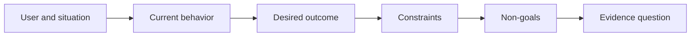

# Định nghĩa kết quả trước khi chọn kết quả

> Việc thực hiện nhanh sẽ làm tăng hình phạt cho việc chọn sai vấn đề.

**Type:** Learn + Build
**Languages:** Python (stdlib)
**Prerequisites:** None
**Time:** ~60 minutes

## Mục tiêu học tập

- Viết một khung kết quả mà không đặt tên cho giải pháp.
- Xác định người dùng, tình huống, hành vi hiện tại và thay đổi mong muốn.
- Định rõ ràng các hạn chế và không mục tiêu.
- Khám phá rò rỉ dung dịch trước khi nó cứng vào phạm vi.

## Kết quả không phải là kết quả

Xây dựng trợ lý xảy ra sự cố đặt tên cho một đầu ra. Nó không nói ai cần nó, điều gì sẽ trở nên tốt hơn, hoặc điều gì phải được bảo vệ.

Một khung kết quả nói:

> Khi một cảnh báo sản xuất đến, kỹ sư đang gọi xác định dịch vụ thất bại và hành động an toàn tiếp theo trong vòng hai phút, trong khi chẩn đoán vẫn chỉ được đọc và kiểm toán.

Câu đó có thể được thỏa mãn bằng phần mềm, sổ chạy, sửa chữa dữ liệu, hoặc thay đổi giao diện nhỏ hơn. Nó giữ cho nhóm gắn bó với kết quả thay vì tạo vật đầu tiên mà ai đó tưởng tượng.

## Phong khung 6 phần

| Part | Question |
|---|---|
| User | Who experiences the problem directly? |
| Situation | When and where does it occur? |
| Current behavior | What happens today, including workarounds? |
| Desired outcome | What observable state should improve? |
| Constraints | Which safety, policy, cost, or compatibility limits are fixed? |
| Non-goals | What tempting adjacent work is excluded? |



## Tìm giải pháp rò rỉ

Các tuyên bố kết quả rò rỉ các giải pháp khi chúng chứa một hình thức sản phẩm, giao diện, lựa chọn mô hình, khung hoặc kiến trúc không được thu được bằng chứng.

- Người dùng nhận được một bản tóm tắt AI hàng tuần rò rỉ bản tóm tắt và thời gian.
- Người dùng hiểu được những thay đổi tài khoản trước khi phê duyệt tuyên bố kết quả.
- Dân dụng cơ sở dữ liệu vector rò rỉ cơ sở hạ tầng.
- Các bằng chứng chính sách có liên quan có sẵn trong quá trình xem xét tuyên bố khả năng.

Các hạn chế có thể đặt tên công nghệ khi sự tương thích thực sự sửa chữa nó.

## Những hạn chế bảo vệ kết quả

Các hạn chế không phải là chi tiết thực hiện.

- Không có sản phẩm nào viết trong quá trình chẩn đoán;
- phản ứng trong ngân sách thời gian xảy ra sự cố;
- Các sự kiện kiểm toán hiện có vẫn có thẩm quyền;
- Không có sự phụ thuộc thời gian chạy mới;
- Hành vi tiếp cận vẫn còn nguyên vẹn.

Một công trình xây dựng đạt được kết quả bằng cách vi phạm một hạn chế đã không đạt được kết quả.

## Những mục tiêu không đạt được tạo ra giới hạn

Những mục tiêu không có mục tiêu ngăn chặn một mảnh hữu ích trở thành một nền tảng.

- Không có sự khắc phục tự động;
- Không có hệ thống định tuyến cảnh báo mới;
- Không thay thế chỉ huy vụ việc;
- Không có phân tích lịch sử trong đoạn này.

## Hãy xây dựng nó

Phòng thí nghiệm xác nhận`OutcomeFrame`và viết `outputs/outcome-frame.json`- Tôi không biết.

```bash
python3 code/main.py
python3 -m unittest discover code/tests -v
```

Thay thế kết quả mong muốn bằng  sử dụng trợ lý xảy ra. Người xác nhận nên đánh dấu rằng kết quả được đề xuất đã rò rỉ vào kết quả.

## Các bài tập

1. Tái viết lại yêu cầu tính năng từ backlog của bạn như một khung kết quả.
2. Thêm một hạn chế thay đổi những giải pháp vẫn có thể.
3. Thêm hai mục tiêu không mục tiêu giữ cho mảnh đầu tiên nhỏ.
4. Xác định quan sát sớm nhất mà sẽ bác bỏ kết quả mong muốn.
5. Viết ba kết quả khác nhau có thể thỏa mãn kết quả tương tự.

## Đọc thêm

- [Nuseibeh and Easterbrook, Requirements Engineering: A Roadmap](https://www.cs.toronto.edu/~sme/papers/2000/ICSE2000.pdf), để đối xử với các mục tiêu trong thế giới thực như là neo cho công việc phần mềm.
- [Dardenne, van Lamsweerde, and Fickas, Goal-Directed Requirements Acquisition](https://doi.org/10.1016/0167-6423(93)90021-G), để tinh chỉnh các mục tiêu cấp cao thành các hạn chế và yêu cầu hoạt động.

## Những gì bạn giữ

Cứ giữ lại`outputs/outcome-frame.json`Bài học tiếp theo sẽ thử nghiệm nó so với những người thực sự làm việc.
