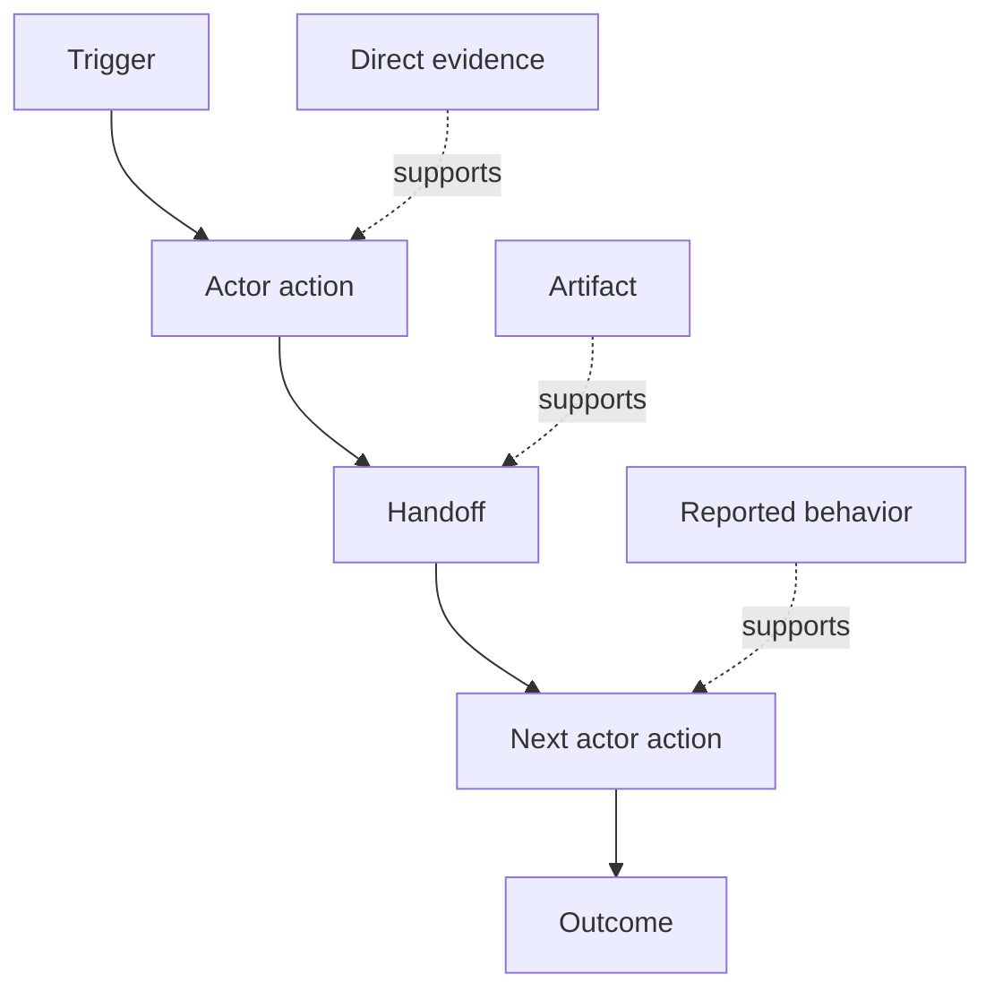

# Tìm ra những người thực sự làm việc như thế nào

> Các yêu cầu không phải chờ đợi trong một cuộc họp để được thu thập.

**Type:** Learn + Build
**Languages:** Python (stdlib)
**Prerequisites:** Phase 14 lesson 47
**Time:** ~70 minutes

## Mục tiêu học tập

- Mô hình hóa dòng công việc hiện tại như các hành động được sắp xếp với bằng chứng.
- Phân biệt quan sát trực tiếp từ hành vi được báo cáo hoặc suy luận.
- Tìm kiếm sự xung đột, giao hàng, quyền lực và trạng thái ẩn.
- Giữ các yêu cầu không chắc chắn hiển thị thay vì biến chúng thành yêu cầu.

## Bắt đầu với hệ thống hiện tại

Đừng bắt đầu bằng cách hỏi mọi người muốn có những đặc điểm gì mà hãy bắt đầu bằng cách tái tạo những gì đang xảy ra.

Đối với mỗi bước, ghi lại:

| Field | Example |
|---|---|
| Actor | On-call engineer |
| Trigger | Production alert arrives |
| Action | Opens alert, then searches dashboards |
| Input | Alert payload and deployment record |
| Output | Candidate service and owner |
| Friction | Context switching across three tools |
| Authority | Incident commander approves a write |
| Evidence | Screen recording, incident log, runbook |

Phòng công việc lớn hơn màn hình. Nó bao gồm chờ đợi, sao chép dán, kênh bên, chấp thuận, phục hồi lỗi, và các bước mà mọi người đã ngừng nhận thấy.

## Bằng chứng có sức mạnh

Sử dụng một cái thang bằng chứng đơn giản:

1. **Direct behavior:**quan sát, theo dõi, ghi lại hoặc sự kiện hệ thống.
2. **Artifact:**vé, sổ chạy, nhật ký, biểu mẫu hoặc đầu ra hoàn thành.
3. **Reported behavior:**một người mô tả những gì họ làm.
4. **Inference:**Nhóm kết luận những gì có thể xảy ra.

Tất cả bốn đều có thể hữu ích. Chỉ hai thứ đầu tiên chứng minh trực tiếp hành vi hiện tại.



## Tìm kiếm bốn điều

- **Friction:**nỗ lực lặp đi lặp lại, trì hoãn, tái nhập cảnh hoặc phục hồi.
- **Hidden state:**những sự thật được ghi nhớ, trò chuyện hoặc ghi chú cá nhân.
- **Authority:**người hoặc hệ thống được phép thực hiện một sự thay đổi theo sau.
- **Exceptions:**trường hợp khi dòng công việc bình thường không còn bình thường.

Các tính năng AI thường thất bại trong việc trao tặng và ngoại lệ bởi vì con đường hạnh phúc là con đường duy nhất được hình thành.

## Đừng bỏ qua sự bất đồng

Hai người dùng có thể thực hiện các dòng công việc khác nhau vì lý do tốt.

- các vai trò khác nhau;
- mức độ rủi ro khác nhau;
- quá trình truyền thống và hiện tại;
- Sự khác biệt về chuyên môn;
- Một sự bất đồng chính sách thực sự.

Một dòng công việc trung bình không thể mô tả ai cả.

## Hãy xây dựng nó

Phòng thí nghiệm lưu trữ bằng chứng về từng bước của dòng công việc, xác nhận thứ tự và sự tin tưởng, tính toán tỷ lệ bằng chứng trực tiếp, và viết `outputs/workflow-evidence.json`- Tôi không biết.

```bash
python3 code/main.py
python3 -m unittest discover code/tests -v
```

Thêm một đường ngoại lệ trong đó ghi chép triển khai bị thiếu. Giữ trật tự chính nguyên vẹn và ghi lại nơi bắt đầu chi nhánh.

## Các bài tập

1. Tái tạo lại một dòng công việc từ một nhật ký mà không phỏng vấn ai.
2. Đàm phỏng vấn người dùng và đánh dấu mọi tuyên bố vẫn thiếu bằng chứng trực tiếp.
3. Thêm một giới hạn thẩm quyền và một bước phục hồi thất bại.
4. Mô hình hai biến thể dòng công việc mà không hợp nhất chúng.
5. Xác định một tính năng được đề xuất loại bỏ một bước hiển thị nhưng để lại công việc ẩn không bị ảnh hưởng.

## Đọc thêm

- [Nuseibeh and Easterbrook, Requirements Engineering: A Roadmap](https://www.cs.toronto.edu/~sme/papers/2000/ICSE2000.pdf), đặc biệt là việc xử lý việc tạo ra như là giải thích, mô hình hóa và xác nhận thay vì chỉ là bắt.
- [Gotel and Finkelstein, An Analysis of the Requirements Traceability Problem](https://doi.org/10.1109/ICRE.1994.292398), vì sự khó khăn trong việc bảo tồn mối quan hệ giữa các yêu cầu và nguồn gốc của chúng.

## Những gì bạn giữ

Cứ giữ lại`outputs/workflow-evidence.json`Nó biến sự chi phối và sự không chắc chắn được quan sát thành một bản đồ giả định trong bài học tiếp theo.
