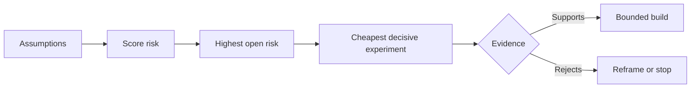

# Bản đồ các giả định và giải quyết trước những giả định nguy hiểm nhất

> Một bản đồ đường dẫn che giấu sự không chắc chắn bên trong các tính năng.

**Type:** Learn + Build
**Languages:** Python (stdlib)
**Prerequisites:** Phase 14 lesson 48
**Time:** ~65 minutes

## Mục tiêu học tập

- Chuyển đổi công việc được đề xuất thành giả định rõ ràng.
- Nhận điểm tác động, không chắc chắn và không thể đảo ngược riêng biệt.
- Chọn thử nghiệm tiếp theo theo rủi ro, không phải nhiệt tình.
- Thay thế giả định được kiểm tra bằng bằng chứng và quyết định.

## Mỗi tòa nhà đều có cá cược

Một công cụ xảy ra có thể phụ thuộc vào tất cả những điều này là đúng:

- ngữ cảnh cảnh báo báo có đủ thông tin để xác định dịch vụ;
- Các kỹ sư tin tưởng vào một khuyến nghị mà họ không tự mình lấy ra;
- Thời gian phản ứng mong muốn quan trọng về mặt hoạt động;
- dữ liệu cần thiết có thể được truy cập mà không có thẩm quyền không an toàn;
- dòng công việc xảy ra thường xuyên đủ để biện minh cho việc bảo trì.

Đây không phải là những nhiệm vụ thực hiện mà là điều kiện để xây dựng có giá trị, có thể sử dụng, khả thi và an toàn.

## Các lớp giả định

| Class | Question |
|---|---|
| Value | Will the outcome matter enough? |
| Usability | Can the user understand and act on it? |
| Feasibility | Can the system produce it with available data and constraints? |
| Viability | Can the organization sustain cost, ownership, and operation? |
| Safety | Can it fail without unacceptable consequence? |

Viết giả định như các câu nói có thể giả mạo. Công tính hữu ích không thể kiểm tra. 8 trong 10 kỹ sư gọi xác định dịch vụ chính xác nhanh hơn với kết quả chỉ đọc có thể.

## Nguy cơ không phải là một con số

Phòng thí nghiệm sử dụng ba chiều từ 1 đến 5:

- **Impact:**thiệt hại nếu giả định là sai.
- **Uncertainty:**Sự yếu kém của bằng chứng hiện tại.
- **Irreversibility:**chi phí học tập sau khi cam kết.

Điểm số ví dụ nhân tác động và không chắc chắn, sau đó thêm tính không thể đảo ngược. Công thức không phải là phổ quát. Mục đích của nó là buộc nhóm để nói tại sao một người không biết nên được giải quyết trước người khác.



## Thiết kế một thí nghiệm, chứ không phải nghi lễ xác nhận

Một thử nghiệm hữu ích có:

- một tuyên bố có thể là sai;
- một con người hoặc một mẫu thực tế;
- kết quả có thể quan sát được;
- Một ngưỡng được quyết định trước khi kết quả;
- một quyết định tiếp theo cho thông qua, thất bại, và bằng chứng mơ hồ.

Tránh các thử nghiệm chỉ chứng minh rằng nhóm có thể xây dựng ý tưởng.

## Sự đảo ngược thay đổi trật tự

Các lựa chọn có tính chất cao và không thể đảo ngược cần bằng chứng trước đó. Một bản lặp lại chỉ đọc có thể đi trước sự tích hợp sản xuất. Một bộ điều chỉnh tạm thời có thể đi trước việc di chuyển dữ liệu. Một khuyến nghị được phê duyệt bởi con người có thể đi trước hành động tự động.

Hình dạng của xây dựng nên theo hình dạng của sự không chắc chắn.

## Hãy xây dựng nó

Phòng thí nghiệm xếp hạng các giả định, phân biệt được thử nghiệm từ các yêu cầu mở, chọn rủi ro mở cao nhất, và viết `outputs/assumption-map.json`- Tôi không biết.

```bash
python3 code/main.py
python3 -m unittest discover code/tests -v
```

Thay đổi bằng chứng về giả định rủi ro cao nhất và quan sát cách thí nghiệm tiếp theo thay đổi.

## Các bài tập

1. Viết ra năm giả định cho một tính năng bạn muốn xây dựng.
2. Thêm một giả định an toàn mà danh sách tính năng của bạn bỏ qua.
3. Định nghĩa một ngưỡng khiến bạn dừng xây dựng.
4. Thay thế một thí nghiệm lớn bằng một thử nghiệm quyết định rẻ hơn.
5. So sánh xếp hạng rủi ro với ưu tiên trên lộ trình và giải thích sự không phù hợp.

## Đọc thêm

- [Barry Boehm, A Spiral Model of Software Development and Enhancement](https://dl.acm.org/doi/10.1145/12944.12948), cho một chu kỳ phát triển dựa trên rủi ro giải quyết sự không chắc chắn trước khi cam kết sâu sắc hơn.
- [Dardenne, van Lamsweerde, and Fickas, Goal-Directed Requirements Acquisition](https://doi.org/10.1016/0167-6423(93)90021-G), để tinh chỉnh mục tiêu trong khi làm nổi lên những trở ngại và hạn chế.

## Những gì bạn giữ

Cứ giữ lại`outputs/assumption-map.json`Bài học tiếp theo sử dụng nó để chọn mảnh nhỏ nhất có thể tạo ra bằng chứng quyết định.
