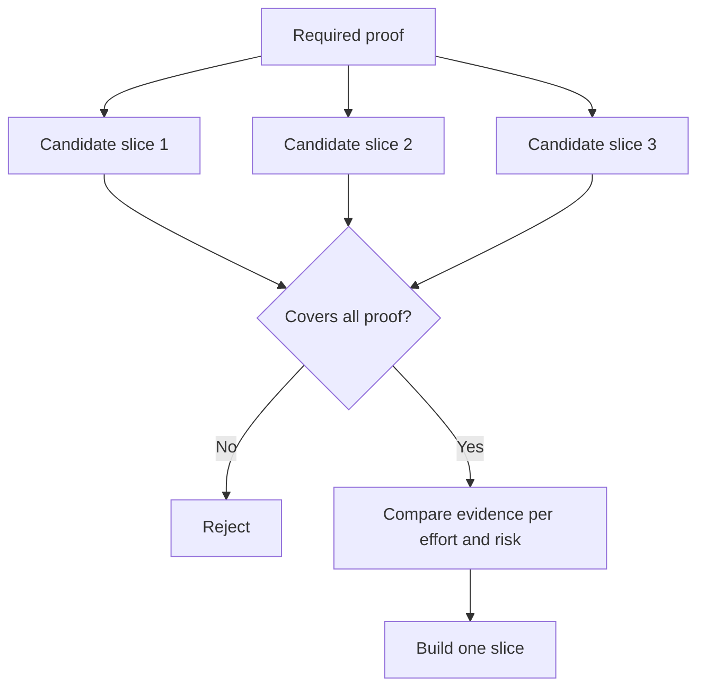

# Chọn một phần nhỏ nhất có thể thay đổi quyết định

> Một cái nhỏ chỉ hữu ích khi nó chứng minh một điều gì đó quan trọng. Một cái nhỏ mà không thể thay đổi quyết định tiếp theo chỉ là không hoàn chỉnh.

**Type:** Learn + Build
**Languages:** Python (stdlib)
**Prerequisites:** Phase 14 lesson 49
**Time:** ~65 minutes

## Mục tiêu học tập

- Định nghĩa một mảnh bằng những giả định nó chứng minh.
- Tăng giá trị kết quả, giảm sự không chắc chắn, nỗ lực và hậu quả.
- Tích thích bằng chứng đảo ngược hơn là cam kết sản xuất sớm.
- Tránh các mảnh bỏ qua phần nguy hiểm của dòng công việc.

## Bằng chứng từ đầu đến cuối

Một đoạn hữu ích vượt qua dòng công việc thực tế tối thiểu cần thiết để quan sát kết quả. Nó có thể hẹp về người dùng, dữ liệu, thời gian và khả năng. Nó không nên hẹp bằng cách loại bỏ sự không chắc chắn chính xác bạn cần kiểm tra.

Ví dụ:

- Một bản đọc-chỉ-lần lặp lại trên mười sự cố thực kiểm tra nhận dạng dịch vụ và niềm tin của nhà điều hành.
- Một bảng điều khiển được đánh bóng trên dữ liệu tổng hợp có thể kiểm tra sự hiểu biết nhưng không kiểm tra khả thi của dữ liệu.
- Một máy tự trị sản xuất kiểm tra mọi thứ cùng một lúc với hậu quả không thể chấp nhận được.

## Định nghĩa bằng chứng cần thiết trước

Hãy lấy các giả định mở có nguy cơ cao nhất và biến chúng thành một bộ bằng chứng cần thiết. Một mảnh ứng cử viên chỉ đủ điều kiện nếu nó bao gồm bộ đó.

Sau đó so sánh các mảnh đủ điều kiện trên:

| Dimension | Direction |
|---|---|
| Outcome value | More is better |
| Uncertainty reduced | More is better |
| Effort | Less is better |
| Consequence | Less is better |
| Reversibility | More is better |

Điểm số của phòng thí nghiệm là đơn giản.



## Những điều tối thiểu sai lầm phổ biến

- **The UI-only minimum:**loại bỏ dữ liệu và sự không chắc chắn về hoạt động.
- **The infrastructure-only minimum:**chứng minh khả năng kỹ thuật mà không có giá trị người dùng.
- **The happy-path minimum:**bỏ qua ngoại lệ tạo ra nguy cơ lớn nhất.
- **The demo minimum:**tạo ra một vật cổ thuyết phục nhưng không có phép đo lặp lại.
- **The platform minimum:**xây dựng máy móc tái sử dụng trước khi một dòng công việc kiếm được nó.

## Thêm quy tắc dừng

Trước khi thực hiện, viết những gì xảy ra nếu mảnh thất bại:

- bỏ kết quả;
- thay đổi người dùng mục tiêu hoặc tình huống;
- kiểm tra một cơ chế khác;
- thu thập bằng chứng tốt hơn;
- quyền hạn hạn hạn chế hơn nữa.

Nếu mọi kết quả dẫn đến việc xây dựng, thì đoạn không phải là thí nghiệm.

## Hãy xây dựng nó

Phòng thí nghiệm lọc ứng cử viên bằng bằng chứng cần thiết, ghi điểm các mảnh hợp lệ, và viết `outputs/slice-decision.json`- Tôi không biết.

```bash
python3 code/main.py
python3 -m unittest discover code/tests -v
```

Thêm một ứng cử viên rẻ hơn chứng minh chỉ một giả định yêu cầu. Nó nên vẫn không đủ điều kiện ngay cả khi điểm số của nó là cao.

## Các bài tập

1. Thiết kế ba mảnh cho cùng một kết quả ở các mức độ hậu quả khác nhau.
2. Đề xuất bằng chứng cần thiết trước khi ghi điểm.
3. Tháo một khả năng trong khi vẫn giữ lại bằng chứng quyết định.
4. Thêm một quy tắc dừng cho phi công thất bại.
5. Xác định một thành phần nền tảng có thể được sử dụng lại nên chờ cho đến khi cắt.

## Đọc thêm

- [Barry Boehm, A Spiral Model of Software Development and Enhancement](https://dl.acm.org/doi/10.1145/12944.12948), để phù hợp với từng chu kỳ phát triển với các rủi ro mà nó phải giải quyết.
- [Lenarduzzi and Taibi, MVP Explained: A Systematic Mapping Study on the Definitions of Minimal Viable Product](https://arxiv.org/abs/1609.07592), vì sự mơ hồ xung quanh minimum và viable trong thực tiễn sản phẩm phần mềm.

## Những gì bạn giữ

Cứ giữ lại`outputs/slice-decision.json`Nó ghi lại tại sao mảnh này là mảnh nhỏ nhất có thể thay đổi quyết định.
