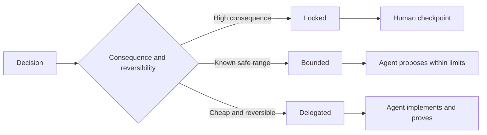

# Viết những thông tin đặc biệt để giữ cho sự phán xét

> Một đặc điểm hữu ích sửa đổi các biến động và bằng chứng trong khi để lại các lựa chọn thực hiện đảo ngược mở.

**Type:** Learn + Build
**Languages:** Python (stdlib)
**Prerequisites:** Phase 14 lesson 50
**Time:** ~75 minutes

## Mục tiêu học tập

- Kết quả riêng biệt, không biến đổi, ví dụ, không mục tiêu và bằng chứng.
- Đánh dấu các quyết định như bị khóa, giới hạn hoặc ủy quyền.
- Giữ sự phán đoán của các đại lý khi lựa chọn rẻ và đảo ngược.
- Cần phải có các trạm kiểm soát của con người khi hậu quả hoặc hành vi của công chúng thay đổi.

## Hai điều cực kỳ xấu

Một nhiệm vụ không xác định rõ ràng yêu cầu một đại lý đoán hệ thống.

Một hợp đồng có thể thực hiện được là một hợp đồng hữu ích:

| Surface | Purpose |
|---|---|
| Outcome | The observable result |
| Invariants | Conditions that must always remain true |
| Examples | Concrete cases that reveal intent |
| Non-goals | Adjacent behavior intentionally excluded |
| Decision policy | Which choices are locked, bounded, or delegated |
| Proof | Evidence required before completion |

## Ba phương thức quyết định

- **Locked:**Các tác nhân không được lựa chọn. Sử dụng cho sự tương thích công cộng, thẩm quyền, an toàn, chi phí không thể đảo ngược, hoặc cam kết sản phẩm.
- **Bounded:**người đại lý có thể chọn trong giới hạn rõ ràng. Sử dụng cho ngân sách tìm kiếm, đếm lại, phụ thuộc được phép, hoặc một gia đình giao diện được biết.
- **Delegated:**đại lý sở hữu sự lựa chọn và phải giải thích nó. sử dụng cho cấu trúc địa phương, tên, refactor đảo ngược, và chi tiết thực hiện.



## Hãy nêu rõ hành vi bằng những ví dụ

Ví dụ nén ý định tốt hơn các đặc điểm. Helpful, robust, vàproduction-ready không thể thực hiện. Một bộ nhỏ các ví dụ bình thường, cạnh, thất bại và cấm cung cấp cho cả người xây dựng và xác minh một cái gì đó cụ thể.

Ví dụ không thay thế các tính không biến đổi. Một trường hợp qua không thể chứng minh một quy tắc an toàn phổ quát.

## Bằng chứng phải phù hợp với tuyên bố

- Một thử nghiệm đơn vị chứng minh hợp đồng chức năng địa phương.
- Một thử nghiệm dây chứng minh sự liên kết và hành vi vận chuyển.
- Một chuyến đi trình duyệt chứng minh một đường giao diện.
- Một bộ lặp lại chứng minh hành vi trên các trường hợp đại diện.
- Một sổ kiểm toán chứng minh rằng giới hạn thẩm quyền được giữ.

Không chấp nhận một lớp thấp hơn như bằng chứng cho một tuyên bố lớp cao hơn.

## Chức giữ những điều không biết

Một thông số kỹ thuật có thể nói theo thực hiện có thể chọn bất kỳ nguồn chỉ đọc nào trả lại trong ngân sách thời gian. Đó không phải là sự mơ hồ. Đó là một quyết định ủy quyền cố ý với một ranh giới và bằng chứng.

Các thông số kỹ thuật nên phát triển khi bằng chứng thay đổi. Giữ nguyên nhân đằng sau các lựa chọn bị khóa và giới hạn để các nhóm sau này có thể sửa đổi chúng mà không cần khảo cổ học.

## Hãy xây dựng nó

Phòng thí nghiệm xác nhận mọi mặt hợp đồng, kiểm tra các chế độ quyết định, và viết `outputs/executable-specification.json`- Tôi không biết.

```bash
python3 code/main.py
python3 -m unittest discover code/tests -v
```

Di chuyển quyết định viết sản xuất từ khóa sang ủy quyền. Giải thích tại sao các kế hoạch chấp nhận giá trị nhưng rủi ro sản phẩm không.

## Các bài tập

1. Chuyển đổi một vé backlog vào sáu bề mặt kỹ thuật.
2. Thay thế ba hướng dẫn thực thi bằng một không thay đổi và hai ví dụ.
3. Hãy ghi lại mọi quyết định và biện minh cho mọi lựa chọn bị khóa hoặc bị giới hạn.
4. Thêm một biên nhận bằng chứng cho mỗi biến đổi.
5. Giảm một hạn chế không có bằng chứng hoặc lý do rủi ro.

## Đọc thêm

- [Nuseibeh and Easterbrook, Requirements Engineering: A Roadmap](https://www.cs.toronto.edu/~sme/papers/2000/ICSE2000.pdf), cho mối quan hệ giữa các mục tiêu, đặc điểm chính xác, xác thực, đồng thuận và tiến hóa.
- [Zave and Jackson, Four Dark Corners of Requirements Engineering](https://doi.org/10.1145/267895.267896), để phân biệt các giả định, yêu cầu và đặc điểm môi trường.
- [Gotel and Finkelstein, An Analysis of the Requirements Traceability Problem](https://doi.org/10.1109/ICRE.1994.292398), để bảo tồn lý do tại sao yêu cầu tồn tại và nó đến từ đâu.

## Những gì bạn giữ

Cứ giữ lại`outputs/executable-specification.json`Nó trở thành hợp đồng mà các đại lý lập trình và các nhà đánh giá con người chia sẻ.
