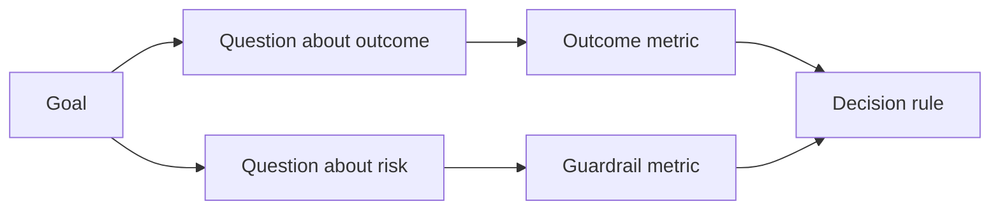

# Thiết kế số liệu thành công trước khi kết quả tồn tại

> Mức đo nên trả lời một quyết định, không phải trang trí bảng điều khiển. Bắt đầu với mục tiêu, dẫn ra các câu hỏi, sau đó chọn các số liệu nhỏ nhất trả lời chúng.

**Type:** Learn + Build
**Languages:** Python (stdlib)
**Prerequisites:** Phase 14 lessons 47 and 51
**Time:** ~70 minutes

## Mục tiêu học tập

- Thuộc dẫn các câu hỏi và số liệu từ một mục tiêu kết quả.
- Định nghĩa ngưỡng, cửa sổ, nguồn và hướng dẫn trước khi quan sát kết quả.
- Kết hợp các số liệu kết quả với các đường dây và các số liệu phản đối.
- Bằng chứng đánh giá phù hợp với quyết định mà xây dựng phải hỗ trợ.

## Mục tiêu, câu hỏi, métrics

Bắt đầu với mục tiêu:

> Giảm thời gian để xác định dịch vụ bị ảnh hưởng mà không tăng các hành động không an toàn.

Các câu hỏi bắt nguồn:

- Làm thế nào nhanh chóng xác định dịch vụ đúng?
- Dịch vụ xác định được xác định là đúng bao nhiêu lần?
- Liệu chẩn đoán vẫn chỉ được đọc?
- Dòng công việc có làm tăng việc từ chối cảnh báo hoặc tải trọng công việc của người vận hành không?

Sau đó chọn các số liệu làm việc các câu hỏi đó.



## Một số liệu cần hợp đồng

Mỗi số liệu cần:

| Field | Example |
|---|---|
| Name | `median_identification_seconds` |
| Direction | at most |
| Threshold | 120 |
| Window | ten incident replays |
| Source | replay event log |
| Population | on-call engineers in the pilot |
| Kind | outcome or guardrail |

Nếu không có nguồn và cửa sổ, một số không thể được tái tạo.

## Kết quả, Guardrail và Counter-Metric

- **Outcome metric:**tình trạng mong muốn đã được cải thiện?
- **Guardrail:**Có phải một giới hạn cố định vẫn đúng không?
- **Counter-metric:**việc cải thiện địa phương có phải là chi phí hay thiệt hại ở nơi khác?

Đối với một dòng công việc xảy ra, tốc độ không đủ. Sự chính xác, sản xuất viết, tải trọng công việc của nhà điều hành và các cảnh báo bị bỏ qua bảo vệ khỏi một kết quả nhanh chóng nhưng không an toàn.

## Bằng chứng trực tuyến và ngoại tuyến

Phân tích trực tuyến hữu ích cho khả năng lặp lại và bảo hiểm cạnh. Một máy bay bay bay có giới hạn hữu ích cho hành vi thực tế, tin tưởng và hiệu ứng luồng làm việc.

Sử dụng bằng chứng rẻ nhất có thể trả lời quyết định hiện tại. Đừng phơi bày người dùng thực sự chỉ vì việc thực hiện đã sẵn sàng.

## Hãy quyết định trước khi bạn đo lường

Viết đường đi, thất bại và không rõ ràng trước khi thấy kết quả.

Ví dụ:

- Pass: tốc độ dịch vụ chính xác ít nhất 0,9 và thời gian trung bình tối đa 120 giây;
- thất bại: bất kỳ tỷ lệ ghi sản xuất hoặc sửa chữa nào dưới 0,75;
- không rõ ràng: cải tiến nhỏ với sự khác biệt rộng, đòi hỏi một bộ lặp lại lớn hơn.

## Hãy xây dựng nó

Phòng thí nghiệm xác nhận một kế hoạch đo lường, đánh giá các ngưỡng bao gồm, ghi lại các giá trị thiếu, và viết `outputs/measurement-report.json`- Tôi không biết.

```bash
python3 code/main.py
python3 -m unittest discover code/tests -v
```

Tắt các métrics guardrail và quan sát tại sao kế hoạch trở nên vô hiệu ngay cả khi các métrics kết quả vẫn còn.

## Các bài tập

1. Lấy 3 câu hỏi từ một mục tiêu kết quả.
2. Thêm một counter-metric mà bắt chi phí chuyển sang một vai trò khác.
3. Định nghĩa nguồn, dân số và cửa sổ cho mỗi métric.
4. Viết bỏ qua, thất bại, và quyết định mơ hồ trước khi tạo ra các giá trị.
5. Hãy xác định một số liệu dễ thu thập nhưng không thể thay đổi quyết định.

## Đọc thêm

- [Basili, Software Modeling and Measurement: The Goal/Question/Metric Paradigm](https://drum.lib.umd.edu/items/8119803a-362b-42ec-b6ce-2311713e7236), để lấy các phép đo hoạt động từ các mục tiêu rõ ràng.
- [Basili, Caldiera, and Rombach, The Goal Question Metric Approach](https://www.cs.toronto.edu/~sme/CSC444F/handouts/GQM-paper.pdf), để áp dụng phương pháp như một hệ thống phản hồi và cải tiến.

## Những gì bạn giữ

Cứ giữ lại`outputs/measurement-report.json`Nó xác định cổng bằng chứng cho nguyên mẫu, thí điểm hoặc giai đoạn sản xuất.
