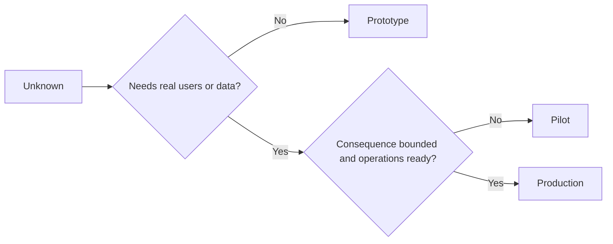

# Chọn mẫu thử nghiệm, máy bay bay hoặc sản xuất một cách cố ý

> Đây là môi trường học tập khác nhau, không phải mức độ đánh bóng.

**Type:** Learn + Build
**Languages:** Python (stdlib)
**Prerequisites:** Phase 14 lessons 50 to 52
**Time:** ~70 minutes

## Mục tiêu học tập

- Chọn một giai đoạn xây dựng từ không biết, khán giả, dữ liệu, hậu quả, và sẵn sàng.
- Định nghĩa các biện pháp kiểm soát và tiêu chí thoát khỏi giai đoạn cụ thể.
- Giữ nguyên mẫu từ một cách lặng lẽ trở thành hệ thống sản xuất.
- Hoãn lại quyền thực sự cho đến khi bằng chứng và hoạt động chứng minh nó.

## Ba câu hỏi khác nhau

| Stage | Primary question |
|---|---|
| Prototype | Can this mechanism produce the evidence at all? |
| Pilot | Does it work safely with a bounded real audience and real conditions? |
| Production | Can we own it continuously at the promised reliability and risk level? |

Một nguyên mẫu có thể hoàn thành kỹ thuật và vẫn có thể dùng một lần. Một phi công có thể sử dụng dữ liệu sản xuất trong khi vẫn bị giới hạn trong khán giả và thẩm quyền.

## Mô hình đầu tiên

Sử dụng một nguyên mẫu khi điều không biết không đòi hỏi người dùng thực hoặc dữ liệu thực.

- có thể tháo;
- cách ly;
- hành vi hạn chế;
- rõ ràng về câu hỏi học tập;
- Không có bảo đảm hoạt động sai lầm.

Đừng tối ưu hóa kiến trúc trước khi cơ chế đạt được một giai đoạn khác.

## Phi công

Sử dụng một máy bay bay khi điều không biết đòi hỏi hành vi thực tế, dữ liệu thực tế hoặc một dòng công việc thực tế, nhưng hậu quả hoặc sẵn sàng chưa tương thích với việc phát hành rộng.

Một phi công cần:

- một khán giả được đặt tên;
- một chủ nhân;
- Thời gian và thẩm quyền hạn chế;
- kiểm toán và quay trở lại;
- Các ngưỡng kết quả và đường dây bảo vệ;
- tiêu chí thoát khỏi để mở rộng, sửa đổi hoặc dừng.

## Sản xuất

Sản xuất cần nhiều hơn là triển khai:

- Mục tiêu cấp dịch vụ;
- quyền sở hữu khi gọi và khi xảy ra sự cố;
- xem xét bảo mật và quyền riêng tư;
- kiểm soát chi phí và năng lực;
- Lái quay trở lại và phục hồi;
- giám sát liên tục;
- một con đường về hưu.



## Drift giai đoạn

Mã nguyên mẫu trở nên nguy hiểm khi nó thu được người dùng, dữ liệu hoặc quyền lực mà không có quyền sở hữu.

Bước này nên được quan sát từ hệ thống.

## Hãy xây dựng nó

Phòng thí nghiệm chọn một giai đoạn từ bối cảnh quyết định, trả lại các kiểm soát cần thiết, và viết `outputs/stage-decisions.json`- Tôi không biết.

```bash
python3 code/main.py
python3 -m unittest discover code/tests -v
```

Thay đổi ví dụ thí điểm để có hậu quả thấp với sự sẵn sàng hoạt động. Giải thích những bằng chứng bổ sung nào sẽ biện minh cho sản xuất.

## Các bài tập

1. Lập mục ba dự án hiện tại theo giai đoạn học tập, chứ không phải tình trạng triển khai.
2. Viết các tiêu chí thoát phi công bao gồm quyết định dừng.
3. Thêm một điều khiển kỹ thuật ngăn chặn một nguyên mẫu đạt đến dữ liệu sản xuất.
4. Xác định trách nhiệm hoạt động đầu tiên làm cho sản xuất xây dựng.
5. Thiết kế một biên bản quay lại cho phi công có giới hạn.

## Đọc thêm

- [Barry Boehm, A Spiral Model of Software Development and Enhancement](https://dl.acm.org/doi/10.1145/12944.12948), để phù hợp với cam kết của mỗi lần lặp lại với rủi ro được giải quyết.
- [Fagerholm et al., Building Blocks for Continuous Experimentation](https://doi.org/10.1145/2601248.2601276), cho các điều kiện tổ chức và kỹ thuật cần thiết để chạy các thí nghiệm liên tục.

## Những gì bạn giữ

Cứ giữ lại`outputs/stage-decisions.json`Nó ghi lại lý do tại sao mỗi giai đoạn đều được biện minh và những điều khiển nào phải tồn tại trước giai đoạn tiếp theo.
