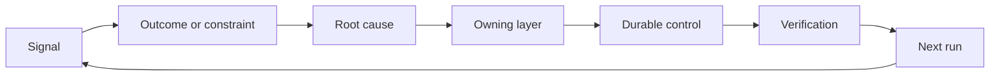

# Xây dựng một Ratchet phản hồi với sở hữu và nghỉ hưu

> Việc vận chuyển đóng một vòng xây dựng và mở vòng học tập bằng chứng phải thay đổi hệ thống hoặc nó sẽ trở thành điện đo không ai sở hữu.

**Type:** Learn + Build
**Languages:** Python (stdlib)
**Prerequisites:** Phase 14 lessons 46 and 53
**Time:** ~75 minutes

## Mục tiêu học tập

- Chuyển đổi các sự cố, đánh giá, hành vi của người dùng và sửa chữa thành hành động của riêng bạn.
- Định hướng mỗi tín hiệu đến bối cảnh, đánh giá, chính sách, thời gian chạy hoặc backlog.
- Cấp ưu tiên tái phát theo mức độ nghiêm trọng và tần suất.
- Đưa cho mọi người kiểm soát một điều kiện nghỉ hưu.

## Phản hồi là cơ sở hạ tầng

Một nhóm có thể thu thập các dấu vết, đánh giá, vé hỗ trợ và nhật ký sự cố mà không cần học hỏi từ bất kỳ một trong số chúng.

Chuyện này là:

1. quan sát một tín hiệu cụ thể;
2. kết nối nó với một kết quả, hạn chế hoặc giả định;
3. xác định lớp hệ thống sớm nhất có nguyên nhân;
4. tạo ra một sự thay đổi giới hạn;
5. xác minh rằng tái phát trở nên ít có khả năng;
6. xem xét xem liệu kiểm soát có nên tiếp tục hay không.

## Con đường đến tầng sở hữu

| Signal | Destination |
|---|---|
| False positive, regression, wrong result | Evaluation or test |
| Missing context, duplicate work, stale fact | Context source or retrieval route |
| Unsafe action or authority gap | Policy or permission boundary |
| Timeout, retry storm, unavailable dependency | Runtime control |
| New product need or unresolved tradeoff | Shaped backlog item |

Xác định nguyên nhân ở lớp hiệu quả sớm nhất. Đừng thêm một đoạn văn nhanh hơn khi thử nghiệm hoặc quyền có thể làm cho sự thất bại không thể xảy ra.



## Quyền sở hữu là một phần của sự kiểm soát

Mỗi hành động cần:

- một chủ sở hữu;
- ưu tiên dựa trên hậu quả và tái phát;
- Các tác phẩm được thay đổi;
- Việc xác minh thay đổi;
- một cửa sổ xem xét hoặc hết hạn;
- Điều kiện nghỉ hưu.

Một cải tiến không có là một quan sát với định dạng tốt hơn.

## Tắt kiểm soát cố định

Các hệ thống phản hồi tích lũy chính sách. Chính sách đó có thể trở nên mâu thuẫn và tốn kém.

- thay đổi kiến trúc hoặc dòng công việc;
- Một tính không biến cấp thấp thay thế cho một hướng dẫn cấp cao hơn;
- lỗi được bảo vệ không xuất hiện trên cửa sổ được chọn;
- kiểm soát ngăn chặn công việc hợp pháp thường xuyên hơn là ngăn chặn thiệt hại.

Tái hưu cũng cần bằng chứng. Đừng xóa một kiểm soát vì nó cảm thấy cũ.

## Kết nối xây dựng và phản hồi của nhân viên lập trình

Cùng một con đòn phục vụ cả hai đường ray:

- Bằng chứng sản phẩm thay đổi khung kết quả, giả định, mảnh hoặc kế hoạch đo lường.
- Các sửa đổi của bộ phận mã hóa thay đổi các thử nghiệm, ngữ cảnh, phạm vi, tự động hóa hoặc giao hàng.
- Các sự cố có thể thay đổi cả giới hạn sản phẩm và bàn làm việc của đại lý.

Đó là lý do tại sao việc định hình xây dựng không phải là một giai đoạn kết thúc trước khi mã hóa. Nó tiếp tục thông qua mọi thay đổi được chấp nhận.

## Hãy xây dựng nó

Phòng thí nghiệm phân loại tín hiệu, tạo ra các hành động ratchet, ưu tiên chúng, và viết `outputs/feedback-backlog.json`- Tôi không biết.

```bash
python3 code/main.py
python3 -m unittest discover code/tests -v
```

Thêm một tín hiệu thời gian chạy và xác nhận rằng nó hướng đến thời gian chạy thay vì sự chậm trễ chung.

## Các bài tập

1. Hãy biến một vụ tai nạn và một khiếu nại của người dùng thành hành động.
2. Hãy cho tên lớp sớm nhất có thể ngăn chặn mỗi lần tái phát.
3. Thêm lệnh xác minh hoặc quan sát vào đầu ra phòng thí nghiệm.
4. Định nghĩa điều kiện nghỉ hưu cho quy tắc chính sách.
5. Theo dõi một đã chấp nhận sửa đổi trở lại khung nhiệm vụ tiếp theo.

## Đọc thêm

- [Basili, Caldiera, and Rombach, The Goal Question Metric Approach](https://www.cs.toronto.edu/~sme/CSC444F/handouts/GQM-paper.pdf), cho việc học tập tổ chức thông qua đo lường hướng đến mục tiêu.
- [Fagerholm et al., Building Blocks for Continuous Experimentation](https://doi.org/10.1145/2601248.2601276), cho vòng lặp kỹ thuật và tổ chức kết nối bằng chứng với phát triển sản phẩm tiếp tục.
- [Nuseibeh and Easterbrook, Requirements Engineering: A Roadmap](https://www.cs.toronto.edu/~sme/papers/2000/ICSE2000.pdf), để xử lý các yêu cầu như phát triển trong chu kỳ đời sống của hệ thống.

## Những gì bạn giữ

Cứ giữ lại`outputs/feedback-backlog.json`. Nó là tác phẩm kết thúc của các sản phẩm phán xét và giao hàng và đầu vào khung kết quả tiếp theo.
