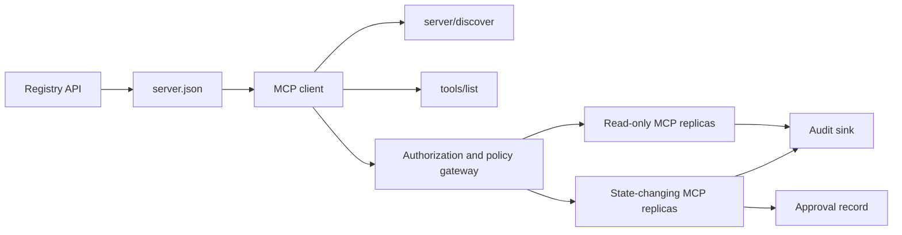

# Capstone 13: MCP Server không có quốc tịch với đăng ký và quản lý

> MCP sản xuất không phải là một quy trình máy chủ. Nó là một chuỗi hợp đồng: dữ liệu siêu dữ liệu được xuất bản, phát hiện trực tiếp, một gói yêu cầu không có quốc tịch, ủy quyền, chính sách, kiểm toán và bằng chứng triển khai.

**Type:** Capstone
**Languages:** Python and TypeScript reference models; any production language
**Prerequisites:** Phase 11, Phase 13, Phase 14, Phase 17, and Phase 18
**Required MCP deep dives:** [Lesson 28: Tool Contracts](../../../13-tools-and-protocols/28-mcp-tool-contracts-and-content/docs/en.md)- [Lesson 29: Reliability](../../../13-tools-and-protocols/29-mcp-reliability-cancellation-and-flow-control/docs/en.md)- [Lesson 30: Registry Supply Chain](../../../13-tools-and-protocols/30-mcp-registry-supply-chain-and-drift/docs/en.md), và[Lesson 31: Conformance Operations](../../../13-tools-and-protocols/31-mcp-conformance-versioning-and-operations/docs/en.md)
**Protocol target:**MCP `2026-07-28`
**Time:** ~25 hours

## Mục tiêu học tập

- Thực hiện yêu cầu và kết quả MCP không có quốc tịch.
- Giữ dữ liệu siêu dữ liệu Registry tách biệt với phát hiện giao thức trực tiếp.
- Xây dựng các công cụ phát hiện xác định, nhận thức về cache.
- Thực hiện chính sách phát hành, khán giả, phạm vi và phê duyệt cho mỗi cuộc gọi công cụ.
- Dùng HTTP Streamable mà không có liên hệ phiên.
- Bằng chứng hành vi tại dây, ủy quyền, chính sách, đăng ký, và kiểm toán biên giới.

## Đường dẫn MCP yêu cầu

Hãy hoàn thành bốn bài học liên kết giai đoạn 13 theo thứ tự trước khi xử lý đá cuối này như sẵn sàng sản xuất:

1. [Lesson 28](../../../13-tools-and-protocols/28-mcp-tool-contracts-and-content/docs/en.md)xác định công cụ, sơ đồ, nội dung, trang, hoàn thành, định tuyến và hợp đồng lỗi mà máy chủ này phải tiết lộ.
2. [Lesson 29](../../../13-tools-and-protocols/29-mcp-reliability-cancellation-and-flow-control/docs/en.md)định nghĩa các cuộc đua hủy bỏ, thời hạn, bất lực, áp lực ngược lại, thử lại và kết nối lại hành vi.
3. [Lesson 30](../../../13-tools-and-protocols/30-mcp-registry-supply-chain-and-drift/docs/en.md)xác định không gian tên, nguồn gốc, pin nhập học, tình trạng Registry, drift, sổ cái và bằng chứng rollback.
4. [Lesson 31](../../../13-tools-and-protocols/31-mcp-conformance-versioning-and-operations/docs/en.md)định nghĩa các bản sao vàng và âm tính, thời kỳ phiên bản nghiêm ngặt, kiểm tra phân biệt SDK, chứng minh đại diện, biên dịch, sức khỏe và khóa phát hành.

Bạch đá kết hợp các hiện vật đó. Nó không thay thế chúng bằng một thử nghiệm SDK đường hạnh phúc.

## Vấn đề

Một nền tảng nội bộ cần các công cụ dữ liệu chỉ đọc và một bộ nhỏ các công cụ thay đổi trạng thái. Các nhà phát triển phải có khả năng khám phá máy chủ, hiểu cách kết nối, kiểm tra khả năng trực tiếp của nó và chỉ gọi các hoạt động mà họ được ủy quyền sử dụng.

Phần khó là không ghi lại một hàm, phần khó là giữ sáu sự thật khác nhau phù hợp:

1. `server.json`nói nơi máy chủ có thể được cài đặt hoặc truy cập.
2. `server/discover`nói về những gì mà quá trình trực tiếp hỗ trợ bây giờ.
3. Mỗi yêu cầu cho biết nó sử dụng các tính năng sửa đổi giao thức và khách hàng nào.
4. Quyền liên kết người gọi với người phát hành, nguồn lực và phạm vi chính xác.
5. Chính sách quyết định liệu hành động cụ thể này có thể được thực hiện hay không.
6. Bằng chứng kiểm toán ghi lại những gì vượt biên giới mà không tiết lộ bí mật hoặc tải trọng hữu ích nhạy cảm.

Nếu bất kỳ một trong những điều này bị biến mất, nền tảng có thể liệt kê một máy chủ không thể tiếp cận, định tuyến một khách hàng không tương thích, chấp nhận một token được đúc cho một nguồn tài nguyên khác, hoặc phơi bày một hành động phá hủy mà không có đánh giá dự kiến.

## Hai lớp phát hiện

Bộ đăng ký và máy chủ MCP trực tiếp trả lời các câu hỏi khác nhau.

| Layer | Contract | Question it answers |
|---|---|---|
| Publication | `server.json` and Registry API | What is this server, where is its package or remote endpoint, and how is it configured? |
| Runtime | `server/discover` | Which protocol versions, capabilities, extensions, and server identity does this process support? |

Các đăng ký chính thức sử dụng một phiên bản `server.json`schema. Một mục từ xa có thể đặt tên cho một URL HTTP Streamable:

```json
{
  "$schema": "https://static.modelcontextprotocol.io/schemas/2025-12-11/server.schema.json",
  "name": "com.example/internal-readonly",
  "title": "Internal Read-Only Tools",
  "description": "Read-only incident and data lookup tools.",
  "version": "1.0.0",
  "remotes": [
    {
      "type": "streamable-http",
      "url": "https://mcp.internal.example.com/readonly"
    }
  ]
}
```

Phiên bản sơ đồ Registry và bản sửa đổi giao thức MCP là độc lập. Đừng viết lại một ngày để phù hợp với ngày khác.

Sơ đồ tính hợp lệ không chứng minh quyền sở hữu không gian tên.`example.com`sử dụng không gian tên DNS ngược `com.example/*`hoặc một trong các không gian tên con của nó. dòng xác thực Registry chứng minh chủ sở hữu đó. giữ các nhãn miền trong thứ tự bình thường của họ tên một không gian tên khác.

Mô hình STDlib của `validate_registry_document`function là một bộ xác nhận hồ sơ từ xa một cách cố ý. Nó kiểm tra các chức năng cần thiết `name`- `description`, và`version`các trường; tùy chọn `title`; tên và độ dài được công bố; hình dạng phiên bản bê tông; và mỗi `streamable-http`hoặc `sse`hình dạng URL HTTP(S của từ xa. Nó cũng yêu cầu một không trống `remotes`danh sách vì đá cuối này luôn luôn hoạt động thăm dò từ xa. `validate_publisher_namespace`kiểm tra riêng tên với tên miền nhà xuất bản được xác minh, trong khi `validate_runtime_alignment`so sánh tên và phiên bản của ấn phẩm với live `serverInfo`. Các kế hoạch chính thức cũng hỗ trợ các bản ghi chỉ gói và nhiều lĩnh vực xa hơn. Trước khi xuất bản, xác nhận toàn bộ tài liệu với các kế hoạch chính thức JSON gắn hoặc `mcp-publisher`; không trình bày bộ phận không phụ thuộc này như là xác thực đầy đủ sơ đồ.

Server phải thực hiện `server/discover`; một client có thể gọi nó trước các phương pháp khác. Client capstone này làm như vậy sau khi giải quyết điểm cuối, và nhận được bản sửa đổi giao thức hiện tại và khả năng sống:

```json
{
  "resultType": "complete",
  "supportedVersions": ["2026-07-28"],
  "capabilities": {
    "tools": {
      "listChanged": false
    }
  },
  "_meta": {
    "io.modelcontextprotocol/serverInfo": {
      "name": "com.example/internal-readonly",
      "version": "1.0.0"
    }
  },
  "ttlMs": 3600000,
  "cacheScope": "public"
}
```

Một danh mục riêng có thể chỉ mục quyền sở hữu, đánh giá hoặc dữ liệu vòng đời bổ sung, nhưng nó không được phát minh ra dữ liệu đó như các trường dây MCP hoặc gốc `server.json`Các trường. lưu trữ chính sách tổ chức bên cạnh hồ sơ được xuất bản. Khi cần thông tin siêu dữ liệu tùy chỉnh công cộng, sử dụng thư ký của `_meta.io.modelcontextprotocol.registry/publisher-provided`mở rộng và ở trong giới hạn 4 KB của nó.

## Core MCP không quốc tịch

Việc sửa đổi MCP `2026-07-28`xóa các phiên giao thức và các`initialize`- `notifications/initialized`Nhúng tay. Nó cũng loại bỏ`Mcp-Session-Id`- Tôi không biết.

Mỗi yêu cầu đều có ngữ cảnh giao thức trong `params._meta`- Có thể là:

```json
{
  "io.modelcontextprotocol/protocolVersion": "2026-07-28",
  "io.modelcontextprotocol/clientCapabilities": {},
  "io.modelcontextprotocol/clientInfo": {
    "name": "internal-platform-client",
    "version": "1.0.0"
  }
}
```

Phiên bản và khả năng là yêu cầu thực tế, không phải các sự kiện kết nối. Một bộ cân bằng tải có thể gửi yêu cầu liên tiếp đến các bản sao khỏe mạnh khác nhau vì bất kỳ bản sao nào có thể xác nhận yêu cầu từ bản tin.

Kết quả bình thường bao gồm:`resultType: "complete"`Các máy chủ nên đặt danh tính của họ trong `_meta.io.modelcontextprotocol/serverInfo`Một phiên bản giao thức bị thiếu hoặc không có chuỗi là các tham số không hợp lệ `-32602`. Thầm `-32022`chỉ dành cho một chuỗi cung cấp không được hỗ trợ, với chính xác `{"supported": ["2026-07-28"], "requested": "..."}`như dữ liệu của nó.

### Khám phá ẩn

`tools/list`phải xác định cho cùng một bộ công cụ hiệu quả. Kết quả bao gồm:

- `ttlMs`, một gợi ý tươi mới cho khách hàng;
- `cacheScope`, hoặc `public`hoặc `private`-
- một thứ tự công cụ ổn định để các danh sách giống nhau có thể tái sử dụng bộ nhớ cache nhanh;
- `resultType: "complete"`và dữ liệu siêu dữ liệu danh tính máy chủ.

`cacheScope: "private"`. Đừng đặt khả năng hiển thị cụ thể của công cụ cho người dùng sau một bộ nhớ cache công cộng được chia sẻ.

## HTTP được phát trực tuyến

Một máy chủ mạng cho thấy một điểm cuối MCP chấp nhận POST. Mỗi yêu cầu hoặc thông báo JSON-RPC nhận được POST riêng của mình.

Đối với yêu cầu, máy chủ trả lại hoặc một đối tượng JSON hoặc một dòng SSE được quy mô cho yêu cầu đó.`subscriptions/listen`yêu cầu có thông báo thay đổi được chọn. Không có dòng GET độc lập, session DELETE, session header, hoặc `Last-Event-ID`tái phát trong vận chuyển hiện tại.

Mỗi yêu cầu bao gồm:

- `MCP-Protocol-Version`, phù hợp với các metadata cơ thể;
- `Mcp-Method`, phù hợp với phương pháp JSON-RPC;
- `Mcp-Name`cho `tools/call`- `resources/read`, và`prompts/get`-
- `Accept: application/json, text/event-stream`- Tôi không biết.

Tháo tiêu đề gương không phù hợp với các tiêu đề được chỉ định `-32020`lỗi.`Origin`, liên kết các máy chủ phát triển địa phương với loopback, xác thực các khách hàng từ xa, và coi phản ứng SSE được yêu cầu đóng như hủy.



```figure
cf-mcp-gate
```

## Giấy phép và chính sách

Métadata vận chuyển không phải là phép.

Đối với máy chủ từ xa:

1. Khám phá dữ liệu siêu dữ liệu nguồn được bảo vệ.
2. Chọn máy chủ ủy quyền cho tài nguyên đó.
3. Ưu tiên ID Client Metadata Documents để đăng ký khách hàng.
4. Gửi chỉ số nguồn trong quá trình ủy quyền.
5. Thiết lập một return `iss`giá trị so với máy chủ ủy quyền được ghi lại cho dòng chảy.
6. Thông tin tín dụng khách hàng chính theo nhà phát hành. Không bao giờ sử dụng lại dữ liệu đăng ký trên các nhà phát hành.
7. Thiết lập các công cụ giao dịch và các công cụ giao dịch.
8. Lấy một quyết định chính sách thứ hai vào công cụ cụ thể và các lập luận.

Các chú thích công cụ như `readOnlyHint`và `destructiveHint`giúp khách hàng có nguy cơ. Họ không phải là kiểm soát ủy quyền đáng tin cậy.

### Sự chấp thuận là một bản ghi, không phải là một phạm vi phép thuật

Một cuộc gọi thay đổi trạng thái cần một hồ sơ phê duyệt gắn với người chơi, công cụ, các lập luận hoặc tiêu hóa bình thường, môi trường mục tiêu, hết hạn và chính sách sử dụng một lần hoặc lặp lại.

Mô hình Python phân phối JSON theo quy định, sau đó liên kết kết tiêu hóa với đối tượng token, tên công cụ, URL máy chủ và hết hạn. Chơi lại bản ghi sau khi thay đổi ngay cả một lập luận thất bại trước khi trình xử lý chạy.

Giữ các công cụ có nguy cơ cao trên bề mặt có thể xem xét riêng biệt khi điều đó làm giảm đáng kể bán kính nổ.

## Hãy xây dựng nó

### 1. Mô hình metadata xuất bản

Tạo và xác nhận sơ đồ `server.json`. Bao gồm một tên ổn định trong không gian tên được xác thực cho nhà xuất bản, cộng với phiên bản, mô tả, chính thức `repository`hoặc `packages`Metadata khi có thể, và một vận chuyển từ xa hoặc trên đài.

### 2. Thực hiện phát hiện trực tiếp

Thực hiện`server/discover`trước bất kỳ tính năng nào RPC. quảng cáo các phiên bản giao thức được hỗ trợ, khả năng, mở rộng và danh tính máy chủ. Thêm trường hợp từ chối phiên bản bằng cách sử dụng `-32022`- Tôi không biết.

### 3. Thực hiện phong bì vô quốc tịch

Cần phiên bản giao thức và khả năng của khách hàng trong mỗi yêu cầu.`resultType`và danh tính máy chủ trong mỗi kết quả. xóa trạng thái khởi tạo, cache khả năng kết nối và các nhận dạng phiên.

### 4. Xây dựng bề mặt công cụ

Bắt đầu với hai công cụ chỉ đọc và một công cụ thay đổi trạng thái. Cho mỗi một JSON Schema giới hạn, mô tả chính xác, hình dạng kết quả xác định và ghi chú trung thực. Thêm các sơ đồ đầu ra khi khách hàng dựa vào kết quả có cấu trúc.

### 5. Thêm danh sách cache-aware

Thuật dụng trả lại trong trật tự ổn định với `ttlMs`và `cacheScope`Thực hành hành vi thông báo hết hạn cache và thay đổi danh sách riêng biệt.

### 6. Thêm phép và chính sách

Thiết lập thông tin về người phát hành, khán giả, hết hạn và phạm vi. Thực hiện quyết định chính sách cho mỗi cuộc gọi công cụ. Kết hợp sự chấp thuận với các hành động có rủi ro cao. Phước từ bỏ hoặc trì hoãn sự chấp thuận trước khi thực hiện một người xử lý.

### 7. Đăng ký riêng biệt và xác thực thời gian chạy

Thiết lập tính toán tĩnh `server.json`ghi lại, sau đó thăm dò điểm cuối từ xa với `server/discover`. báo cáo trôi khi các bộ điều khiển từ xa, danh tính, phiên bản hoặc khả năng yêu cầu được xuất bản không đồng ý với quá trình trực tiếp.

### 8. Thêm bằng chứng kiểm toán

Đăng ký diễn viên, nhà phát hành, tài nguyên, công cụ, quyết định chính sách, nhận dạng yêu cầu, bối cảnh theo dõi, độ trễ và kết quả. Tạo lại hoặc tiêu hóa các lập luận và kết quả nhạy cảm trước khi kiên trì. Giữ bộ phận kiểm toán bên ngoài bối cảnh hiển thị của mô hình.

### 9. Thực hành quy mô ngang

Đặt hai bản sao không có quốc gia sau một bộ cân bằng tải. Gửi ít nhất 100 yêu cầu đồng thời. Cố gắng chứng minh rằng tính chính xác không phụ thuộc vào sự thân mật. Nếu một công cụ cần trạng thái gọi chéo, hãy đúc một tay cầm không rõ ràng và lưu trữ nó trong một hệ thống bền chung.

### 10. Tham gia dây thật

Thực hiện kiểm tra phù hợp với bộ nhị phân máy chủ thực tế. Chụp tiêu đề yêu cầu và cơ thể JSON, không chỉ đối tượng SDK. Thực hành phiên bản sai, không phù hợp tiêu đề, phạm vi thiếu, khán giả sai, lập luận sai, lỗi xử lý, hủy và hết hạn cache.

## Bao gồm các chứng cứ cần thiết

Một hồ sơ không đầy đủ cho đến khi nó chứa tất cả năm lớp bằng chứng:

| Evidence | Minimum proof | Source lesson |
|---|---|---|
| Wire | Redacted raw headers and JSON-RPC bodies for golden and negative cases, including metadata type failure, header mismatch, unsupported version, missing or unknown `resultType`, notification no-response, and response ID matching | [Lesson 31](../../../13-tools-and-protocols/31-mcp-conformance-versioning-and-operations/docs/en.md) |
| Proxy | The same stable case run directly and through the deployed intermediary, with ingress, origin, and egress status and body digests; prove protocol errors are not collapsed into generic 500 responses and streaming is not buffered | [Lessons 29](../../../13-tools-and-protocols/29-mcp-reliability-cancellation-and-flow-control/docs/en.md) and [31](../../../13-tools-and-protocols/31-mcp-conformance-versioning-and-operations/docs/en.md) |
| Admission | Verified publisher namespace, immutable Registry record digest, artifact or remote provenance, live `server/discover` identity and capability observation, descriptor pin, current Registry status, and admission-ledger event | [Lesson 30](../../../13-tools-and-protocols/30-mcp-registry-supply-chain-and-drift/docs/en.md) |
| Retry | A cancellation-versus-completion race, explicit timeout, safe read retry, mutation idempotency key, reconnect refetch, and proof that request cancellation cannot silently become durable task cancellation | [Lesson 29](../../../13-tools-and-protocols/29-mcp-reliability-cancellation-and-flow-control/docs/en.md) |
| Rollback | Exact previous version, admission and artifact digests, descriptor pin, active Registry status, current health window, route restoration result, and redacted decision evidence | [Lessons 30](../../../13-tools-and-protocols/30-mcp-registry-supply-chain-and-drift/docs/en.md) and [31](../../../13-tools-and-protocols/31-mcp-conformance-versioning-and-operations/docs/en.md) |

Cung cấp một bản sao của gói đã được chỉnh sửa cùng với bản phát hành. Nếu bất kỳ lớp nào bị thiếu, giữ bản phát hành. Đừng suy luận hành vi đại diện từ một trình phát hành đang trong quá trình, nhập từ sự hiện diện của Registry, thử lại an toàn từ một ID JSON-RPC mới, hoặc sẵn sàng quay lại từ việc triển khai trước đó.

## Các mô hình tham chiếu địa phương

Mô hình Python cho thấy dữ liệu siêu dữ liệu đăng ký, xác thực không gian tên nhà xuất bản DNS ngược, kiểm tra danh tính xuất bản đến thời gian chạy, phát hiện trực tiếp, danh sách công cụ xác định, dữ liệu siêu dữ liệu theo yêu cầu, người phát hành đáng tin cậy, khán giả, hết hạn và kiểm tra phạm vi, phê duyệt bị ràng buộc hành động, xác nhận đăng ký một phần được ghi chép, chính sách và kiểm toán mà không mở ổ cắm mạng:

```bash
cd phases/19-capstone-projects/13-mcp-server-with-registry
python3 code/main.py
python3 -m unittest discover -s code/tests -v
```

Dự án TypeScript phơi bày hình dạng JSON-RPC không có trạng thái qua studio mà không có MCP SDK.`tools/call`path thực thi các chương trình đầu vào hạn chế tương tự được quảng cáo bởi `tools/list`; các lập luận không hợp lệ cho một công cụ được biết đến trả lại kết quả hoàn chỉnh với `isError: true`Không gọi người thực thi:

```bash
cd phases/19-capstone-projects/13-mcp-server-with-registry/code/ts
npm install
npm run typecheck
npm test
npm run demo
```

Những mô hình này chứng minh logic hợp đồng địa phương. Chúng không chứng minh tiêu đề HTTP, trao đổi OAuth, xuất bản Registry, tích hợp OPA, cân bằng tải trọng hoặc biên nhận người thu thập.

## Ví dụ về dây

```http
POST /mcp HTTP/1.1
Host: mcp.internal.example.com
Content-Type: application/json
Accept: application/json, text/event-stream
MCP-Protocol-Version: 2026-07-28
Mcp-Method: tools/call
Mcp-Name: postgres.readonly
Authorization: Bearer REDACTED

{
  "jsonrpc": "2.0",
  "id": 42,
  "method": "tools/call",
  "params": {
    "name": "postgres.readonly",
    "arguments": {"sql": "SELECT 1"},
    "_meta": {
      "io.modelcontextprotocol/protocolVersion": "2026-07-28",
      "io.modelcontextprotocol/clientCapabilities": {},
      "io.modelcontextprotocol/clientInfo": {
        "name": "internal-platform-client",
        "version": "1.0.0"
      }
    }
  }
}
```

## Chuyển nó

Chuyển một kho chứa:

- một schema-valid `server.json`-
- Các bề mặt máy chủ chỉ đọc và thay đổi trạng thái;
- `server/discover`, định nghĩa `tools/list`, và chính sách được ghi`tools/call`-
- Một bản triển khai HTTP được phát trực tuyến với hai bản sao có thể thay thế;
- Việc hợp nhất các phép và phê duyệt;
- Một nhà xuất bản Registry hoặc bộ điều chỉnh API Registry riêng;
- Các định nghĩa chính sách và hồ sơ phê duyệt liên quan đến hành động;
- Kết quả kiểm toán đã được xóa và sự lan truyền dấu vết;
- Bằng chứng về lỗi điện tử và đại diện;
- nhận, thử lại, sức khỏe, và chứng cứ quay lại với một bản ghi của gói đã sửa đổi.

| Weight | Criterion | Evidence |
|---:|---|---|
| 25 | Protocol correctness | Stateless request metadata, discovery, results, headers, and negative cases |
| 20 | Authorization | Issuer, audience, expiry, scope, and action-bound approval cases |
| 15 | Registry integrity | Valid `server.json`, publication record, live discovery probe, and drift report |
| 15 | Policy and safety | Allow, deny, malformed, stale approval, and sensitive-data cases |
| 15 | Scale and reliability | Two replicas, no affinity dependency, cancellation, timeout, and recovery |
| 10 | Auditability | Redacted receiver-side audit and trace evidence |

## Các bài tập

1. Thay đổi URL từ xa được xuất bản trong khi để lại máy chủ trực tiếp không thay đổi. Làm cho báo cáo xác thực đăng ký dẫn dắt chính xác.
2. Gửi đi`tools/list`hai lần với đầu vào giống nhau và chứng minh các bộ lệnh công cụ ổn định bằng byte.`ttlMs`và làm mới.
3. Đưa một cơ thể hợp lệ với một cơ thể khác.`MCP-Protocol-Version`- Trở lại.`-32020`và không sử dụng chính sách hoặc công cụ.
4. Mint một token cho máy chủ chỉ đọc và trình bày nó cho máy chủ thay đổi trạng thái. chứng minh xác thực khán giả thất bại trước khi xử lý chạy.
5. Kết nối sự chấp thuận với một bài kiểm tra lập luận bình thường, thay đổi một trường và chứng minh sự chấp thuận không thể được lặp lại.
6. Đường dẫn các cuộc gọi liên tiếp đến các bản sao thay thế. Thay thế bộ nhớ quá trình ẩn bằng một tay cầm được chia sẻ rõ ràng bất cứ khi nào workflow cần sự kiên trì.
7. Phá vỡ kết nối SSE được yêu cầu và thử lại với một ID yêu cầu JSON-RPC mới.`Last-Event-ID`đường phục hồi được sử dụng.

## Các điều khoản chính

| Term | What people say | What it actually means |
|---|---|---|
| Stateless MCP | "No state anywhere" | No protocol session; cross-call state is explicit and server-managed |
| `server.json` | "The tool manifest" | Registry metadata for naming, packaging, configuration, and transports |
| `server/discover` | "The handshake" | A normal mandatory RPC for live versions and capabilities, not a session initializer |
| Cache scope | "Can I cache it?" | Whether a cacheable result is safe for shared or private reuse |
| Policy decision | "The token allows it" | A separate decision over actor, tool, target, arguments, and context |
| Approval record | "A human clicked yes" | Evidence bound to one actor and consequential action under an expiry policy |
| Explicit handle | "A session ID" | Ordinary application data for named server-managed state, not protocol connection state |

## Đọc thêm

- [MCP 2026-07-28 key changes](https://modelcontextprotocol.io/specification/2026-07-28/changelog)
- [Streamable HTTP](https://modelcontextprotocol.io/specification/2026-07-28/basic/transports/streamable-http)
- [Server discovery](https://modelcontextprotocol.io/specification/2026-07-28/server/discover)
- [MCP authorization](https://modelcontextprotocol.io/specification/2026-07-28/basic/authorization)
- [Official Registry server.json requirements](https://github.com/modelcontextprotocol/registry/blob/main/docs/reference/server-json/official-registry-requirements.md)
- [Official Registry OpenAPI contract](https://registry.modelcontextprotocol.io/openapi.yaml)
