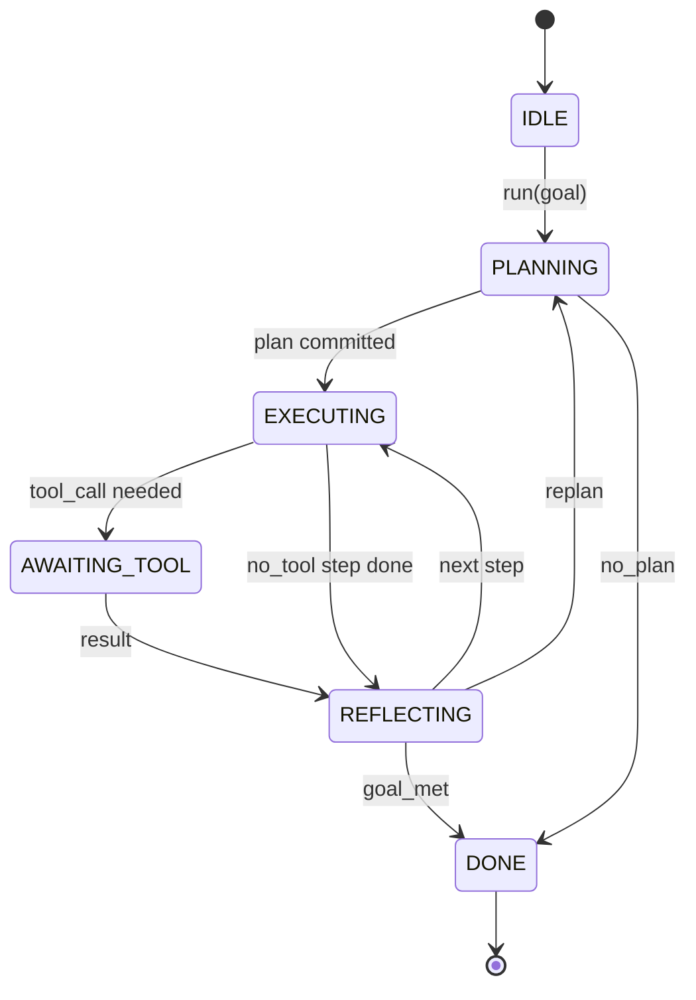

# Hợp đồng vòng lặp của đại lý Harness

> Bộ đeo là đại lý, mô hình là một bộ xử lý đồng bộ. Bài học này đóng băng hợp đồng vòng lặp mà bạn có thể cáp bất kỳ mô hình nào vào.

**Type:** Build
**Languages:** Python
**Prerequisites:** Phase 13 lessons 01-07, Phase 14 lesson 01
**Time:** ~90 minutes

## Mục tiêu học tập
- Định nghĩa một vòng lặp sử dụng chất tác nhân như một máy trạng thái xác định với chuyển đổi rõ ràng.
- Thực hiện mười chủ đề vòng đời mà các nhà điều hành dây chính sách, viễn thông và hàng rào vào.
- Định nghĩa hai điểm kéo mà vòng lặp trả lại kiểm soát cho người gọi và tiếp tục vào một đầu vào mới.
- Thực hiện ngân sách mỗi phiên (giây, gọi công cụ, đồng hồ tường) mà không rò rỉ trạng thái một phần khi vượt quá.
- Giả ra một dòng dòng được đánh máy gồm 11 loại sự kiện để UI và người theo dõi có thể đăng ký mà không cần kiểm tra vòng lặp trực tiếp.

```figure
cf-loop-contract
```

## Tâm

Một đại lý lập trình chạy không được giám sát trong bốn mươi lượt không phải là một vòng lặp trò chuyện. Nó là một máy trạng thái mà các nút của nó có thể bị người vận hành chặn và mà các cạnh của nó có thể kiểm tra. Một khi bạn viết hợp đồng xuống, đổi các mô hình, công cụ hoặc chính sách không còn là một yếu tố. Nó trở thành một cuộc gọi đăng ký.

Bài học này xây dựng hợp đồng đó. Chúng tôi đặt tên sáu tiểu bang, mười chủ đề nát, hai điểm kéo, mười một loại sự kiện và một phong bì ngân sách. Mọi thứ khác trong vòng (đồ đăng ký công cụ, giao thông JSON-RPC, máy phát, lập kế hoạch) được cắm vào hình dạng này.

## Các tiểu bang

Loop có 6 trạng thái, 5 trạng thái hoạt động, 1 trạng thái cuối cùng.



`IDLE`là điểm nhập cảnh hợp pháp duy nhất. `DONE`là lối thoát hợp pháp duy nhất.`AWAITING_TOOL`là trạng thái duy nhất tạo ra điểm kéo.

Máy trạng thái là xác định. Với cùng một nhật ký sự kiện, vòng xoắn lại vào cùng một trạng thái. thuộc tính đó là điều cho phép bạn chơi lại các phiên để gỡ lỗi mà không cần gọi lại mô hình.

## Các chủ đề cá mập

Các cái nón là một cái nón của người vận hành trong vòng lặp. Các dây đeo bắn mười chủ đề. Mỗi chủ đề chấp nhận bất kỳ số lượng nào của người đăng ký. Người đăng ký bắn theo thứ tự đăng ký. Người đăng ký có thể đột biến tải hữu ích, nâng để hủy lượt, hoặc trả lại một chiếc sentinel để bỏ qua bước tiếp theo.

```text
before_plan         after_plan
before_tool_call    after_tool_call
before_step         after_step
on_error
on_pause
on_budget_exceeded
on_complete
```

Hình dạng phản ánh những gì Claude Code, Cursor và OpenCode tất cả hội tụ vào giữa năm 2025.`rm -rf`sống ở `before_tool_call`Một cái móng đưa một khoảng thời gian OpenTelemetry sống trong`after_step`Một con cá bắt đầu lại một buổi họp tạm dừng sống trong`on_pause`- Tôi không biết.

## Các điểm kéo

Lòng vòng quay sẽ cung cấp điều khiển hai lần.`AWAITING_TOOL`khi nó không thể tiến bộ mà không có kết quả công cụ.`on_pause`khi ngân sách bị kiệt sức hoặc một cái nón rõ ràng yêu cầu kiểm tra con người.

Một điểm kéo không phải là ngoại lệ, nó là một trở lại. Người gọi kiểm tra trạng thái dây đeo, lấy bất cứ điều gì dây đeo yêu cầu, và gọi.`resume(payload)`. dây thừng bắt đầu ở nơi nó dừng lại. Đây là hình dạng tương tự như một máy phát điện Python. vận chuyển qua điểm kéo là tùy chọn của bạn. Trong một TUI nó là bàn phím. trên MCP nó là`tools/call`Trên một hàng, đó là một cuộc thăm dò công việc.

## Chuỗi sự kiện

Loop này gắn các sự kiện vào một dòng chảy được gõ tại các điểm cụ thể trong hợp đồng.

- `session.start` phát ra một lần khi `run(goal)`được gọi là
- `plan.draft` được phát hành khi nhà hoạch định trả lại bản dự thảo kế hoạch
- `plan.commit` được phát hành sau khi dự thảo được cam kết như là kế hoạch hoạt động
- `step.start` phát hành vào đầu mỗi bước thực hiện
- `step.end` phát hành vào cuối mỗi bước thực hiện
- `tool.call` phát ra khi một bước yêu cầu công cụ cung cấp quyền kiểm soát cho người gọi
- `tool.result` được phát hành trên sơ yếu lý lịch với kết quả công cụ
- `tool.error` phát hành trong hồ sơ với một lỗi hoặc khi một cái móc phá vỡ cuộc gọi
- `budget.warn` phát hành khi đạt được giới hạn ngân sách
- `session.pause` phát ra khi vòng lặp tạo ra một khoảng thời gian tạm dừng (khuế toán hoặc nồi)
- `session.complete` phát ra một lần khi vòng lặp đạt đến `DONE`

Các sự kiện không trùng lặp tải trọng lợi ích của nồi. nồi là bắt buộc (tiến đổi, hủy bỏ).

## Bộ ngân sách

Một phiên có ba giới hạn. số lượt, số lượt công cụ, giây đồng hồ tường. Mỗi lượt tăng lượt một lần. Mỗi công cụ gọi tăng số lượt công cụ gọi một lần. Wall-clock được kiểm tra ở mỗi chuyển đổi trạng thái. Khi đạt được bất kỳ giới hạn nào, vòng lặp sẽ được kích hoạt`on_budget_exceeded`, phát ra `budget.warn`, sau đó chuyển sang `IDLE`với một lý do vượt quá ngân sách ở điểm kéo tiếp theo.

Ngân sách không phải là một chuyển đổi giết người, nó là một lợi nhuận. Người gọi quyết định liệu có nên kéo dài ngân sách và tiếp tục, hoặc để đóng phiên.

## Bài học này không làm gì

Nó không gọi một mô hình, nó không đăng ký các công cụ thực sự, nó không thực hiện một vận chuyển. Đó là bốn bài học tiếp theo. Bài học này đóng đinh hợp đồng để bốn tiếp theo có thể kết nối nó mà không cần viết lại.

Nhà lập kế hoạch định nghĩa trong `main.py`là một thay thế. nó trả lại một kế hoạch mã hóa cứng của ba bước, hai trong đó yêu cầu một kết quả công cụ. điểm là vòng lặp, không phải kế hoạch.

## Làm thế nào để đọc mã

`HarnessLoop`là lớp chính, giữ nhà nước, bắn móng, phát sóng các sự kiện.`Budget`- Đường giới hạn.`Event`là phong bì được đánh dấu trên dòng chảy. `HookRegistry`là bàn giao hàng.`_transition`là chức năng duy nhất thay đổi trạng thái, vì vậy các tính bất biến của máy trạng thái sống ở một nơi.

Đọc `main.py`Từ trên xuống dưới.`code/tests/test_loop.py`Các thử nghiệm ghi lại từng chuyển tiếp và từng lệnh bắn.

## Đi xa hơn nữa

Phần khó khăn nhất trong việc xây dựng một dây đeo trong sản xuất không phải là máy nhà nước. Nó đang làm cho hợp đồng có thể thực thi được. Hợp đồng phải tồn tại trong một tải lại nóng của người lập kế hoạch. Nó phải tồn tại trong một công cụ trả về JSON bị hình dạng sai. Nó phải tồn tại trong một cái móng mà nâng lên trong `before_tool_call`2/3 của cách qua một phiên 40 lượt. Các bài kiểm tra trong bài học này thực hiện các chế độ thất bại.

Bài học tiếp theo thêm vào danh sách công cụ. Sau đó, giao thông JSON-RPC. Sau đó, bộ chuyển tiếp.
