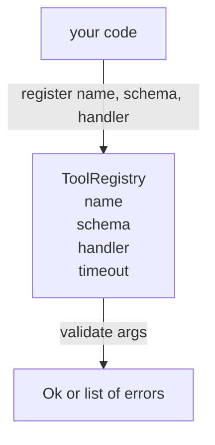

# Đăng ký công cụ với xác thực sơ đồ

> Một công cụ mà đại lý không thể xác nhận là một công cụ mà đại lý không thể gọi.

**Type:** Build
**Languages:** Python
**Prerequisites:** Phase 13 lessons 01-07, Phase 14 lesson 01
**Time:** ~90 minutes

## Mục tiêu học tập
- Giữ một sổ đăng ký nhập tên công cụ → schema → xử lý mà người phát triển có thể hỏi một lần và tin vào sau đó.
- Thực hiện một bộ phận JSON Schema 2020-12 bao gồm các từ khóa chín mươi phần trăm các cuộc gọi công cụ thực sự sử dụng.
- Trở lại chính xác, đường lối sai lầm hình dạng chỉ số json để mô hình có thể tự sửa chữa trong một chuyến đi vòng.
- Nhận lại đăng ký mà không có sự phủ nhận rõ ràng, vì việc phủ nhận im lặng là cách các danh mục công cụ sản xuất di chuyển.
- Giữ xác thực viên sạch (không I / O, không thời gian, không toàn cầu) để nó có thể được chạy lại trên một nhật ký lặp lại.

```figure
cf-registry-validate
```

## Tại sao registry đến trước công cụ

Một đại lý lập trình vào năm 2026 có nhiều công cụ được đăng ký hơn mô hình có thể phù hợp trong một cửa sổ ngữ cảnh duy nhất. Một vòng xoáy không tầm thường sẽ ghi lại hai trăm công cụ và bề mặt từ mười đến bốn mươi ở bất kỳ lượt nào. Các hồ sơ là nguồn sự thật cho "những công cụ nào tồn tại", "những hình dạng nào của các lập luận của họ", và "những người xử lý nào tôi gọi". Một khi ba câu trả lời đó được gắn, phần còn lại của vòng có thể ngừng đoán.

Thầm lẫn mà chúng ta đang tránh là vận chuyển người xử lý không có kế hoạch, hoặc vận chuyển các kế hoạch không xác nhận. Cả hai đều phổ biến. Cả hai biến lớp tiếp theo (người vận chuyển trong bài học hai mươi ba) thành một trò chơi đoán nơi chế độ thất bại duy nhất là dấu vết hàng đống từ người xử lý.

## Một hồ sơ công cụ trông như thế nào

```text
ToolRecord
  name        : str          (unique, lowercase alphanumeric and underscore segments separated by dots, e.g., snake_case.segment.case)
  description : str          (one line, shown to the model)
  schema      : dict         (JSON Schema 2020-12 subset)
  handler     : Callable     (async or sync, returns Any)
  idempotent  : bool         (dispatcher uses this for retry decisions)
  timeout_ms  : int          (override per-tool dispatcher default)
```

Các quy trình là trường duy nhất mà người xác nhận chạm vào. bộ xử lý là không minh bạch cho nó. Chúng tôi tách chúng một cách cố ý. Các quy trình là dữ liệu. bộ xử lý là mã. Trộn chúng khiến bạn đặt logic xác nhận bên trong bộ xử lý, đó là lỗi chúng tôi đang dừng lại.

## Các bộ phận của JSON Schema 2020-12

Các thông số kỹ thuật toàn bộ năm 2020-12 là một bài báo. Chúng tôi cần tám từ khóa.

```text
type           string / number / integer / boolean / object / array / null
properties     map of property name -> schema
required       list of property names
enum           list of allowed primitive values
minLength      integer, applies to strings
maxLength      integer, applies to strings
pattern        ECMA-262-compatible regex, applies to strings
items          schema applied to every array element
```

Đó là đủ để bao gồm những gì một API công cụ thực sự cần. Các từ khóa mà chúng tôi không thêm vào (oneOf, anyOf, allOf, $ref, điều kiện) là hợp lệ trong các sơ đồ sản xuất nhưng biến xác thực viên thành một bộ đi bộ cây với chu kỳ. Chúng tôi đang xây dựng một registry, không phải một công cụ JSON Schema.

## Json đường dẫn lỗi chỉ dẫn

Khi xác thực thất bại, trình xác nhận trả lại danh sách các lỗi. Mỗi lỗi mang theo một con đường chỉ số json vào đầu vào. Một chỉ số là một chuỗi tên thuộc tính và chỉ số mảng được cố định bằng slash.

```text
{"a": {"b": [1, 2, "x"]}}
                    ^
                    /a/b/2
```

Mô hình đọc đường lỗi tốt hơn so với nó đọc câu. Nếu một sơ đồ yêu cầu `args.user.email`và mô hình vượt qua một số nguyên, sai lầm nên là `/user/email`với `expected_type: string`Mô hình sẽ sửa chữa điều đó trong cuộc gọi tiếp theo mà không cần một vòng ngôn ngữ tự nhiên.

## Việc đăng ký và bỏ qua

`register(name, schema, handler, **opts)`từ chối đăng ký lại theo mặc định. Người gọi phải vượt qua `override=True`Đây là vệ sinh hoạt động. hai phần của cơ sở mã âm thầm đăng ký tên công cụ tương tự là loại lỗi mà mất một tuần để tìm thấy trong sản xuất.

Các đăng ký phơi bày ba phương pháp đọc. `get(name)`trả lại hồ sơ hoặc tăng. `validate(name, args)`trả lại một `Ok`hoặc một danh sách lỗi. `names()`trả lại tên công cụ theo thứ tự đăng ký.

## Điều gì là chất xác nhận và không phải là

Nó là một lần qua cây schema, tái tạo. Nó là tinh khiết. Nó không gọi người xử lý. Nó không ép kiểu (một chuỗi)`"42"`Nó không âm thầm cắt giảm.

Đây không phải là ranh giới bảo mật. Một người xử lý độc hại vẫn có thể hành vi sai trái sau khi xác nhận vượt qua. Người phát sóng trong bài học hai mươi ba thêm thời gian và lớp hộp rác. Kế hoạch đăng ký thêm hình dạng.

## Hình dạng



## Làm thế nào để đọc mã

`code/main.py`định nghĩa `ToolRegistry`- `ToolRecord`- `ValidationError`, và tám chức năng xác nhận.`schema["type"]`(hoặc xử lý một kế hoạch với `enum`mỗi loại xác nhận trả lại hoặc một danh sách trống hoặc một danh sách của `ValidationError`- Người đi bộ cấp cao nhất kết nối các lỗi và prepend các đoạn đường khi nó đi xuống.

`code/tests/test_registry.py`bao gồm đăng ký, bỏ qua, thành công xác nhận, thất bại xác nhận với các đường dẫn và mọi từ khóa trong bộ phận.

## Đi xa hơn nữa

Hai phần mở rộng mà bạn sẽ cần khi bài học này kết thúc là`$ref`giải quyết chống lại một khối định nghĩa địa phương, và `additionalProperties: false`Chúng tôi đã bỏ qua bài học để giữ tập tin dưới một đọc.

Bài học tiếp theo (tứ hai mươi hai) xây dựng giao thông studio JSON-RPC xuất hiện trên registry này cho một khách hàng mô hình. Bài học sau (tứ hai mươi ba) bao quanh cả hai phía sau một máy phát sóng với thời gian và thử lại.
