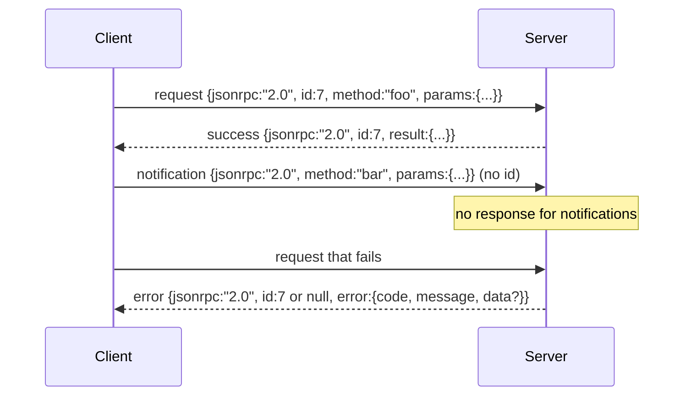

# JSON-RPC 2.0 Over Newline-Delimited Stdio

> Việc vận chuyển giữa một khách hàng mô hình và một máy chủ công cụ là JSON-RPC qua stdio.

**Type:** Build
**Languages:** Python
**Prerequisites:** Phase 13 lessons 01-07, Phase 14 lesson 01
**Time:** ~90 minutes

## Mục tiêu học tập
- Nói JSON-RPC 2.0 được khung thành như là dòng mới giới hạn JSON trên stdin và stdout.
- Bản đồ năm mã lỗi tiêu chuẩn (-32700, -32600, -32601, -32602, -32603) và làm cho chúng có nghĩa ngữ đúng.
- Sự khác biệt giữa các yêu cầu, phản hồi, thông báo và lô mà không phát minh ra các khóa phong bì mới.
- Chọn một lỗi phân tích trên mỗi dòng mà không làm độc phần còn lại của dòng.
- Xây dựng một bản demo tự kết thúc sử dụng io.BytesIO để bài học chạy mà không sinh ra một quá trình con.

```figure
cf-jsonrpc-frames
```

## Tại sao JSON-RPC vẫn là ngôn ngữ ngoại ngữ

Một đại lý lập trình vào năm 2026 nói chuyện với có lẽ 12 máy chủ công cụ trong một phiên. Mỗi máy chủ là một quá trình riêng biệt hoặc một điểm cuối từ xa. Phương thức điện thoại đã giống nhau kể từ năm 2013. JSON-RPC 2.0 là mô hình hai trang. Nó tồn tại bởi vì các lựa chọn thay thế (gRPC, HTTP per call, tùy chỉnh binary) tất cả áp đặt một tradeoff JSON-RPC không: họ chọn hoặc phát hoặc batching hoặc vận chuyển-coupling. JSON-RPC là đối xứng giữa stdio, socket, websocket và HTTP, và một client có thể chạy một máy chủ mà nó chưa bao giờ thấy nếu cả hai tôn trọng thông số kỹ thuật.

Bài học này xây dựng biến thể stdio. Newline-delimited JSON. Mỗi yêu cầu là một dòng. Mỗi câu trả lời là một dòng. Biên giới vận chuyển là `\n`- Tôi không biết.

## Hình dạng dây

Có bốn hình dạng phong bì, hai được nói bởi khách hàng, hai được nói bởi máy chủ.



Thông báo không có `id`. máy chủ không được trả lời. Nếu một máy chủ trả lời một thông báo, khách hàng không có cách nào để gắn nó vào một trang web cuộc gọi. Quy tắc duy nhất này giữ cho toán học khung đơn giản.

Một batch là một dãy yêu cầu hoặc thông báo JSON. máy chủ trả lời với một dãy phản hồi, theo bất kỳ thứ tự nào, một trong mỗi mục không thông báo. Nếu mỗi mục trong batch là một thông báo, máy chủ không gửi gì trở lại.

## 5 mã lỗi

```text
-32700  Parse error      JSON could not be parsed
-32600  Invalid Request  Envelope shape is wrong
-32601  Method not found
-32602  Invalid params
-32603  Internal error
```

Các mã giữa -32000 và -32099 được dành riêng cho lỗi được xác định bởi máy chủ. Mọi thứ khác đều được xác định bởi ứng dụng. Bài học gắn liền với năm. Nếu trình xử lý của bạn nâng lên, giao thông sẽ gói nó như -32603 với tên lớp ngoại lệ trong `data.exception`- Tôi không biết.

Một lỗi phân tích có một quy tắc đặc biệt.`id`trong câu trả lời là `null`, bởi vì yêu cầu không bao giờ phân tích đủ để lấy một ID.

## Quát hình dòng mới và demo BytesIO

Các phương tiện vận chuyển đọc một dòng tại một thời điểm.`\n`Nếu không thể phân tích một đường, phương tiện vận chuyển sẽ viết một phản ứng -32700 với `id: null`Và tiếp tục, dòng chảy không bị nhiễm độc, dòng tiếp theo được phân tích tươi.

Để học bài chúng ta kết thúc một `io.BytesIO`máy chủ đọc yêu cầu cho đến EOF, viết câu trả lời cho mỗi người, và trả lại. Client đọc câu trả lời trở lại. Không quá trình sinh sản. Không thời gian ra. Hành vi vận chuyển giống hệt như một ống phụ quy trình thực bởi vì Python `io`giao diện trình bày tương tự `.readline()`và `.write()`hợp đồng.

## Phương pháp gửi

Chuyến vận chuyển không biết phương pháp nào tồn tại.`handler(method, params)`3 lớp ngoại lệ bề mặt có mã cụ thể.

```text
MethodNotFound -> -32601
InvalidParams  -> -32602
Anything else  -> -32603 with exception name in data
```

Các giao thông không bao giờ thấy một sổ đăng ký công cụ. Các sổ đăng ký nằm phía sau bộ xử lý. Đây là lớp mà chúng tôi muốn. Các giao thông nói JSON-RPC. Các sổ đăng ký nói hình dạng công cụ. Các nhà phát triển (cách hai mươi ba) đan cùng nhau.

## Hành vi phát trên lỗi

```text
client writes              server reads             server writes
---------------            -----------              -------------
{...valid request...}      parses ok                {...response, id matches...}
{...broken json...         parse fails              {id:null, error: -32700}
{...valid request...}      parses ok                {...response, id matches...}
{...missing method...}     invalid envelope         {id:X, error: -32600}
```

Một dòng JSON bị hỏng không dừng vòng lặp.`method`trường không dừng vòng lặp. Một ngoại lệ xử lý không dừng vòng lặp.

## Thông báo và dòng chảy không đối xứng

Một thông báo là fire-and-forget. Các vòng xoắn sử dụng thông báo cho các sự kiện tiến bộ, tín hiệu hủy bỏ và dòng đăng ký. Các thông báo là cách một công cụ chạy lâu dài có thể phát các cập nhật trạng thái mà không cần đi lại cho mỗi người.

Bài học thực hiện một trợ lý thông báo ra ngoài, `write_notification`. máy chủ sử dụng nó để phát phát tiến bộ trong khi yêu cầu đang bay. Demo cho thấy mô hình: một yêu cầu đến, người xử lý phát ra hai thông báo tiến bộ, sau đó viết câu trả lời cuối cùng.

## Làm thế nào để đọc mã

`code/main.py`định nghĩa `StdioTransport`, trợ lý phân tích (`parse_request`), ba người trợ lý viết (`write_response`- `write_error`- `write_notification`), và vòng chuyển giao `serve`Các liên tục mã lỗi đang hoạt động ở phạm vi mô-đun.

`code/tests/test_transport.py`bao gồm năm mã lỗi, thông báo (không có phản hồi được viết), hàng (số vào, sắp xếp ra, thông báo bỏ qua), JSON bị hỏng (số lỗi sau đó tiếp tục), và dòng chảy không đối xứng khi một người xử lý viết thông báo giữa cuộc gọi.

## Đi xa hơn nữa

Việc vận chuyển sản xuất thêm ba thứ. Một trường id tương quan tồn tại sau việc chuyển tiếp (tự động của bạn)`id`là nó, nhưng trong một lưới bạn cũng cần một ID theo dõi bên ngoài.`$/cancelRequest`và một cú tay giao dịch kiểu nội dung để cùng một ổ cắm có thể nói JSON-RPC và Streamable HTTP.
