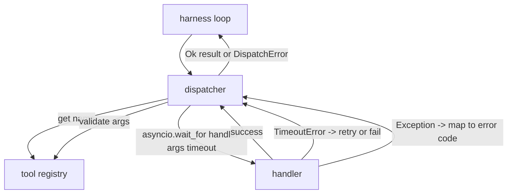
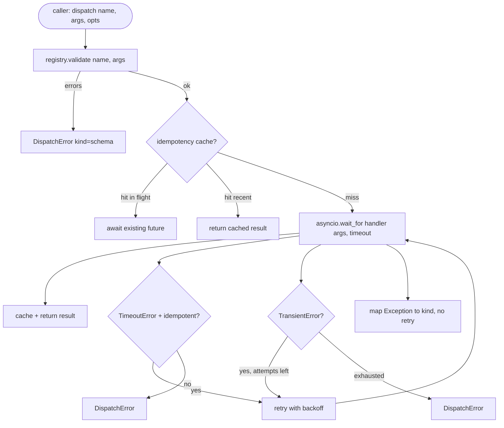

# Function Call Dispatcher

> Bộ chuyển giao là nơi mà dây đeo trả tiền cho mọi lời hứa của kế hoạch, thời gian, thử lại, dedupe, bản đồ lỗi, tất cả trên một hàng xích.

**Type:** Build
**Languages:** Python
**Prerequisites:** Phase 13 lessons 01-07, Phase 14 lesson 01
**Time:** ~90 minutes

## Mục tiêu học tập
- Bị gói một trình xử lý công cụ trong thời gian nghỉ mỗi cuộc gọi trả về lỗi gõ thay vì treo vòng lặp.
- Lấy một lần thử lại với jitter và số lần thử tối đa.
- Deduplicate thử lại trên một khóa idempotency để một thử lại chạy với một bản gốc chậm không chạy hai lần.
- Các ngoại lệ xử lý bản đồ và lỗi vận chuyển vào một gói lỗi duy nhất vòng lặp vòng xoắn đã hiểu.
- Đưa ban song song với giới hạn đồng thời để một fan-out của bốn mươi tool gọi không làm hết vòng lặp sự kiện.

```figure
cf-dispatch-retry
```

## Ở chỗ người vận chuyển ngồi

Giữa vòng lặp (câu hai mươi) và sổ đăng ký công cụ (câu hai mươi một). Việc vận chuyển (câu hai mươi hai) cung cấp cho vòng lặp. vòng lặp đưa ra một cuộc gọi công cụ cho người gửi. Người gửi gọi vào sổ đăng ký, chạy trình xử lý, và trả lại hoặc kết quả hoặc một bọc lỗi hình dạng JSON-RPC.



Bộ chuyển giao là lớp duy nhất biết về thời gian, thử lại và không có khả năng.

## Thời gian nghỉ

Mỗi công cụ có thời gian mặc định.`timeout_ms`Người điều khiển sẽ chuyển đổi nó từ một lần gọi khi dây chuyền đi qua một.`asyncio.wait_for`Khi thời gian nghỉ, nhiệm vụ xử lý bị hủy bỏ và người vận chuyển quay lại.`DispatchError(kind="timeout")`- Tôi không biết.

Một thời gian dừng không phải là một lỗi có thể được tái tạo theo mặc định cho các công cụ không có quyền lực.`db.write`Có thể đã phạm hoặc không phạm.`idempotent`cờ từ hồ sơ đăng ký. các công cụ không có quyền kiểm tra lại. các công cụ không có quyền kiểm tra không.

## Các thử nghiệm trở lại với backkoff theo hàm số

Chính sách thử lại là 3 lần tối đa.

```text
attempt 1  -> delay 0
attempt 2  -> delay 0.1s * (1 + random[0..0.5])
attempt 3  -> delay 0.4s * (1 + random[0..0.5])
```

Chỉ là `timeout`và `transient`lỗi thử lại.`schema`lỗi, một `not_found`, hoặc một `internal`lỗi không thử lại. sai lầm kế hoạch là xác định. thử lại không thay đổi kết quả và đốt cháy ngân sách.

Các vòng lặp thử lại tôn trọng ngân sách từ vòng xoáy. Nếu ngân sách của người gọi có số gọi công cụ còn lại không, người gửi thất bại nhanh chóng trên nỗ lực đầu tiên và quay trở lại `kind="budget_exceeded"`- Tôi không biết.

## Chìa khóa khử năng lực

Một lần thử lại khi bản gốc vẫn đang bay là một lỗi sản xuất thực sự. cuộc gọi đầu tiên treo ở bốn điểm chín giây (cũng dưới thời gian nghỉ).`payments.charge`- Anh đã trả tiền hai lần.

Người vận chuyển chấp nhận một tùy chọn`idempotency_key`Nếu cùng một chìa khóa đang bay khi cuộc gọi đến, máy phát hành sẽ chờ đợi tương lai trong chuyến bay và trả lại kết quả của nó.

Chìa khóa là trách nhiệm của người gọi.`f"{step_id}:{tool_name}:{hash(args)}"`. Người phát triển không phát minh ra chìa khóa, bởi vì lấy một chìa khóa từ các lập luận đơn giản làm cho hai cuộc gọi khác nhau về ngữ nghĩa trông giống nhau.

## Bảng lỗi

Một chuyến phát không thành công sẽ trả lại một hình dạng.

```text
DispatchError
  kind        : "timeout" | "transient" | "schema" | "not_found" | "internal" | "budget_exceeded"
  message     : str
  attempts    : int
  jsonrpc_code: int   (one of -32601, -32602, -32603)
```

Bản đồ vòng xoáy của vòng xoáy `kind`tới tiểu bang tiếp theo. `schema`và `not_found`đi đi`on_error`và kích hoạt một kế hoạch tái lập.`timeout`và `transient`đi đi`on_error`và có thể hoặc không có thể tái lập tùy thuộc vào các nỗ lực. `budget_exceeded`kích hoạt`on_budget_exceeded`- Tôi không biết.

## Tỷ lệ tiền tệ đối với fan out

`gather(*calls)`chạy tất cả các trình điều khiển đồng thời. Với bốn mươi tool call, đó là bốn mươi ổ cắm mở hoặc bốn mươi ống phụ quy trình. Hầu hết các backend không thích bốn mươi kết nối song song từ một khách hàng.

Máy chuyển nhượng đóng gói`gather`trong một semaphore. giới hạn đồng thời mặc định là tám. Mỗi cuộc gọi có được semaphore trước khi gửi và phát hành khi hoàn thành. Người gọi thấy `gather`-shaped output nhưng lịch trình thực tế là giới hạn.

## Tạo dòng cho một cuộc gọi



## Làm thế nào để đọc mã

`code/main.py`định nghĩa `Dispatcher`- `DispatchError`, và`TransientError`- Người điều khiển sẽ ghi lại công trình xây dựng.`dispatch(name, args, ...)`là điểm nhập cảnh duy nhất.`_run_with_retries`sử dụng `asyncio.wait_for`- `gather_bounded(calls)`chạy nhiều chuyến đi với giới hạn đồng thời.

`code/tests/test_dispatcher.py`bao gồm thời gian tắt, thử lại trên tạm thời, không thử lại trên lỗi schema, giảm tính năng (hai cuộc gọi đồng thời với cùng một khóa sụp đổ đến một cuộc gọi xử lý) và hạn chế đồng thời (số giao thông trong hành động).

Các thử nghiệm sử dụng `asyncio.sleep(0)`và quyết định `Counter`- các bộ xử lý dựa trên, vì vậy chúng hoàn thành trong vài millisecond và không phụ thuộc vào thời gian của đồng hồ tường.

## Đi xa hơn nữa

Hai phần mở rộng sản xuất các máy phát triển thêm. Đầu tiên, ghi chép cấu trúc tại mỗi chuyển đổi (được luồng các sự kiện của vòng lặp đã cung cấp cho bạn, nhưng máy phát triển cũng nên phát `dispatch.attempt`và `dispatch.retry`Thứ hai, các máy cắt mạch: sau khi N thất bại trong một cửa sổ, một công cụ nhận được một thời gian làm mát xuống nơi các chuyến đi trở lại ngay lập tức với `kind="circuit_open"`Cả hai đều phù hợp với máy bay này mà không thay đổi hợp đồng.

Bài học 24 gắn máy phát triển vào một nhân viên lập kế hoạch và thực hiện để bạn thấy tất cả bốn phần trong chuyển động.
