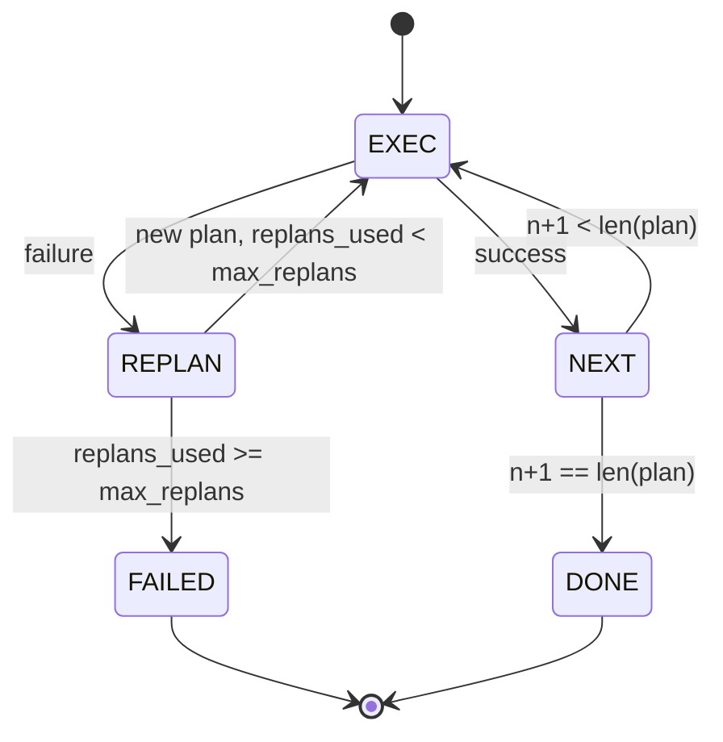

# Phong trào kiểm soát kế hoạch thực hiện

> Một kế hoạch không thể tồn tại sau khi thất bại là một kịch bản. Một kịch bản có thể tái lập là một đại lý.

**Type:** Build
**Languages:** Python
**Prerequisites:** Phase 13 lessons 01-07, Phase 14 lesson 01
**Time:** ~90 minutes

## Mục tiêu học tập
- Hiểu lại một kế hoạch như một danh sách các bước được gõ theo thứ tự để người thực thi có thể lý luận về tiến bộ và kết quả.
- Thực hiện các bước theo trình tự với một sự cố kiểm soát chuyển lại cho người lập kế hoạch.
- Tái lập từ trình chiếu hiện tại với lỗi trước đó trong ngữ cảnh để kế hoạch tiếp theo được thông báo.
- Giả ra một kế hoạch khác biệt với mỗi sửa đổi để một tracker hoặc UI có thể hiển thị lý do tại sao kế hoạch thay đổi.
- Thực hiện hai ngân sách: một trần đáy cứng và một trần tái lập cứng.

```figure
cg-plan-replan
```

## Kế hoạch và thực hiện, không phải là chuỗi suy nghĩ

Một đại lý chuỗi suy nghĩ phát hành mã thông báo và cho phép vòng lặp đoán kết thúc cuộc gọi công cụ. Một đại lý kế hoạch và thực thi phát hành một kế hoạch được cấu trúc trước, sau đó thực hiện từng bước theo cách xác định.

Một người lập kế hoạch tạo ra một kế hoạch, một người thực thi kế hoạch, một người thực thi kế hoạch, một người thực thi kế hoạch, một người thực thi kế hoạch, một người thực thi kế hoạch, một người thực thi kế hoạch, một người thực thi kế hoạch, một người thực thi kế hoạch, một người thực thi kế hoạch, một người thực thi kế hoạch, một người thực thi kế hoạch, một người thực thi kế hoạch, một người thực thi kế hoạch, một người thực thi kế hoạch, một người thực thi kế hoạch, một người thực thi kế hoạch, một người thực thi kế hoạch, một người thực thi kế hoạch, một người thực thi kế hoạch, một người thực thi kế hoạch, một người thực thi kế hoạch, một người thực thi kế hoạch, một người thực thi kế hoạch, một người thực thi kế hoạch, một người thực thi kế hoạch, một người thực thi kế hoạch, một người thực thi kế hoạch, một người thực thi kế hoạch, một người thực thi kế hoạch, một người thực thi kế hoạch, một người thực thi kế hoạch, và một người thực thi kế hoạch, và một người thực thi kế hoạch.

```text
1. Abort         (return failed, surface the error)
2. Skip          (mark step failed, continue with the rest)
3. Replan        (hand the error to the planner, get a new plan from the cursor)
```

Replan là người biến kịch bản thành một đại lý.

## Hình dạng bước

```text
Step
  id              : int           (monotonic within a plan revision)
  tool_name       : str
  args            : dict
  expected_outcome: str           (planner's stated success condition)
  result          : Any | None
  error           : str | None
```

`expected_outcome`là một câu ngắn mà người lập kế hoạch phát ra bên cạnh bước. Nó không được thực thi bởi người thực thi. Nó là vì hai điều: người lập kế hoạch lại đọc nó khi sửa đổi kế hoạch; dòng sự kiện phát ra nó để một người theo dõi có thể hiển thị "giải hành này được cho là làm X".

## Hình dạng của người lập kế hoạch

```python
def planner(goal: str, history: list[Step], last_error: str | None) -> list[Step]:
    ...
```

Một chức năng thuần túy.`goal`là mục tiêu của người dùng. `history`là các bước đã thực hiện (với kết quả và lỗi được điền vào). `last_error`là Không có trên cuộc gọi đầu tiên và thông điệp thất bại gần đây nhất trên mỗi cuộc gọi tiếp theo.

Người lập kế hoạch không biết về người thực hiện, không biết về các nỗ lực tái lập, không biết về thời gian trôi qua, nó tạo ra một kế hoạch.

## Người hành quyết

Các nhà thực thi là một máy nhỏ của nhà nước. Mỗi bước chạy qua các nhà phát triển. Kết quả là một trong ba điều: thành công, thất bại có thể tái lập, thất bại là chết người. thất bại có thể tái lập trở lại với người lập kế hoạch. thất bại chết người (khuế toán vượt quá, tái lập trần nhà) trả lại một Ưu điểm.`FAILED`kết quả phiên.



## Kế hoạch khác nhau về sửa đổi

Khi người lập kế hoạch trả lại một kế hoạch mới sau khi thất bại, người thực thi sẽ phát hành một `plan.diff`sự kiện với ba trường.

```text
removed: list of step ids that were in the old plan and are not in the new
added  : list of step ids in the new plan that were not in the old
revised: list of step ids whose tool_name or args changed
```

Một trình theo dõi hoặc UI có thể render này như một sự đột phá trên các bước được xóa và một điểm nhấn trên những bước được thêm vào. Điểm không phải là định dạng khác nhau. Điểm là sửa đổi là một sự kiện có thể nhìn thấy, không phải là một viết lại âm thầm.

## Hai ngân sách, cả hai đều khó khăn

`max_steps`giới hạn tổng số các bước thực hiện trong suốt toàn phiên, bao gồm cả các kế hoạch lại. Tầm là mười hai. Một kế hoạch năm bước tuyến tính tái lập hai lần và thêm ba bước mỗi lần đạt mười sáu lần thực hiện và sẽ vượt quá ngân sách. Người thực thi sẽ từ chối kế hoạch lại và trả lại FAILED.

`max_replans`giới hạn số lần người lập kế hoạch được gọi sau kế hoạch đầu tiên. mặc định là năm. Đây là giới hạn quan trọng hơn. Một người lập kế hoạch trả lại cùng một kế hoạch bị hỏng năm lần liên tiếp sẽ lặp lại vòng lặp cho đến khi ngân sách bước bắt được nó. Capping kế hoạch lại làm cho sự thất bại nhanh hơn và lý do rõ ràng hơn.

## Người lập kế hoạch định nghĩa trong bài học này

Chúng ta không gọi mô hình trong bài học này. bài học đưa ra một nhà hoạch định xác định học chọn một kế hoạch dựa trên`last_error`- Tôi không biết.

```text
last_error is None    -> emit a four-step plan
last_error matches X  -> emit a three-step plan that routes around X
last_error matches Y  -> emit a two-step plan that gives up gracefully
otherwise             -> return [] (signals nothing to replan)
```

Điều này đủ để kiểm tra hành vi của người thực thi trên mỗi con đường chuyển đổi: thành công, tái lập một lần, tái lập hai lần, tái lập - kiệt sức, và kiệt sức ngân sách bước.

## Hình dạng kết quả

```text
SessionResult
  status      : "completed" | "failed"
  reason      : str     ("goal_met" | "step_budget" | "replan_budget" | "no_plan")
  history     : list[Step]
  revisions   : list[PlanDiff]
  events      : list[Event]
```

Các vòng lặp của các vòng lặp từ bài học hai mươi có thể đọc trực tiếp điều này. Các bộ chuyển phát từ bài học hai mươi ba là những gì thực hiện mỗi bước. Registry từ bài học hai mươi một xác nhận arg của mỗi bước. Việc vận chuyển từ bài học hai mươi hai sẽ làm cho toàn bộ dòng chảy này trên JSON-RPC đến một khách hàng mô hình.

## Làm thế nào để đọc mã

`code/main.py`định nghĩa `PlanExecuteAgent`- `Step`- `PlanDiff`- `SessionResult`, và người lập kế hoạch xác định.`run(goal)`Phương pháp trả lại một `SessionResult`. Phân biệt kế hoạch được tính bằng cách so sánh các bước ID và `(tool_name, args)`Túples.

`code/tests/test_agent.py`bao gồm một thành công tuyến tính, một thất bại giữa kế hoạch tái lập kế hoạch một lần, tái lập sự kiệt sức mà trở lại `failed:replan_budget`, phungu hẹp ngân sách giai đoạn, và các kế hoạch khác nhau các sự kiện định dạng.

## Đi xa hơn nữa

Hai phần mở rộng bạn sẽ muốn khi bạn cáp này vào một mô hình thực. Đầu tiên, dự trữ dự trữ kế hoạch một phần: khi một kế hoạch thành công cho ba bước đầu tiên trong sáu bước và sau đó thất bại, bạn không muốn chạy lại ba bước đầu tiên.`gather_step`thay vì `next_step`) có thể chạy hai cuộc gọi công cụ cùng một lúc thông qua máy phát.

Cả hai đều thêm vào sự phức tạp thực sự. Cả hai đều dễ dàng thêm khi trình thực hiện tuyến tính được gắn. Đó là điều bài học này làm.
