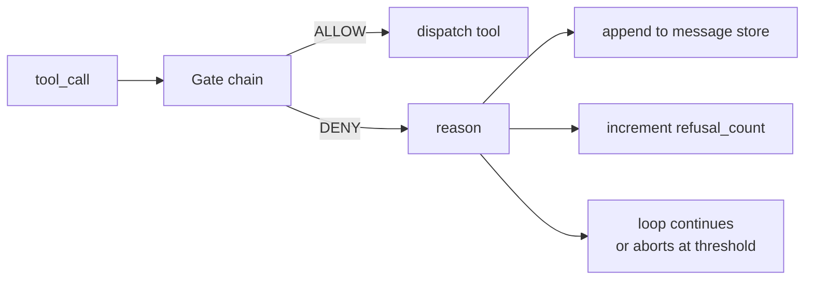
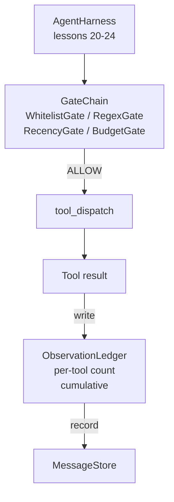

# Bài học Capstone 25: Cổng kiểm tra và ngân sách quan sát

> Một vòng xoáy không có lớp xác minh là một ước muốn trong một áo khoác. Bài học này xây dựng chuỗi cổng xác định được quyết định liệu một cuộc gọi công cụ có được phép bắn, bao nhiêu đầu ra của nó mà đại lý được phép xem, và khi nào vòng lặp phải dừng lại vì đại lý đã đọc quá nhiều. Dòng là một chức năng của các cổng nhỏ, tên cộng với một sổ cái quan sát theo dõi mọi biểu tượng mô hình đã được hiển thị.

**Type:** Build
**Languages:** Python (stdlib)
**Prerequisites:** Phase 19 · 20-24 (Track A1: agent loop, tool registry, message store, prompt builder, model router), Phase 14 · 33 (instructions as constraints), Phase 14 · 36 (scope contracts), Phase 14 · 38 (verification gates)
**Time:** ~90 minutes

## Mục tiêu học tập

- - Làm một cái`VerificationGate`giao thức với một định nghĩa`evaluate(call)`Phương pháp.
- Sắp xếp ngân sách, danh sách mới, danh sách trắng và regex vào một chuỗi với ngữ nghĩa mạch ngắn.
- Theo dõi mọi quan sát qua một `ObservationLedger`Đánh khóa bằng công cụ và quay.
- Nhận lệnh không tham gia khi ngân sách quan sát tổng thể sẽ được vượt quá.
- bề mặt một cấu trúc `GateDecision`ghi lại khả năng quan sát theo dòng chảy có thể nuốt.

## Vấn đề

Khi một vòng xoáy đại lý cho phép mô hình gọi công cụ tự do, ba loại lỗi xuất hiện trong giờ đầu tiên của việc sử dụng thực sự.

Đầu tiên là quan sát không giới hạn. Một cúi trên một repo 200K dòng ném một nửa triệu token sản lượng vào lượt tiếp theo. mô hình thấy một trận đấu mỗi kilobyte và phần còn lại của ngữ cảnh bị lãng phí. Dự án token lớn và đại lý bây giờ tồi tệ hơn, không tốt hơn, trong nhiệm vụ.

Thứ hai là quá khứ gần đây. Một nhiệm vụ chạy lâu tích lũy năm mươi cuộc gọi công cụ. Mô hình đọc lại file read_file đầu tiên từ vòng ba như thể nó là trạng thái sống. Các chỉnh sửa được thực hiện trên vòng bốn mươi bảy không bao giờ xuất hiện vì người xây dựng prompt đã tựa trình các quan sát sớm nhất trước.

Thứ ba là đặc quyền quái vật.`web_search`, rồi bằng cách nào đó kết thúc chạy`shell`bởi vì mô hình đã phát minh ra một tên công cụ và vòng xoáy mặc định là cho phép. Khi bất cứ ai đọc dấu vết, một tệp rác đang ngồi trong /tmp và một curl chạy chống lại một API riêng tư.

Một cổng xác minh là thành phần dây đeo nói không. Nó không phải là mô hình. Nó không phải là một thẩm phán. Nó là một hàm xác định của `(call, history, ledger)`cho phép hoặc từ chối với một lý do. Lý do được ghi lại. mô hình được nói. vòng lặp tiếp tục hoặc phá sản.

## Khái niệm



Một cổng là bất cứ thứ gì với một`evaluate(call, ctx) -> GateDecision`Các hệ thống này được đặt ra bởi các hệ thống điện tử, các hệ thống điện tử, các hệ thống điện tử, các hệ thống điện tử, các hệ thống điện tử, các hệ thống điện tử, các hệ thống điện tử, các hệ thống điện tử, các hệ thống điện tử, các hệ thống điện tử, các hệ thống điện tử, các hệ thống điện tử, các hệ thống điện tử, các hệ thống điện tử, các hệ thống điện tử, các hệ thống điện tử, các hệ thống điện tử, các hệ thống điện tử, các hệ thống điện tử, các hệ thống điện tử, các hệ thống điện tử, các hệ thống điện tử, các hệ thống điện tử, các hệ thống điện tử, các hệ thống điện tử, các hệ thống điện tử, các hệ thống điện tử, các hệ thống điện tử, các hệ thống điện tử, các hệ thống điện tử, các hệ thống điện tử, các hệ thống điện tử, các hệ thống điện tử, các hệ thống điện tử, các hệ thống điện tử, các hệ thống điện tử, các hệ thống điện tử, các hệ thống điện tử, các hệ thống điện tử, các hệ thống điện tử, và các hệ thống điện tử, các hệ thống điện tử, và các hệ thống điện tử, và các hệ thống điện tử, và các hệ thống điện tử.

Bài học này có bốn cánh cổng:

- `WhitelistGate`Tên công cụ được phép là một bộ cụ thể bất cứ thứ gì bên ngoài đều bị từ chối đây là cổng rẻ nhất và chạy đầu tiên
- `RegexGate`. Các lập luận công cụ được kết hợp với một regex. hữu ích để từ chối các cuộc gọi shell với `rm -rf`trong chúng, hoặc các cuộc gọi HTTP đến IP nội bộ.
- `RecencyGate`. Mô hình chỉ nhìn thấy quan sát từ các vòng quay N cuối cùng. quan sát cũ hơn được che giấu. Cổng từ chối một cuộc gọi công cụ mà kết quả sẽ mở rộng một cửa sổ quan sát đã già đi.
- `BudgetGate`Các token tích lũy mà mô hình đã đọc trong suốt phiên có một mức tối thượng. Khi sổ cái nói rằng mức tối thượng đã đạt được, mọi cuộc gọi công cụ tiếp theo sẽ bị từ chối.

sổ cái quan sát là kế toán. Mỗi cuộc gọi công cụ thành công viết một hàng: tên công cụ, lượt, token phát hành, tích lũy. sổ cái trả lời hai câu hỏi: mô hình đã nhìn thấy bao nhiêu tổng cộng, và bao nhiêu nó đã nhìn thấy công cụ X. Cổng ngân sách đọc đầu tiên. Cổng ngân sách cho mỗi công cụ, mà bạn sẽ viết như một bài tập, đọc thứ hai.

```figure
cg-gate-chain
```

## Kiến trúc



Các dây xoay hỏi chuỗi. chuỗi hoặc gật đầu hoặc từ chối. Nếu gật đầu, công cụ chạy, sổ cái đánh dấu, và kết quả được gắn vào kho thông điệp. Nếu nó từ chối, mô hình được trao từ chối như một thông điệp hệ thống và vòng lặp quyết định xem phải thử lại hay hủy bỏ.

## Những gì bạn sẽ xây dựng

Việc thực hiện là một`main.py`cộng với các xét nghiệm.

1. `Observation`và `ToolCall`Dataclasses xác định các hình dạng dây.
2. `ObservationLedger`ghi chép`(turn, tool, tokens)`hàng và câu trả lời `cumulative()`và `per_tool(name)`- Tôi không biết.
3. `GateDecision`mang `(allow, reason, gate_name)`- Tôi không biết.
4. `VerificationGate`là giao thức.`evaluate(call, ctx)`- Tôi không biết.
5. `GateChain`Nó gọi mỗi cổng, trả lại từ chối đầu tiên, hoặc trả lại cho phép nếu mỗi cổng đi qua.
6. Dòng demo chạy một vòng tròn nhỏ của đại lý tổng hợp ba vòng tròn thứ ba tròn tròn ngân sách và vòng tròn báo cáo một từ chối sạch với số lượng từ chối không bằng 0.

Máy tính biểu tượng này cố ý là một kẻ ngu ngốc`len(text) // 4`Ý tưởng của bài học này là hệ thống ống dẫn cổng, không phải hệ thống đầu tư.

## Tại sao sự sắp xếp chuỗi quan trọng

Một lời phủ nhận rẻ hơn một lời cho phép.`WhitelistGate`chạy trong O(1) tìm kiếm hash. `RegexGate`chạy trong O(phát hình * argv). `RecencyGate`đọc một mảnh nhỏ của cửa hàng tin nhắn. `BudgetGate`Bạn đặt hàng chúng bằng cách tăng chi phí để một cuộc gọi từ chối chuyển mạch ngắn trước khi làm công việc đắt tiền.

Bạn cũng đặt hàng theo vòng bán kính blast. Whitelist là tuyên bố mạnh nhất: công cụ này không có trong hợp đồng. Cổng regex là tiếp theo: lập luận này không có trong hợp đồng.

## Làm thế nào nó kết hợp với phần còn lại của Track A

Những bài học trước đây đã cho bạn vòng lặp, sổ đăng ký công cụ, kho tin nhắn, trình tạo prompt và router mô hình. Bài học này thêm lớp giữa mô hình và các công cụ. Bài học 26 đưa hộp cát mà người phát sóng đưa ra công cụ gọi cho khi chuỗi cổng nói "Hãy cho phép". Bài học 27 đưa ra thiết bị đánh giá ghi nhận từ chối được coi là tín hiệu chất lượng. Bài học 28 dẫn các quyết định cổng vào OpenTelemetry. Bài học 29 đan hàng vào một đại lý lập trình đang làm việc.

## - Đưa nó ra.

```bash
cd phases/19-capstone-projects/25-verification-gates-observation-budget
python3 code/main.py
python3 -m pytest code/tests/ -v
```

Các bài kiểm tra bao gồm sổ cái, mỗi cổng cách ly, mạch ngắn chuỗi và vòng lặp tổng hợp từ đầu đến cuối.
