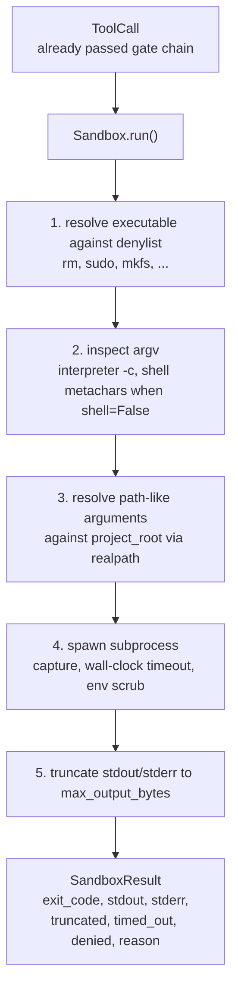
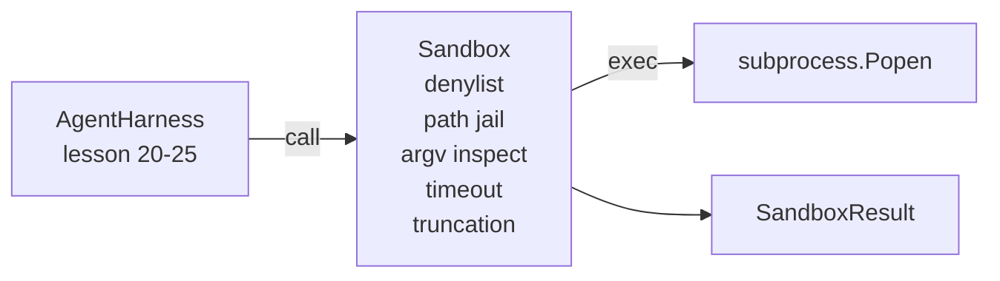

# Bài học Capstone 26: Người chạy Sandbox với Denylist và Path Jail

> Cổng xác minh quyết định liệu một cuộc gọi công cụ có nên chạy hay không. Cái hộp cát quyết định chuyện gì sẽ xảy ra khi nó xảy ra. Bài học này đưa ra một bộ chạy bộ xử lý từ chối các trình thực nguy hiểm, từ chối các hình dạng argv nguy hiểm, khóa tất cả các đường dẫn tập tin đến gốc dự án, cắt giảm lượng sản xuất quá lớn và giết chết các quy trình chạy trốn trong thời gian clock tường. Nó là lớp thứ hai trong hai lớp nằm giữa mô hình và hệ điều hành.

**Type:** Build
**Languages:** Python (stdlib)
**Prerequisites:** Phase 19 · 25 (verification gates and observation budget), Phase 14 · 33 (instructions as constraints), Phase 14 · 38 (verification gates)
**Time:** ~90 minutes

## Mục tiêu học tập

- - Làm một cái`Sandbox`lớp đóng gói `subprocess.run`với thời gian nghỉ, bắt và cắt.
- Từ chối lệnh bằng tên chống lại một tên gọi và theo cấu trúc chống lại một thanh tra ARGV.
- Từ chối bất kỳ lập luận đường dẫn nào giải quyết bên ngoài gốc dự án được tuyên bố.
- Khước từ các siêu nhân shell khi chế độ shell bị tắt.
- Trở lại một cấu trúc `SandboxResult`rằng khả năng quan sát theo dòng chảy và vòng đánh giá có thể nuốt.

## Vấn đề

Một nhân viên lập trình có thể lắp đặt cửa sau, tháo khóa, gạch một máy tính xách tay của nhà phát triển và lắp ráp một hóa đơn đám mây trong một lượt.

Ba loại thất bại lặp lại trong dấu vết của đại lý.

Thứ nhất là các thiết bị thực thi nguy hiểm. Một mô hình bị áp lực để sửa chữa vấn đề đường sẽ cố gắng`sudo`- `chmod -R 777`- `rm -rf`- `mkfs`- `dd`Không ai trong số những người này thuộc về một cuộc chạy đua của các điệp viên.

Thứ hai là những trò lừa đảo. Một mô hình mà không có đạn sẽ dẫn một cuộc tấn công qua một người giải thích:`python3 -c "import os; os.system('rm -rf /')"`- `bash -c '...'`- `node -e '...'`- `perl -e '...'`- Quả lưng cần biết rằng bất kỳ người phiên dịch nào cũng chạy với một`-c`- như cờ chỉ là một cuộc gọi với thêm bước.

Thứ ba là lối thoát.`./src/main.py`và thay vào đó đọc`../../etc/passwd`Thùng cát sẽ giữ mọi tranh cãi bằng cách giải quyết nó qua`os.path.realpath`và khẳng định tiền tố.

Sandbox không phải là một ranh giới an ninh theo nghĩa hệ điều hành. Một kẻ tấn công xác định với việc thực hiện mã vẫn có thể phá vỡ. Sandbox là một đường dây bảo vệ thời gian phát triển: nó làm cho các chế độ thất bại phổ biến lớn và ngăn chặn người đại lý làm tổn hại vì sự thiếu năng lực.

## Khái niệm



Sandbox có bốn trục từ chối: tên, argv, đường dẫn, cấu trúc. Mỗi trục là một chức năng thuần túy của cuộc gọi, chưa có quá trình phụ.

- `SandboxResult`mã thoát là các mã thông thường: 0 thành công, không thành công bằng 0, cộng với ba mã treo cho từ chối (-100), thời gian_out (-101), và trunced ( mã thoát là thực tế, với một tập hợp cờ).

```figure
cg-path-jail
```

## Kiến trúc



Danylist là một bộ sưu tập tên cơ bản có thể thực hiện.`/bin/rm`- `/usr/bin/rm`Các thanh tra argv biết hình dạng của phiên dịch: bất kỳ argv nào trong đó argv[0] là phiên dịch và bất kỳ arg nào sau đó bắt đầu với `-c`hoặc `-e`được phủ nhận.`;`- `|`- `&`- `>`- `<`, đống lưng,`$()`) gây ra từ chối khi cuộc gọi không yêu cầu một con vỏ rõ ràng.

Cửa tù đường là mảnh tinh tế nhất.`project_root`Bất kỳ tranh luận nào có vẻ như là một con đường (có chứa`/`hoặc phù hợp với một tệp hiện có) được bình thường hóa thông qua `os.path.realpath`, sau đó kiểm tra ngược với đường thực của gốc dự án. Nếu mục tiêu được giải quyết không nằm dưới gốc, từ chối. Các nỗ lực thoát khỏi Symlink (một liên kết trong gốc dự án chỉ ra bên ngoài) được chặn bằng cách kiểm tra đường thực, chứ không phải đường thực.

## Những gì bạn sẽ xây dựng

Việc thực hiện là `main.py`cộng với một bài kiểm tra dir.

1. `SandboxResult`Dataclass: exit_code, stdout, stderr, truncated, timed_out, denied, reason, duration_ms.
2. `SandboxConfig`Dataclass: project_root, max_output_bytes, timeout_seconds, denylist, interpreter_block.
3. `Sandbox`lớp: `run(argv, *, shell=False, cwd=None)`trả lại một `SandboxResult`- Tôi không biết.
4. Những người giúp đỡ từ chối nội bộ: `_check_executable_denylist`- `_check_argv_interpreter`- `_check_shell_metachars`- `_check_path_jail`- Tôi không biết.
5. Truncation đầu ra với một clear `truncated`cờ và một đường đánh dấu trong dòng chảy bị bắt.
6. Demo ở dưới: một chuỗi các cuộc gọi hợp pháp và đối lập.

Thùng cát sử dụng `subprocess.run`với `shell=False`theo mặc định và `capture_output=True`Thời gian clock tường sử dụng `timeout`-`TimeoutExpired`, sandbox giết chết nhóm quá trình và tổng hợp một SandboxResult.

## Tại sao đây không phải là một hộp cát thật

Sandbox bài học không sử dụng không gian tên, cgroups, seccomp, gVisor, Firecracker hoặc bất kỳ sự cô lập cấp độ hạt nhân nào. Bất cứ điều gì mà các quá trình phụ có thể làm, sandbox có thể làm. Bảo vệ là cấu trúc: đại lý bị từ chối các cuộc gọi nguy hiểm phổ biến nhất, và từ chối lớn đi vào khả năng quan sát thay vì chạy lặng lẽ.

Đối với các đại lý sản xuất bạn layer lên: chạy bên trong một container Docker không được ưu tiên, chạy bên trong một microVM, giảm khả năng, lắp đặt các root dự án chỉ đọc và một điểm nếp nhặt đọc viết, đặt giới hạn trên bộ nhớ và CPU, quét môi trường đến một danh sách trắng an toàn được biết. Bài học 29 làm một số điều này.

## - Đưa nó ra.

```bash
cd phases/19-capstone-projects/26-sandbox-runner-denylist
python3 code/main.py
python3 -m pytest code/tests/ -v
```

Demo tạo thư mục tạm thời, thả một tệp sạch vào đó, sau đó chạy một pin của các cuộc gọi.`denied=True`Và có lý do.`timed_out=True`. Bộ cắt `truncated=True`. Demo in một bảng JSON kết quả và thoát khỏi số không.

## Làm thế nào nó kết hợp với phần còn lại của Track A

Bài học 25 tạo ra chuỗi cổng. Bài học 26 là trình thực hiện chạy sau khi một cổng cho phép. Bài học 27 của đánh giá sử dụng so sánh kết quả hộp cát với dự kiến mã thoát mỗi nhiệm vụ. Bài học 28 phát ra một `gen_ai.tool.execution`tròn quanh mỗi `Sandbox.run`Bài học 29 của kết thúc đến kết thúc demo dây một thực sự lập trình thông qua cả hai lớp.
