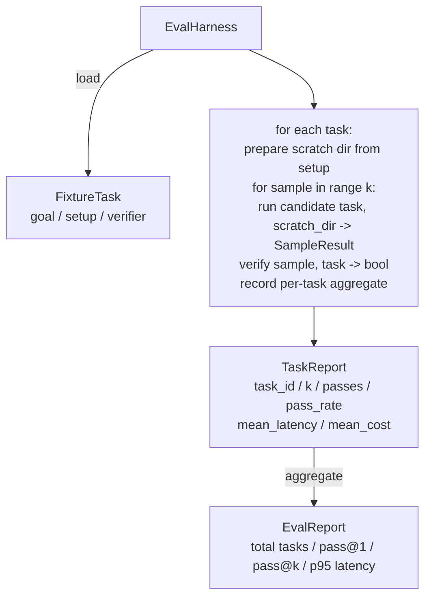

# Bài học 27 của Capstone: Giúp nhau với các nhiệm vụ cố định

> Một nhân viên lập trình chỉ tốt như bộ nhiệm vụ mà bạn đo lường nó. Bài học này xây dựng một vòng đánh giá lấy một thư mục các nhiệm vụ cố định, chạy mỗi trong một đại lý ứng cử viên, điểm vượt qua hoặc thất bại thông qua một xác minh xác định, và tổng hợp kết quả thành pass@1, pass@k, độ trễ trung bình và chi phí trung bình. Lớp dây là nguồn sự thật cho phép bạn biết sự lùi từ một bộ phản ứng.

**Type:** Build
**Languages:** Python (stdlib)
**Prerequisites:** Phase 19 · 25 (verification gates), Phase 19 · 26 (sandbox runner), Phase 14 · 30 (eval-driven agent development), Phase 14 · 19 (SWE-bench and GAIA benchmarks)
**Time:** ~90 minutes

## Mục tiêu học tập

- Định nghĩa một nhiệm vụ cố định như là một phần ba của mục tiêu, thiết lập và xác minh.
- Điểm số nhiều mẫu chạy cho mỗi nhiệm vụ và tính toán pass@1 và pass@k.
- Tổng hợp thời gian trễ và chi phí thành trung bình và 95th percentile metrics.
- Các bộ xác minh xác định điện tử (phát khác biệt, mã thoát, regex match) thành các hàm có thể sử dụng lại.
- Giả ra một báo cáo JSON có cấu trúc mà một kịch bản theo dõi hồi quy có thể nuốt.

## Vấn đề

Ba chế độ thất bại các điểm chuẩn của đại lý dịch bệnh được xây dựng mà không cần một vòng đánh giá.

Một trong số đó là một lỗi không được xác minh. Đại lý nói rằng nó đã sửa lỗi, người ta nhìn vào sự khác biệt, bộ bị đánh dấu màu xanh lá cây, và ba tuần sau khi thử nghiệm hồi quy xuất hiện cùng một lỗi. Đại lý đã suy luận hợp lý mà không thực sự sửa chữa bất cứ điều gì.

Thứ hai là sự lùi ngược không được phát hiện. Một thay đổi vào mẫu yêu cầu làm cho đại lý 4% tốt hơn trong nhiệm vụ lớn và 14% tồi tệ hơn trong nhiệm vụ yên tĩnh. Không có một bộ vàng và điểm số mỗi nhiệm vụ, sự lùi ngược chỉ đi vào chính và xuất hiện khi một khách hàng phàn nàn.

Thứ ba là mỗi nhiệm vụ. đánh giá được thực hiện vào thứ Hai với 100 nhiệm vụ và vào thứ Sáu với 95 nhiệm vụ, bởi vì ai đó đổi tên năm nhiệm vụ. tỷ lệ vượt qua trông giống như là một sự cải thiện 5%.

Cánh dây là chương trình biến những thất bại này thành sự thật. Nó chạy mỗi lần, mỗi lần, theo thứ tự có thể tái tạo, chống lại một xác minh viên trả lại đúng hoặc sai trên một kiểm tra xác định.

## Khái niệm

```mermaid
flowchart LR
  F1[fixtures/task_001/<br/>task.json + expected/] --> Harness
  F2[fixtures/task_002/<br/>...] --> Harness
  Harness[Harness<br/>for each task:<br/>setup / run agent k samples /<br/>verify each sample /<br/>record latency, cost]
  Harness --> Report[EvalReport<br/>pass@1 / pass@k<br/>mean ms / p95 ms<br/>mean cost]
```

A `FixtureTask`là một tệp JSON nhỏ cộng với tùy chọn `expected/`thư mục. JSON tuyên bố một `id`, một `goal`(sự yêu cầu được cung cấp cho đại lý), một `setup`khối (tệp để rơi vào các vết xước dir), và một `verifier`block. block xác minh tên một chức năng trong registry xác minh của vòng xoáy và cung cấp các lập luận của nó.

Ba hình dạng xác minh bao gồm hầu hết các nhiệm vụ hữu ích.

Thứ nhất là`file_equals`Sau khi trình duyệt chạy, so sánh một tập tin có tên với nội dung mong đợi.

Thứ hai là`regex_match`. Nội dung của tệp được đặt tên được kết hợp với một regex. Điều này bắt "các chức năng phải tồn tại và trả lại X" các nhiệm vụ nơi có nhiều giải pháp chấp nhận được.

Thứ ba là`shell_exit_zero`. Bộ đinh chạy lệnh shell (thông qua hộp cát từ bài học 26) và chỉ vượt qua nhiệm vụ nếu lệnh thoát khỏi 0. Điều này bắt được các nhiệm vụ "các thử nghiệm phải vượt qua".

Lăng găng này làm mọi việc.`k`Pass@k là `1 - (1 - p)^k`nơi p là tỷ lệ vượt qua thực nghiệm; vòng xoài cũng báo cáo số liệu thô để bạn có thể phát hiện sự khác biệt. Trễ là đồng hồ tường cho mỗi mẫu. Chi phí là bất cứ gì đại lý tự báo cáo (tốc số, USD, hoặc cả hai); vòng xoài tổng hợp nó trên các mẫu và trình bày các số mỗi nhiệm vụ và tổng hợp.

```figure
pass-at-k
```

## Kiến trúc



Ứng viên là một người có thể gọi:`Callable[[FixtureTask, str], SampleResult]`. Lớp dây tạo ra thư mục cào thông qua `tempfile.mkdtemp()`Và đi theo con đường của nó như một chuỗi đơn giản. dây đeo không quan tâm cách ứng viên hoạt động. ứng viên có thể là một ứng dụng đệm xác định (có ích cho tự kiểm tra dây đeo), một đại lý LLM thực sự, một máy hút. Hợp đồng là SampleResult.

## Những gì bạn sẽ xây dựng

`main.py`tàu:

1. `FixtureTask`Dataclass.
2. `SampleResult`Dataclass: success_self_reported, latency_ms, cost_units, chỉnh sửa.
3. `TaskReport`- `EvalReport`Dataclasses với `to_dict()`- Tôi không biết.
4. `VerifierRegistry`bản đồ tên xác minh để hoạt động. Các xác minh tích hợp: file_equals, regex_match, shell_exit_zero.
5. `EvalHarness`class. chạy một thư mục các nhiệm vụ chống lại một ứng cử viên. trả lại EvalReport.
6. Năm nhiệm vụ cố định được kết hợp trong `tasks/`- Có thể là:
   - - Một-một trong `fizzbuzz`
   - mất lợi nhuận trong `factorial`
   - lỗi đánh chữ trong thông báo lỗi
   - cơ quan chức năng trống
   - off-by-one trong việc đi qua danh sách liên kết
7. Một ứng cử viên tham chiếu xác định (`apply_known_fixes`) dây đeo sử dụng để chứng minh một thông qua sạch@1 của 1.0.
8. Demo in EvalReport JSON và thoát khỏi không.

Các nhiệm vụ cố định được tập hợp như các tệp JSON trong `tasks/`cộng với các tệp nguồn kết hợp trong `tasks/<id>/buggy/`và `tasks/<id>/expected/`- Bộ đeo thắt sao chép buggy thành một vết xước, đưa nó cho ứng cử viên, và xác minh ngược lại mong đợi.

## Tại sao pass@k và không chỉ pass@1

Các đại lý LLM thực sự là stochastic. Pass@1 của 0,6 trông giống như một thất bại. Pass@5 của 0,95 nói đại lý nhận được câu trả lời đúng hầu hết thời gian nhưng đang chọn sai trong các mẫu sơ bộ.

Pass@k được báo cáo bên cạnh pass@1 bởi vì pass@k báo cáo về một thất bại thực sự: nếu mô hình nhận được câu trả lời đúng một lần trong hai mươi lần thử bạn không có một đại lý hữu ích.

## Làm thế nào nó kết hợp với phần còn lại của Track A

Bài học 25 tạo ra chuỗi cổng, bài học 26 tạo ra hộp cát.`shell_exit_zero`Bài học 28 kết hợp mỗi vòng xoáy chạy trong một dấu vết OTel. Bài học 29 chạy demo đầu đến cuối đối với một trong các thiết bị kết hợp và khẳng định pass@1 = 1.0 cho ứng viên tham khảo.

## - Đưa nó ra.

```bash
cd phases/19-capstone-projects/27-eval-harness-fixture-tasks
python3 code/main.py
python3 -m pytest code/tests/ -v
```

Demo in EvalReport bằng JSON, bao gồm pass@1, pass@5, độ trễ trung bình và phân chia mỗi nhiệm vụ. Mã thoát là không. Các thử nghiệm bao gồm các chức năng xác minh, toán học pass@k, tải bộ phận cố định và sử dụng đầu đến cuối đối với ứng viên tham chiếu được gói.
