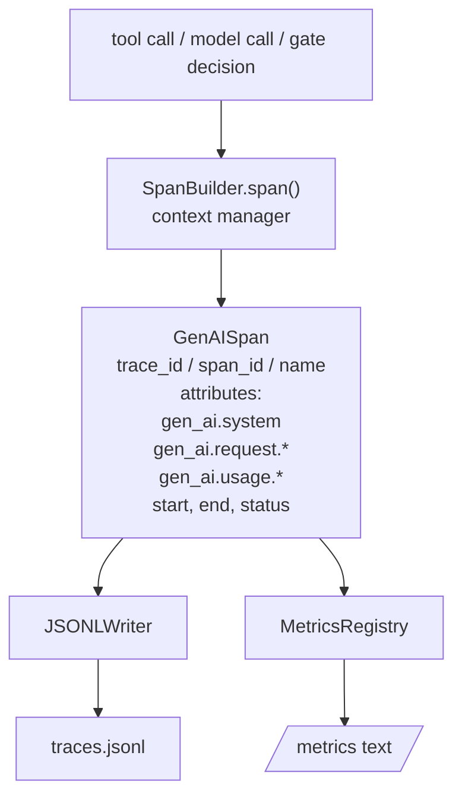
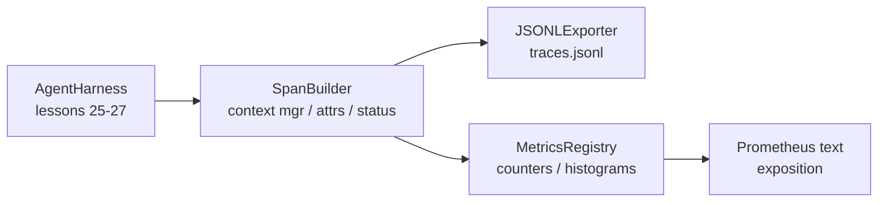

# Bài học Capstone 28: Hình ảnh có thể quan sát được với OTel GenAI Spans và Prometheus Metrics

> Một vòng xoay không có khả năng quan sát là một hộp đen có giá trị tiền bạc. Bài học này tay-roll một người xây dựng span phát ra các hồ sơ phù hợp với các quy ước ngữ nghĩa OpenTelemetry GenAI, viết chúng vào một tệp JSON-Lines một span mỗi dòng, và phơi bày các bộ đếm và histogram trong định dạng văn bản Prometheus.

**Type:** Build
**Languages:** Python (stdlib)
**Prerequisites:** Phase 19 · 25 (verification gates), Phase 19 · 26 (sandbox), Phase 19 · 27 (eval harness), Phase 13 · 20 (OpenTelemetry GenAI), Phase 14 · 23 (OTel GenAI conventions)
**Time:** ~90 minutes

## Mục tiêu học tập

- Xây dựng một lớp dữ liệu span được định hình theo các quy ước ngữ nghĩa OpenTelemetry GenAI.
- Thực hiện một nhà xuất khẩu JSONL viết một khoảng thời gian tự lập mỗi dòng.
- Xây dựng các bộ đếm và histogram với nhãn và biểu hiện định dạng văn bản Prometheus.
- Bao tất cả các cuộc gọi trong một quản lý ngữ cảnh span ghi lại thời gian, tình trạng và ngoại lệ.
- Kiểm tra rằng các phát sóng phát ra đi vòng qua `json.loads`và phù hợp với hình dạng của spec.

## Vấn đề

Một đại lý lập trình trong sản xuất sản xuất ba lớp đồ tạo mỗi lượt: một cuộc gọi mô hình, một thực hiện công cụ và một quyết định cửa kiểm tra.

Chế độ thất bại đầu tiên là dấu vết bị mất. Có gì đó đã sai vào thứ Ba nhưng ghi lại duy nhất là một nhật ký trò chuyện 500 dòng. Không có ghi lại công cụ nào đã chạy, mất bao lâu, bao nhiêu token đã vào trong lời nhắc, hoặc cổng đã từ chối bất cứ điều gì.

Phương thức thất bại thứ hai là dấu vết không thể phân tích được. Bộ đeo viết các span nhưng sử dụng tên trường ad-hoc của riêng mình. Không có gì trong Grafana, Honeycomb, Jaeger hoặc CLI địa phương có thể đọc chúng. Bất cứ công cụ nào tồn tại trong hàng của nhóm đều bị lãng phí vì các span không tiêu chuẩn.

Cách thất bại thứ ba là métrics không tổng hợp. Bạn có thể thấy một cuộc gọi công cụ chậm trong dấu vết, nhưng bạn không thể trả lời "tạm suất p95 của các cuộc gọi read_file trong giờ qua là gì?" bởi vì không có métrics, chỉ có dấu vết.

Các quy ước ngữ nghĩa OpenTelemetry GenAI tồn tại chính xác cho điều này. Họ xác định một tập hợp nhỏ thuộc tính tiêu chuẩn mà các phát xạ trải dài trên các khung LLM chia sẻ. Nếu vòng xoáy của bạn viết các thuộc tính đó, mọi backend tương thích OTel có thể đọc chúng.

## Khái niệm



Mỗi hoạt động trong vòng xoắn tạo ra một span. một span có một trace id (the whole agent invocation), một span id (thử động này), một tên (ví dụ `gen_ai.chat`- `gen_ai.tool.execution`), thuộc tính theo các quy ước GenAI, thời gian bắt đầu và kết thúc, và một trạng thái.

Các công ước GenAI tiêu chuẩn hóa các khóa thuộc tính này: `gen_ai.system`(các nhà cung cấp nào, ví dụ:`anthropic`- `openai`), `gen_ai.request.model`(tình dạng mẫu), `gen_ai.request.max_tokens`- `gen_ai.usage.input_tokens`- `gen_ai.usage.output_tokens`- `gen_ai.response.model`- `gen_ai.response.id`- `gen_ai.operation.name`, cộng với các khóa cụ thể cho công cụ `gen_ai.tool.name`và `gen_ai.tool.call.id`- Tôi không biết.

Người xuất khẩu viết JSONL. Một đối tượng JSON mỗi dòng. Đây là định dạng đơn giản nhất có thể được công cụ dòng chảy có thể truyền, thu thập và nhập khẩu. Một người xuất khẩu OTel thực sự sẽ nói OTLP gRPC; người xuất khẩu JSONL của bài học là tương đương ngoại tuyến và thoát khỏi số không trên mỗi trạm làm việc.

Các số liệu sống bên cạnh các dấu vết. Một số lần tăng trên mỗi công cụ gọi: `tools_called_total{tool="read_file"}`. Một histogram ghi lại độ trễ quan sát: `tool_latency_ms{tool="read_file"}`Cả hai đều được phân phối theo định dạng trình bày văn bản Prometheus, đó là tiêu chuẩn thực tế cho các số liệu dựa trên kéo.

```figure
trace-spans
```

## Kiến trúc



Nhà xây dựng span là một lớp nhỏ với một `span(name, attrs)`Phương pháp trả lại một người quản lý ngữ cảnh. Người quản lý ngữ cảnh ghi lại thời gian bắt đầu khi nhập, ghi lại thời gian kết thúc khi ra, gắn một ngoại lệ nếu một người được nâng lên, và đẩy thời gian hoàn thành cho người xuất khẩu.

Các bộ ghi số là hai chữ cái.`{(name, frozen_labels): int}`Các histogram lưu trữ các mẫu nguyên liệu trong một danh sách và phân phối theo chuỗi vào các vỏ histogram Prometheus tại thời điểm tiếp xúc.

## Những gì bạn sẽ xây dựng

`main.py`tàu:

1. `GenAISpan`Dataclass: trace_id, span_id, parent_span_id, tên, thuộc tính, start_unix_nano, end_unix_nano, trạng thái, status_message, sự kiện.
2. `SpanBuilder`lớp với `span(name, attrs, parent=None)`quản lý bối cảnh.
3. `JSONLExporter`lớp với `export(span)`Đó là một dòng.
4. `Counter`và `Histogram`lớp cộng với`MetricsRegistry`- Tôi không biết.
5. `prometheus_exposition(registry)`tạo ra các dạng văn bản.
6. `wrap_tool_call(name)`một thiết kế trang trí phát ra một khoảng thời gian và cập nhật các métrics.
7. Demo: tổng hợp một cuộc gọi đại lý hoàn chỉnh (gen_ai.chat span xung quanh tool spans), viết traces.jsonl, in bài báo Prometheus, thoát khỏi 0.

ID span và ID trace là chuỗi hex 16 byte, được tạo từ `os.urandom`. Điều đó phù hợp với bối cảnh theo dõi W3C của OTel. Người xuất khẩu không bao giờ ném; lỗi IO được xuất hiện nhưng dây đeo vẫn chạy.

HISTogram có một bộ vỏ cố định (tầm định OTel cho độ trễ trong millisecond: 5, 10, 25, 50, 100, 250, 500, 1000, 2500, 5000, 10000, +Inf).

## Tại sao được quấn bằng tay thay vì opentelemetry-sdk

OTel Python SDK là một sự phụ thuộc thực sự. Nó cũng là vài ngàn dòng mã, nhiều quy trình cho người xuất khẩu OTLP, và chi phí thời gian chạy mà tràn ngập ngân sách bài học. Phiên bản xoay tay dạy định dạng dây. Trong sản xuất bạn cáp các thuộc tính tương tự vào SDK thực và nhận được người xuất khẩu OTLP, phân phối hàng và phát hiện tài nguyên miễn phí.

Các quy ước ổn định. định dạng dây mà bài học phát ra sẽ tiếp tục phân tích vào năm 2030 bởi vì OTel không bao giờ phá vỡ tên thuộc tính GenAI; họ chỉ thêm mới.

## Làm thế nào nó kết hợp với phần còn lại của Track A

Bài học 25 tạo ra chuỗi cổng. Bài học 26 tạo ra hộp cát. Bài học 27 tạo ra vòng đánh giá. Bài học 28 làm cho cả ba đều có thể quan sát được. Bài học 29 bao bọc từng bước của bản demo đầu đến cuối trong khoảng thời gian và in văn bản Prometheus ở cuối.

## - Đưa nó ra.

```bash
cd phases/19-capstone-projects/28-observability-otel-traces
python3 code/main.py
python3 -m pytest code/tests/ -v
```

Demo phát ra một `traces.jsonl`trong bài học làm việc dir (được dọn dẹp ở cuối), sau đó in một mẫu ba span, sau đó in phơi bày Prometheus cho các đếm và histogram. Các thử nghiệm xác minh rằng các span xoay quanh, các thuộc tính GenAI có mặt, đếm tăng đúng, và rằng phơi bày histogram chứa các đếm rác mong đợi.
