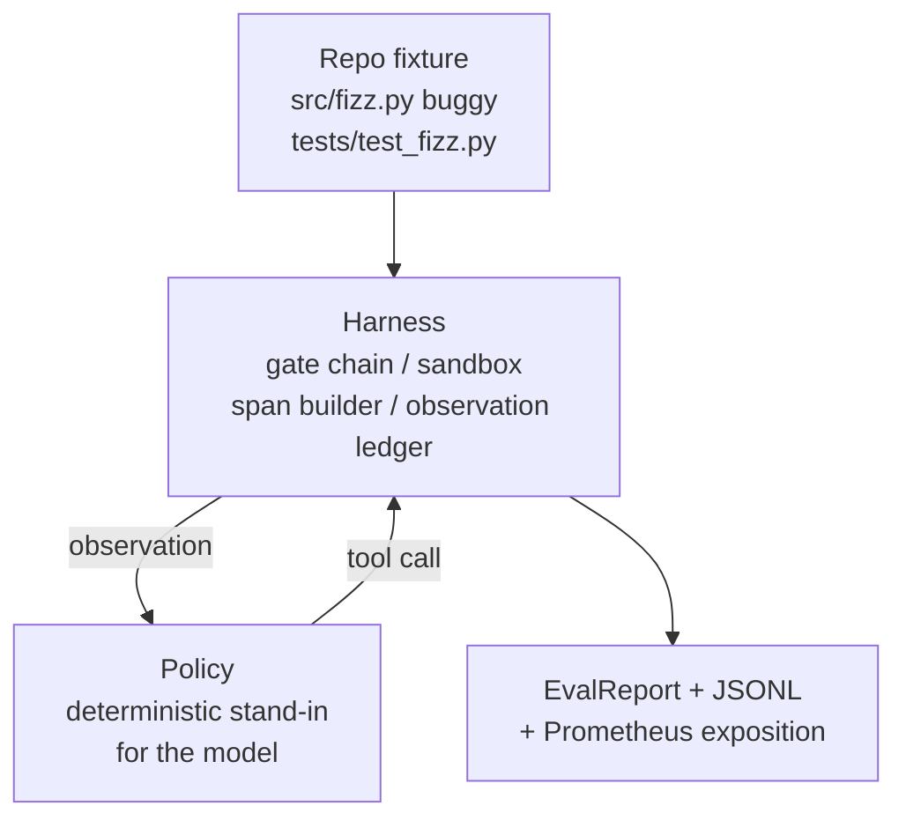
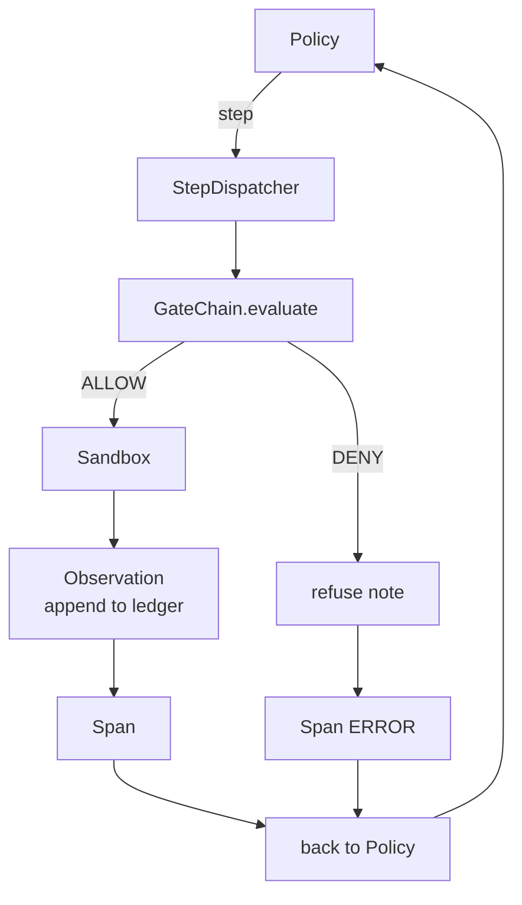

# Bài học Capstone 29: Thuốc mã hóa từ đầu đến cuối trên vòng xoáy

> - Đường A trả tiền. Bài học này đan chuỗi cổng, hộp cát, vòng đánh giá và OTel mở rộng thành một đại lý mã hóa hoạt động khắc phục một lỗi thực tế (tín, quy mô cố định) trong một dự án Python đa tập tin. Các đại lý là một chính sách xác định, không phải là một LLM; sự thay thế làm cho bài học có thể tái tạo và cho thấy rằng vòng xoáy là phần thú vị trong suốt thời gian. Hợp đồng giống nhau: một mô hình thực sự kết nối vào các chính sách.

**Type:** Build
**Languages:** Python (stdlib)
**Prerequisites:** Phase 19 · 25 (verification gates), Phase 19 · 26 (sandbox), Phase 19 · 27 (eval harness), Phase 19 · 28 (observability), Phase 14 · 38 (verification gates), Phase 14 · 41 (workbench for real repos), Phase 14 · 42 (agent workbench capstone)
**Time:** ~90 minutes

## Mục tiêu học tập

- Sắp xếp chuỗi cổng, hộp cát, vòng đánh giá và xây dựng span thành một vòng lặp đại lý duy nhất.
- Thực hiện một chính sách xác định sử dụng read_file, run_tests, và write_file để sửa lỗi cài đặt.
- Thực hiện ngân sách bước toàn cầu cộng với ngân sách token quan sát trong một cuộc chạy từ đầu đến cuối.
- Giả ra dấu vết OTel GenAI đầy đủ và số liệu Prometheus cho toàn bộ chạy.
- Hãy xác minh đại lý giải quyết sự cố trong ít hơn 12 bước với không có hành trình vào cổng trên các công cụ pháp lý.

## Vấn đề

Hầu hết các trình diễn đại lý hoạt động một cách riêng biệt: một hộp cát tự nó, một vòng đánh giá tự nó, một phát xạ kéo dài tự nó.

Mạng cổng nói "HỌNG" nhưng hộp cát từ chối vì lý do mà chuỗi không dự đoán. Vị kiểm tra ghi lại một thông qua nhưng các thông tin của OTel nói rằng cổng đã từ chối một công cụ mà nhân viên cho rằng nó đã sử dụng. Máy đếm Prometheus được tăng gấp đôi khi nó nên được tăng một lần. Ngân sách quan sát đã vượt quá nhưng đại lý vẫn tiếp tục vì ngân sách đã được theo dõi trong chuỗi và hộp cát không biết.

Bài học này là thử nghiệm tích hợp cho toàn bộ đường đua. Đại lý phải làm bốn điều để: đọc dự án, chạy các thử nghiệm, xác định lỗi từ sự thất bại của thử nghiệm, viết sửa chữa, chạy lại các thử nghiệm và dừng. Mỗi hoạt động đi qua chuỗi cổng. Mỗi hành động thực hiện công cụ đi qua hộp cát. Mỗi bước được gói trong một khoảng thời gian. Vỏ đánh giá ghi điểm toàn bộ ở cuối.

## Khái niệm



Chính sách của đại lý là một máy của tiểu bang.

`SURVEY`: đại lý đọc danh sách dự án.

`RUN_TESTS`Nếu các thử nghiệm vượt qua, máy trạng thái dừng lại thành công. Nếu không trạng thái tiếp theo là INSPECT.

`INSPECT`: đại lý đọc các tập tin nguồn thất bại. trạng thái tiếp theo là FIX.

`FIX`: đại lý viết file sửa chữa.

`VERIFY`Nếu các thử nghiệm vượt qua, dừng thành công. Nếu không dừng lại với thất bại.

Mỗi trạng thái tương ứng với một cuộc gọi công cụ. Mỗi cuộc gọi công cụ đi qua chuỗi cổng. Nếu một cuộc gọi công cụ bị từ chối, đại lý báo cáo từ chối trong manh mối và dừng lại.

Vấn đề của bộ phận này là một sự cố trong 1`fizz.py`Chính sách xác định phát hiện lỗi từ thông điệp thất bại thử nghiệm thông qua regex và phát ra các tập tin đã sửa chữa.

```figure
cg-harness-weave
```

## Kiến trúc



Bài học tự nhiên. Mỗi bài học trước tiên được thực hiện lại ở quy mô tối thiểu trong`main.py`(gate, sandbox, ledger, span) để bài học được chạy mà không cần nhập các anh chị em. tên tương ứng với bài học 25-28 chính xác để bản đồ khái niệm là không rõ ràng.

## Những gì bạn sẽ xây dựng

`main.py`tàu:

1. Những nguyên thủy của vòng xoáy tối thiểu, được sao chép cùng tên với bài học 25-28:`GateChain`- `Sandbox`- `ObservationLedger`- `SpanBuilder`- `MetricsRegistry`- Tôi không biết.
2. `CodingAgentPolicy`lớp: máy trạng thái với năm trạng thái.
3. `Repo`trợ lý: chuẩn bị một vết xước với bộ phận gắn buggy.
4. `AgentRun`lớp: điều khiển chính sách, gửi qua dây cáp, trả lại một `AgentRunReport`- Tôi không biết.
5. Một bộ kết hợp (`fixture_repo/`) với src/fizz.py, tests/test_fizz.py, và một cây dự kiến/ cây cho vòng đánh giá.
6. Demo: chạy chính sách từ đầu đến cuối, in dấu vết từng bước, khẳng định vượt qua, in métrics.

Các kết hợp được kết hợp cùng hình dạng với cấu trúc nhiệm vụ của bài học 27: một tệp lỗi và một tệp thử nghiệm. Thông điệp thất bại thử nghiệm chứa đủ thông tin cho chính sách xác định để xác định sự cố. Một LLM thực sự sẽ làm công việc tương tự, chậm hơn và với sự nhớ lại rộng hơn, nhưng nó sẽ không thay đổi kỳ vọng của vòng xoắn.

## Tại sao chính sách không phải là một LLM

Một LLM thực sự đòi hỏi một khóa API, một cuộc gọi mạng và stochasticity không thể xác minh. Harness là phần mà bài học quan tâm. Subbing trong một chính sách xác định cho phép bài học chạy trên bất kỳ máy tính xách tay của nhà phát triển nào với không phụ thuộc bên ngoài và cho phép bộ thử nghiệm khẳng định đếm từng bước chính xác.

Chính sách của bài học là một bộ phận nghiêm ngặt của những gì một đại lý LLM làm. Chính sách đọc repo, nhìn thấy bài kiểm tra thất bại, xác định đường và phát hành một sửa chữa. Một LLM đi qua cùng một vòng lặp với cùng một hợp đồng sử dụng; kế toán là giống nhau.

## Những gì bản demo khẳng định

Bản demo đầu đến cuối khẳng định năm điều tại thời điểm ra đi, và bộ thử nghiệm xác nhận lại chúng theo cách lập trình.

Chính sách đã giải quyết vấn đề trong ít hơn 12 bước.

Ngân sách quan sát không bao giờ được vượt quá.

Zero Gate denials bắn vào các công cụ pháp lý.

Mỗi bước có khoảng thời gian tương ứng trong các dấu vết. jsonl

Khảo trình Prometheus chứa một `tools_called_total{tool="read_file"}`nhập và một `tool_latency_ms`HISTOM

## Làm thế nào nó kết hợp với phần còn lại của Track A

Bài học 25 viết chuỗi cổng. Bài học 26 viết hộp cát. Bài học 27 viết value harness. Bài học 28 viết observability. Bài học 29 chứng minh rằng chúng hoạt động như một hệ thống. Một axent harness thực sự mở rộng từ đây: thay đổi chính sách xác định cho một mô hình, thay đổi bộ cố định đóng gói cho một nhiệm vụ thực repo, thay đổi xuất khẩu JSONL cho OTLP.

## - Đưa nó ra.

```bash
cd phases/19-capstone-projects/29-end-to-end-coding-task-demo
python3 code/main.py
python3 -m pytest code/tests/ -v
```

Các bài kiểm tra in một dấu vết từng bước, báo cáo đánh giá cuối cùng và bài báo Prometheus. Mã thoát là không. Các bài kiểm tra bao gồm các chuyển đổi trạng thái chính sách, các lệnh từ chối vào các cuộc gọi công cụ tổng hợp, chạy đầu đến cuối trên thiết bị kết hợp và các biến số ngân sách từng bước.
