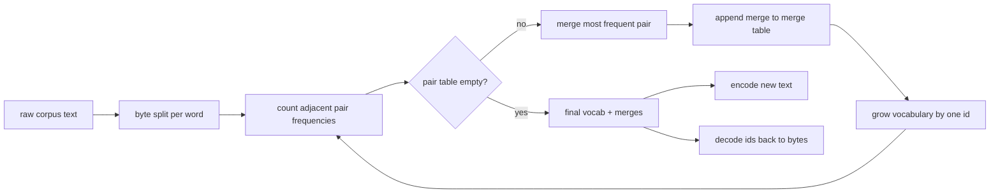
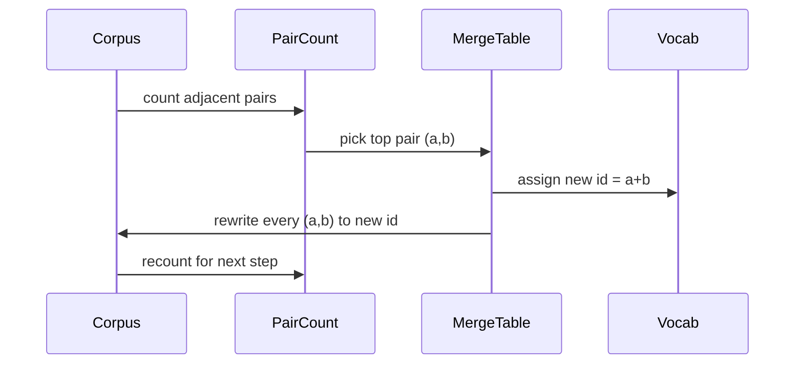

# BPE Tokenizer Từ đầu

> Bytes vào, ID ra, ID trở lại cùng một byte.

**Type:** Build
**Languages:** Python
**Prerequisites:** Phase 04 lessons, Phase 07 transformer lessons
**Time:** ~90 minutes

## Mục tiêu học tập
- Trình tạo từ vựng mã hóa từ một tập tin văn bản thô bằng cách liên tục hợp nhất các cặp biểu tượng lân cận thường xuyên nhất.
- Thực hiện một bảng kết hợp xác định và áp dụng nó cho văn bản mới để tạo ra một dòng các chữ chữ phụ.
- Chuyến đi vòng tròn nhập UTF-8 tùy ý vào ID và trở lại mà không mất thông tin.
- Đặt và bảo vệ các token đặc biệt (`<|endoftext|>`- `<|pad|>`) để chúng tồn tại trong việc đào tạo và giải mã.
- Lý do tại sao một bảng chữ cái cấp bằng byte là sàn phù hợp cho một tokenizer mục đích chung.

```figure
cap-bpe-merge
```

## Tâm

Một mô hình ngôn ngữ không bao giờ nhìn thấy văn bản. Nó nhìn thấy số nguyên. Bản đồ từ một chuỗi đến một danh sách số nguyên và trở lại là tokenizer.

Gia đình chủ yếu của các mã ký hiệu phụ cho các mô hình văn bản chung là Byte-Pair Encoding. Ý tưởng là nhỏ. Bắt đầu từ một bảng chữ cái được biết đến. Tìm cặp biểu tượng lân cận xuất hiện thường xuyên nhất trong tập thể đào tạo. Thủy nó thành một biểu tượng mới. Lặp lại cho đến khi từ vựng đạt đến kích thước mục tiêu. Mã hóa văn bản mới sử dụng lại cùng danh sách hợp nhất trong cùng một thứ tự.

Chúng tôi sẽ xây dựng biến thể cấp bayt. bảng chữ cái là 256 byte thô, không phải các điểm mã Unicode.

## Đường ống



Phần đào tạo và phần suy luận chia sẻ bảng hợp nhất. chia sẻ đó là hợp đồng. Nếu bạn thay đổi thứ tự hợp nhất khi suy luận, bạn giải mã một dòng ID khác.

## Biểu đồ byte

Các ID 256 đầu tiên được dành riêng cho các byte nguyên liệu 0x00 đến 0xFF. Điều này đảm bảo mỗi chuỗi đầu vào có thể được thể hiện trong từ vựng trước khi bất kỳ hợp nhất nào xảy ra. Sau khối byte chúng tôi dành một phạm vi nhỏ cho các token đặc biệt.

Pre-tokenizer chia corpus trên không gian trắng và ranh giới điểm trước khi đào tạo thấy nó. Nếu không có chia tách BPE bước hợp nhất sẽ vui vẻ học các hợp nhất vượt qua ranh giới từ và từ vựng điền đầy với toàn bộ các cụm từ chung.

## Chuyển tập

Đối với mỗi bước đào tạo, vòng lặp làm ba điều. Nó đi bộ mỗi từ trong corpus và đếm bao nhiêu lần mỗi cặp biểu tượng hiện tại liền kề xuất hiện, cân bằng với bao nhiêu lần từ chính nó xuất hiện. Nó chọn cặp với số lượng cao nhất. Nó viết lại mọi sự xuất hiện của cặp đó thành một biểu tượng mới duy nhất có id là khe tự do tiếp theo trong từ vựng. Sau đó nó ghi lại sự hợp nhất.



Chi phí của mỗi bước là tuyến tính trong kích thước của tập thể được thể hiện như một danh sách các chuỗi biểu tượng. Đối với một triệu từ và một từ vựng mục tiêu mười ngàn id vòng lặp chạy đến hoàn thành trong vài giây vì các chuỗi biểu tượng thu nhỏ khi hợp nhất đất.

## Mã hóa văn bản tươi

Inference không gọi đếm kết hợp. Nó áp dụng bảng kết hợp theo cùng thứ tự mà nó được học. Đối với một từ mới, bộ mã hóa bắt đầu từ phân chia byte. Nó quét chuỗi hiện tại cho chuỗi kết hợp xếp hạng thấp nhất (những thứ nhất áp dụng). Nó thực hiện kết hợp đó. Nó quét lại. Loop kết thúc khi không có sự kết hợp trong bảng áp dụng cho chuỗi hiện tại.

Sự sắp xếp theo thứ hạng là tính chất làm cho việc mã hóa xác định và phù hợp với hành vi đào tạo trên cùng đầu vào. Một sự kết hợp được học trước tiên nằm ở đầu bảng và được áp dụng trước tiên. Nếu hai sự kết hợp có thể áp dụng ở cùng một vị trí, một thứ hạng thấp hơn sẽ thắng.

## Các token đặc biệt

Các mã thông báo đặc biệt là các ID mà dòng byte không bao giờ có thể tạo ra chúng ta đặt chúng bằng tay hai là đủ cho bài học này

- `<|endoftext|>`Nó nói với mô hình "một tài liệu mới bắt đầu ở đây, đừng để ngữ cảnh của một tài liệu trước đó rò rỉ vào".
- `<|pad|>`Nó điền vào các chuỗi ngắn để một lô có thể là một tensor hình chữ nhật.

Các mã hóa chấp nhận một cờ để cho phép các mã thông báo đặc biệt trong đầu vào.`<|endoftext|>`và `<|pad|>`với cờ được bật, các chuỗi chữ cái được lập bản đồ đến ID được lưu trữ của họ và không phải là đối tượng của bất kỳ hợp nhất.

## Bảo đảm đi lại

Các mã hóa sau đó phải trả về các byte đầu vào chính xác. Các mã hóa sẽ kết nối các byte mở rộng của mỗi id theo thứ tự. Vì mỗi id là một byte thô hoặc kết nối hai id đã được biết đến trước đây, sự mở rộng tái tạo luôn kết thúc trong byte thô.

Bộ thử nghiệm trong bài học này kiểm tra tính chất đó trên một câu không thể nhìn thấy, trên một câu với một emoji Unicode, và trên một câu có chứa một chữ nghĩa đen `<|endoftext|>`- Đồ tín hiệu.

## Bài học này không làm gì

Nó không xây dựng một pre-tokenizer chạy regex theo phong cách của các tokeners sản xuất lớn nhất. Pre-Kenizer ở đây là một không gian trắng nhỏ và phân đoạn dấu chấm. Chỉ cần tạo ra sự hợp nhất hợp lý trên một tập thể đào tạo nhỏ và hợp đồng với phần còn lại của chuỗi bài học vẫn giữ nguyên. Bài học tiếp theo xử lý token như một hộp đen và xây dựng bộ dữ liệu cửa sổ trượt trên nó.

Nó không song song đếm cặp. Một vòng lặp trong Python trên một tập hợp vài ngàn từ kết thúc trong ít hơn một giây. Đối với các tập thể lớn hơn chuyển động rõ ràng là đếm cặp mỗi từ song song và giảm.

## Làm thế nào để đọc mã

`main.py`định nghĩa bốn đối tượng.`BPETokenizer`chứa từ vựng, bảng hợp nhất và bảng mã đặc biệt. `train`là vòng tròn đào tạo.`encode`là con đường suy luận.`decode`là liên kết byte. Demo ở dưới cùng đào tạo một token nhỏ trên một corpus tích hợp, mã hóa một câu dài, giải mã lại các ID, và in cả hai.`code/tests/test_bpe.py`Pin thuộc tính đi lại, đặt thẻ đặc biệt, và sắp xếp hợp nhất.

Hãy chạy demo. Sau đó thay đổi kích thước từ vựng mục tiêu trong demo từ 300 lên 600 và xem chiều dài mã hóa của câu được giữ ra giảm như thế nào. cong đó là cong bpe compression.
