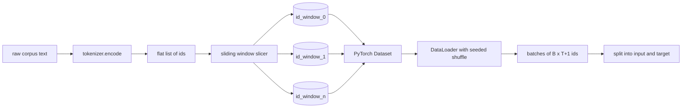
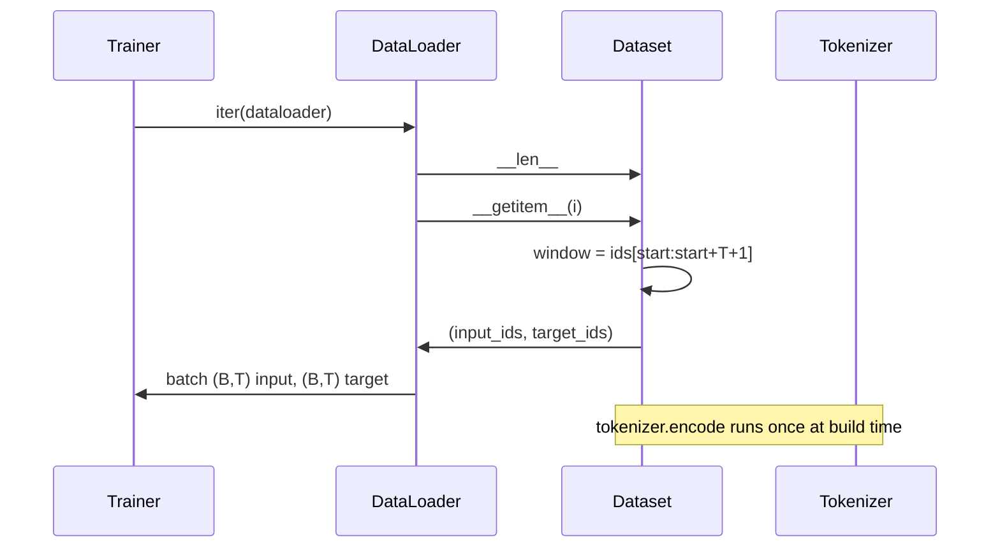

# Bộ dữ liệu được mã hóa với cửa sổ trượt

> Một chạy trước tập là một chức năng từ ID token đến gradient. Bài học này xây dựng conveyor mà cung cấp ID vào.

**Type:** Build
**Languages:** Python
**Prerequisites:** Phase 04 lessons, Phase 07 transformer lessons, Lesson 30 of this phase
**Time:** ~90 minutes

## Mục tiêu học tập
- Chuyển đổi một tập hợp nguyên liệu thành một dòng ID token bằng cách gọi cho tokenizer một lần.
- Chia dòng id thành cửa sổ dài cố định với bước chồng chéo có thể cấu hình.
- Xây dựng một bộ dữ liệu PyTorch trả về đầu vào và các tensor mục tiêu cho dự đoán mã thông báo tiếp theo.
- Bỏ bộ dữ liệu trong một DataLoader với một sự trộn xác định được gieo theo thời đại.
- Lý do về sự thỏa hiệp giữa bước tiến, tính tháo dỡ và kích thước tập dữ liệu hiệu quả.

```figure
cap-sliding-window
```

## Tâm

Một lần chạy trước khi đào tạo đọc một loạt các thẻ ID một lúc và cập nhật mô hình.`(B, T)`ID đầu vào và `(B, T)`mục tiêu id nơi mục tiêu là đầu vào được chuyển từ bên trái của một. Công việc của đường ống dữ liệu là tạo ra hợp đồng đó theo yêu cầu, theo cách xác định và tái tạo, từ một tập thể có thể là vài gigabytes văn bản thô.

Bài học này xây dựng đường ống dẫn. Tokenizer từ bài học trước biến văn bản thành một danh sách dài phẳng của các ID. Một cửa sổ trượt cắt danh sách thành ví dụ đào tạo. Một bộ dữ liệu tùy chỉnh phơi bày các ví dụ như các tensor. Một DataLoader đúc chúng và trộn chúng với một hạt giống được biết đến.

## Hợp đồng hình dạng

Một LM nguyên nhân tiêu thụ ID hình dạng `(B, T)`nơi `B`là kích thước lô và `T`là chiều dài của ngữ cảnh.`t`là đầu vào ở vị trí `t+1`Điều đó có nghĩa là mỗi ví dụ đào tạo bao gồm`T+1`ID nguyên chất. bước cửa sổ kiểm soát mức độ chồng chéo tồn tại giữa các ví dụ liên tiếp.



Máy cắt không bao giờ chồng chéo với ranh giới của corpus. nếu cửa sổ cuối cùng không có đủ ID để lấp đầy`T+1`Đặt vị trí, người cắt cắt bỏ nó.`<|pad|>`cũng là một lựa chọn hợp lệ nhưng nó làm phức tạp hơn mặt nạ mất mát.

## Tại sao một cửa sổ trượt

Một corpus trước khi tập là một dòng dài của các ID. Nếu mô hình chỉ thấy các cửa sổ không chồng chéo, mỗi ví dụ tập luyện sẽ dạy nó giống nhau `T`Định hướng bước chuyển các ranh giới đó xung quanh để mô hình nhìn thấy các nhiệm vụ dự đoán-được công nhận tiếp theo đa dạng hơn.

Một bước đi của `T`tạo ra các cửa sổ không chồng chéo.`T // 2`tạo ra sự chồng chéo 50% và tăng gấp đôi bộ dữ liệu hiệu quả.`1`tạo ra sự chồng chéo tối đa và tăng bộ dữ liệu bằng một nhân tố của `T`Chi phí là tính toán nhiều hơn mỗi thời đại. Lợi ích là sự đa dạng ranh giới nhiều hơn. Hầu hết các chạy trước tập sử dụng một bước bằng chiều dài ngữ cảnh vì cơ thể đã lớn hơn nhiều so với mô hình có thể hoàn thành trong một thời đại, do đó lập luận đa dạng ranh giới yếu hơn.

## Các lớp Dataset

Một bộ dữ liệu PyTorch có hai phương pháp cần thiết. `__len__`trả lại số lượng các ví dụ. `__getitem__`trả lại một ví dụ như một cặp tensor. bộ dữ liệu của chúng tôi lưu trữ dòng id được mã hóa và bước. Chỉ mục vào nó tính toán khởi đầu của cửa sổ trên đường bay vì vậy chi phí bộ nhớ là một bản sao của dòng id bất kể bước tạo ra bao nhiêu ví dụ.



Chuyển theo từng người xảy ra bên trong.`__getitem__`. Bộ dữ liệu trả lại `(input, target)`nơi `input = window[:-1]`và `target = window[1:]`Cả hai đều là các tensor dài PyTorch.

## Đánh trộn quyết định

Một DataLoader với `shuffle=True`đọc từ một máy phát điện ngẫu nhiên PyTorch.`torch.Generator`nếu bạn có một chuỗi giống, chúng ta sẽ có cùng một sự trộn lẫn mỗi khi chạy được khởi động lại. tính chất đó quan trọng khi bạn muốn so sánh hai lần chạy khác nhau chỉ trong một siêu tham số. nếu không có một chuỗi giống, hai lần chạy sẽ thấy dữ liệu theo thứ tự khác nhau và đường cong mất mát sẽ khác nhau vì những lý do không liên quan đến sự thay đổi.

Hợp đồng hạt giống trong bài học này rất đơn giản.`epoch_seed = base_seed + epoch_index`. Mầm cơ bản được chuyển qua khi xây dựng. Chỉ số thời đại được tăng lên bởi huấn luyện viên ở đầu mỗi thời đại. Một lần chạy lại với giống cơ bản tương tự luôn thấy thứ tự tương tự trong mọi thời đại.

## Máy lấy mẫu lô

Các mẫu mặc định trong PyTorch chọn chỉ số một cách ngẫu nhiên với thay thế vô hiệu hóa. Đó là điều chúng tôi muốn cho việc đào tạo trước. Đối với việc chỉnh sửa kỹ lưỡng trên một tập dữ liệu nhỏ hợp đồng tương tự. DataLoader lắp ráp một lô bằng cách gọi `__getitem__` `B`Vì mỗi ví dụ đều dài bằng cách xây dựng, không cần logic đệm.

Bài học vẫn còn `num_workers=0`Trong một cuộc sản xuất, công nhân song song hóa`__getitem__`với đường ống của chúng tôi mà chủ yếu là không hoạt động bởi vì công việc chỉ là một mảnh của một tensor trong bộ nhớ, nhưng cùng một Dataset API hỗ trợ công nhân sạch sẽ.

## Ví dụ đếm

Đối với một dòng ID chiều dài `N`, chiều dài của ngữ cảnh `T`, và một bước tiến`S`, số lượng các ví dụ là `max(0, 1 + (N - (T + 1)) // S)`Bài học cho thấy tính toán đó là một phương pháp tĩnh trên bộ dữ liệu để người đào tạo có thể tính toán tổng số bước mỗi thời đại mà không lặp lại.

## Bài học này không làm gì

Nó không chảy từ đĩa. Bộ phận được mã hóa hoàn toàn trong bộ nhớ và được giữ như một tensor duy nhất. Đối với một bộ phận của một vài triệu id là dưới một trăm megabytes và là hình dạng phù hợp cho bài học.

Nó không xử lý nhiều tài liệu. Corpus được coi như một dòng ID liên tục. Biên giới tài liệu tiếp theo được mã hóa bằng cách chèn `<|endoftext|>`ID khi corpus được xây dựng từ nhiều tài liệu. mô hình học được dự đoán xung quanh ranh giới.

## Làm thế nào để đọc mã

`main.py`định nghĩa hai lớp và một trợ lý. `SlidingWindowDataset`là bộ dữ liệu PyTorch. `make_dataloader`trả lại một DataLoader được cấu hình với một máy phát điện được gieo. `_encode_corpus_to_ids`là cuộc gọi tokenizer một lần. Demo ở dưới cùng xây dựng một tokenizer nhỏ trong quá trình, mã hóa một bộ tích hợp, xây dựng bộ dữ liệu và dataloader, in một lô, và khẳng định hợp đồng hình dạng. Các thử nghiệm trong `code/tests/test_dataset.py`Pin công thức đếm cửa sổ, thuộc tính chuyển đổi theo một, sự trộn lẫn xác định và sự đổi bước.

Hãy chạy demo. Sau đó thay đổi chiều dài ngữ cảnh từ 16 lên 32 và xem số lượng ví dụ mỗi thời đại giảm như thế nào. Số lượng đó là ngân sách từng bước mỗi thời đại của bạn.
