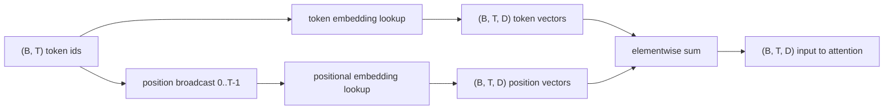
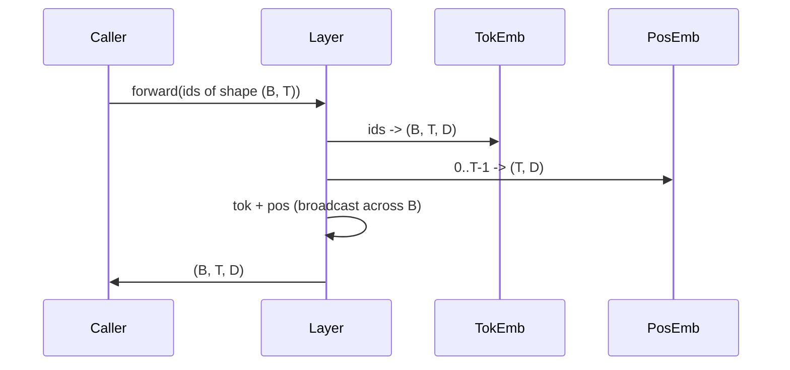

# Các mã và vị trí tích hợp

> ID là số nguyên. mô hình muốn các vector. hai bảng tìm kiếm nằm giữa chúng, và sự lựa chọn của vị trí hình thành những gì mô hình có thể học được.

**Type:** Build
**Languages:** Python
**Prerequisites:** Phase 04 lessons, Phase 07 transformer lessons, Lessons 30 and 31 of this phase
**Time:** ~90 minutes

## Mục tiêu học tập
- Xây dựng một bảng tìm kiếm tích hợp token mà lập bản đồ danh mục từ vựng thành các vector dày đặc.
- Xây dựng một bảng tìm kiếm tích hợp vị trí được học được theo vị trí.
- Xây dựng một hình dung vị trí sinusoidal cố định được chỉ mục theo vị trí mà không có tham số.
- Sắp xếp các mã thông báo và vị trí nhúng vào một đầu vào duy nhất cho một khối biến thể.
- Sự tương phản được học và các bản nhúng sinusoidal trên tổng hợp chiều dài và số lượng tham số.

```figure
cc-embedding-lookup
```

## Tâm

Kết nối đầu tiên của mô hình với một mã thông báo là tìm kiếm hàng trong mã thông báo. Các mã thông báo có một hàng cho mỗi mã từ vựng và một cột cho mỗi chiều mô hình. Tìm kiếm trả lại một vector mà phần còn lại của mô hình xử lý như ý nghĩa của mã thông báo. Backprop cập nhật các hàng được sử dụng trong chuyển tiếp phía trước.

Chỉ riêng thẻ ID không có thứ tự. Mô hình cần một tín hiệu thứ hai cho biết vị trí một khác với vị trí mười bảy. Hai lựa chọn thống trị cho tín hiệu đó là một việc tích hợp vị trí được học (một bảng tìm kiếm thứ hai, một hàng cho mỗi vị trí) và một việc tích hợp vị trí chân lưng cố định (một công thức toán học không có tham số). Sự lựa chọn có hậu quả. Một bảng học là một tham số và được giới hạn bởi chiều dài ngữ cảnh tối đa mô hình được đào tạo. Một bảng hình âm đạo là không tham số trong lý thuyết và công thức mở rộng đến bất kỳ vị trí, nhưng bài học này `SinusoidalPositionalEmbedding`tính toán trước một bảng cố định tại `max_context_length`và của nó`forward`mô hình vẫn có thể đấu tranh vượt qua chiều dài đào tạo của nó ngay cả khi bảng đủ lớn để chỉ mục.

Bài học này xây dựng cả hai và kết hợp chúng với biểu tượng tích hợp vào một đầu vào duy nhất cho khối chú ý của bài học tiếp theo.

## Hợp đồng hình dạng

Các đầu vào vào giai đoạn nhúng là một loạt các ID token hình dạng `(B, T)`. Tạo ra là một tensor hình dạng`(B, T, D)`nơi `D`là chiều kích mô hình. Mỗi phần tử lô có cùng chiều dài ngữ cảnh `T`Mỗi vị trí đều có cùng chiều dọc vector`D`- Tôi không biết.



Sự kết hợp là một tổng hợp, không phải là một kết nối.`D`liên tục qua mạng và cho phép mô hình quyết định trên cơ sở tính năng cho phép ý nghĩa biểu tượng hoặc vị trí thống trị ở mỗi lớp.

## Các mã hóa nhúng mã hóa

Các token được nhúng là một parameter tensor hình dạng `(V, D)`nơi `V`là kích thước từ vựng. PyTorch cho thấy nó là`nn.Embedding(V, D)`. Tại init các mục được rút ra từ một Gaussian nhỏ, truyền thống với trung bình bằng không và lệch chuẩn xung quanh `0.02`cho các mô hình quy mô biến đổi. sự chính xác init ít quan trọng hơn là nó vẫn phù hợp trong các lần chạy.

Việc đi trước là một hoạt động lập chỉ mục duy nhất.`(B, T)`int64 ID đến `(B, T, D)`Lần trượt ngược chỉ tích lũy gradient vào các hàng đã được chạm vào trong lần trượt phía trước. Hai hàng không bao giờ xuất hiện trong lô nhận được gradient không trên bước đó.

Một chi tiết tinh tế. Việc nhúng mã và dự đoán đầu ra ở cuối mô hình thường chia sẻ trọng lượng (tích trọng lượng). Khi điều đó xảy ra, mỗi lần đi ngược lại chạm vào mỗi hàng nhúng thông qua phía đầu ra. Bài học ở đây cho thấy cả hai là mô-đun riêng biệt nhưng cùng một matrix có thể đóng cả hai vai trò trong mô hình đầy đủ.

## Việc tích hợp vị trí được học

Việc tích hợp vị trí được học là thứ hai `nn.Embedding`hình dạng`(max_context_length, D)`. Tìm kiếm được khóa bằng vị trí ID `0, 1, 2, ..., T-1`. Hành trình đi trước phát sóng vị trí vector qua chiều batch.

Nhược điểm của bảng học là nó không thể được hỏi ở vị trí `T`Nếu mô hình chỉ được huấn luyện để vị trí `T-1`Các mô hình chỉ sử dụng máy giải mã sản xuất sử dụng hệ thống này nướng chiều dài ngữ cảnh tối đa vào kiến trúc và từ chối xử lý các đầu vào dài hơn.

## Các tích hợp vị trí sinusoidal

Sự nhúng vị trí chân lưng là một hàm từ vị trí sang vector.`p`và tính năng`i`sản phẩm

```python
angle = p / (10000 ** (2 * (i // 2) / D))
emb[p, 2k]     = sin(angle)
emb[p, 2k + 1] = cos(angle)
```

Các hàm không có tham số. Mỗi vị trí có một vector độc đáo. Độ dài sóng thay đổi theo hình học giữa các chiều kích đặc tính, do đó các chiều kích thấp hơn mã hóa vị trí thô và các chiều kích cao hơn mã hóa vị trí tốt.

Tài sản phát sinh từ sự lựa chọn của `sin`và `cos`cùng là vector ở vị trí `p + k`là một hàm tuyến tính của vector ở vị trí `p`. Điều đó cho lớp chú ý một con đường dễ dàng để học các sự bù đắp vị trí tương đối. mô hình không cần một tham số riêng biệt để thể hiện "xem lại năm token".

Bài học tính toán toàn bộ bảng sinus một lần trong xây dựng và chỉ số vào nó trong thời gian phía trước.

## Thành phần

Đường dẫn đầu vào làm ba điều theo thứ tự. đọc các mã thông báo, tìm các vector token, thêm các vector vị trí, trả lại tổng số.



Việc phát sóng trong bước tổng cộng sao chép `(T, D)`Tăng áp vị trí dọc theo chiều kích lô. PyTorch xử lý tự động vì tensor vị trí có hình dạng `(1, T, D)`sau khi không ép.

## Phân tích tương phản

Bài học chạy cả hai biến thể trên cùng một đầu vào và in hai chẩn đoán.

Thứ nhất là số parameter.`max_context_length * D`Các thông số trên đầu của token.

Thứ hai là sự tương đồng cosine giữa các embedding ở vị trí lân cận. Phân biến sinus có sự phân rã mịn và có thể dự đoán được vì chức năng liên tục. Sự khác biệt được học tại khởi đầu có sự tương đồng gần như ngẫu nhiên vì các hàng được vẽ độc lập. Sau khi đào tạo, biến thể được học thường phát triển một cấu trúc mượt mà tương tự, nhưng nó phải khám phá cấu trúc đó từ dữ liệu.

## Bài học này không làm gì

Nó không xây dựng mã hóa vị trí xoay (RoPE) hoặc AliBi. Đó là những lựa chọn hiện đại trong các bộ chuyển đổi sản xuất. Cả hai đều tuân theo hợp đồng hình dạng tương tự như các nhúng ở đây (hãy áp dụng một biến đổi phụ thuộc vào vị trí cho các vector hình dạng `(B, T, D)`(văn) nhưng chúng được áp dụng ở bước chiếu chú ý thay vì vào đầu vào. Bài học tiếp theo xây dựng khối chú ý, và một trong những mở rộng tùy chọn là gấp quay vào các dự đoán khóa truy vấn ở đó.

Nó không huấn luyện việc nhúng. huấn luyện đòi hỏi một mất mát, đòi hỏi một mô hình đầu ra, đòi hỏi sự chú ý và một đầu LM. Đó là bài học tiếp theo và một sau đó.

## Làm thế nào để đọc mã

`main.py`định nghĩa ba mô-đun. `TokenEmbedding` Bọc`nn.Embedding(V, D)`- `LearnedPositionalEmbedding` Bọc`nn.Embedding(L, D)`- `SinusoidalPositionalEmbedding`tính toán trước bảng và phơi bày nó như một bộ đệm. `EmbeddingComposer`kết nối một token embedding và một position embedding cùng nhau. Demo ở dưới cùng in các hình dạng, các tham số đếm, và các nhà chẩn đoán tương đồng vị trí hàng xóm.`code/tests/test_embeddings.py`hình pin, hành vi phát sóng, số parameter và công thức sinusoidal.

Thử thử và thay đổi kích thước mô hình.`D`từ 64 đến 32 và xem các băng sóng hình âm thay đổi như thế nào.
