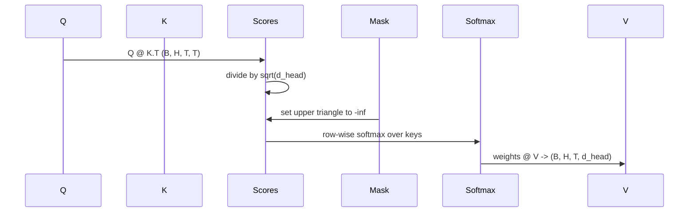

# Sự chú ý nhiều người

> Một dự án tuyến tính, ba góc nhìn, đầu song song H, một mặt nạ.

**Type:** Build
**Languages:** Python
**Prerequisites:** Phase 04 lessons, Phase 07 transformer lessons, Lessons 30 through 32 of this phase
**Time:** ~90 minutes

## Mục tiêu học tập
- Thực hiện một dự đoán Query/Key/Value được phân phối theo loạt như một lớp tuyến tính đơn lẻ được chia thành các đầu H.
- Lập toán sự chú ý của sản phẩm điểm với sự bình thường hóa và xử lý dtype đúng.
- Lắp một mặt nạ nguyên nhân để ngăn chặn một vị trí không được tiếp cận với các vị trí trong tương lai.
- Kiểm tra trọng lượng chú ý mỗi đầu để tìm ra một đầu vào cố định và lý luận về những gì mỗi đầu nhìn vào.
- Tập một khối chú ý nhỏ trên một nhiệm vụ đồ chơi và xem mất mát rơi khi các đầu chuyên.

```figure
cap-multihead-attention
```

## Tâm

Sự chú ý là chức năng cho phép đại diện của một token thu hút thông tin từ các token khác trong cùng một chuỗi. Sự chú ý tự nghĩa là các truy vấn, khóa và giá trị đều được lấy từ cùng một đầu vào.

Mô hình thực hiện hiệu quả là một lớp tuyến tính mà dự án từ `D`đến`3 * D`và được cắt thành ba hình ảnh, sau đó được định dạng lại thành các đầu H kích thước`D // H`Matmul, softmax và weighted sum xảy ra khi các tensor hoạt động để các đầu chạy song song trên bộ đẩy.

Bài học này xây dựng khối đó. Nó cũng thêm mặt nạ nguyên nhân để cùng một mã hoạt động như lớp chú ý trong mô hình ngôn ngữ chỉ có trình giải mã. Bài học tiếp theo xếp chồng khối thành một biến thể đầy đủ và bài học sau đó đào tạo nó.

## Hợp đồng hình dạng

Đáng nhập là `(B, T, D)`. Tạo ra là `(B, T, D)`Mặt nạ là`(T, T)`Bên trong khối các tensor trung gian có hình dạng`(B, H, T, d_head)`nơi `d_head = D // H`- Khá hạn là`D % H == 0`- Tôi không biết.

```mermaid
flowchart LR
    A["(B, T, D) input"] --> B[Linear D -> 3D]
    B --> C["split into Q, K, V"]
    C --> D["reshape to (B, H, T, d_head)"]
    D --> E["scores = Q @ K.T / sqrt(d_head)"]
    E --> F[apply causal mask]
    F --> G[softmax over keys]
    G --> H["context = weights @ V"]
    H --> I["reshape to (B, T, D)"]
    I --> J[output Linear D -> D]
    J --> K["(B, T, D) output"]
```



Hai lớp tuyến tính (đợt chiếu QKV và dự án ra) là các tham số duy nhất trong khối.

## Sự chia rẽ của QKV

Việc thực hiện ngây thơ có ba lớp tuyến tính riêng biệt, mỗi lớp cho Q, K và V. Một lớp hiệu quả có một lớp duy nhất tạo ra các kết quả.`3 * D`hai là tương đương về mặt toán học bởi vì ba lần nhân tử liệu riêng biệt bằng`(D, D)`trọng lượng chính xác là một matrix nhân bằng a `(3D, D)`trọng lượng của chúng.

Phiên bản hiệu quả nhanh hơn vì bộ tăng tốc khởi động một matmul thay vì ba. Nó cũng dễ dàng hơn để khởi tạo bởi vì ba phụ tử sống trong cùng một tensor tham số và có thể được khởi tạo cùng nhau.

## Đầu hình dạng lại

Sau khi chia, mỗi Q, K, V là `(B, T, D)`Để biến điều đó thành vấn đề chú ý song song H, chúng ta sẽ tái định hình thành`(B, T, H, d_head)`và chuyển sang `(B, H, T, d_head)`- Cỡ đầu bây giờ nằm cạnh kích thước lô, vì vậy PyTorch coi sự chú ý mỗi đầu như là một hoạt động lật lật.`B * H`Các trường hợp độc lập.

D_head dimension vẫn ở lại cuối cùng để điểm số matmul `Q @ K.transpose(-2, -1)`Kết quả là:`(B, H, T, T)`điểm chú ý mỗi người.

## Tăng quy mô

Điểm số được chia bằng `sqrt(d_head)`Nếu không có quy mô đó, các sản phẩm điểm phát triển như`d_head`tăng lên và đẩy Softmax vào một chế độ nơi một mục có gần như toàn bộ khối lượng và các mục khác là biến mất nhỏ.`sqrt(d_head)`giữ sự khác biệt của điểm số gần như không đổi giữa các kích thước đầu.

## Mặt nạ nguyên nhân

Một mô hình ngôn ngữ chỉ có mã hóa chỉ có thể điều kiện trên quá khứ khi dự đoán biểu tượng tiếp theo.`(T, T)`Matrix điểm được thay thế bởi âm vô hạn. sau softmax những vị trí đó có trọng lượng bằng không.



Chúng tôi đăng ký mặt nạ như một bộ đệm khi xây dựng để nó sống trên cùng một thiết bị như mô hình và không là một phần của biểu đồ gradient. Mặt nạ bao gồm chiều dài ngữ cảnh tối đa mà khối sẽ bao giờ thấy.`(T, T)`góc.

## Dự án đầu ra

Sau các vector ngữ cảnh mỗi đầu `(B, H, T, d_head)`, chúng ta chuyển lại cho `(B, T, H, d_head)`, tái tạo thành `(B, T, D)`, và áp dụng một kết luận`(D, D)`H đầu sẽ chỉ được kết hợp lại thông qua các lớp sau đó và khối sẽ bị hạn chế nhân tạo.

## Kiểm tra trọng lượng chú ý

Bài học tiết lộ một `return_weights=True`cờ trên đường đi trước. Khi được thiết lập, khối trả lại trọng lượng chú ý mỗi đầu của hình dạng `(B, H, T, T)`Dòng demo in một bản đồ nhiệt của trọng lượng của một đầu vào một đầu vào ngắn để bạn có thể thấy cấu trúc ba giác nguyên nhân và trọng tâm mỗi vị trí.

Trong một mô hình được đào tạo, các đầu khác nhau học các mô hình khác nhau. Một số đầu chú ý đến biểu tượng ngay trước đó. Một số đầu chú ý đến sự bắt đầu của chuỗi. Một số đầu truyền tải sự chú ý gần như đồng đều.

## Đạo diễn tập luyện

Demos ở dưới cùng của `main.py`cáp khối chú ý đến một đầu LM nhỏ và đào tạo toàn bộ thứ trên một nhiệm vụ lặp lại. Mỗi hàng đầu là một id ngẫu nhiên duy nhất được sao chép qua ngữ cảnh. Mục tiêu là đầu vào được chuyển đổi bởi một, vì vậy mô hình phải học rằng token tiếp theo là giống như token trước đó.`log(64) ~ 4.16`) xuống xuống dưới `1.0`hơn ba thời đại trên CPU.

Điểm của bản demo không phải là đào tạo một mô hình hữu ích. Điểm là xác nhận các gradient chảy qua mỗi mảnh của khối và các đầu học được một cái gì đó về một vấn đề mà câu trả lời là rõ ràng.

## Bài học này không làm gì

Nó không thêm một khối chuyển tiếp. Lớp biến thể trong một mô hình thực là sự chú ý, sau đó là một MLP hai lớp với kết nối còn lại và chuẩn lớp xung quanh mỗi lớp. Bài học tiếp theo thêm những điều đó.

Nó không thực hiện mã hóa vị trí xoay hoặc AliBi. Cả hai đều áp dụng ở bước chiếu QKV trong cùng một khối, nhưng chúng là một đơn vị giảng dạy riêng biệt.

Nó không thực hiện bộ nhớ cache KV cho suy luận. Caching các khóa và giá trị trên các đoạn đi trước là tối ưu hóa làm cho việc giải mã tự động nhanh chóng. Nó thay đổi hợp đồng hình dạng trên các tensor K và V nhưng không phải trên Q. Nó thuộc về bài học suy luận.

## Làm thế nào để đọc mã

`main.py`định nghĩa `MultiHeadSelfAttention`- Tôi không biết. Các lớp có hai lớp tuyến tính và một bộ đệm mặt nạ đăng ký. Các dự án vượt qua, hình dạng lại, điểm số, mặt nạ, mềm, trọng lượng, hình dạng lại, và dự án lại. Demos ở dưới cùng xây dựng một mô hình nhỏ bao phủ sự chú ý với các nhúng mã và vị trí và đầu LM, đào tạo nó trên một nhiệm vụ sao chép trong ba thời đại, và in đường cong mất mát và một bản đồ nhiệt độ chú ý mỗi đầu. Các thử nghiệm trong `code/tests/test_attention.py`Pin hợp đồng hình dạng, tính chất gây nên, tính chất softmax, tính chất đầu chia và dòng chảy gradient.

Thử thử và tăng lên.`n_heads`từ 4 đến 8 (trình giữ `d_model=32`, vậy `d_head=4`) và xem bản đồ nhiệt thay đổi.
