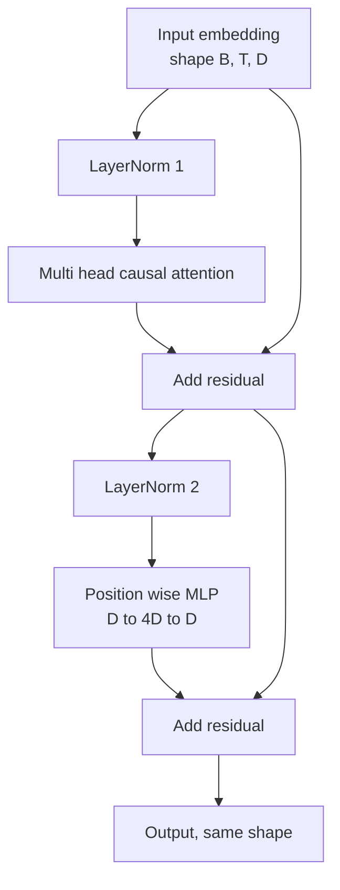
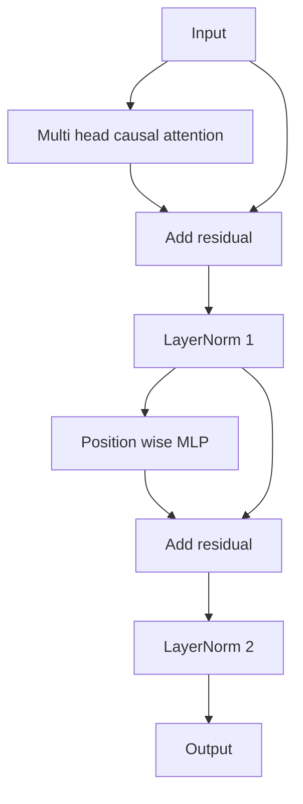

# Phòng chuyển đổi từ đầu

> Một khối là đơn vị của mỗi máy giải mã hiện đại LLM. Biểu thức lớp, chú ý nhiều đầu, dư thừa, MLP, dư thừa. biến thể trước LN được đào tạo ổn định mà không cần nóng lên. biến thể sau LN là những gì giấy ban đầu đã gửi. Bài học này xây dựng cả hai, cạnh nhau, và cho thấy một người nào tồn tại trong một chồng 12 lớp với tốc độ học tập phổ biến.

**Type:** Build
**Languages:** Python
**Prerequisites:** Phase 19 lessons 30 to 33 (tokenizer, embeddings, attention math, batched data loader)
**Time:** ~90 minutes

## Mục tiêu học tập

- Xây dựng một khối biến thể trong PyTorch từ bốn mảnh di chuyển: LayerNorm, nhiều đầu chú ý nguyên nhân, kết nối dư thừa, vị trí trí thông minh MLP.
- Đặt LayerNorms vào hai cấu hình (pre-LN và post-LN) và giải thích tại sao một chuyến tàu ổn định mà không cần nóng lên.
- Thực hiện việc che giấu nguyên nhân bên trong nhiều đầu chú ý để biểu tượng `i`không thể thấy token `j > i`- Tôi không biết.
- Theo dõi dòng chảy gradient qua cả hai biến thể trên một chồng 12 lớp và đọc kết quả mà không vẫy tay.
- Sử dụng lại khối như một đơn vị drop-in khi bài học tiếp theo lắp ráp một parameter 124 triệu GPT.

## Vấn đề

Một biến thể là một khối lặp lại. Nếu bạn sai khối một lần, lặp lại 12 lần, bạn sẽ gửi một mô hình khác nhau trong thời đại đầu tiên hoặc cần được làm nóng cho phần còn lại của cuộc đi. Hai cách thất bại mà bạn sẽ thấy trong bài học này không phải là kỳ lạ. Chúng xuất hiện khi học viên đồi lên các khối một cách ngây thơ. Một là lớp chú ý đang chăm sóc tương lai. Cái khác là LayerNorm được đặt ở nơi nó không thể làm bẩm tín dư ở độ sâu.

Các sửa chữa là cơ học khi bạn thấy nó. khối có chính xác hai con đường dư và chính xác hai vị trí bình thường hóa.

## Khái niệm

Mỗi bộ giải mã chỉ khối biến thể là một hàm mà có một tensor hình dạng `(batch, sequence, embedding)`và trả lại một tensor cùng hình dạng. bên trong, hai lớp phụ làm việc.



Đây là biến thể trước LN. LayerNorm nằm bên trong chi nhánh dư, trước lớp phụ.

Các biến thể sau LN di chuyển LayerNorm sau khi dư cộng.



Hình dạng giống nhau. Hành vi tập luyện không giống nhau. Với sau LN, độ nghiêng chảy trở lại qua con đường dư thừa phải đi qua LayerNorm.`3e-4`Pre-LN để lại con đường dư thừa không bình thường, do đó gradient lan rộng sạch đến lớp nhúng. Pre-LN là cấu hình GPT-2 tiếp theo với vì lý do đó.

### Sự chú ý về nguyên nhân đa đầu

Các lớp phụ chú ý chiếu đầu vào ba cách vào truy vấn, khóa, giá trị tensor.`(B, T, D)`đến`(B, H, T, D/H)`nơi `H`là số lượng đầu. Scaled dot sản phẩm chú ý tính toán`softmax(Q K^T / sqrt(d_k))`mỗi đầu, che giấu phần ba phía trên đến vô hạn âm, áp dụng mặt nạ thông qua softmax, sau đó nhân bằng `V`Đầu được nối lại thành một cái.`(B, T, D)`Mặt nạ là mảnh duy nhất làm cho mô hình gây ra.

### MLP

MLP có trí tuệ vị trí áp dụng cùng một mạng hai tầng cho mỗi token độc lập. Độ rộng ẩn là bốn lần chiều rộng nhúng, kích hoạt là GELU, và một sự bỏ rơi sau đường thẳng thứ hai. Không có token nói chuyện với nhau bên trong MLP. Tất cả các token trộn xảy ra trong sự chú ý.

### Các kết nối còn lại làm hai điều

Chúng làm cho đường độ gradient tích hợp trên chiều sâu, giữ cho chuẩn gradient trong quy mô thông qua mười hai lớp. Chúng cũng cho phép mỗi khối học được một cập nhật tích hợp cho đại diện chạy thay vì thay thế đầy đủ. Cả hai hiệu ứng là lý do tại sao các khối cân bằng.

```figure
cc-transformer-block
```

## Hãy xây dựng nó

`code/main.py`thực hiện:

- `class LayerNorm`với quy mô và chuyển đổi có thể học được, eps thiên vị, được áp dụng cho mỗi vector token.
- `class MultiHeadAttention`với `num_heads`- `head_dim = d_model // num_heads`, dự đoán QKV hợp nhất, mặt nạ nguyên nhân được đăng ký, chú ý và bỏ sót dư thừa.
- `class FeedForward`với hai lớp tuyến tính, kích hoạt GELU, bỏ.
- `class TransformerBlock`với một `pre_ln`cờ chuyển đổi giữa hai biến thể.
- Một bản demo xây dựng một ngăn xếp trước LN 6 lớp và một ngăn xếp sau LN 6 lớp với đầu vào và in giống nhau (a) hình dạng đầu ra, (b) chuẩn gradient tại nhúng sau một lần đi ngược.

Đi đi.

```bash
python3 code/main.py
```

Kết quả: kiểm tra hình dạng trên cả hai ngăn xếp, các chuẩn độ nghiêng cạnh nhau. độ nghiêng nhúng của ngăn xếp trước LN là thứ tự lớn hơn ngăn xếp sau LN với tốc độ học tập tương tự, đó là tín hiệu thực nghiệm của các tàu trước LN mà không cần nóng lên.

## Thống

- `torch`cho toán học tensor, autograd, và `nn.Module`- Thủy an toàn.
- Không .`transformers`Không có trọng lượng trước khi được huấn luyện.

## Các mô hình sản xuất trong tự nhiên

Ba mô hình biến khối sách giáo khoa thành thứ bạn có thể vận chuyển.

**Fused QKV projection.**Ba lớp tuyến tính riêng biệt có giá ba lần khởi động lõi và ba lần matmuls.`3 * d_model`làm việc tương tự trong một lần phóng, sau đó chia ra đầu ra dọc theo trục cuối cùng. con đường hợp nhất nhanh hơn trên mọi bộ tăng tốc và phù hợp với các thực hiện tham chiếu của GPT-2, LLaMA và Mistral tất cả tàu.

**Registered causal mask buffer.**Mặt nạ chỉ phụ thuộc vào chiều dài ngữ cảnh tối đa.`register_buffer`, cắt cửa sổ hoạt động mỗi đi trước, và bỏ qua phân bổ mỗi cuộc gọi.

**Dropout in two places, not three.**Trượt rơi thuộc về sau độ nhẹ của sự chú ý (trượt rơi của sự chú ý) và sau đường thẳng thứ hai của MLP (trượt rơi của dư thừa).

## Sử dụng nó

- Các khối trong bài học này được kết nối trực tiếp vào bộ GPT trong bài học 35 mà không có sửa đổi.
- Phân biến trước LN là những gì mà mỗi công nghệ mở hiện đại sử dụng. Phân biến sau LN là những gì giấy chú ý ban đầu năm 2017 sử dụng. Biết cả hai là đủ để đọc bất kỳ kiến trúc decoder nào bạn sẽ gặp phải.
- Thay đổi GELU thành SiLU và bạn có kích hoạt gia đình LLaMA thay đổi LayerNorm thành RMSNorm và bạn có sự bình thường hóa gia đình LLaMA cùng xương.

## Các bài tập

1. Thêm một `bias=False`các biểu tượng để mỗi đường thẳng trong khối. trọng lượng mở hiện đại LLMs vận chuyển mà không có thiên vị trên các lớp đường thẳng. đo bao nhiêu tham số bạn lưu trong một 12 lớp 768 mô hình mờ.
2. Thay thế `nn.LayerNorm`bằng cách xoay tay RMSNorm và xác minh hình dạng đầu ra không thay đổi.
3. Thêm một cờ trả lại trọng lượng chú ý cho đầu đầu tiên như một `(B, T, T)`Tensior. vẽ bộ ba phía trên để xác nhận nó là không sau softmax.
4. Hãy xây dựng một kiểm tra tinh thần để nuôi dưỡng một `(2, 16, 384)`tensor với `H=6`thông qua cả hai biến thể và khẳng định các kết quả về phía trước là khác nhau (ví dụ:`not torch.allclose`) khi trọng lượng được khởi tạo giống nhau và dropout được đặt lên 0.

## Các điều khoản chính

| Term | What people say | What it actually means |
|------|-----------------|------------------------|
| Pre-LN | "Pre norm" | LayerNorm inside the residual branch, before each sublayer; the residual carries the unnormalized signal |
| Post-LN | "Post norm" | LayerNorm after the residual add; what the 2017 paper shipped and what needs warmup |
| Causal mask | "Triangle mask" | The upper triangle of the attention logits set to negative infinity so token i cannot read token j when j is greater than i |
| Fused QKV | "Combined projection" | One linear of width 3D instead of three linears of width D; one kernel, one matmul |
| Residual stream | "Skip connection" | The unnormalized tensor that flows top to bottom through every block; what each block adds to |

## Đọc thêm

- Chương 7 bài học 02 (đánh giá từ đầu) cho toán học chú ý bên dưới khối này.
- Giai đoạn 7 bài học 05 (giới chuyển biến đầy đủ) cho phiên bản decoder của bộ xương tương tự.
- Giai đoạn 10 bài học 04 (pre training mini GPT) cho thủ tục đào tạo mà khối này kết nối.
- Giai đoạn 19 bài học 35 (câu này) tập hợp 12 khối này thành mô hình GPT.
