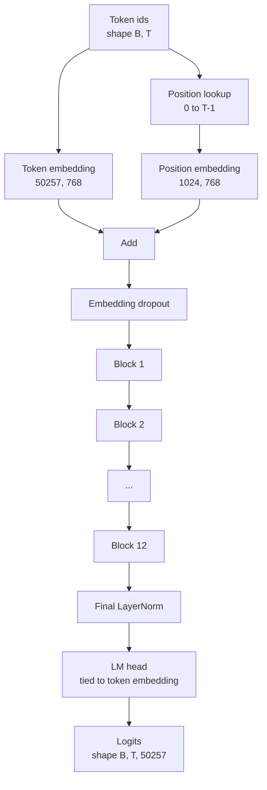
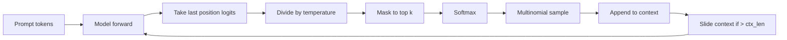

# Phong hợp mô hình GPT

> 12 khối xếp chồng lên, một token embed, một embed learning position, một LayerNorm cuối cùng, và một đầu mô hình ngôn ngữ gắn kết. Đó là toàn bộ mô hình GPT tham số 124 triệu. Bài học này tập hợp những mảnh đó thành một lớp lao động, đếm các tham số để xác nhận mô hình phù hợp với hình dạng tham chiếu 124M, và tạo ra văn bản với lấy mẫu đa số, nhiệt độ và top-k.

**Type:** Build
**Languages:** Python
**Prerequisites:** Phase 19 lessons 30 to 34
**Time:** ~90 minutes

## Mục tiêu học tập

- Lắp ráp khối biến đổi từ bài học 34 thành mô hình GPT đầy đủ: nhúng token, nhúng vị trí, N khối, LayerNorm cuối cùng, đầu mô hình ngôn ngữ.
- Tái tạo lại cấu hình thông số 124 triệu: từ ngữ 50257, ngữ cảnh 1024, nhúng 768, mười hai đầu, mười hai lớp.
- Kết nối trọng lượng đầu mô hình ngôn ngữ với việc nhúng mã và giải thích tại sao điều đó tiết kiệm ~ 38 triệu tham số ở quy mô này.
- Tạo văn bản từ một lệnh với lấy mẫu đa số, quy mô nhiệt độ và cắt giảm trên-k, giữ chiều dài ngữ cảnh với một cửa sổ trượt.
- Đánh giá số parameter và chi phí vượt qua trước so với mục tiêu 124M.

## Vấn đề

Một khối biến thể không làm gì một mình. Bạn cần biến ID token thành vector, trộn thông tin vị trí, chạy chúng qua hàng đống, và chiếu trở lại logit từ vựng. Hãy quên bất kỳ bước nào trong bốn bước đó và mô hình hoặc không chuyển tiếp, biến đổi thông tin vị trí, hoặc không thể nói.

Hình dạng của mô hình cũng quan trọng. GPT-2 nhỏ tham chiếu là 124 triệu tham số ở chính xác cấu hình trên. Số không phải là phép thuật. Từ 50257 lần nhúng 768 là bảng biểu tượng. Vị trí 1024 nhân 768 là bảng vị trí. 12 khối ở khoảng 7 triệu tham số mỗi khối là 84 triệu. Đầu cuối cùng sử dụng lại bảng biểu tượng bằng cách liên kết trọng lượng. Đánh số các mảnh và bạn sẽ có 124 triệu. Xây dựng một mô hình có số parameter không phù hợp với tham chiếu là một dấu hiệu bạn đã cáp một cái gì đó sai.

## Khái niệm



Các mã mã mã hóa trở thành các vector mã hóa. Các mã vị trí trở thành các vector vị trí. Hai được thêm vào và gửi qua đống. LayerNorm cuối cùng là một mảnh bên ngoài các khối tồn tại trong mỗi biến thể hiện đại. Đầu LM sử dụng lại các mã hóa nhúng tử liệu, đó là điều mà liên kết trọng lượng có nghĩa là.

### Tắt trọng lượng

Đơn vị gắn có hình dạng`(vocab, d_model)`. Bộ trưởng mô hình ngôn ngữ cần phải chiếu từ `d_model`quay lại `vocab`. Đó là các chuyển thể của nhau. Kết nối hai nghĩa là một tensor tham số tương tự, được sử dụng hai lần. Ở từ 50257 và d_model 768, các mã số là 38 triệu tham số. Không kết nối, bạn trả cho nó hai lần. kết nối, bạn trả cho nó một lần và bạn cũng nhận được một tín hiệu gradient hơi sạch hơn vì việc nhúng và cập nhật đầu cùng nhau.

### Việc nhúng vị trí được học, không phải là hình âm đạo

GPT-2 cung cấp một vị trí học tập nhúng. bảng vị trí là một tham số tensor hình dạng `(1024, 768)`. Mô hình tìm kiếm vị trí 0 đến T-1 ở mỗi bước tiến và thêm tìm kiếm vào token. Đây là sơ đồ vị trí đơn giản nhất (RoPE, ALiBi, T5 là các phương án thay thế) và nó là những gì tham chiếu 124M sử dụng.

### Tạo: nhiệt độ, top-k, đa số

Tạo tự do là tự rút lại. Ở mỗi bước, mô hình trả lại logits trên toàn bộ từ vựng tại mỗi vị trí. Bạn chỉ lấy vị trí cuối cùng, chia theo nhiệt độ, tùy chọn che giấu tất cả ngoại trừ logits top k đến vô hạn âm, softmax để có được xác suất, và lấy một token từ phân phối kết quả.



Ba nút, ba hành vi khác nhau. Nhiệt độ gần không sụp đổ thành tham lam. Nhiệt độ một phù hợp với phân bố tự nhiên của mô hình. Top-k một tham lam. Top-k bốn mươi lọc đuôi dài.

```figure
cc-gpt-assembly
```

## Hãy xây dựng nó

`code/main.py`thực hiện:

- `class GPTConfig`Dataclass với các mặc định 124M: `vocab_size=50257`- `context_length=1024`- `d_model=768`- `num_heads=12`- `num_layers=12`- `mlp_expansion=4`- `dropout=0.1`- `use_bias=True`- `weight_tying=True`- Tôi không biết.
- `class GPTModel`với token embedding, position embedding, embedding dropup, 12 `TransformerBlock`S, LayerNorm cuối cùng, và một `lm_head`liên quan đến biểu tượng được nhúng khi cờ được đặt.
- A `count_parameters`trợ lý trả lại số parameter độc đáo (vì vậy việc liên kết trọng lượng được tôn trọng trong số).
- A `generate`chức năng làm nhiệt độ, top-k, đa số, và khung cửa sổ trượt.
- Một bản demo xây dựng mô hình, in số parameter bên cạnh tham chiếu 124M, và tạo ra một chuỗi ngắn từ một lời nhắc cố định để hiển thị đường ống kết thúc đến cuối.

Đi đi.

```bash
python3 code/main.py
```

Kết quả: số parameter bên cạnh tham chiếu 124M, tạo ra ID token từ một lời nhắc ngẫu nhiên, và xác nhận rằng đầu LM và token nhúng chia sẻ lưu trữ khi liên kết được bật.

Để giữ cho bản demo nhanh chóng, kịch bản cũng chạy một cấu hình nhỏ (`d_model=64`- `num_layers=2`(văn) kết thúc đến kết thúc và inline chuỗi token được tạo ra.

## Thống

- `torch`cho toán học tensor, tự cấp và ống nước module.
- `code/main.py`thực hiện lại mô hình khối tương tự từ bài học 34 tại địa phương.

## Các mô hình sản xuất trong tự nhiên

Ba mô hình tạo ra sự khác biệt giữa một mô hình chạy và một mô hình vận chuyển.

**Initialize the residual projections small.**Dự án đầu ra của sự chú ý và đường thẳng thứ hai của MLP đều được cung cấp trực tiếp vào một phần dư thừa.`1 / sqrt(2 * num_layers)`cho hai dự đoán đó; dòng dư ở trong một phạm vi hợp lý thông qua mười hai lớp.

**Cache the position id tensor, do not recompute.** `torch.arange(T)`phân bổ bộ nhớ mới tại mỗi chuyển tiếp. phân bổ một lần trong `__init__`Đối với ngữ cảnh tối đa, cắt các mục T đầu tiên cho mỗi cuộc gọi, và bỏ qua chuyến đi vòng quay của người phân bổ.

**Tie weights at parameter level, not just by copying.**Đặt `lm_head.weight = token_embedding.weight`Tân tích có thể được sao chép bằng các mô hình khác nhau, nhưng không phải sao chép. Optimizer cần cập nhật một tham số và biểu đồ tự động cần một tích lũy. Nếu bạn sao chép, đầu sẽ di chuyển xa khỏi việc nhúng và liên kết trọng lượng sẽ không giúp bạn mua gì.

## Sử dụng nó

- Các lớp mô hình trong bài học này có cùng hình dạng với lớp học tiếp theo.
- Thay thế vị trí học được nhúng bằng RoPE sẽ giúp bạn có thể tạo ra gia đình LLaMA mà không cần chạm vào khối hoặc đầu.
- Thay thế GELU bằng SiLU và LayerNorm bằng RMSNorm sẽ giúp bạn thay đổi phần còn lại của gia đình LLaMA.
- Chức năng tạo hoạt động với bất kỳ nguồn logits nào, không chỉ mô hình này. Bạn có thể rút logits từ một tệp GPT-2 được đào tạo trước trong bài học 37 và sử dụng lại vòng lặp tạo tương tự.

## Các bài tập

1. Tháo đầu LM khỏi mã hóa và đếm lại các tham số.
2. Thay thế vị trí được học được tích hợp bằng một bảng hình âm đạo được tính toán tại thời điểm xây dựng.
3. Thêm một `greedy=True`cờ đến thế hệ bỏ qua lấy mẫu và chọn argmax. xác nhận chuỗi là xác định trên các lần chạy.
4. Thêm một `repetition_penalty`nút chia logit của bất kỳ token nào trong prompt hoặc lịch sử được tạo bằng một liên tục trước softmax.
5. Thêm `top_p`(tái) lấy mẫu bên cạnh `top_k`Kiểm tra hai dòng rằng tổng số xác suất của các token được giữ vượt quá `top_p`- Tôi không biết.

## Các điều khoản chính

| Term | What people say | What it actually means |
|------|-----------------|------------------------|
| Weight tying | "Tied embeddings" | The LM head and the token embedding share the same parameter tensor; saves vocab times d_model parameters and matches the GPT-2 reference |
| Position embedding | "Learned positions" | A separate table of shape (context length, d_model) added to token vectors; learned end to end |
| Sliding window context | "Context cap" | When the prompt plus generated tokens exceed the context length, drop the oldest tokens so the active window fits |
| Top-k sampling | "K truncation" | Keep the K logits with the highest values, mask the rest to negative infinity, softmax over the remainder |
| Temperature | "Sampling temperature" | Divide logits by T before softmax; T less than 1 sharpens, T equal to 1 keeps the natural distribution, T greater than 1 flattens |

## Đọc thêm

- Giai đoạn 19 bài học 34 cho khối mô hình này xếp chồng lên.
- Giai đoạn 19 bài học 36 cho vòng đào tạo điều khiển mô hình này với mất entropi chéo.
- Gigalight: Gigalight: Gigalight: Gigalight: Gigalight: Gigalight:
- Giai đoạn 7 bài học 07 (GPT ngôn ngữ nhân quả mô hình hóa) cho toán học dự đoán token tiếp theo.
- Giai đoạn 10 bài học 04 (pre training mini GPT) cho thủ tục đào tạo ban đầu về cùng một kiến trúc.
