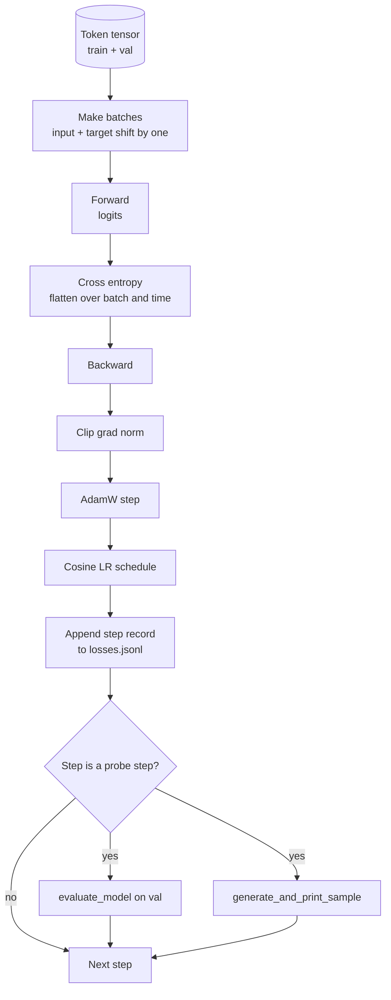

# Lòng đào tạo và đánh giá

> Một vòng lặp không đo là một vòng lặp nằm. Bài học này xây dựng vòng lặp đào tạo điều khiển mô hình GPT: AdamW với phân chia suy giảm trọng lượng, một chương trình tăng nhiệt cộng với tốc độ học cosine, một `calc_loss_batch`trợ lý, một `evaluate_model`thông qua dữ liệu được giữ lại, một `generate_and_print_sample`Một bộ phận chất lượng thăm dò từng bước K, và một nhật ký của các lỗ bạn có thể vẽ sau đó. cùng bộ xương đào tạo mỗi decoder LLM bạn sẽ bao giờ xây dựng.

**Type:** Build
**Languages:** Python
**Prerequisites:** Phase 19 lessons 30 to 35
**Time:** ~90 minutes

## Mục tiêu học tập

- Xây dựng một vòng đào tạo tính toán mất entropi chéo với đầu vào và mục tiêu phù hợp chính xác cho dự đoán token tiếp theo.
- Thiết lập AdamW với sự suy giảm trọng lượng được áp dụng cho các tensor trọng lượng chứ không phải cho LayerNorm hoặc các tensor thiên vị.
- Thực hiện một lịch trình tốc độ học tập với sự nóng lên tuyến tính và sự phân rã cosine, và đọc LR kết quả theo thời gian.
- Đánh giá trên một chia cắt kéo dài với `evaluate_model`Vì vậy, sự mất giá trị là tương đương trên các chạy.
- Tạo một mẫu chất lượng mỗi bước K với `generate_and_print_sample`để bắt được sự khác biệt trước khi đường cong mất mát làm.
- Cố gắng để mất từng bước để JSONL để bạn có thể tải lại, lập bản đồ và gửi nhật ký đào tạo như một phần được giao.

## Vấn đề

Một kịch bản huấn luyện in thất bại nhưng không làm gì khác thất bại theo ba cách. Nó không thể cho bạn biết liệu tổn thất có giảm vì lý do chính xác hay không (chương trình có thể vượt quá bộ đào tạo và không bao giờ học). Nó không thể cho bạn biết nếu một sự khác biệt bắt đầu (sự mất mát có thể tăng lên một bước và phục hồi, hoặc một bước và sụp đổ). Nó không thể cho bạn biết mô hình đã học được gì (kết là một scalar; một mẫu được tạo ra là một đoạn). Cả ba lỗi đều ẩn nếu vòng lặp không đo lường.

Các vòng lặp trong bài học này đo ba cách: mất tập thể dục mỗi bước. mất tập thể dục kéo dài mỗi bước K. Một tiếp tục được tạo ra từ một lời nhắc cố định mỗi bước K. nhật ký đào tạo hạ cánh trong JSONL vì vậy tạo vật là chứng từ của vòng lặp.

## Khái niệm



Hai mảnh không rõ ràng là sự sắp xếp mất mát và phân chia phân rã của AdamW.

### Định hướng thua lỗ

Mô hình dự đoán token tiếp theo tại mỗi vị trí. Nếu loạt đầu vào là token `[t0, t1, t2, t3]`, hàng mục tiêu phải là `[t1, t2, t3, t4]`. Cross entropy được tính toán trên hình phẳng`(batch * seq, vocab)`chống lại mục tiêu phẳng `(batch * seq,)`Hãy quên đi sự thay đổi và bạn tập mô hình để dự đoán chính nó, mà hội tụ đến thua lỗ không trong khi không học được gì hữu ích.

### AdamW phân rã chia

Sự suy giảm trọng lượng thường xuyên hóa các tensor trọng lượng nhưng không làm bình thường hóa các cân bằng hoặc thiên vị. Đặt sự suy giảm trên thang LayerNorm chậm đẩy quy mô xuống mức không và phá vỡ bình thường hóa. Đặt sự suy giảm trên một thiên vị là vô hại về mặt toán học nhưng là lãng phí chu kỳ.

### Tháp lại cộng với lịch trình cosine

Warmup làm tăng tốc độ học tập từ 0 đến mục tiêu trong vài trăm bước để trạng thái tối ưu hóa có thời gian để lấp đầy. Sự phân rã của cosine làm giảm tốc độ học tập trở lại gần không trên các bước còn lại để giai đoạn cuối cùng điều chỉnh trọng lượng ở một bước nhỏ. Sự kết hợp là lịch trình phổ biến nhất trong đào tạo LLM trọng lượng mở vì nó loại bỏ hầu hết những khoảnh khắc dễ vỡ trong hàng ngàn bước đầu tiên và hàng ngàn bước cuối cùng.

### Thử nghiệm được thực hiện

`evaluate_model`chạy một số lượng số lượng cố định của các lô từ phân chia xác thực, tích lũy mất, chia bằng số lượng lô, và trả lại. Không gradient. Không giảm. Số lượng có thể tái tạo qua các lô cho cùng hạt giống và phân chia. Báo cáo mất kéo dài bên cạnh mất tập là cách bạn phát hiện quá phù hợp.

### Tiêu chuẩn mẫu như một tín hiệu sớm

Một mô hình có sự mất mát trong đào tạo giảm tốt nhưng các mẫu được tạo ra đều giống nhau bị phá vỡ. Một mô hình có đường cong mất mát trông bằng phẳng nhưng các mẫu được tạo ra sắc sắc sắc thành các từ liên kết đang học tập. Vụ thăm dò chất lượng chạy nhanh hơn so với đọc đường cong đầy đủ và bắt được các chế độ mà đường cong bỏ lỡ.

```figure
cap-training-loop
```

## Hãy xây dựng nó

`code/main.py`thực hiện:

- `make_batches(token_ids, batch_size, context_length)`mà cắt một tensor token dài thành input và mục tiêu cặp.
- `calc_loss_batch(model, inputs, targets)`Điều này dẫn đến, phẳng hóa và trả lại entropy chéo scalar.
- `evaluate_model(model, val_loader, max_batches)`mà lặp lại một số lượng xác thực xác định mà không có cấp độ và trả lại mức mất mát trung bình.
- `generate_and_print_sample(model, prompt, max_new_tokens)`chạy các bài học 35 hệ hàm trên một prompt cố định và in kết quả.
- `build_param_groups(model, weight_decay)`tạo ra danh sách các tham số AdamW hai nhóm.
- `cosine_with_warmup(step, warmup_steps, total_steps, max_lr, min_lr)`trả lại LR tại một bước nhất định.
- `train(...)`- Nó vẫn còn tồn tại.`outputs/losses.jsonl`, và in đánh giá mất và một mẫu mỗi `eval_every`bước.
- Một bản demo đào tạo một mô hình nhỏ trên dữ liệu tổng hợp cho một số bước nhỏ, viết nhật ký JSONL, và in đánh giá mất và một mẫu tại các điểm thăm dò.

Đi đi.

```bash
python3 code/main.py
```

Kết quả: mỗi bước mất đường, đánh giá mất mỗi bước thăm dò, một mẫu được tạo ra mỗi bước thăm dò, và một cuối cùng `outputs/losses.jsonl`bạn có thể tải với `json.loads`mỗi dòng.

## Thống

- `torch`cho autograd, optimizer và module.
- `main.py`thực hiện lại bài học 35 `GPTModel`và hỗ trợ các mô-đun tại địa phương.

## Các mô hình sản xuất trong tự nhiên

Ba mô hình biến vòng sách giáo khoa thành thứ bạn có thể bỏ chạy qua đêm.

**Gradient norm clipping is non negotiable.**Một lô dữ liệu xấu (dữ liệu bất thường, một cú đốm LR, một trường hợp cạnh số) tạo ra một gradient khổng lồ mà xóa sạch nhiều giờ đào tạo. `torch.nn.utils.clip_grad_norm_(params, max_norm=1.0)`sau đó`backward`và trước đó`step`giữ cho tối ưu hóa trong phạm vi an toàn. giá trị cắt là một tham số miễn phí; một là mặc định tồn tại trong hầu hết các thiết lập.

**Resumable JSONL logging, not pickled state.**Theo hồ sơ mất mát từng bước như `{"step": int, "train_loss": float, "lr": float}`Các đường trong JSONL là bền: bất kỳ vụ tai nạn nào để lại một đồ tạo có thể đọc được, bạn có thể nắm bắt, bạn có thể vẽ với ba mươi đường Python, và bạn có thể tiếp tục đào tạo bằng cách đọc bước cuối cùng.

**Eval batches drawn from a fixed slice.**Các mã xác nhận được cắt thành hàng khi bắt đầu kịch bản, không phải khi bay. khả năng tái tạo phụ thuộc vào các hàng eval giống nhau từ chạy đến chạy; nếu không so sánh lỗ eval giữa hai chạy đo lường sự trộn nhịp như mô hình.

## Sử dụng nó

- Loop trong bài học này là cùng một bộ xương mà đào tạo mô hình 124M trên dữ liệu thực.`datasets`- kiểu tải và vòng lặp hoạt động không thay đổi.
- Các nhật ký JSONL là kết quả chuyển đổi một cuộc chạy đào tạo thành bằng chứng. Bài học tiếp theo sử dụng một để so sánh một điểm kiểm soát mới được đào tạo với một điểm kiểm soát đã được đào tạo trước.
- Hình mẫu chất lượng là tất cả những gì mất tích scalar không thể thay thế.

## Các bài tập

1. Thêm `weight_decay_groups()`Các thử nghiệm đơn vị xác nhận các tham số quy mô và thiên vị rơi vào nhóm không phân rã và các trọng lượng tuyến tính và nhúng rơi vào nhóm phân rã.
2. Thay thế mã thông báo ngẫu nhiên tổng hợp bằng các byte từ một tệp văn bản nhỏ để demo tập trung vào một cái gì đó dễ đọc. Kiểm tra mẫu được tạo sử dụng các ký tự hiện diện trong tệp.
3. Thêm một `min_lr`tầng 10 phần trăm của `max_lr`đến lịch trình cosine và kế hoạch lại.
4. Hãy giữ một điểm kiểm soát mỗi lần `eval_every`các bước bổ sung vào nhật ký JSONL. Thêm một `resume_from`cờ tải lại trạng thái mô hình và trạng thái tối ưu hóa.
5. Đăng nhập thông qua từng bước (tốc hiệu mỗi giây) bên cạnh lỗ và xác nhận nó ở trong một băng thông ổn định.

## Các điều khoản chính

| Term | What people say | What it actually means |
|------|-----------------|------------------------|
| Loss alignment | "Shift by one" | Input tokens at positions 0..T-1, target tokens at positions 1..T; cross entropy is computed on flattened shapes |
| Decay split | "Two groups" | AdamW receives matrix shaped tensors with weight decay and scale or bias tensors with none |
| Warmup | "Ramp" | The learning rate climbs from zero to its target over a fixed number of steps so the optimizer state can populate |
| Eval batches | "Held out batches" | A fixed slice of the validation token tensor, sliced once at script start, used identically every probe |
| Qualitative probe | "Sample print" | A short generation from a fixed prompt printed every K steps to catch failure modes loss alone hides |

## Đọc thêm

- Giai đoạn 19 bài học 35 cho mô hình vòng xoay.
- Giai đoạn 19 bài học 37 để tải trọng trước khi được huấn luyện vào cùng một mô hình.
- Giai đoạn 10 bài học 04 (GPT mini trước đào tạo) cho thủ tục dữ liệu thực.
- Giai đoạn 10 bài học 10 (học) cho bề mặt đánh giá rộng hơn ngoài mất entropi chéo.
