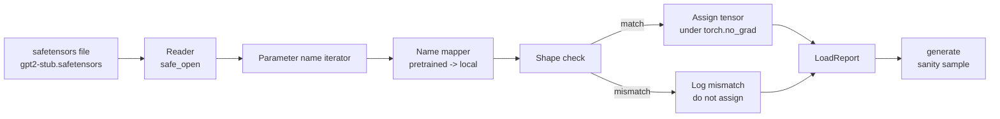

# Lái những trọng lượng chưa được huấn luyện

> Việc đào tạo một mô hình tham số 124 triệu từ đầu là một quyết định ngân sách; tải một điểm kiểm soát được xuất bản là một thứ ba. Bài học này tải trọng kiểu GPT-2 được đào tạo trước từ tệp bộ cảm biến an toàn vào kiến trúc chính xác từ bài học 35, đi bộ bản đồ tên tham số từng mảnh, và trí tuệ tạo ra một tiếp tục để chứng minh tải đã hoạt động. Không mạng, không có người tải thứ ba, không có phép thuật không rõ ràng.

**Type:** Build
**Languages:** Python
**Prerequisites:** Phase 19 lessons 30 to 36
**Time:** ~90 minutes

## Mục tiêu học tập

- Đọc một tập tin safetensors với `safetensors`Thư viện Python và kiểm tra tên và hình dạng của các tensor.
- Bản đồ mỗi tên tham số được đào tạo trước vào một tham số bên trong mô hình GPT bài học 35.
- Chọn hai quy định tên khác nhau giữa các trọng lượng GPT-2 được công bố và mô hình trong đường đua này: `wte/wpe/h.N.attn.c_attn/c_proj`và `mlp.c_fc/c_proj`so với tên địa phương `tok_embed/pos_embed/blocks.N.attn.qkv/out_proj`và `mlp.fc1/fc2`- Tôi không biết.
- Khám phá và từ chối sự không phù hợp hình dạng với một lỗi rõ ràng trước khi bất kỳ phân bổ trọng lượng nào xảy ra.
- Tạo một sự tiếp tục ngắn với các trọng lượng tải và xác nhận các token đến từ phân phối tải, không phải là một sự khởi đầu ngẫu nhiên.

## Vấn đề

Các trọng lượng được xuất bản không được đóng gói cho kiến trúc của bạn. Chúng mang tên thực hiện ban đầu được sử dụng.`transformer.h.0.attn.c_attn.weight`hình dạng`(2304, 768)`; mô hình của bạn mong đợi `blocks.0.attn.qkv.weight`hình dạng`(2304, 768)`(đó là cùng một matrix trong một quy định khác nhau của quy định) hoặc mô hình của bạn sử dụng `nn.Linear`Các thông số này được chuyển đổi thành các thông số khác nhau, và các thông số này được chuyển đổi thành các thông số khác nhau.

Một loader sao chép mù quáng đặt tensor đúng ở nơi sai và bạn nhận được một mô hình tạo ra vô nghĩa. Một loader từ chối sao chép khi hình dạng khác nhau nhưng ghi chép không có gì để bạn đoán được tensor nào không hạ cánh. Loader trong bài học này là rõ ràng: mỗi bài giao được ghi chép, mọi hình dạng được kiểm tra, và một `LoadReport`tóm tắt các lượt đánh, bỏ lỡ và hình dạng không phù hợp để bạn có thể đọc những gì đã xảy ra.

## Khái niệm



Tên mapper chỉ là một hàm từ chuỗi sang chuỗi. kiểm tra hình dạng là một nếu. Việc gán xảy ra bên trong `torch.no_grad()`Autograd không theo dõi tải.

### Công ước đặt tên GPT-2

Các cân nặng GPT-2 được xuất bản được đặt dưới tên như:

| Pretrained name | Shape | Meaning |
|-----------------|-------|---------|
| `wte.weight` | (50257, 768) | Token embedding |
| `wpe.weight` | (1024, 768) | Position embedding |
| `h.N.ln_1.weight` | (768,) | LayerNorm 1 scale at block N |
| `h.N.ln_1.bias` | (768,) | LayerNorm 1 shift at block N |
| `h.N.attn.c_attn.weight` | (768, 2304) | Fused QKV linear weight |
| `h.N.attn.c_attn.bias` | (2304,) | Fused QKV linear bias |
| `h.N.attn.c_proj.weight` | (768, 768) | Attention output projection |
| `h.N.attn.c_proj.bias` | (768,) | Attention output projection bias |
| `h.N.ln_2.weight` | (768,) | LayerNorm 2 scale |
| `h.N.ln_2.bias` | (768,) | LayerNorm 2 shift |
| `h.N.mlp.c_fc.weight` | (768, 3072) | MLP fc1 weight |
| `h.N.mlp.c_fc.bias` | (3072,) | MLP fc1 bias |
| `h.N.mlp.c_proj.weight` | (3072, 768) | MLP fc2 weight |
| `h.N.mlp.c_proj.bias` | (768,) | MLP fc2 bias |
| `ln_f.weight` | (768,) | Final LayerNorm scale |
| `ln_f.bias` | (768,) | Final LayerNorm shift |

Hai bất ngờ cần thiết.`c_attn`- `c_proj`- `c_fc`linear được lưu trữ với matrix được chuyển đổi so với `nn.Linear.weight`Loader chuyển trong quá trình giao dịch. đầu LM không có trong hồ sơ; mô hình dựa trên trọng lượng liên kết với `wte`, để đầu được đặt bằng cách đặt tên một lần `wte`đất.

### Hội nghị đặt tên địa phương

Mô hình trong đường đua này sử dụng tên mô tả:

| Local name | Meaning |
|------------|---------|
| `tok_embed.weight` | Token embedding |
| `pos_embed.weight` | Position embedding |
| `blocks.N.ln1.scale` | LayerNorm 1 scale at block N |
| `blocks.N.ln1.shift` | LayerNorm 1 shift |
| `blocks.N.attn.qkv.weight` | Fused QKV |
| `blocks.N.attn.qkv.bias` | Fused QKV bias |
| `blocks.N.attn.out_proj.weight` | Attention output projection |
| `blocks.N.attn.out_proj.bias` | Output projection bias |
| `blocks.N.ln2.scale` | LayerNorm 2 scale |
| `blocks.N.ln2.shift` | LayerNorm 2 shift |
| `blocks.N.mlp.fc1.weight` | MLP fc1 |
| `blocks.N.mlp.fc1.bias` | MLP fc1 bias |
| `blocks.N.mlp.fc2.weight` | MLP fc2 |
| `blocks.N.mlp.fc2.bias` | MLP fc2 bias |
| `final_ln.scale` | Final LayerNorm scale |
| `final_ln.shift` | Final LayerNorm shift |

Bản đồ là một chức năng cố định. Bài học đưa nó như một lệnh mà bộ tải lặp lại.

### Thiết bị đệm

Đường độ GPT-2 thực sự là 0,5 GB. Demos không tải chúng xuống; nó tạo ra một bộ cố định bộ cảm biến an toàn nhỏ trong lần chạy đầu tiên, với quy ước đặt tên chính xác GPT-2 và hình dạng phù hợp với mô hình 12 khối ở d_model 192 thay vì 768.

```figure
cc-weight-remap
```

## Hãy xây dựng nó

`code/main.py`thực hiện:

- Một bản sao nhỏ của bài học 35 `GPTModel`Vì vậy, bài học này tự chứa đựng.
- `make_pretrained_to_local(num_layers)`Điều này mở rộng các mục mỗi lớp.
- `load_safetensors(model, path)`mà lặp lại tên, lập bản đồ chúng, kiểm tra hình dạng, chuyển đổi các trọng lượng kiểu conv1d, và phân bổ dưới `torch.no_grad()`. trả lại một `LoadReport`- Tôi không biết.
- `make_stub_safetensors(path, cfg)`tạo ra một tập tin cố định với quy ước đặt tên chính xác được đào tạo trước.
- Một bản demo tạo ra`outputs/gpt2-stub.safetensors`lần đầu tiên, xây dựng một mô hình mới, chụp một tiếp tục được tạo từ random init, tải các stub, chụp một tiếp tục khác, in cả hai, và xác minh hai là khác nhau (thánh tải thực sự thay đổi mô hình).

Đi đi.

```bash
python3 code/main.py
```

Khả năng: đường bộ thiết bị, một nhật ký tải theo tên, một `LoadReport`tổng kết, một tiếp tục trước khi tải, một tiếp tục sau khi tải, và một sự không phù hợp hình dạng trên một tensor cố ý xấu tiêm vào thiết bị để đường hỏng được thực hiện.

## Thống

- `safetensors`cho định dạng đĩa và một trình đọc trực tuyến.
- `torch`cho mô hình và toán học nhiệm vụ.
- Không .`transformers`Không .`huggingface_hub`Không có cuộc gọi mạng.

## Các mô hình sản xuất trong tự nhiên

Ba mô hình làm cho bộ tải tồn tại tiếp xúc với trọng lượng mà bạn không tạo ra.

**Always validate the file before any assignment.**Mở tập tin, liệt kê từng tên tensor với dtype và hình dạng của nó, chạy bản đồ đầy đủ với kiểm tra hình dạng, và chỉ khi thành công bắt đầu gán.

**Log every assignment with the source name and the destination name.**Khi có gì đó trông sai, nhật ký cho bạn biết tensor nào hạ cánh ở đâu; thay thế là đọc hexdumps.`LoadReport`Dataclass trong bài học này theo dõi `loaded`- `missing`- `unexpected`, và`shape_mismatch`Danh sách và in một bản tóm tắt ở cuối.

**The LM head is a weight tying alias, not a separate copy.**Đặt `model.lm_head.weight = model.tok_embed.weight`sau khi tải `tok_embed`là mô hình kinh điển. sao chép các matrix nhúng vào một mới`lm_head.weight`parameter phá vỡ liên kết và lặng lẽ tăng gấp đôi số parameter của bạn.

## Sử dụng nó

- Loader hoạt động cho bất kỳ tập tin safetensors nào sử dụng quy ước đặt tên trước khi được đào tạo.
- Mô hình tương tự mở rộng đến LLaMA, Mistral, cân Qwen khi bạn cập nhật bản đồ tên.
- Tạo ra tinh thần sau khi tải là một cửa ngõ nhanh: nếu các mẫu sau tải trông giống như các mẫu trước tải, tải không thay đổi mô hình, có nghĩa là bản đồ lặng lẽ bỏ qua mọi tensor.

## Các bài tập

1. Thêm một `dtype`lập luận cho bộ tải mà ném mỗi tensor đến một mục tiêu dtype (`bfloat16`- `float16`- `float32`(v) trong thời gian giao nhiệm vụ.`float32`mô hình có thể được giảm xuống `bfloat16`và vẫn tạo ra.
2. Thêm một `expected_layers`lập luận từ chối tải một điểm kiểm soát mà `h.N`Chỉ số không phù hợp với mô hình `num_layers`- Tôi không biết.
3. Kết nối bộ tải vào hàm thế hệ bài học 35 và tạo ra hai mẫu bên cạnh: một từ init ngẫu nhiên, một từ bộ cố định tải.
4. Thêm một đường dẫn xuất khẩu: ghi trạng thái mô hình hiện tại vào tệp bộ nhớ an toàn mới bằng cách sử dụng quy ước đặt tên trước khi được đào tạo.
5. Tăng `NAME_MAP`để xử lý quy ước đặt tên LLaMA (không có thiên vị, RMSNorm, bố cục qkv hợp nhất) và chạy lại bộ tải trên một bộ cố định LLaMA mà bạn tạo ra.

## Các điều khoản chính

| Term | What people say | What it actually means |
|------|-----------------|------------------------|
| Name map | "Key remapping" | The function from pretrained tensor names to local parameter names; usually a literal dict with one entry per layer index expanded over a loop |
| Shape mismatch | "Bad shape" | The pretrained tensor exists under the mapped name but its dimensions disagree with the local parameter; the loader refuses to assign and logs the pair |
| Transpose-on-load | "Conv1d layout" | Published GPT-2 stores attention and MLP projections in the transpose of what nn.Linear expects; the loader transposes during assignment |
| Weight tying alias | "Shared LM head" | Setting model.lm_head.weight = model.tok_embed.weight so the head and embedding share storage; the head is not in the file because of this |
| Load report | "Coverage summary" | A small dataclass that tracks loaded, missing, unexpected, and shape_mismatch lists; printing it is how you tell whether the load succeeded |

## Đọc thêm

- Giai đoạn 19 bài học 35 cho kiến trúc nhận trọng lượng.
- Giai đoạn 19 bài học 36 cho vòng đào tạo tạo tạo ra một điểm kiểm soát cùng hình dạng.
- Giai đoạn 10 bài học 11 (quantization) cho những gì để làm với trọng lượng tải khi bộ nhớ là cạn kiệt.
- Giai đoạn 10 bài học 13 (giải dựng một đường ống LLM hoàn chỉnh) cho toàn bộ vòng đời xung quanh tải trọng và suy luận.
