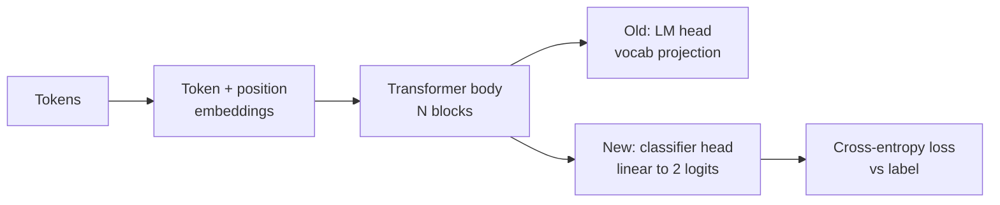
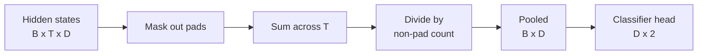
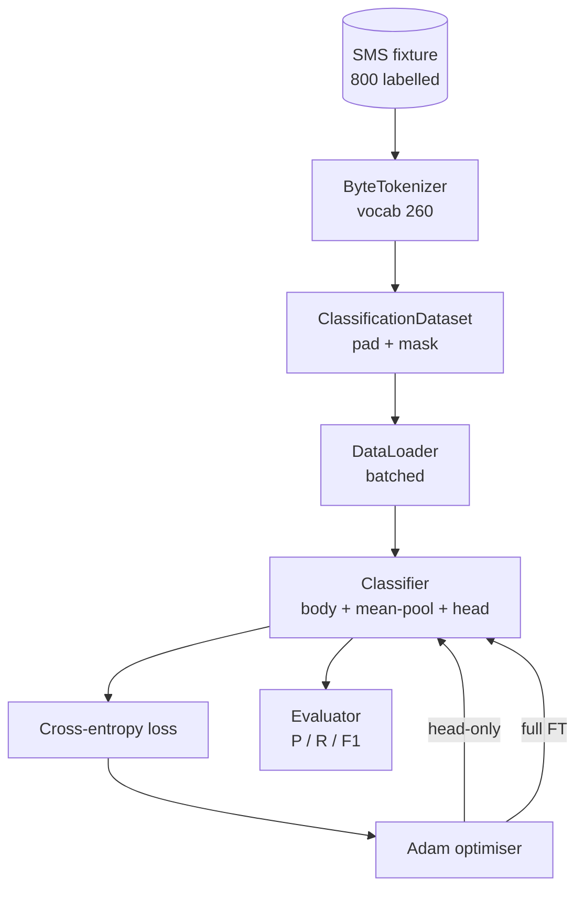

# Bài học Capstone 38: Classifier - Fine-Tuning theo Head Swap

> Đường B là đá cuối đầu tiên. Một mô hình ngôn ngữ được đào tạo trước là một đống các khối tự chú ý kết thúc trong một đầu dự đoán token. Khi bạn muốn spam vs ham, đầu sai nhưng cơ thể hầu hết đúng. Bài học này xé đầu ra, dán một lớp đường thẳng hai lớp vào đại diện tập hợp, và đào tạo phân loại bằng hai cách khác nhau: chỉ lớp cuối cùng, và điều chỉnh hoàn toàn. Thử nghiệm là chính xác, nhớ lại, và F1 trên một chia cắt kéo dài. Bạn học được mỗi chiến lược mua cho bạn và chi phí.

**Type:** Build
**Languages:** Python (torch, numpy)
**Prerequisites:** Phase 19 lessons 30-37 (NLP LLM track: tokenizer, embedding table, attention block, transformer body, pre-training loop, checkpointing, generation, perplexity)
**Time:** ~90 minutes

## Mục tiêu học tập

- Thay thế một đầu mô hình ngôn ngữ bằng một đầu phân loại mà không cần khởi động lại cơ thể.
- Thực hiện hai chế độ đào tạo: cơ thể đóng băng (chỉ với đầu) và điều chỉnh hoàn chỉnh, chia sẻ một vòng đào tạo.
- Xây dựng một đường ống dữ liệu nhận thức về tokeniser để pad, che giấu padding và thu hút sự chú ý.
- Lập toán chính xác, nhớ lại, F1, và một số liệu nhầm lẫn từ các logit nguyên liệu.
- Lý do về sự thỏa hiệp giữa số lượng các tham số, thời gian đào tạo và phòng thủ.

## Vấn đề

Bạn đã đào tạo trước một biến đổi nhỏ trên một bộ phận chung. đầu đầu đầu ra chiếu trạng thái ẩn cuối cùng vào một từ vựng 1000 token. Bây giờ bạn có 800 tin nhắn SMS được dán nhãn spam hoặc ham và bạn muốn một phân loại nhị phân. Ba tùy chọn có.

Một lựa chọn sai là đào tạo một phân loại mới từ đầu trên 800 ví dụ. Cơ thể của mô hình được đào tạo trước đã mã hóa cấu trúc hữu ích: danh tính từ, vị trí, sự xuất hiện đơn giản. Việc ném nó đi lãng phí tính toán đã xây dựng nó.

Hai lựa chọn đúng là đầu đổi với cơ thể đóng băng, và đầu đổi với cơ thể có thể được đào tạo. Trình huấn luyện chỉ bằng đầu là nhanh, gần như miễn phí trong bộ nhớ, và hiếm khi quá tải với dữ liệu nhỏ này.

Bài học này xây dựng cả hai, để bạn có thể so sánh chúng trên cùng một thiết bị.

## Khái niệm



Mô hình là một chức năng `f_theta(tokens) -> hidden_states`Đầu là một chức năng.`g_phi(hidden) -> logits`Thay đổi đầu là giữ lại.`theta`và thay thế `g_phi`Các tham số của cơ thể là phần đắt tiền nhất.

Hai bộ tham số có thể được đào tạo là quan trọng:

- `theta`(trẻ): hàng chục ngàn trọng lượng cho mỗi khối chú ý.
- `phi`(trái đầu):`hidden_dim * num_classes`trọng lượng cộng với một sự thiên vị.

Trong huấn luyện chỉ bằng đầu bạn tính toán gradient với `phi`và đánh bại chúng.`theta`PyTorch cho phép bạn làm điều này bằng cách đặt`requires_grad=False`Khi điều chỉnh, chỉ nhìn thấy đầu và cơ thể vẫn bị đóng băng.

Trong sự điều chỉnh hoàn chỉnh, bạn để các gradient chảy lại qua toàn bộ hàng. trọng lượng của cơ thể di chuyển để phù hợp với mục tiêu phân loại.

## Câu hỏi về sự hợp nhất

Một trình phân loại cần một vector cho mỗi chuỗi, không cần một vector cho mỗi token. Ba lựa chọn phổ biến:

- **Mean pool**: trung bình các trạng thái ẩn trên chuỗi, cân bằng bằng mặt nạ chú ý.
- **CLS pool**: chuẩn bị một token đặc biệt và chỉ sử dụng đầu ra của nó.
- **Last-token pool**Đây là những gì các phân loại lớp GPT làm.

Bài học này sử dụng sự hợp nhất giữa trung bình với trọng lượng mặt nạ chú ý rõ ràng. Nó đơn giản nhất, cung cấp một tín hiệu ổn định trên các chiều dài chuỗi, và không yêu cầu đào tạo trước một token CLS.



## Dữ liệu

800 tin nhắn SMS, cân bằng 400 spam và 400 ham, được tạo ra theo cách xác định trong `code/main.py`. Máy phát điện sử dụng một hạt giống cố định, chọn các mẫu và thay thế các chất lấp khe, và phát ra các tin nhắn dài từ 5 đến 25 token.

Các dữ liệu chia 80/20: 640 tren, 160 test. Các phân chia được phân cấp để bộ thử giữ cân bằng 50/50.

## Các số liệu

Định dạng nhị phân với lớp 1 như là lớp tích cực (spam).

- `TP`: dự đoán spam, là spam.
- `FP`: dự đoán spam, là thịt xông.
- `FN`: dự đoán thịt xông, là spam.
- `TN`: dự đoán thịt xông, là thịt xông.

Ba tiêu đề tiêu đề:

- `precision = TP / (TP + FP)`Trong số những tin nhắn được đánh dấu là spam, phần nào là thực sự?
- `recall = TP / (TP + FN)`Trong số spam thực sự, mẫu cờ có phần nào?
- `F1 = 2 * P * R / (P + R)`- Tỷ lệ trung bình hợp nhất của hai.

Một số liệu hỗn loạn in bốn số như một lưới 2x2.

```figure
cap-classifier-head-swap
```

## Kiến trúc



Cơ thể là một bộ biến đổi nhỏ: từ ngữ 260, ẩn 64, 4 đầu, 2 khối, chuỗi tối đa 32. Nó đủ nhỏ để đào tạo cả hai chế độ để hội tụ trong vòng chín mươi giây trên CPU. Nó không được đào tạo trước trong bài học; thay vào đó, nó được đào tạo trong các chế độ.`pretrain_quick`người trợ giúp thực hiện năm thời gian đào tạo LM trên cùng một văn bản của thiết bị để cung cấp cho cơ thể một điểm khởi đầu không tầm thường.

## Những gì bạn sẽ xây dựng

Việc thực hiện là một`main.py`cộng với một mô-đun thử nghiệm (`code/tests/test_main.py`().

1. `ByteTokenizer`: bản đồ byte đến ID, dự trữ một ID pad.
2. `Block`: một khối biến thể với nhiều đầu chú ý và một lớp tiếp cấp.
3. `LMBody`: token + vị trí nhúng cộng với một loạt các khối.
4. `MeanPool`: trung bình trọng lượng mặt nạ trên trục chuỗi.
5. `Classifier`Cơ thể, bể, đầu tuyến tính. Cơ thể là trường hợp tương tự trên tất cả các chế độ.
6. `freeze_body`và `unfreeze_body`: chuyển đổi `requires_grad`về các tham số cơ thể.
7. `train_classifier`: một vòng lặp chung. chấp nhận mô hình và một bộ tối ưu hóa được cấu hình cho nhóm tham số nào có thể được đào tạo.
8. `evaluate`: chạy bộ thử nghiệm và trả lại `Metrics(precision, recall, f1, confusion)`- Tôi không biết.
9. `run_demo`: tập luyện cơ thể một thời gian ngắn, sau đó tập luyện và đánh giá chỉ bằng đầu, sau đó đầy đủ, in cả hai báo cáo, và thoát khỏi số không.

## Tại sao việc so sánh lại quan trọng

Các chế độ chỉ đầu thường tập luyện nhanh hơn và phù hợp hơn với sự đẹp đẽ. trên thiết bị này bạn thường thấy độ chính xác gần 0,9 và nhớ lại gần 0,85 sau hai mươi thời gian tập luyện chỉ đầu.

Bài học không chọn người chiến thắng. Nó dạy bạn đọc số và chi phí. Với 800 ví dụ và một cơ thể nhỏ, chỉ đầu là cuộc gọi đúng. Với 80.000 ví dụ và một cơ thể lớn hơn, việc chỉnh sửa hoàn chỉnh bắt đầu trả giá. Hợp đồng bạn lấy từ bài học này là API: cùng một `train_classifier`chức năng xử lý cả hai, và chuyển đổi là một cuộc gọi.

## Cải hướng mục tiêu

- Thêm chế độ thứ ba mà chỉ giải khỏa khối cuối cùng. Điều này đôi khi được gọi là điều chỉnh tinh tế một phần.
- Thêm một lập trình học tập tốc độ. Một lập trình cosine trên đầu cộng với một tỷ lệ liên tục nhỏ hơn trên cơ thể là một thiết lập sản xuất phổ biến.
- Thay thế trung bình tập hợp với một tập trung chú ý được học: một lớp chú ý nhỏ với một truy vấn được học. Điều này thường đánh bại trung bình tập hợp trên các chuỗi dài hơn.

Việc thực hiện sẽ giúp bạn có thể kiểm tra được hợp đồng, số lượng là của bạn để đẩy.
